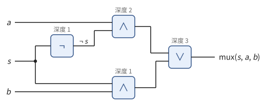
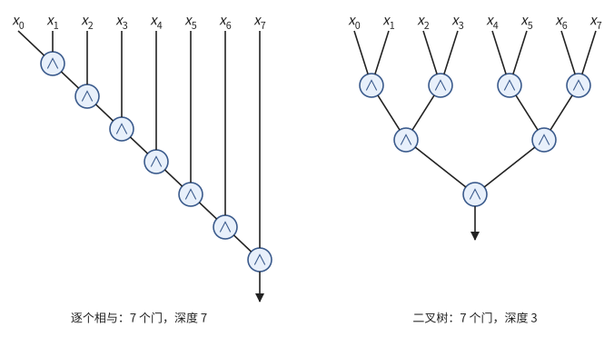
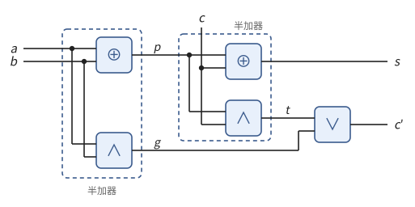
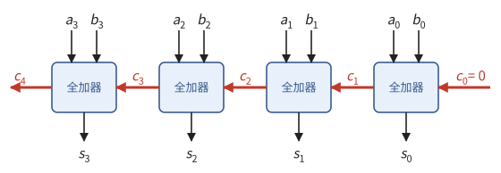
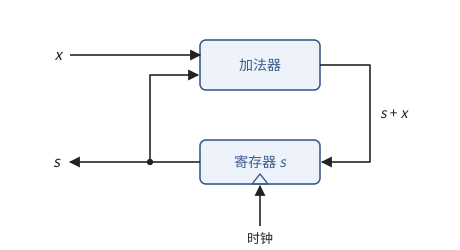
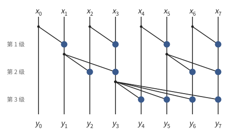
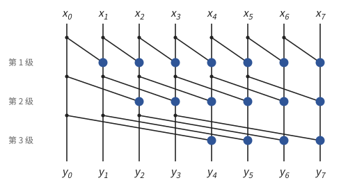
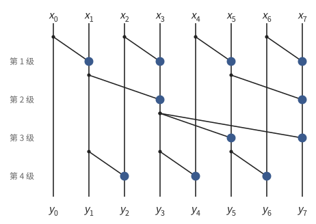
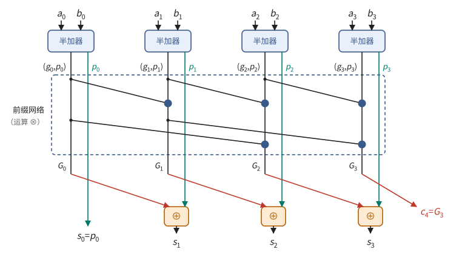

# 第 1 章　逻辑门与加法器

计算机里的一切计算，最后都由大量的逻辑门完成。一个逻辑门只做一件很小的事，例如"两个输入都是 1 时输出 1"。本章从逻辑门出发，一步步搭出做加法的电路，并在这个过程中回答一个贯穿全书的问题：一个电路要付出多少**面积**、**时间**和**能量**？

加法看似平凡，却藏着本书反复使用的一个方法。最直接的加法器让进位从最低位一位一位地传到最高位，位数越多越慢。把"进位怎样穿过一段数位"写成函数，函数的复合满足结合律；利用结合律重新安排计算的顺序，就能把这条串行的链改写成深度只有 $\log n$ 的树。后面各章的并行归约、GPU 上 warp 内的求和、多芯片之间的 all-reduce，用的都是这个方法。

> **在体系中的位置**：本章是全书的起点。逻辑门当作给定的元件，不讨论它们怎样用晶体管实现。本章建立电路的代价模型（面积、深度、能耗），引入寄存器与时钟，构造加法器，并从中提炼出归约与前缀计算的一般方法。第 2 章用加法器和 3:2 压缩搭乘法器；第 3 章用选择器和寄存器搭存储；第 4 章用寄存器和时钟搭流水线；第 7、10 章把归约与前缀的方法用到多芯片通信和并行算法上。

本章的论证是一条链，每节只用前面各节的编号结论：

| 节 | 回答的问题 | 主要结论 |
| --- | --- | --- |
| 1.1–1.3 | 计算的最小元件是什么？电路的大小、快慢、能耗怎样衡量？ | 门能算任何函数；延迟 = 深度 × 门延迟；$n$ 个输入合成一个至少要 $\lceil \log n \rceil$ 级 |
| 1.4–1.5 | 最直接的加法器有多快？时钟能多快？ | 行波进位的深度正比于位数；时钟周期不小于最长路径的延迟 |
| 1.6–1.9 | 能否不逐位等待进位？ | 进位是一个结合运算的前缀；用并行前缀网络，加法的深度为 $O(\log n)$ |
| 1.10 | 很多个数相加时怎样省掉进位传播？ | 3:2 压缩每级常数深度，最后只做一次加法 |
| 1.11 | 换成任意计算单元，规律还成立吗？ | Brent 定理：$\max(W/p, D) \le T_p \le W/p + D$ |

## 1.1 比特与逻辑门

本节定义计算的最小元件，并说明只用它们就能算出任何有限的函数。

> **本节**
>
> - **用到**：无。
> - **得到**：四种逻辑门的定义（定义 1.1）与算术形式（命题 1.2）；门足以计算任何函数（命题 1.4）。

计算机中的信息用比特表示：一根导线上的电压要么高、要么低，分别记作 1 和 0。$n$ 根导线并排，就表示 $\{0,1\}^n$ 中的一个元素。

> **定义 1.1（比特与逻辑门）** 集合 $\{0, 1\}$ 的元素称为**比特**（bit）。**逻辑门**（logic gate）是下面四个函数之一。**非**门（NOT）是 $\{0,1\} \to \{0,1\}$ 的函数 $\neg a = 1 - a$。另外三种是 $\{0,1\}^2 \to \{0,1\}$ 的函数，由下面的**真值表**（truth table，列出全部输入组合及对应的输出）给出：
>
> | $a$ | $b$ | 与 $a \wedge b$ | 或 $a \vee b$ | 异或 $a \oplus b$ |
> | --- | --- | --- | --- | --- |
> | 0 | 0 | 0 | 0 | 0 |
> | 0 | 1 | 0 | 1 | 1 |
> | 1 | 0 | 0 | 1 | 1 |
> | 1 | 1 | 1 | 1 | 0 |
>
> 用文字说：**与**（AND）在两个输入都是 1 时输出 1；**或**（OR）在至少一个输入是 1 时输出 1；**异或**（XOR）在两个输入恰有一个是 1 时输出 1。

后面的证明大多是代数计算，所以先把门写成整数运算。

> **命题 1.2（门的算术形式）** 把 0、1 看作整数，则
>
> $$
> \neg a = 1 - a, \qquad a \wedge b = ab, \qquad a \vee b = a + b - ab, \qquad a \oplus b = (a + b) \bmod 2 .
> $$
>
> 与、或、异或都满足交换律和结合律，与对或满足分配律：$a \wedge (b \vee c) = (a \wedge b) \vee (a \wedge c)$。

*证明* 四个等式逐一对照定义 1.1 的真值表即可。交换律由等式右边关于 $a, b$ 对称得到。结合律：$\wedge$ 是整数乘法；$\oplus$ 是模 2 加法；$a \vee b = 1 - (1-a)(1-b)$，于是 $(a \vee b) \vee c = 1 - (1-a)(1-b)(1-c)$，关于 $a, b, c$ 对称。分配律：两边都等于 1 当且仅当 $a = 1$ 且 $b, c$ 中至少有一个是 1。∎

由结合律，$a_1 \wedge a_2 \wedge \dots \wedge a_k$ 这样不加括号的写法没有歧义。特别地，$a_1 \oplus \dots \oplus a_k$ 是 $a_1 + \dots + a_k$ 的奇偶性，后面算加法时反复用到这一点。

> **例 1.3（选择器）** 二选一**选择器**（multiplexer，简称 mux）是函数 $\{0,1\}^3 \to \{0,1\}$：$s = 0$ 时输出 $a$，$s = 1$ 时输出 $b$。用门写出来是
>
> $$
> \operatorname{mux}(s, a, b) = (\neg s \wedge a) \vee (s \wedge b).
> $$
>
> 验证：$s = 0$ 时右边是 $(1 \wedge a) \vee (0 \wedge b) = a$；$s = 1$ 时是 $(0 \wedge a) \vee (1 \wedge b) = b$。$s$ 称为选择信号，它像一个地址，决定把哪个输入送到输出。第 3 章的寄存器堆和存储器按地址读出数据，用的就是选择器。

只用这几种门，能算出所有的函数吗？能。

> **命题 1.4（门足以计算任何函数）** 任何函数 $f\colon \{0,1\}^n \to \{0,1\}$ 都能写成只含与、或、非的式子。

*证明* 对每个使 $f(u) = 1$ 的 $u \in \{0,1\}^n$，令 $m_u(x) = \ell_1 \wedge \dots \wedge \ell_n$，其中 $u_k = 1$ 时 $\ell_k = x_k$，$u_k = 0$ 时 $\ell_k = \neg x_k$。$m_u(x) = 1$ 当且仅当每个 $\ell_k = 1$，即 $x = u$。于是 $f(x) = \bigvee_{u :\, f(u) = 1} m_u(x)$：右边等于 1 当且仅当 $x$ 是某个使 $f(u) = 1$ 的 $u$。$f$ 恒为 0 时取 $f(x) = x_1 \wedge \neg x_1$。∎

输出多个比特的函数（例如输出一个 $n$ 位数），对每一位分别用命题 1.4 即可。这个构造用到的门的个数可能随 $n$ 指数增长；设计电路要解决的问题，正是找出门少、又快的构造。下一节把"门少"和"快"写成精确的量。

## 1.2 组合电路：规模与深度

本节把门连成电路，定义衡量电路大小与快慢的两个量，并证明一条贯穿全书的下界：把 $n$ 个输入合成一个，至少要 $\lceil \log n \rceil$ 级。

> **本节**
>
> - **用到**：定义 1.1（逻辑门）。
> - **得到**：组合电路、规模、深度（定义 1.5、1.6）；深度下界（命题 1.10）。

> **定义 1.5（组合电路）** 一个**组合电路**（combinational circuit）是一个有向无环图，其中入度为 0 的点称为**输入**；其余的点称为**门**，每个门标有定义 1.1 中的一种，入度等于这种门的输入个数（非门为 1，其余为 2），两条入边分别接到门的两个输入。一个点的出边可以有任意多条，出边的条数称为它的**扇出**（fan-out）。另外指定若干个点为**输出**。
>
> 给定各输入的值，按拓扑顺序依次求出每个门的值（"无环"保证这总能做到）；电路**计算**函数 $f$，是指对每组输入，输出点的值等于 $f$ 的值。

> **定义 1.6（规模、深度与级）** 组合电路的**规模**（size）是门的个数。每个点的**深度**（depth）递归定义：输入的深度为 0；门的深度等于它的前驱的深度的最大值加 1。电路的深度是各输出的深度的最大值，也就是从输入到输出的路径上门的个数的最大值。深度为 $d$ 的门称为第 $d$ **级**的门。

规模度量要用多少元件，深度度量要等多少"步"（1.3 节把它们对应到面积和时间）。下面两个例子各算一次。

> **例 1.7（选择器的电路）** 把例 1.3 的式子画成电路，见图 1.1。非门和下方的与门（$s \wedge b$）的前驱都是输入，深度为 1；上方的与门（$\neg s \wedge a$）要等非门，深度为 2；或门深度为 3。所以规模为 4，深度为 3。最长的路径是 $s \to \neg \to \wedge \to \vee$。

**图 1.1**　二选一选择器。方框是门，信号从左向右传递；导线分叉处画一个圆点。每个门上方标出它的深度（定义 1.6）。

> **例 1.8（多个输入的与）** 计算 $x_0 \wedge x_1 \wedge \dots \wedge x_{n-1}$。逐个相与（先算 $x_0 \wedge x_1$，再与 $x_2$ 相与，依此类推）用 $n - 1$ 个门，深度为 $n - 1$。两两配对组成二叉树，仍然是 $n - 1$ 个门，深度却降为 $\lceil \log n \rceil$。图 1.2 画出了 $n = 8$ 时的两种做法。两者的区别只在括号的位置：$((x_0 \wedge x_1) \wedge x_2) \wedge \cdots$ 与 $((x_0 \wedge x_1) \wedge (x_2 \wedge x_3)) \wedge \cdots$，由结合律（命题 1.2）结果相同。

**图 1.2**　八个输入的与。圆圈是与门，信号从上向下传递。

能不能比二叉树更浅？要回答"不能"，先说清楚一个函数"用到"了哪些输入。

> **定义 1.9（依赖）** 函数 $f\colon \{0,1\}^n \to \{0,1\}$ **依赖于**第 $k$ 个输入，是指存在 $x \in \{0,1\}^n$，使得只改变 $x_k$ 会改变 $f(x)$。

例如 $x_0 \wedge \dots \wedge x_{n-1}$ 依赖于每一个输入：取其余输入全为 1，输出就等于 $x_k$。

> **命题 1.10（深度下界）** 若 $f$ 依赖于全部 $n$ 个输入，则计算 $f$ 的任何组合电路的深度至少为 $\lceil \log n \rceil$。

*证明* 对一个点 $v$，记 $\operatorname{supp}(v)$ 为有路径通到 $v$ 的输入的集合；$v$ 的值只由 $\operatorname{supp}(v)$ 中输入的值决定。先对深度 $d$ 归纳证明 $\lvert \operatorname{supp}(v) \rvert \le 2^d$：$d = 0$ 时 $v$ 是输入，$\operatorname{supp}(v) = \{v\}$；深度为 $d$ 的门至多有两个前驱，深度都不超过 $d - 1$，所以 $\lvert \operatorname{supp}(v) \rvert \le 2 \cdot 2^{d-1} = 2^d$。设输出点为 $v$、电路深度为 $D$。若某个输入 $x_k \notin \operatorname{supp}(v)$，则改变 $x_k$ 不改变输出，与 $f$ 依赖于 $x_k$ 矛盾。所以 $n \le \lvert \operatorname{supp}(v) \rvert \le 2^D$，即 $D \ge \log n$，而 $D$ 是整数。∎

所以二叉树在深度上已经最优。这个简单的事实以后会反复出现：**把 $n$ 个东西合成一个，至少要 $\lceil \log n \rceil$ 级。**

## 1.3 代价模型：面积、延迟与能耗

规模和深度是图上的量。本节给出一个物理模型，把它们对应到面积、时间和能量；后面各章估算代价，都以这个模型为准。

> **本节**
>
> - **用到**：定义 1.5、1.6（组合电路、规模、深度、扇出）。
> - **得到**：代价模型（定义 1.11）；延迟 = 深度 × 门延迟（命题 1.12）；功耗受限时的吞吐上限（命题 1.14）。

门在物理上由几个晶体管组成，本书不讲这一层，只用下面三条假设。

> **定义 1.11（代价模型）** 本书按以下三条估计电路的物理代价。
>
> 1. **面积**正比于规模，另加导线占用的面积。
> 2. **延迟**：每个门有同一个**门延迟**（gate delay）$\tau$：一个门的输入全部稳定之后，再过时间 $\tau$，它的输出稳定到新的值。
> 3. **能耗**：门的输出每翻转一次（从 0 变到 1 或从 1 变到 0），要给它驱动的导线充电或放电，消耗的能量正比于这些导线的总长度。

> **命题 1.12（延迟等于深度乘以门延迟）** 设组合电路的深度为 $D$，输入在时刻 0 改变，此后保持不变。则每个深度为 $d$ 的点在时刻 $d\tau$ 之前稳定；特别地，全部输出在时刻 $D\tau$ 之前稳定。门的个数为 $D$ 的输入到输出的路径称为**关键路径**（critical path），电路的延迟由它决定。

*证明* 对 $d$ 归纳。$d = 0$ 的点是输入，在时刻 0 稳定。深度为 $d$ 的门的前驱深度都不超过 $d - 1$，由归纳假设在时刻 $(d-1)\tau$ 之前全部稳定；由定义 1.11 第 2 条，再过 $\tau$ 它的输出稳定。∎

> **注 1.13（导线与扇出）** 定义 1.11 把导线的代价放进了面积和能耗，没有放进延迟。实际上导线越长，延迟也越大；一个门的扇出越大，它要驱动的导线和门就越多，翻转越慢、越耗能。所以有两条经验规律：**同样的深度，扇出小、连线短的电路更快**（1.8 节比较前缀网络时用到）；**把一个比特送过芯片上一段较长的距离，比对它做一次运算贵得多**（第 3 章给出具体数字）。"搬运数据比计算贵"这条贯穿全书的规律，在最底层就来源于此。

> **现状（2026-10）**：先进工艺中一个简单门的延迟在 10 皮秒的量级（1 ps $= 10^{-12}$ s）。本章的例子取 $\tau = 15$ ps 只是为了算出量级，结论不依赖这个数。

能耗还给芯片的算力加了一道约束。芯片能散掉的热量有限，所以它的功率（每秒消耗的能量）有上限。

> **命题 1.14（功耗受限时的吞吐）** 设芯片的功率不超过 $P_{\max}$，每次运算平均消耗能量 $E$，则它每秒至多完成 $P_{\max} / E$ 次运算。

*证明* 若每秒完成 $r$ 次运算，每秒消耗的能量至少是 $rE$，所以 $rE \le P_{\max}$。∎

命题 1.14 平凡，但结论重要：**在功耗受限的芯片上，每次运算的能耗决定了每秒能做多少次运算**。降低每次运算的能耗（用更少的位、更短的导线），就是提高算力。第 2、3 章用它解释低精度格式和数据复用。

## 1.4 加法器

本节用门搭出最直接的 $n$ 位加法器，证明它正确，并算出它的规模和深度：深度正比于 $n$。

> **本节**
>
> - **用到**：命题 1.2（门的算术形式）；定义 1.6（规模、深度）。
> - **记号**：$n$ 位数 $a$ 的各位记作 $a_{n-1} \cdots a_1 a_0$，$a_0$ 是最低位。
> - **得到**：全加器（定义 1.16、命题 1.17）；行波进位加法器的正确性与代价（命题 1.19）。

> **定义 1.15（二进制表示）** 比特串 $a_{n-1} \cdots a_1 a_0$ 表示整数 $a = \sum_{i=0}^{n-1} a_i 2^i$，$a_i$ 称为 $a$ 的第 $i$ 位。$n$ 位比特串恰好表示 $0, 1, \dots, 2^n - 1$。

二进制加法和十进制的竖式加法一样：从最低位起逐位相加，满 2 向高一位进 1。下表按书写习惯把最低位放在右边，算的是 $6 + 7$：

| | 第 3 位 | 第 2 位 | 第 1 位 | 第 0 位 |
| --- | --- | --- | --- | --- |
| 低位送来的进位 $c_i$ | 1 | 1 | 0 | 0 |
| $a = 6$ | 0 | 1 | 1 | 0 |
| $b = 7$ | 0 | 1 | 1 | 1 |
| 和位 $s_i$ | 1 | 1 | 0 | 1 |
| 送往高位的进位 $c_{i+1}$ | 0 | 1 | 1 | 0 |

结果是 $1101_2 = 13$。每一位做的事都一样：把三个比特 $a_i$、$b_i$、$c_i$ 相加，得到 0 到 3 之间的一个数，写成两位二进制数，低位是本位的和 $s_i$，高位是送往高一位的进位 $c_{i+1}$。把这一步做成一个元件：

> **定义 1.16（半加器与全加器）** **半加器**（half adder）输入两个比特 $a, b$，输出两个比特 $s, c$，满足 $a + b = s + 2c$。**全加器**（full adder）输入三个比特 $a, b, c$，输出两个比特 $s, c'$，满足
>
> $$
> a + b + c = s + 2c'.
> $$
>
> $s$ 称为**和位**，$c'$ 称为**进位**。

左边至多为 3，所以 $s, c'$ 由输入唯一确定：$s$ 是 $a + b + c$ 的奇偶性，$c' = 1$ 当且仅当 $a + b + c \ge 2$，即三个输入中至少有两个是 1。后一个函数有专门的名字：$a, b, c$ 的**多数函数**（majority），记作 $\operatorname{maj}(a, b, c)$。

> **命题 1.17（半加器与全加器的电路）** 半加器是 $s = a \oplus b$，$c = a \wedge b$。记 $p = a \oplus b$，$g = a \wedge b$，全加器是
>
> $$
> s = p \oplus c, \qquad c' = \operatorname{maj}(a, b, c) = g \vee (p \wedge c).
> $$
>
> 它由两个半加器和一个或门组成（图 1.3），规模为 5，深度为 3。

*证明* 半加器：由命题 1.2，$a \oplus b \equiv a + b \pmod 2$，$a \wedge b = ab$；逐一检查四种输入可知 $a + b = (a \oplus b) + 2ab$。全加器：$s$ 是 $a + b + c$ 的奇偶性，等于 $a \oplus b \oplus c = p \oplus c$。进位：若 $a = b = 1$，则 $g = 1$，$c' = 1$ 正确；若 $a, b$ 恰有一个是 1，则 $g = 0$、$p = 1$，右边等于 $c$，而此时至少两个 1 当且仅当 $c = 1$；若 $a = b = 0$，右边是 0，也正确。深度：$p, g$ 在第 1 级，$s = p \oplus c$ 与 $p \wedge c$ 在第 2 级，或门在第 3 级。∎

**图 1.3**　全加器。虚线框是两个半加器：第一个算出 $p = a \oplus b$ 与 $g = a \wedge b$，第二个把 $p$ 与进位 $c$ 相加；或门合并两个半加器的进位。导线交叉而没有圆点的地方互不相连。

> **定义 1.18（行波进位加法器）** 把 $n$ 个全加器串起来：第 $i$ 个全加器的输入是 $a_i, b_i, c_i$，输出是和位 $s_i$ 与进位 $c_{i+1}$，$c_{i+1}$ 接到第 $i + 1$ 个全加器（图 1.4）；最低位的进位输入 $c_0 = 0$。这个电路称为**行波进位加法器**（ripple-carry adder）。

**图 1.4**　4 位行波进位加法器。最低位在右边，与书写数字的习惯一致。进位（红线）从右向左逐位传递。

> **命题 1.19（行波进位加法器的正确性与代价）** 行波进位加法器的输出满足
>
> $$
> a + b = \sum_{i=0}^{n-1} s_i 2^i + c_n 2^n,
> $$
>
> 即 $s_{n-1} \cdots s_0$ 是和的低 $n$ 位，$c_n$ 是第 $n$ 位。它的规模为 $5n$，深度为 $2n + 1$；其中 $c_{i+1}$ 由递推
>
> $$
> c_{i+1} = g_i \vee (p_i \wedge c_i), \qquad g_i = a_i \wedge b_i,\; p_i = a_i \oplus b_i
> $$
>
> 算出，$c_{i}$ 的深度为 $2i + 1$（$i \ge 1$）。

*证明* 正确性：第 $i$ 个全加器满足 $a_i + b_i + c_i = s_i + 2c_{i+1}$。两边乘以 $2^i$，对 $i = 0, \dots, n-1$ 求和，得

$$
a + b + \sum_{i=0}^{n-1} c_i 2^i = \sum_{i=0}^{n-1} s_i 2^i + \sum_{i=1}^{n} c_i 2^i .
$$

两边的进位项除 $c_0 = 0$ 与 $c_n 2^n$ 之外互相抵消，即得所要的等式。

规模：$n$ 个全加器各 5 个门。深度：由命题 1.17，$g_i, p_i$ 只依赖 $a_i, b_i$，都在第 1 级。$c_0 = 0$ 是常数，可以看作深度 0 的输入；$c_1 = g_0 \vee (p_0 \wedge c_0)$ 中与门在第 2 级，或门在第 3 级。之后 $c_{i+1}$ 的与门要等 $c_i$，比 $c_i$ 深 1；或门再深 1。所以 $c_{i+1}$ 比 $c_i$ 深 2，$c_i$ 的深度为 $2i + 1$。最深的输出是 $c_n$，深度 $2n + 1$（$s_{n-1} = p_{n-1} \oplus c_{n-1}$ 的深度是 $2n$）。∎

深度是电路的属性，与输入无关。下面的例子说明，这么长的依赖链在计算中确实会被用到。

> **例 1.20（长进位链）** 计算 $0111\,1111_2 + 0000\,0001_2$。第 0 位两个 1 相加，产生进位；第 1 到 6 位各有一个 1，都把收到的进位原样送往高位；第 7 位的和位要等这个进位走完全程才能确定。若把 $a_0$ 从 1 改成 0，$s_7$ 从 1 变成 0：$s_7$ 依赖于 $a_0$。电路无法预知输入，必须按最坏的情形留足时间：$n$ 位行波进位加法器的延迟正比于 $n$。

## 1.5 寄存器、时钟与时钟周期

组合电路没有记忆，它的输出只由当前的输入决定。本节引入保存状态的元件，使计算可以一步一步进行，并求出每一步至少要多长时间。

> **本节**
>
> - **用到**：定义 1.5（组合电路）；命题 1.12（延迟 = 深度 × $\tau$）；命题 1.19（行波进位的深度）；命题 1.14（功耗受限时的吞吐）。
> - **得到**：寄存器与同步电路（定义 1.21、1.22）；时钟周期的下界（命题 1.24）。

> **定义 1.21（时钟与寄存器）** **时钟**（clock）是一个周期地在 0 与 1 之间切换的信号；它从 0 变为 1 的时刻称为**上升沿**（rising edge），相邻两个上升沿的间隔称为**时钟周期**（clock period），记作 $T$，$1/T$ 称为时钟频率。$k$ 位**寄存器**（register）有 $k$ 根数据输入线 $D$、$k$ 根输出线 $Q$ 和一根时钟输入：在每个上升沿，它把 $D$ 此刻的值存下来，并在 $Q$ 上一直输出这个值，直到下一个上升沿。1 位的寄存器称为**触发器**（flip-flop）。寄存器要求 $D$ 在上升沿之前已经稳定一小段时间，存下的新值也要过一小段时间才出现在 $Q$ 上，两段时间之和记作 $t_{\text{reg}}$。

> **定义 1.22（同步电路）** 一个**同步电路**（synchronous circuit）由若干个寄存器和一个组合电路组成：组合电路的输入是各寄存器的输出 $Q$ 和外部输入 $x$，它的输出接到各寄存器的输入 $D$（也可以作为外部输出）；所有寄存器接同一个时钟。

把全部寄存器的内容看作状态 $s$，组合电路计算的函数记作 $\delta$。在第 $t$ 个上升沿，寄存器存入 $\delta(s_t, x_t)$，即

$$
s_{t+1} = \delta(s_t, x_t).
$$

所以同步电路就是一个有限状态机，每个时钟周期走一步。电路中的环一定经过寄存器，组合部分本身仍然无环，可以用 1.2、1.3 节的方法分析。

> **例 1.23（累加器）** 图 1.5 的电路由一个 $n$ 位寄存器和一个 $n$ 位加法器组成。加法器的两个输入是寄存器的输出 $s$ 和外部输入 $x$，加法器的和（低 $n$ 位）接回寄存器。这里 $\delta(s, x) = (s + x) \bmod 2^n$，每个上升沿寄存器更新为 $s \leftarrow s + x$。从 $s = 0$ 开始，连续 $k$ 个周期送入 $x_1, \dots, x_k$，寄存器中就是它们的和（模 $2^n$）。

**图 1.5**　累加器。寄存器与加法器连成一个环；寄存器底部的三角形表示时钟输入。

时钟能有多快？

> **命题 1.24（时钟周期的下界）** 设同步电路的组合部分深度为 $D$。若
>
> $$
> T \ge D\tau + t_{\text{reg}},
> $$
>
> 则每个上升沿存入寄存器的都是 $\delta(s_t, x_t)$ 的正确值。反过来，由于关键路径（命题 1.12）上的信号可能要走满 $D\tau$，按最坏情形设计时 $T$ 不能小于这个值。所以**时钟周期由寄存器之间组合电路的深度决定**。

*证明* 设第 $t$ 个上升沿在时刻 0，外部输入在此之前已经稳定。新状态在 $Q$ 上出现之后，组合部分的输入不再改变；由命题 1.12，再过 $D\tau$ 它的输出全部稳定。寄存器要求这个值在下一个上升沿（时刻 $T$）之前已经稳定一小段时间。把这两小段时间合在一起记作 $t_{\text{reg}}$（定义 1.21），所需条件就是 $D\tau + t_{\text{reg}} \le T$。∎

> **例 1.25（行波进位的累加器）** 设 $\tau = 15$ ps，忽略 $t_{\text{reg}}$。若例 1.23 的累加器使用 32 位行波进位加法器，组合部分只用到和的低 32 位，其中最深的 $s_{31}$ 深度为 $2 \times 32 = 64$（命题 1.19 的证明），于是 $T \ge 64 \times 15 = 960$ ps，时钟频率 $1/T$ 至多约 1 GHz，而且整个周期只够做一次加法。现代处理器的时钟在 2 到 5 GHz 之间，一个周期里除了加法还要做选择、读写寄存器、在导线上传送。行波进位加法器太慢了。

提高频率有两条路：降低一次加法的深度（1.6–1.9 节），或者在长路径中间插入寄存器、把它切成几段（第 4 章的流水线）。

> **注 1.26（动态功耗）** 电路每秒翻转消耗的能量（动态功耗）约为 $\alpha C V^2 f$，其中 $C$ 是导线和门的总电容，$\alpha$ 是每个周期翻转的比例，$V$ 是电压，$f = 1/T$ 是频率。频率越高，每秒翻转越多，功耗越大；再由命题 1.14，功率的上限给频率和每周期的运算量也加了上限。

## 1.6 进位函数

行波进位慢，是因为第 $i$ 位要等第 $i - 1$ 位送来进位。本节把"进位怎样穿过一段数位"写成从 $\{0,1\}$ 到 $\{0,1\}$ 的函数，证明这样的函数只有三个、在复合下封闭，再把复合编码成比特上的一个结合运算 $\otimes$。结论是：**全部进位就是一列元素在 $\otimes$ 下的全部前缀**（推论 1.32）。

> **本节**
>
> - **用到**：命题 1.17（全加器：$c' = \operatorname{maj}(a, b, c) = g \vee (p \wedge c)$）；命题 1.19（进位的递推）；命题 1.2（分配律）。
> - **记号**：本节固定两个 $n$ 位数 $a, b$。$g_i = a_i \wedge b_i$，$p_i = a_i \oplus b_i$；$c_i$ 是送入第 $i$ 位的进位，$c_0 = 0$。常函数记作 $\underline 0$、$\underline 1$，恒等函数记作 $\mathrm{id}$。
> - **得到**：进位函数只有三种且在复合下封闭（命题 1.28、1.29）；运算 $\otimes$ 满足结合律（命题 1.31）；进位是前缀（推论 1.32）。

固定 $a, b$ 之后，第 $i$ 位送出的进位只取决于它收到的进位。把这个关系当作函数来研究：

> **定义 1.27（进位函数）** 第 $i$ 位的**进位函数**（carry function）是
>
> $$
> \varphi_i\colon \{0,1\} \to \{0,1\}, \qquad \varphi_i(c) = \operatorname{maj}(a_i, b_i, c),
> $$
>
> 即第 $i$ 位的全加器收到进位 $c$ 时送出的进位。对 $0 \le j \le i < n$，记 $\varphi_{[j,i]} = \varphi_i \circ \varphi_{i-1} \circ \dots \circ \varphi_j$，它把送入第 $j$ 位的进位变成从第 $i$ 位送出的进位。

由命题 1.19 的递推，$c_{i+1} = \varphi_i(c_i)$，反复代入得

$$
c_{i+1} = \varphi_{[j,i]}(c_j) \quad (0 \le j \le i), \qquad \text{特别地} \quad c_{i+1} = \varphi_{[0,i]}(0).
$$

所以只要求出每个 $\varphi_{[0,i]}$，就求出了全部进位。下面两个命题说明这些函数非常简单。

> **命题 1.28（进位函数只有三种）** $\varphi_i(c) = g_i \vee (p_i \wedge c)$，并且按 $a_i, b_i$ 分三种情形：
>
> | $a_i, b_i$ | $(g_i, p_i)$ | $\varphi_i$ | 含义 | 硬件文献中的名称 |
> | --- | --- | --- | --- | --- |
> | 都是 0 | $(0, 0)$ | $\underline 0$ | 无论收到什么，都不送出进位 | 吸收（kill） |
> | 恰有一个是 1 | $(0, 1)$ | $\mathrm{id}$ | 收到进位就送出进位 | 传递（propagate） |
> | 都是 1 | $(1, 0)$ | $\underline 1$ | 无论收到什么，都送出进位 | 产生（generate） |

*证明* 第一式就是命题 1.17 的 $c' = g \vee (p \wedge c)$。代入三种情形：$(g_i, p_i) = (0, 0)$ 时右边恒为 0；$(0, 1)$ 时右边等于 $c$；$(1, 0)$ 时右边恒为 1。$g_i$ 与 $p_i$ 不会同时为 1，因为 $a_i = b_i = 1$ 时 $a_i \oplus b_i = 0$。∎

> **命题 1.29（三种函数对复合封闭）** 记 $\mathcal{K} = \{\underline 0, \mathrm{id}, \underline 1\}$。对 $f, h \in \mathcal{K}$，
>
> $$
> h \circ f = \begin{cases} h, & h \text{ 是常函数}, \\ f, & h = \mathrm{id}. \end{cases}
> $$
>
> 特别地 $h \circ f \in \mathcal{K}$，从而每个 $\varphi_{[j,i]}$ 都属于 $\mathcal{K}$。

*证明* $h$ 是常函数时，$h(f(c))$ 与 $f(c)$ 无关，等于那个常数；$h = \mathrm{id}$ 时 $h \circ f = f$。$\varphi_{[j,i]}$ 属于 $\mathcal{K}$ 由命题 1.28 和对 $i - j$ 归纳得到。∎

用进位的话说：把第 $j$ 到 $i$ 位看成一段，它整体上也只有三种行为——一定送出进位、一定不送出、收到才送出。若高位的一段 $h$ 自己决定（产生或吸收），整段由它决定；若它只是传递，整段的行为等于低位的一段 $f$。

接下来把 $\mathcal{K}$ 的元素编码成两个比特，把复合变成门电路可以计算的运算。

> **定义 1.30（运算 $\otimes$）** 记 $\mathcal{E} = \{(0,0), (0,1), (1,0)\}$，令 $\Phi\colon \mathcal{E} \to \mathcal{K}$ 把 $(g, p)$ 映为函数 $c \mapsto g \vee (p \wedge c)$，即 $(0,0) \mapsto \underline 0$，$(0,1) \mapsto \mathrm{id}$，$(1,0) \mapsto \underline 1$。在 $\mathcal{E}$ 上定义
>
> $$
> (g', p') \otimes (g, p) = \big(g \vee (p \wedge g'),\; p \wedge p'\big).
> $$
>
> 约定左边的操作数代表低位的一段，右边的代表紧接在它上面的高位的一段。

$\Phi$ 是双射，由命题 1.28，$\Phi(g_i, p_i) = \varphi_i$。

> **命题 1.31（$\otimes$ 就是复合）** 对 $x, y \in \mathcal{E}$，$x \otimes y \in \mathcal{E}$，并且
>
> $$
> \Phi(x \otimes y) = \Phi(y) \circ \Phi(x).
> $$
>
> 因此 $\otimes$ 满足结合律，不满足交换律。计算一次 $\otimes$ 用 3 个门（两个与门、一个或门），深度为 2。

*证明* 设 $x = (g', p')$，$y = (g, p)$。由分配律（命题 1.2），

$$
\Phi(y)\big(\Phi(x)(c)\big) = g \vee \big(p \wedge (g' \vee (p' \wedge c))\big) = \big(g \vee (p \wedge g')\big) \vee \big((p \wedge p') \wedge c\big),
$$

这正是 $\Phi(x \otimes y)(c)$。封闭性：若 $p \wedge p' = 1$，则 $p = p' = 1$，按 $\mathcal{E}$ 的定义 $g = g' = 0$，于是 $x \otimes y = (0, 1) \in \mathcal{E}$；其余情形第二个分量是 0，也属于 $\mathcal{E}$。

结合律：函数的复合满足结合律，所以

$$
\Phi\big((x \otimes y) \otimes z\big) = \Phi(z) \circ \Phi(y) \circ \Phi(x) = \Phi\big(x \otimes (y \otimes z)\big),
$$

而 $\Phi$ 是单射，故 $(x \otimes y) \otimes z = x \otimes (y \otimes z)$。不满足交换律：$(1, 0) \otimes (0, 0) = (0, 0)$（低位产生的进位被高位吸收），而 $(0, 0) \otimes (1, 0) = (1, 0)$。门的个数与深度：第一个分量先算 $p \wedge g'$（第 1 级）再与 $g$ 相或（第 2 级），第二个分量是一个与门（第 1 级）。∎

> **推论 1.32（进位是前缀）** 令
>
> $$
> (G_i, P_i) = (g_0, p_0) \otimes (g_1, p_1) \otimes \dots \otimes (g_i, p_i), \qquad i \in [n],
> $$
>
> 则 $\Phi(G_i, P_i) = \varphi_{[0,i]}$，送往第 $i + 1$ 位的进位是 $c_{i+1} = G_i$，和位是 $s_0 = p_0$、$s_i = p_i \oplus G_{i-1}$（$i \ge 1$）。

*证明* 由命题 1.31 对 $i$ 归纳，$\Phi(G_i, P_i) = \varphi_i \circ \dots \circ \varphi_0 = \varphi_{[0,i]}$。于是 $c_{i+1} = \varphi_{[0,i]}(0) = G_i \vee (P_i \wedge 0) = G_i$。和位 $s_i = p_i \oplus c_i$（命题 1.17），$c_0 = 0$。∎

$G_i = 1$ 表示第 0 到 $i$ 位这一段会送出进位，$P_i = 1$ 表示这一段会把送入的进位原样送出。求全部进位，就是求 $(g_0, p_0) \otimes \dots \otimes (g_i, p_i)$ 对所有 $i$ 的值。

> **例 1.33（再算 $6 + 7$）** 这次按 $i$ 从小到大排列：
>
> | $i$ | 0 | 1 | 2 | 3 |
> | --- | --- | --- | --- | --- |
> | $a_i$ | 0 | 1 | 1 | 0 |
> | $b_i$ | 1 | 1 | 1 | 0 |
> | $(g_i, p_i)$ | $(0, 1)$ | $(1, 0)$ | $(1, 0)$ | $(0, 0)$ |
> | $\varphi_i$ | $\mathrm{id}$ | $\underline 1$ | $\underline 1$ | $\underline 0$ |
> | $(G_i, P_i)$ | $(0, 1)$ | $(1, 0)$ | $(1, 0)$ | $(0, 0)$ |
> | $c_{i+1} = G_i$ | 0 | 1 | 1 | 0 |
> | $s_i = p_i \oplus c_i$ | 1 | 0 | 1 | 1 |
>
> 例如 $(G_1, P_1) = (0, 1) \otimes (1, 0) = (1 \vee (0 \wedge 0),\, 0 \wedge 1) = (1, 0)$，$(G_3, P_3) = (1, 0) \otimes (0, 0) = (0 \vee (0 \wedge 1),\, 0 \wedge 0) = (0, 0)$。和是 $s_3 s_2 s_1 s_0 = 1101_2 = 13$，与 1.4 节的竖式一致。

## 1.7 前缀与归约

推论 1.32 把求进位化成了一个只依赖结合律的问题。本节离开进位，在任意结合运算下提出这个问题，定义解决它的电路，并证明两条下界。

> **本节**
>
> - **用到**：定义 1.5、1.6（电路、规模、深度）；命题 1.10 的证明方法。
> - **记号**：$\otimes$ 是集合 $X$ 上满足结合律的二元运算，$x_0, \dots, x_{n-1} \in X$；$\log$ 以 2 为底。
> - **得到**：前缀问题与前缀网络（定义 1.34、1.35）；相邻区间的合并（引理 1.36）；归约的下界（命题 1.38）。

> **定义 1.34（前缀问题与归约）** 对 $0 \le j \le i < n$，记
>
> $$
> x_{[j,i]} = x_j \otimes x_{j+1} \otimes \dots \otimes x_i ,
> $$
>
> 由结合律它不依赖括号的加法。计算全部前缀 $y_i = x_{[0,i]}$（$i \in [n]$）的问题称为**前缀问题**（prefix problem），也称**扫描**（scan）；只计算最后一个 $y_{n-1} = x_{[0,n-1]}$ 的问题称为**归约**（reduction）。

例如 $\otimes$ 是整数加法时，前缀就是前缀和；$\otimes$ 是取最大值时，前缀就是"到目前为止的最大值"；$\otimes$ 是定义 1.30 的运算、$x_i = (g_i, p_i)$ 时，前缀就是全部进位（推论 1.32）。注意前缀问题只要求结合律，不要求交换律，所以运算的左右顺序必须保持。

> **定义 1.35（前缀网络）** 一个 $\otimes$ **网络**是这样的有向无环图：入度为 0 的点是输入 $x_0, \dots, x_{n-1}$；其余每个点称为**节点**（node），它有一条左入边和一条右入边，值等于（左前驱的值）$\otimes$（右前驱的值）。规模与深度的定义与定义 1.6 相同：规模是节点的个数，节点的深度是前驱深度的最大值加 1。若网络对**任意**集合上的任意结合运算，都在指定的 $n$ 个点上给出 $y_0, \dots, y_{n-1}$，就称它为**前缀网络**（prefix network）。

对加法器而言，一个节点就是命题 1.31 的 3 个门、2 级。本章其余部分按节点计规模和深度，换算成门时乘以这两个常数。

"对任意结合运算都正确"有一个具体的检验办法：取 $X$ 为由符号 $x_0, \dots, x_{n-1}$ 组成的非空字符串、$\otimes$ 为字符串的拼接，它满足结合律。这时每个节点的值就是一个字符串，网络给出 $y_i$ 当且仅当对应节点的字符串恰为 $x_0 x_1 \cdots x_i$。本章构造的网络都只做下面这一种合并：

> **引理 1.36（相邻区间的合并）** 对 $j \le k < i$，$x_{[j,k]} \otimes x_{[k+1,i]} = x_{[j,i]}$。

*证明* 两边都是 $x_j \otimes \dots \otimes x_i$，只是括号不同；由结合律相等。∎

所以，只要每个节点的左前驱保存 $x_{[j,k]}$、右前驱保存紧接着的 $x_{[k+1,i]}$，节点就得到 $x_{[j,i]}$。验证一个网络是前缀网络，就是验证每个节点合并的是两个相邻的区间（左边的在左），并且最后位置 $i$ 得到 $x_{[0,i]}$。

> **命题 1.37（逐个计算）** 令 $y_0 = x_0$，$y_i = y_{i-1} \otimes x_i$（$i \ge 1$），得到一个规模和深度都是 $n - 1$ 的前缀网络。对 $x_i = (g_i, p_i)$，它的第 $i$ 个节点的第一个分量 $G_i = g_i \vee (p_i \wedge G_{i-1})$ 正是行波进位的递推（命题 1.19）。

*证明* 由引理 1.36 对 $i$ 归纳，$y_i = x_{[0,i-1]} \otimes x_{[i,i]} = x_{[0,i]}$。共 $n - 1$ 个节点，每个节点要等前一个，深度 $n - 1$。$G_i$ 的式子由定义 1.30 直接展开。∎

归约至少要多少节点、多深？

> **命题 1.38（归约的下界）** 计算 $x_{[0,n-1]}$ 的任何 $\otimes$ 网络至少有 $n - 1$ 个节点，深度至少为 $\lceil \log n \rceil$。例 1.8 的二叉树同时达到这两个下界。因此前缀网络的规模至少为 $n - 1$，深度至少为 $\lceil \log n \rceil$。

*证明* 用上面的字符串检验：输出节点的值必须是 $x_0 x_1 \cdots x_{n-1}$，长度为 $n$，每个符号恰好出现一次。

深度：一个节点的字符串长度是两个前驱的长度之和。与命题 1.10 的证明一样对深度归纳，深度为 $d$ 的点的字符串长度至多为 $2^d$，所以 $2^D \ge n$。

规模：从输出节点出发，把每个节点的两个前驱画在它下面，一直展开到输入，得到一棵二叉树。这棵树的叶子对应输出字符串中的各个符号，共 $n$ 个，所以内部点有 $n - 1$ 个。不同的内部点不能是同一个节点：若某个节点出现在树的两个位置上，且两个位置互不为祖先，它的字符串就在输出中出现两次，某个符号也就出现两次，矛盾；若一个位置是另一个的祖先，图中就有环，矛盾。所以至少有 $n - 1$ 个不同的节点。

二叉树（例 1.8，把 $\wedge$ 换成 $\otimes$，保持左右顺序）有 $n - 1$ 个节点，深度 $\lceil \log n \rceil$。前缀网络要算出 $y_{n-1} = x_{[0,n-1]}$，所以两条下界对它也成立。∎

于是问题变成：能否**同时**求出全部 $n$ 个前缀，既让深度接近 $\log n$，又让节点数接近 $n$？逐个计算节点最少但深度为 $n - 1$；对每个 $i$ 单独用一棵二叉树，深度为 $\lceil \log n \rceil$ 但节点数约为 $n^2/2$。下一节给出好得多的构造。

## 1.8 并行前缀网络

本节构造三种前缀网络，证明它们的正确性、规模和深度，并比较它们的取舍。

> **本节**
>
> - **用到**：定义 1.34、1.35（前缀、$x_{[j,i]}$、前缀网络）；引理 1.36（相邻区间的合并）；命题 1.38（下界）；注 1.13（扇出的代价）。
> - **记号**：$n = 2^m$，即 $m = \log n$。$v_k(i)$ 表示第 $k$ 级之后位置 $i$ 保存的值，$v_0(i) = x_i$。
> - **得到**：Sklansky、Kogge–Stone、Brent–Kung 网络的代价（命题 1.40、1.42、1.45）；深度与规模的取舍（注 1.47）。

三幅图（图 1.6–1.8）的画法相同：每一列是一个位置 $i$，信号从上向下流动，每一行是一级。蓝色圆点是一个节点，它把从左边某一列斜着引来的值放在 $\otimes$ 的左边、本列当前的值放在右边，结果留在本列。没有圆点的地方，本列的值原样往下传。

**分治。** 把输入分成左右两半，各自求前缀，再把左半的总和接到右半的每个前缀前面。

> **定义 1.39（Sklansky 网络）** $n = 1$ 时网络就是输入 $x_0$ 本身。$n \ge 2$ 时，对左半 $x_0, \dots, x_{n/2-1}$ 与右半 $x_{n/2}, \dots, x_{n-1}$ 分别（同时）构造 Sklansky 网络；然后对右半的每个位置 $i$，用一个节点计算（左半的最后一个输出）$\otimes$（右半在位置 $i$ 的输出）。

**图 1.6**　Sklansky 网络（$n = 8$）：12 个节点，深度 3。第 3 级中位置 3 的值（$y_3$）送到右半全部 4 个节点。

> **命题 1.40（Sklansky 网络）** Sklansky 网络是前缀网络，深度为 $m$，规模为 $\frac{n}{2} m$。位置 $n/2 - 1$ 的值在最后一级要送到 $n/2$ 个节点。

*证明* 正确性：对 $n$ 归纳。左半网络给出 $x_{[0,i]}$（$i < n/2$）；右半网络作用在 $x_{n/2}, \dots, x_{n-1}$ 上，在位置 $i$ 给出 $x_{[n/2,\, i]}$；由引理 1.36，$x_{[0,\, n/2-1]} \otimes x_{[n/2,\, i]} = x_{[0,i]}$。代价：两半同时进行，合并再加一级，$D(n) = D(n/2) + 1$，$D(1) = 0$，得 $D(n) = m$；合并用 $n/2$ 个节点，$S(n) = 2S(n/2) + n/2$，$S(1) = 0$，得 $S(n) = \frac{n}{2} m$。∎

Sklansky 网络的深度已达到下界，缺点是最后一级的扇出为 $n/2$：一个值要驱动很多个节点和很长的导线（注 1.13），又慢又耗能。

**倍增。** 每一级让每个位置把"自己往左看的距离"翻一倍。

> **定义 1.41（Kogge–Stone 网络）** 共 $m$ 级。第 $k$ 级（$k = 1, \dots, m$）中，每个位置 $i \ge 2^{k-1}$ 用一个节点把位置 $i - 2^{k-1}$ 的值结合到自己的值上：
>
> $$
> v_k(i) = \begin{cases} v_{k-1}(i - 2^{k-1}) \otimes v_{k-1}(i), & i \ge 2^{k-1}, \\ v_{k-1}(i), & i < 2^{k-1}. \end{cases}
> $$

**图 1.7**　Kogge–Stone 网络（$n = 8$）：17 个节点，深度 3。第 $k$ 级的斜线跨过 $2^{k-1}$ 列。

> **命题 1.42（Kogge–Stone 网络）** 第 $k$ 级之后，位置 $i$ 保存 $v_k(i) = x_{[\max(0,\, i - 2^k + 1),\; i]}$，即以 $i$ 结尾、长为 $2^k$ 的区间（不够长时从 0 开始）。因此 Kogge–Stone 网络是前缀网络，深度为 $m$，规模为 $nm - n + 1$，每个值至多送到 2 个节点。

*证明* 对 $k$ 归纳。$k = 0$ 时 $v_0(i) = x_i = x_{[i,i]}$。设结论对 $k - 1$ 成立，记 $h = 2^{k-1}$。

- 若 $i \ge h$：位置 $i$ 保存 $x_{[\max(0,\, i - h + 1),\, i]}$，而 $i - h \ge 0$，故它就是 $x_{[i-h+1,\, i]}$；位置 $i - h$ 保存 $x_{[\max(0,\, i - 2h + 1),\, i - h]}$。两个区间首尾相接，由引理 1.36 合并为 $x_{[\max(0,\, i - 2h + 1),\, i]}$，而 $2h = 2^k$。
- 若 $i < h$：位置 $i$ 保存 $x_{[\max(0,\, i-h+1),\, i]} = x_{[0, i]}$，不变；这也等于 $x_{[\max(0,\, i - 2^k + 1),\, i]}$。

$k = m$ 时 $2^m = n > i$，每个位置都保存 $x_{[0,i]} = y_i$。第 $k$ 级有 $n - 2^{k-1}$ 个节点，求和得 $nm - (2^m - 1) = nm - n + 1$。第 $k$ 级中 $v_{k-1}(j)$ 只送到位置 $j$ 与 $j + 2^{k-1}$ 的节点。∎

> **例 1.43（Kogge–Stone 网络逐级保存的区间）** $n = 8$ 时，第 $k$ 级之后各位置保存的区间如下（$[j, i]$ 表示 $x_{[j,i]}$，粗体是已完成的前缀）：
>
> | 级 | 位置 0 | 1 | 2 | 3 | 4 | 5 | 6 | 7 |
> | --- | --- | --- | --- | --- | --- | --- | --- | --- |
> | 0 | $\mathbf{[0,0]}$ | $[1,1]$ | $[2,2]$ | $[3,3]$ | $[4,4]$ | $[5,5]$ | $[6,6]$ | $[7,7]$ |
> | 1 | $\mathbf{[0,0]}$ | $\mathbf{[0,1]}$ | $[1,2]$ | $[2,3]$ | $[3,4]$ | $[4,5]$ | $[5,6]$ | $[6,7]$ |
> | 2 | $\mathbf{[0,0]}$ | $\mathbf{[0,1]}$ | $\mathbf{[0,2]}$ | $\mathbf{[0,3]}$ | $[1,4]$ | $[2,5]$ | $[3,6]$ | $[4,7]$ |
> | 3 | $\mathbf{[0,0]}$ | $\mathbf{[0,1]}$ | $\mathbf{[0,2]}$ | $\mathbf{[0,3]}$ | $\mathbf{[0,4]}$ | $\mathbf{[0,5]}$ | $\mathbf{[0,6]}$ | $\mathbf{[0,7]}$ |
>
> 例如第 2 级中位置 6 把位置 4 的 $[3,4]$ 接到自己的 $[5,6]$ 前面，得到 $[3,6]$。

Kogge–Stone 网络扇出小、连线规整，因此常用于高速加法器；代价是节点数多了一个 $\log n$ 因子。

**先上后下。** 先用二叉树求出一部分前缀，再用它们补齐其余位置。

> **定义 1.44（Brent–Kung 网络）** 分两个阶段，每个位置只保存一个值，节点就地更新。
>
> 1. **上行阶段**：对 $k = 1, \dots, m$，每个满足 $2^k \mid i + 1$ 的位置 $i$ 计算 $v(i) \gets v(i - 2^{k-1}) \otimes v(i)$。这就是例 1.8 的二叉树。
> 2. **下行阶段**：对 $k = m - 1, \dots, 1$，每个形如 $i = r \cdot 2^k + 2^{k-1} - 1$（$r \ge 1$，$i < n$）的位置计算 $v(i) \gets v(r \cdot 2^k - 1) \otimes v(i)$。

**图 1.8**　Brent–Kung 网络（$n = 8$）：第 1–3 级是上行阶段（第 3 级同时做了下行阶段的第一步），第 4 级是下行阶段：11 个节点，深度 4。

> **命题 1.45（Brent–Kung 网络）** Brent–Kung 网络是前缀网络，规模为 $2n - 2 - m$，深度为 $2m - 2$（$n \ge 4$）。

*证明* 记 $2^{t(i)}$ 为整除 $i + 1$ 的最大的 2 的幂（不超过 $n$）。

正确性，上行阶段：对 $k$ 归纳可知，上行阶段之后位置 $i$ 保存 $x_{[i - 2^{t(i)} + 1,\; i]}$（第 $k$ 步把两个长为 $2^{k-1}$ 的相邻区间合并成长为 $2^k$ 的区间，引理 1.36）。特别地，位置 $2^t - 1$（$t = 0, \dots, m$）此时已保存完整的前缀 $x_{[0,\, 2^t - 1]}$。

正确性，下行阶段：断言第 $k$ 步之前，所有满足 $2^k \mid j + 1$ 的位置 $j$ 已保存 $y_j$。$k = m - 1$ 时这样的位置是 $2^{m-1} - 1$ 与 $2^m - 1$，由上一段成立。第 $k$ 步中，位置 $i = r \cdot 2^k + 2^{k-1} - 1$ 满足 $t(i) = k - 1$，保存 $x_{[r \cdot 2^k,\; i]}$；位置 $r \cdot 2^k - 1$ 满足 $2^k \mid r \cdot 2^k$，由断言保存 $y_{r \cdot 2^k - 1}$；由引理 1.36 合并得 $y_i$。于是第 $k$ 步之后，满足 $i + 1 \equiv 2^{k-1} \pmod{2^k}$ 的位置也都完整了（$r = 0$ 的位置 $2^{k-1} - 1$ 在上行阶段已完整），即所有满足 $2^{k-1} \mid j + 1$ 的位置都已完整，断言对 $k - 1$ 成立。$k = 1$ 之后所有位置都完整。

规模：上行阶段第 $k$ 步有 $n / 2^k$ 个节点，共 $n - 1$ 个。上行之后已完整的位置是 $2^t - 1$（$t = 0, \dots, m$），共 $m + 1$ 个；其余每个位置在下行阶段恰好被更新一次，共 $n - 1 - m$ 个节点。合计 $2n - 2 - m$。

深度：上行阶段占 $m$ 级。下行阶段的第一步（$k = m - 1$）只有一个节点，位于 $i = 3n/4 - 1$；它用到的 $y_{n/2 - 1}$ 在第 $m - 1$ 级、$x_{[n/2,\, 3n/4-1]}$ 在第 $m - 2$ 级已经算好，所以它可以放在第 $m$ 级，与上行阶段的最后一个节点（位置 $n - 1$）同时进行。其余 $m - 2$ 步各占一级，合计 $2m - 2$ 级。∎

> **例 1.46（Brent–Kung 网络逐级保存的区间）** $n = 8$，按图 1.8 的分级：
>
> | 级 | 位置 0 | 1 | 2 | 3 | 4 | 5 | 6 | 7 |
> | --- | --- | --- | --- | --- | --- | --- | --- | --- |
> | 1 | $\mathbf{[0,0]}$ | $\mathbf{[0,1]}$ | $[2,2]$ | $[2,3]$ | $[4,4]$ | $[4,5]$ | $[6,6]$ | $[6,7]$ |
> | 2 | $\mathbf{[0,0]}$ | $\mathbf{[0,1]}$ | $[2,2]$ | $\mathbf{[0,3]}$ | $[4,4]$ | $[4,5]$ | $[6,6]$ | $[4,7]$ |
> | 3 | $\mathbf{[0,0]}$ | $\mathbf{[0,1]}$ | $[2,2]$ | $\mathbf{[0,3]}$ | $[4,4]$ | $\mathbf{[0,5]}$ | $[6,6]$ | $\mathbf{[0,7]}$ |
> | 4 | $\mathbf{[0,0]}$ | $\mathbf{[0,1]}$ | $\mathbf{[0,2]}$ | $\mathbf{[0,3]}$ | $\mathbf{[0,4]}$ | $\mathbf{[0,5]}$ | $\mathbf{[0,6]}$ | $\mathbf{[0,7]}$ |
>
> 第 3 级中位置 7（上行）与位置 5（下行的第一步）都用位置 3 的 $[0,3]$；第 4 级中位置 2、4、6 分别用位置 1、3、5 的完整前缀。

三种网络的比较：

> **注 1.47（深度与规模的取舍）** 下表列出 $n = 2^m$ 时三种网络与逐个计算的代价（最大扇出指一个值至多送到几个节点）：
>
> | 网络 | 深度 | 规模 | 最大扇出 |
> | --- | --- | --- | --- |
> | 逐个计算（命题 1.37） | $n - 1$ | $n - 1$ | 1 |
> | Sklansky（命题 1.40） | $m$ | $\frac{n}{2} m$ | $n/2$ |
> | Kogge–Stone（命题 1.42） | $m$ | $nm - n + 1$ | 2 |
> | Brent–Kung（命题 1.45） | $2m - 2$ | $2n - 2 - m$ | $m$ |
>
> 深度与规模不能同时达到下界：Snir 证明了任何前缀网络都满足 $S + D \ge 2n - 2$。逐个计算取到等号；Brent–Kung 的规模不到最小值的两倍，深度约为最小值的两倍；Sklansky 与 Kogge–Stone 深度最小，规模多一个 $\log n$ 因子。硬件加法器通常选深度小、扇出小的网络（Kogge–Stone 及其变种）；软件中用少量处理器做大规模扫描时，总节点数更要紧（1.11 节的推论 1.58 把这一点说精确）。

## 1.9 超前进位加法器

本节把 1.6–1.8 节合起来，得到深度为 $O(\log n)$ 的 $n$ 位加法器，并与行波进位比较。

> **本节**
>
> - **用到**：命题 1.17（$g_i, p_i$ 在第 1 级）；命题 1.31（一个节点 = 3 个门、2 级）；推论 1.32（$c_{i+1} = G_i$）；命题 1.42、1.45（前缀网络的代价）；命题 1.24（时钟周期）。
> - **得到**：超前进位加法器的规模与深度（命题 1.49）。

> **定义 1.48（超前进位加法器）** 设 $\mathcal{N}$ 是 $n$ 个输入的前缀网络。以 $\mathcal{N}$ 为核心的**超前进位加法器**（carry-lookahead adder）由三层组成（图 1.9）：
>
> 1. $n$ 个半加器同时算出全部 $(g_i, p_i) = (a_i \wedge b_i,\; a_i \oplus b_i)$；
> 2. 以 $(g_i, p_i)$ 为输入、$\otimes$（定义 1.30）为运算的网络 $\mathcal{N}$ 算出全部 $(G_i, P_i)$；
> 3. 和位 $s_0 = p_0$，$s_i = p_i \oplus G_{i-1}$（$1 \le i < n$），最高的进位 $c_n = G_{n-1}$。

**图 1.9**　超前进位加法器的三层结构（$n = 4$，中间一层是 Kogge–Stone 网络）。位置 0 在左边，与图 1.6–1.8 一致。$p_i$ 绕过前缀网络直接送到第三层的异或门。

> **命题 1.49（超前进位加法器）** 定义 1.48 的电路正确计算 $a + b$。若 $\mathcal{N}$ 的深度为 $D$、规模为 $S$（按节点计），则加法器的深度为 $2D + 2$，规模为 $3S + 3n - 1$。用 Kogge–Stone 网络，深度为 $2\log n + 2$，规模为 $O(n \log n)$；用 Brent–Kung 网络，深度为 $4 \log n - 2$，规模为 $O(n)$。

*证明* 正确性由推论 1.32 与命题 1.19 得到：第三层给出的 $s_i$ 与 $c_n$ 正是行波进位加法器的输出。深度：第一层 1 级；每个节点 2 级（命题 1.31），第二层共 $2D$ 级；第三层的异或门 1 级。规模：$n$ 个半加器共 $2n$ 个门，$S$ 个节点各 3 个门，$n - 1$ 个异或门。代入命题 1.42、1.45 即得后两句。∎

> **例 1.50（32 位与 64 位）** 用 Kogge–Stone 网络，32 位加法的深度是 $2 \times 5 + 2 = 12$ 级门，64 位是 $2 \times 6 + 2 = 14$ 级；行波进位分别是 65 级和 129 级（命题 1.19）。按例 1.25 的 $\tau = 15$ ps，32 位超前进位加法器约 180 ps，一个 1 GHz 的周期里还剩下大部分时间做别的事。位数加倍，行波进位的深度加倍，超前进位只多一个节点（2 级门）：这就是现代处理器能在一个周期内完成 32 位、64 位加法的原因。

"超前"是说进位不必等低位一位一位地送来。减法也用同一个加法器完成（习题 1.11）。

## 1.10 多个数相加：进位保留

乘法（第 2 章）要把很多个数加起来。本节说明怎样把 $k$ 个数相加时的 $k - 1$ 次进位传播减少到一次。

> **本节**
>
> - **用到**：定义 1.16 与命题 1.17（全加器：$a + b + c = s + 2c'$，$c' = \operatorname{maj}(a, b, c)$）；命题 1.49（一次加法的深度为 $O(\log n)$）。
> - **得到**：3:2 压缩保持和（命题 1.52）；$k$ 个数相加的深度为 $O(\log k + \log n)$（命题 1.54）。

$k$ 个 $n$ 位数若每次用一个完整的加法器相加，要做 $k - 1$ 次加法，每次都要传播进位。办法是推迟进位：全加器把三个比特变成两个比特而总和不变，对三个数逐位使用，就把三个数变成两个数。

> **定义 1.51（3:2 压缩）** 对三个数 $x, y, z$，在每一位 $i$ 上用一个全加器，得到 $s_i = x_i \oplus y_i \oplus z_i$ 与 $c_i = \operatorname{maj}(x_i, y_i, z_i)$。由 $s = \sum_i s_i 2^i$ 与 $c = \sum_i c_i 2^i$ 组成的这一步称为 **3:2 压缩**（3:2 compression）。各位的全加器之间没有连线，进位不在位与位之间传播，而是保留在 $c$ 中，所以这种加法也叫**进位保留加法**（carry-save addition）。

> **命题 1.52（3:2 压缩保持和）** $x + y + z = s + 2c$。3:2 压缩的深度为 3，与位数无关。

*证明* 每一位的全加器满足 $x_i + y_i + z_i = s_i + 2c_i$，两边乘以 $2^i$ 后对 $i$ 求和。深度是一个全加器的深度（命题 1.17）。∎

$2c$ 就是把 $c$ 左移一位。

> **例 1.53** $x = 5 = 101_2$，$y = 6 = 110_2$，$z = 3 = 011_2$。逐位异或得 $s = 000_2 = 0$，逐位取多数得 $c = 111_2 = 7$，而 $s + 2c = 14 = 5 + 6 + 3$。

把 $m$ 个数三个一组，每组压缩成两个，余下的一两个原样保留，数的个数就从 $m$ 变为 $m - \lfloor m/3 \rfloor = 2\lfloor m/3 \rfloor + (m \bmod 3)$。

> **命题 1.54（多个数相加）** $k$ 个 $n$ 位数之和（$3 \le k \le 2^n$），可以用 $\lfloor \log_{3/2}(k - 2) \rfloor + 1$ 级 3:2 压缩化为两个数，再用一次超前进位加法相加。总深度为 $O(\log k + \log n)$，规模为 $O(kn + n \log n)$。

*证明* 记 $m_t$ 为 $t$ 级之后数的个数，$m_0 = k$。由 $m_{t+1} = m_t - \lfloor m_t/3 \rfloor \le m_t - (m_t - 2)/3$ 得 $m_{t+1} - 2 \le \frac{2}{3}(m_t - 2)$，所以 $m_t - 2 \le (2/3)^t (k - 2)$。当 $t > \log_{3/2}(k-2)$ 时右边小于 1，即 $m_t \le 2$。每级深度为 3（命题 1.52）。

规模：每个全加器把三个比特变成两个比特，比特总数减少 1。开始有 $kn$ 个比特，所以全加器不超过 $kn$ 个。和小于 $k 2^n \le 2^{2n}$，至多 $2n$ 位，所以最后一次加法由命题 1.49 完成，深度 $O(\log n)$，规模 $O(n \log n)$。∎

这样组织的加法树称为 **Wallace 树**（Wallace tree），是乘法器的核心（第 2 章）。

## 1.11 工作量、深度与 Brent 定理

1.6–1.10 节的方法只用到了结合律，与"门"无关。本节把"一个节点"换成任何一个计算单元（一个加法器、一个处理器、一颗芯片），回答：$p$ 个单元完成一个计算要多久？

> **本节**
>
> - **用到**：定义 1.6（深度）；命题 1.38（归约的下界与二叉树）；命题 1.42、1.45（前缀网络的代价）。
> - **得到**：Brent 定理（定理 1.57）；归约与前缀的并行时间（推论 1.58）。

> **定义 1.55（计算图、工作量与深度）** 把一个计算写成有向无环图：每个点是一次运算，边表示数据依赖（运算 $u$ 的结果是运算 $v$ 的输入）。**工作量**（work）$W$ 是运算的总数；**深度** $D$ 是最长的依赖链上运算的个数，与定义 1.6 的深度相同。

> **定义 1.56（调度）** 设有 $p$ 个相同的计算单元，每次运算占用一个单元一个单位时间。一个**调度**（schedule）给每次运算指定一个时间步 $1, 2, \dots, T$，使得每个时间步至多指定 $p$ 次运算，并且每次运算的时间步大于它的所有前驱的时间步。所有调度中最小的 $T$ 记作 $T_p$。

> **定理 1.57（Brent）** 工作量为 $W$、深度为 $D$ 的计算满足
>
> $$
> \max\!\left(\frac{W}{p},\, D\right) \le T_p \le \frac{W}{p} + D .
> $$

*证明* 下界：每个时间步至多做 $p$ 次运算，所以 $T \ge W/p$；最长依赖链上的 $D$ 次运算必须在不同的时间步依次进行，所以 $T \ge D$。

上界：把运算按深度（定义 1.6）分成 $D$ 层，第 $j$ 层有 $w_j$ 次运算。同一层的运算之间没有依赖（有依赖的两个运算深度不同），它们的前驱都在更低的层。依次调度各层：第 $j$ 层用 $\lceil w_j / p \rceil$ 个时间步做完。这是一个合法的调度，总时间为

$$
\sum_{j=1}^{D} \left\lceil \frac{w_j}{p} \right\rceil \le \sum_{j=1}^{D} \left(\frac{w_j}{p} + 1\right) = \frac{W}{p} + D ,
$$

这就是上界。∎

定理 1.57 说明，只要 $W/p \gg D$，$p$ 个单元就能被充分利用（$T_p \approx W/p$）；当 $p$ 大到 $W/p$ 与 $D$ 相当时，再增加单元已经没有用。

> **推论 1.58（归约与前缀的并行时间）** 用 $p$ 个单元：
>
> 1. 用二叉树归约 $n$ 个元素：$W = n - 1$，$D = \lceil \log n \rceil$，$T_p \le (n - 1)/p + \lceil \log n \rceil$；$p \le n / \log n$ 时 $T_p$ 至多是下界 $n/p$ 的约两倍。
> 2. 用 Brent–Kung 网络求前缀（$n = 2^m$）：$W < 2n$，$D = 2m - 2$，$T_p < 2n/p + 2\log n$。
> 3. 用 Kogge–Stone 网络求前缀：$W = nm - n + 1$，$D = m$，$T_p \ge (nm - n + 1)/p$。$p$ 远小于 $n$ 时，它比 Brent–Kung 慢约 $(\log n)/2$ 倍。

*证明* 前两条把命题 1.38、1.45 的规模和深度代入定理 1.57；$p \le n/\log n$ 时 $\log n \le n/p$。第三条用定理 1.57 的下界和命题 1.42；比较两条的主项 $nm/p$ 与 $2n/p$。∎

所以硬件加法器（$p$ 很大，每一级的节点都有自己的门）选深度小的网络，而软件中的并行扫描（$p$ 远小于 $n$，第 10 章）选工作量小的网络。这条规律在后面的每一层都会再现：向量单元中跨通道的归约、GPU 上一个线程块内的归约、多芯片之间的 all-reduce，都是同一棵树，只是"节点"的代价不同。

## 接口小结

1. 逻辑门（与、或、异或、非）是最小的计算元件；把 0、1 看作整数，$a \wedge b = ab$，$a \oplus b = (a + b) \bmod 2$；任何函数都能用门计算。（定义 1.1、命题 1.2、命题 1.4）
2. 组合电路的规模是门数，深度是最长路径上的门数；依赖全部 $n$ 个输入的函数，深度至少为 $\lceil \log n \rceil$。（定义 1.6、命题 1.10）
3. 代价模型：面积正比于规模，延迟等于深度乘以门延迟 $\tau$，能耗正比于翻转所驱动的导线长度；扇出大、导线长都更慢更耗能；功耗受限时，每次运算的能耗决定算力。（定义 1.11、命题 1.12、注 1.13、命题 1.14）
4. 选择器按地址从多个输入中选出一个；$2^k$ 选一的深度为 $O(k)$。（例 1.3、例 1.7、习题 1.2）
5. 全加器满足 $a + b + c = s + 2c'$，$c' = \operatorname{maj}(a, b, c)$；行波进位加法器的深度为 $2n + 1$。（定义 1.16、命题 1.17、命题 1.19）
6. 同步电路是有限状态机；时钟周期不小于寄存器之间组合电路的深度乘以 $\tau$，再加寄存器开销。（定义 1.22、命题 1.24）
7. 进位函数只有 $\underline 0$、$\mathrm{id}$、$\underline 1$ 三种，复合编码为满足结合律的运算 $\otimes$；全部进位是 $(g_i, p_i)$ 在 $\otimes$ 下的前缀。（命题 1.29、命题 1.31、推论 1.32）
8. 任何满足结合律的运算，$n$ 元归约至少要 $n - 1$ 次运算、$\lceil \log n \rceil$ 级，二叉树同时达到；前缀可以在 $\log n$ 级（Kogge–Stone）或用少于 $2n$ 个节点（Brent–Kung）完成，深度与规模不能同时最小。（命题 1.38、命题 1.42、命题 1.45、注 1.47）
9. 超前进位加法器的深度为 $O(\log n)$。（命题 1.49）
10. 多个数相加时，先用常数深度的 3:2 压缩化为两个数，最后只做一次进位传播。（命题 1.52、命题 1.54）
11. 工作量为 $W$、深度为 $D$ 的计算，在 $p$ 个单元上的用时介于 $\max(W/p, D)$ 与 $W/p + D$ 之间；单元少时选工作量小的算法，单元多时选深度小的算法。（定理 1.57、推论 1.58）

## 习题

**习题 1.1** ★ 只用与、或、非门实现异或 $a \oplus b$，并写出你的电路的规模和深度。

提示 1

$a \oplus b = 1$ 恰好有两种情形：$a = 1, b = 0$，或 $a = 0, b = 1$。

提示 2

仿照命题 1.4 的证明，为每种情形写一个与式，再把它们或起来。

答案

$a \oplus b = (a \wedge \neg b) \vee (\neg a \wedge b)$。两个非门（第 1 级）、两个与门（第 2 级）、一个或门（第 3 级），规模 5，深度 3。可见异或比与、或"贵"，所以有些教材不把它当作基本门；本书为了叙述方便把它列为基本门，这不影响任何渐近结论。

**习题 1.2** ★ 给出 $2^k$ 选一选择器的一种深度为 $O(k)$ 的构造：输入 $2^k$ 个比特 $a_0, \dots, a_{2^k - 1}$ 和 $k$ 位地址 $t = t_{k-1} \cdots t_0$，输出 $a_t$。算出你的构造的深度。

提示 1

先考虑 $k = 2$：四个输入、两位地址。能否用三个二选一选择器（例 1.3）完成？

提示 2

用地址的低 $k - 1$ 位分别在前一半和后一半输入中各选出一个，再用最高位在这两者之间选择，然后递归。算深度时注意：最后一个选择器的非门 $\neg t_{k-1}$ 只依赖输入，可以与前面的选择同时算。

答案

$k = 1$ 时就是例 1.7，深度 3。一般地，用低 $k - 1$ 位在 $a_0, \dots, a_{2^{k-1}-1}$ 中选出一个 $u$，同时在 $a_{2^{k-1}}, \dots, a_{2^k - 1}$ 中选出一个 $w$，再输出 $\operatorname{mux}(t_{k-1}, u, w)$。设 $u, w$ 的深度为 $D(k-1)$。最后一级中，$\neg t_{k-1}$ 在第 1 级，两个与门的深度为 $D(k-1) + 1$，或门为 $D(k-1) + 2$。所以 $D(k) = D(k-1) + 2$（$k \ge 2$），$D(k) = 2k + 1$；共用 $2^k - 1$ 个二选一选择器。第 3 章的寄存器堆和存储器按地址读出一个字，用的就是这种结构。

**习题 1.3** ★ 用 1.6 节的方法计算 $a = 1011_2$（11）与 $b = 0110_2$（6）的和：先写出每位的 $(g_i, p_i)$ 与进位函数 $\varphi_i$，再逐个计算 $(G_i, P_i)$，最后得到各位的进位与和。哪一位送出的进位传得最远？

提示 1

从最低位开始：$a_0 = 1, b_0 = 0$，所以 $(g_0, p_0) = (0, 1)$，$\varphi_0 = \mathrm{id}$。

提示 2

$(G_i, P_i) = (G_{i-1}, P_{i-1}) \otimes (g_i, p_i)$，$c_{i+1} = G_i$，$s_i = p_i \oplus c_i$（推论 1.32）。最后的进位 $c_4$ 是和的第 4 位。

答案

$(g_0, p_0) = (0, 1)$，$(g_1, p_1) = (1, 0)$，$(g_2, p_2) = (0, 1)$，$(g_3, p_3) = (0, 1)$；即 $\varphi_0 = \mathrm{id}$，$\varphi_1 = \underline 1$，$\varphi_2 = \varphi_3 = \mathrm{id}$。

前缀：$(G_0, P_0) = (0, 1)$；$(G_1, P_1) = (0, 1) \otimes (1, 0) = (1, 0)$；$(G_2, P_2) = (1, 0) \otimes (0, 1) = (0 \vee (1 \wedge 1),\, 0 \wedge 1) = (1, 0)$；同理 $(G_3, P_3) = (1, 0)$。用命题 1.29 看更快：$\varphi_{[0,i]}$ 对 $i \ge 1$ 都是 $\underline 1$，因为第 1 位之上全是 $\mathrm{id}$。

进位 $c_1 = 0$，$c_2 = c_3 = c_4 = 1$。和位 $s_0 = 1 \oplus 0 = 1$，$s_1 = 0 \oplus 0 = 0$，$s_2 = 1 \oplus 1 = 0$，$s_3 = 1 \oplus 1 = 0$。结果 $c_4 s_3 s_2 s_1 s_0 = 10001_2 = 17 = 11 + 6$。

第 1 位送出的进位经第 2、3 位传递，一直传到最高位之外，走得最远。行波进位加法器要等它逐位走完；超前进位加法器则在 $O(\log n)$ 级内直接算出 $G_3$。

**习题 1.4** ★ 取 $n = 16$。(a) 在 Kogge–Stone 网络中，位置 11 在第 1、2、3、4 级之后各保存哪个区间？第 3 级的节点从哪个位置取左操作数？(b) 在 Brent–Kung 网络中，位置 11 在第几级得到完整的前缀 $y_{11}$？这个节点合并的是哪两个区间？

提示 1

(a) 直接用命题 1.42 的公式 $x_{[\max(0,\, i - 2^k + 1),\, i]}$；第 $k$ 级的左操作数来自位置 $i - 2^{k-1}$。

提示 2

(b) 先求上行阶段之后位置 11 保存什么：$11 + 1 = 12 = 4 \times 3$，整除 12 的最大的 2 的幂是 4。再看下行阶段哪一步把它补全：把 11 写成 $r \cdot 2^k + 2^{k-1} - 1$。

答案

(a) 第 1 级 $[10, 11]$，第 2 级 $[8, 11]$，第 3 级 $[4, 11]$，第 4 级 $[0, 11]$。第 3 级的左操作数来自位置 $11 - 4 = 7$，它在第 2 级之后保存 $[4, 7]$，与位置 11 的 $[8, 11]$ 首尾相接，合并得 $[4, 11]$。

(b) 上行阶段之后位置 11 保存 $x_{[8, 11]}$（第 2 级得到）。$11 = 1 \cdot 8 + 4 - 1$，即下行阶段 $k = 3$ 的一步（$r = 1$），它把位置 7 的 $y_7 = x_{[0,7]}$ 与 $x_{[8,11]}$ 合并。这是下行阶段的第一步（$k = m - 1 = 3$），由命题 1.45 的证明，它与上行阶段的最后一级同时进行，在第 4 级完成。

**习题 1.5** ★ 取 $n = 16$。Sklansky、Kogge–Stone、Brent–Kung 三种前缀网络的规模和深度各是多少？验证它们都满足注 1.47 的 $S + D \ge 2n - 2$。

提示

代入命题 1.40、1.42、1.45 的公式，$m = \log 16 = 4$。

答案

Sklansky：$S = 8 \times 4 = 32$，$D = 4$。Kogge–Stone：$S = 64 - 16 + 1 = 49$，$D = 4$。Brent–Kung：$S = 32 - 2 - 4 = 26$，$D = 6$。

$S + D$ 分别为 36、53、32，都不小于 $2 \times 16 - 2 = 30$。Brent–Kung 节点最少，Sklansky 与 Kogge–Stone 深度最小。

**习题 1.6** ★ 设门延迟 $\tau = 15$ ps，寄存器开销忽略不计。一个 64 位累加器（例 1.23）的最高时钟频率是多少：(a) 用行波进位加法器；(b) 用 Kogge–Stone 超前进位加法器。(c) 从 32 位换成 64 位，两种加法器的关键路径各增加多少级门？

提示 1

用命题 1.24：$f_{\max} = 1 / (D\tau)$，$D$ 是到 $s_{63}$ 的深度（累加器只用和的低 64 位）。

提示 2

行波进位中 $s_{n-1}$ 的深度是 $2n$（命题 1.19 的证明）；超前进位是 $2D + 2$，Kogge–Stone 的 $D = \log n$（命题 1.49）。

答案

(a) $D = 2 \times 64 = 128$，$T = 1920$ ps，$f_{\max} \approx 0.52$ GHz。

(b) $D = 2 \times 6 + 2 = 14$，$T = 210$ ps，$f_{\max} \approx 4.8$ GHz。

(c) 行波进位从 64 级增加到 128 级，翻了一倍；Kogge–Stone 从 12 级增加到 14 级，只多了一个节点。对数深度的加法器是 GHz 时钟的前提。

**习题 1.7** ★ 一个 24 位尾数的乘法器要把 24 个部分积加起来。用 3:2 压缩，需要几级才能化为两个数？与命题 1.54 的上界比较。

提示

按 $m \mapsto 2\lfloor m/3 \rfloor + (m \bmod 3)$ 迭代。

答案

$24 \to 16 \to 11 \to 8 \to 6 \to 4 \to 3 \to 2$，共 7 级，之后再做一次超前进位加法。命题 1.54 的上界是 $\lfloor \log_{3/2} 22 \rfloor + 1 = 7 + 1 = 8$ 级（$\log_{3/2} 22 \approx 7.6$）。与逐个相加的 23 次进位传播相比，深度降了一个数量级。

**习题 1.8** ★ 用 $p = 1024$ 个单元归约 $n = 2^{20}$ 个数。按定理 1.57，时间的上下界各是多少？如果 $p = 2^{20}$ 呢？

提示

$W = n - 1$，$D = 20$。

答案

$p = 1024$：$W/p = (2^{20} - 1)/2^{10} \approx 1024$，所以 $1024 \le T \le 1044$，几乎完美加速。$p = 2^{20}$：$20 \le T \le 21$，此时深度起主导作用，再多的单元也没有用。

**习题 1.9** ★ 对 $n = 2^{20}$ 个元素求前缀。分别对 $p = 2^{10}$ 与 $p = 2^{20}$，用定理 1.57 估计 Kogge–Stone 网络与 Brent–Kung 网络的用时，说明各自在什么情况下更好。

提示 1

Kogge–Stone：$W = 20n - n + 1 = 19 \cdot 2^{20} + 1$，$D = 20$。Brent–Kung：$W = 2^{21} - 22$，$D = 38$。

提示 2

$p = 2^{20}$ 时，两个网络每一级的节点数都不超过 $p$，按层调度每层只要一个时间步。

答案

$p = 2^{10}$：Kogge–Stone 的 $W/p \approx 19456$，所以 $T$ 在 19456 与 19476 之间；Brent–Kung 的 $W/p \approx 2048$，所以 $T$ 在 2048 与 2086 之间。Brent–Kung 快约 9.5 倍。

$p = 2^{20}$：两个网络每层的节点都不超过 $p$，按定理 1.57 证明中的调度每层一步，Kogge–Stone 用 20 步，Brent–Kung 用 38 步；而下界分别是 20 和 38，所以这就是 $T_p$。Kogge–Stone 快近一倍。

单元少时工作量决定时间，选 Brent–Kung；单元多到每个节点都有自己的单元时（例如加法器中的门），深度决定时间，选 Kogge–Stone。

**习题 1.10** ☆ **与非**门输出 $\neg(a \wedge b)$。证明只用与非门就能实现与、或、非、异或。

提示

先用与非门做出非门：把两个输入接在一起。

答案

记 $\operatorname{nand}(a, b) = \neg(a \wedge b)$。$\neg a = \operatorname{nand}(a, a)$；$a \wedge b = \neg \operatorname{nand}(a, b)$；由 De Morgan 律，$a \vee b = \operatorname{nand}(\neg a, \neg b)$。异或可以由命题 1.4 得到，也可以只用 4 个与非门：令 $t = \operatorname{nand}(a, b)$，则 $a \oplus b = \operatorname{nand}(\operatorname{nand}(a, t), \operatorname{nand}(b, t))$。实际的芯片中，与非门和或非门是最自然的基本门，因为它们用晶体管实现时最简单。

**习题 1.11** ☆ 说明如何用一个加法器计算 $a - b$（$n$ 位补码）。

提示

补码中 $-b = \neg b + 1$，其中 $\neg b$ 表示逐位取反。

答案

$a - b = a + \neg b + 1$：把 $b$ 逐位取反后送入加法器，并令最低位的进位输入 $c_0 = 1$。减法不需要另一套电路。

**习题 1.12** ☆ (a) 证明定义 1.30 的公式在全部四个元素 $\{0,1\}^2$ 上（包括 $(1,1)$）都满足结合律。(b) 有的加法器用 $p_i' = a_i \vee b_i$ 代替 $p_i = a_i \oplus b_i$。证明这样算出的 $G_i$ 仍然是正确的进位，但和位仍须用 $a_i \oplus b_i$。

提示 1

(a) 直接展开：三个元素 $x_k = (g_k, p_k)$（从低到高），分别算 $(x_1 \otimes x_2) \otimes x_3$ 与 $x_1 \otimes (x_2 \otimes x_3)$。

提示 2

(b) 命题 1.31 的第一个计算（$\Phi(y) \circ \Phi(x) = \Phi(x \otimes y)$）没有用到 $g$、$p$ 不同时为 1。$\operatorname{maj}(a, b, c) = (a \wedge b) \vee ((a \vee b) \wedge c)$ 吗？

答案

(a) 两边都等于 $\big(g_3 \vee (p_3 \wedge g_2) \vee (p_3 \wedge p_2 \wedge g_1),\; p_1 \wedge p_2 \wedge p_3\big)$。

(b) 把 $\Phi$ 的定义推广到 $\{0,1\}^2$：$\Phi(g, p) = (c \mapsto g \vee (p \wedge c))$，其中 $(1,0)$ 与 $(1,1)$ 都映为 $\underline 1$。命题 1.31 证明中的那个等式对全部四个元素成立，所以对任意 $x_i \in \{0,1\}^2$，$\Phi(x_0 \otimes \dots \otimes x_i) = \Phi(x_i) \circ \dots \circ \Phi(x_0)$。又 $\operatorname{maj}(a, b, c) = (a \wedge b) \vee ((a \vee b) \wedge c)$（$a = b = 1$ 时两边都是 1，否则 $a \vee b = a \oplus b$），即 $\Phi(a_i \wedge b_i,\, a_i \vee b_i) = \varphi_i$。于是用 $(g_i, p_i')$ 算出的 $G_i$ 满足 $G_i = \varphi_{[0,i]}(0) = c_{i+1}$。但和位是 $a_i + b_i + c_i$ 的奇偶性，$a_i = b_i = 1$ 时 $a_i \vee b_i = 1 \ne a_i \oplus b_i$，所以必须用异或。

**习题 1.13** ☆ 比较两个 $n$ 位无符号数 $a$ 与 $b$ 的大小也可以写成归约问题。设计一个作用在 $\{<, =, >\}$ 上的结合运算，使比较的深度为 $O(\log n)$。

提示

从最高位往最低位看，第一个不相等的位决定结果。定义 $u \otimes v$ 为"高位段的结果是 $u$、低位段的结果是 $v$ 时，整体的结果"。

答案

令 $u \ne {=}$ 时 $u \otimes v = u$，$u = {=}$ 时 $u \otimes v = v$。它满足结合律：$(u \otimes v) \otimes w$ 与 $u \otimes (v \otimes w)$ 都等于 $u, v, w$ 中第一个不是"$=$"的元素（全是"$=$"时为"$=$"）。这与命题 1.29 是同一个结构：$<$、$>$ 像常函数，"$=$"像恒等函数。每一位先得到 $<, =, >$ 之一，再按从高位到低位的顺序用二叉树归约（命题 1.38），深度 $O(\log n)$。

