# 第 2 章　乘法器与浮点运算

加速器的大部分晶体管花在乘法上，而它处理的数几乎都是浮点数。本章回答三个问题：乘法器为什么比加法器贵得多？浮点数是什么，每做一次运算会带来多大的误差？在这两条约束之下，矩阵单元为什么总是"低精度相乘、高精度累加"，又怎样用很窄的格式表示范围很大的数、怎样用低精度的乘法拼出高精度的结果？

2.1 节用第 1 章的 3:2 压缩搭出整数乘法器，看出它的规模随位数的平方增长。2.2、2.3 节从一个具体的比特串讲起，把浮点数写成一个数学对象，并证明舍入的相对误差有一个统一的上界，本章以后的误差分析只用这一条。2.4 节把浮点乘法与浮点加法拆开，比较它们的代价；2.5 节讨论许多个数相加时误差怎样积累。有了这两方面的结论，2.6 节介绍机器学习使用的各种格式，2.7 节得出"低精度相乘、高精度累加"的原则。2.8 节讲块缩放，2.9 节讲用低精度拼出高精度，2.10 节讲随机舍入。

> **在体系中的位置**：下层是第 1 章的加法器、3:2 压缩与归约树（命题 1.47、1.50、1.52，命题 1.38）。本章构造整数乘法器和浮点运算单元，给出浮点舍入的误差模型、数值格式与它们的代价。第 5 章的矩阵单元由本章的乘加单元组成；第 6 章按格式计算芯片的算力；第 10 章讨论并行归约的数值问题；第 11 章讨论量化。

## 2.1 整数乘法器

第 1 章的加法器把两个数相加，命题 1.52 又说明了怎样把许多个数相加。乘法恰好可以化成许多个数相加。本节用竖式把乘法写成部分积之和（定义 2.1），用 3:2 压缩把部分积加起来（例 2.2），得到乘法器的代价（命题 2.3）：规模随位数的平方增长，深度只是对数。

二进制的竖式乘法比十进制简单：乘数的每一位不是 0 就是 1，所以竖式中的每一行要么是被乘数本身，要么是 0，再按这一位的位置左移。图 2.1 左边算的是 $11 \times 13$：$13 = 1101_2$ 的第 0、2、3 位是 1，所以第 0、2、3 行是 $11 = 1011_2$（分别左移 0、2、3 位），第 1 行是 0。

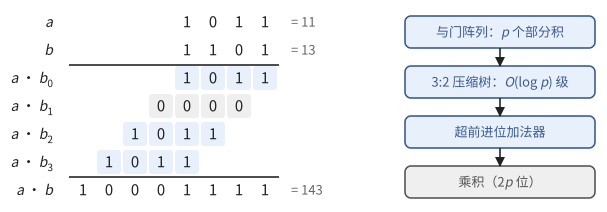

**图 2.1**　4 位乘法 $11 \times 13$。左：竖式中，$b$ 的第 $j$ 位决定第 $j$ 行是 $a$ 还是 0，这一行再左移 $j$ 位。右：乘法器的结构，与门同时产生全部部分积，压缩树把它们化为两个数，最后只做一次进位传播。

> **定义 2.1（部分积）** 设 $a, b$ 是两个 $p$ 位无符号整数。对 $j \in [p]$，把 $a$ 的每一位与 $b_j$ 相与，得到 $p$ 位数 $a \cdot b_j$，再左移 $j$ 位，记作 $q_j = (a \cdot b_j)\, 2^j$，称为第 $j$ 个**部分积**（partial product）。于是
>
> $$
> a \cdot b = \sum_{j=0}^{p-1} q_j .
> $$

等式由 $b = \sum_j b_j 2^j$ 两边乘以 $a$ 得到。产生全部部分积只要 $p^2$ 个与门，深度为 1；难的是把 $p$ 个数加起来。命题 1.52 给出了办法：先用 3:2 压缩把它们化为两个数，最后只做一次真正的加法。

> **例 2.2（用 3:2 压缩算 $11 \times 13$）** 四个部分积是 $q_0 = 11$，$q_1 = 0$，$q_2 = 44$，$q_3 = 88$。
>
> 1. 第一级把 $q_0, q_1, q_2$ 压缩成两个数（定义 1.49）：逐位异或得 $s = 11 \oplus 0 \oplus 44 = 39$，逐位取多数得 $c = 8$。现在剩下 $39$、$2c = 16$ 和 $q_3 = 88$ 三个数，和不变：$39 + 16 + 88 = 143$。
> 2. 第二级把这三个数压缩成 $s = 111$ 与 $2c = 32$。
> 3. 最后用一次超前进位加法，得 $111 + 32 = 143 = 11 \times 13$。
>
> 两级压缩各只有 3 级门，进位只在最后传播一次。

把每个部分积的每一位画成一个点，放在它的权所在的列，就得到图 2.2 的点阵。$p$ 位乘法共有 $p^2$ 个点，压缩的总工作量与点数成正比。

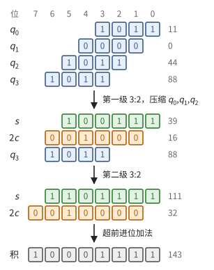

**图 2.2**　4 位乘法的点阵。每个点是一个比特，同一列的点权相同。每级 3:2 压缩把三行变成两行：和位 $s$ 留在原列，进位 $c$ 进到左边一列。两级之后只剩两行，交给一次超前进位加法。

> **命题 2.3（乘法器的代价）** 按竖式构造的 $p$ 位乘法器用 $p^2$ 个与门和 $O(p^2)$ 个全加器，深度为 $O(\log p)$。

*证明* 部分积需要 $p^2$ 个与门，深度 1。$p$ 个部分积各不超过 $2p$ 位，由命题 1.52 用 3:2 压缩化为两个数：每个全加器使比特总数减少 1，开始时共 $p^2$ 个比特，所以全加器不超过 $p^2$ 个，深度 $O(\log p)$。最后一次 $2p$ 位的超前进位加法深度为 $O(\log p)$（命题 1.47）。∎

与第 1 章比较：$p$ 位加法器的规模是 $O(p)$ 到 $O(p \log p)$（命题 1.47），乘法器则要 $p^2$ 个与门，再加上同样数量级的全加器。**乘法器比加法器大一个 $p$ 的因子**：位数加倍，加法器大约加倍，乘法器变成四倍。（存在渐近更省门的乘法电路，但在本书关心的 2 到 24 位上，竖式结构就是实际的做法。）这是本章其余内容的出发点。

## 2.2 浮点数的表示

整数乘法器处理的是一个固定范围内的整数。机器学习中的数却跨越许多数量级：权重常在 $10^{-2}$ 附近，梯度可以小到 $10^{-8}$，某些激活又能大到 $10^{4}$。办法与科学记数法相同：把一个数写成"有效数字乘以 2 的幂"，有效数字保留固定的位数。本节先拆开一个具体的 16 位浮点数（例 2.4），再给出浮点数系统的一般定义（定义 2.5），最后说明这些数在数轴上怎样分布（命题 2.7）。

科学记数法把阿伏伽德罗常数写成 $6.02 \times 10^{23}$：一个在 $[1, 10)$ 中的有效数字乘以 10 的幂。二进制的写法是 $\pm (1.f)_2 \times 2^e$，有效数字在 $[1, 2)$ 中，小数点前总是 1。

> **例 2.4（拆开一个 bf16 数）** bf16 格式用 16 位表示一个数：1 位符号、8 位指数、7 位尾数（图 2.3）。比特串 `0 10000010 1010000` 这样读出：
>
> 1. 符号位是 0，这是一个正数；
> 2. 指数字段是 $10000010_2 = 130$，减去**偏置**（bias）127，得指数 $e = 3$；
> 3. 尾数字段 $1010000$ 前面补上一个不存储的 1，得有效数字 $(1.1010000)_2 = 1 + \tfrac12 + \tfrac18 = 1.625$；
> 4. 值为 $+1.625 \times 2^3 = 13$。
>
> 反过来，$-0.375 = -(1.1)_2 \times 2^{-2}$：符号位 1，指数字段 $-2 + 127 = 125 = 01111101_2$，尾数字段 $1000000$。

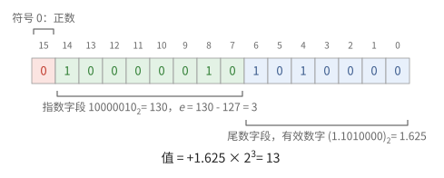

**图 2.3**　bf16 的 16 个比特，高位在左。指数字段减去偏置得到指数，尾数字段前补一个 1 得到有效数字。

小数点前的 1 不必存储，称为**隐含位**，所以 7 位尾数字段给出 8 位有效数字。指数字段的两端留作特殊用途：全为 0 时表示零和下面要定义的次正规数，全为 1 时表示无穷大和 NaN（not a number，例如 $0/0$ 的结果）。于是 bf16 的指数从 $1 - 127 = -126$ 到 $254 - 127 = 127$。把这些写成一般的定义：

> **定义 2.5（浮点数系统）** 设 $p \ge 1$ 为精度，$e_{\min} \le e_{\max}$ 为整数。二进制浮点数系统 $\mathbb{F}(p, e_{\min}, e_{\max})$ 由下列数组成：
>
> - **规格化数**：$x = \pm\, m \cdot 2^{e - p + 1}$，其中 $e_{\min} \le e \le e_{\max}$，$m$ 为整数且 $2^{p-1} \le m < 2^p$；
> - **次正规数**（subnormal number）：$x = \pm\, m \cdot 2^{e_{\min} - p + 1}$，其中 $0 \le m < 2^{p-1}$（$m = 0$ 给出零）。
>
> $m$ 称为**尾数**（significand），$e$ 称为**指数**（exponent）。

规格化数 $m \cdot 2^{e-p+1}$ 就是 $(1.f)_2 \times 2^e$，其中 $f$ 是 $m$ 去掉最高位 1 之后的 $p - 1$ 位。所以一个"$p$ 位精度"的格式存 $p - 1$ 位尾数字段：bf16 是 $\mathbb{F}(8, -126, 127)$，32 位的 f32（1 位符号、8 位指数、23 位尾数）是 $\mathbb{F}(24, -126, 127)$。两者指数范围相同，精度不同。

> **例 2.6（一个很小的浮点数系统）** $\mathbb{F}(3, -1, 2)$ 的规格化数是 $m \cdot 2^{e-2}$，$m \in \{4, 5, 6, 7\}$：
>
> | 指数 $e$ | 规格化数 | 间距 |
> | --- | --- | --- |
> | $-1$ | $0.5,\ 0.625,\ 0.75,\ 0.875$ | $1/8$ |
> | $0$ | $1,\ 1.25,\ 1.5,\ 1.75$ | $1/4$ |
> | $1$ | $2,\ 2.5,\ 3,\ 3.5$ | $1/2$ |
> | $2$ | $4,\ 5,\ 6,\ 7$ | $1$ |
>
> 次正规数是 $m \cdot 2^{-3}$，$m \in \{0, 1, 2, 3\}$，即 $0, 0.125, 0.25, 0.375$。没有它们，0 与最小的规格化数 0.5 之间就是一片空白。图 2.4 画出了全部 20 个非负数。

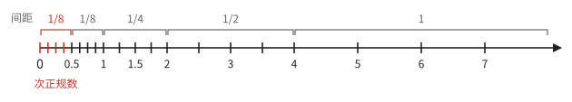

**图 2.4**　$\mathbb{F}(3, -1, 2)$ 的全部非负数，每条刻度是一个数。每过一个 2 的幂，间距加倍。红色的是次正规数：它们与最小的一段规格化数间距相同，均匀地填上了 0 附近的空隙。

例 2.6 的表中，每一行有同样多个数，间距逐行加倍。一般地：

> **命题 2.7（间距）** 在 $[2^e, 2^{e+1})$ 中（$e_{\min} \le e \le e_{\max}$），相邻两个浮点数的间距是 $2^{e - p + 1}$，称为这一段的 **ulp**（unit in the last place）。因此对这一段中的 $x$，相对间距 $\mathrm{ulp}/x$ 在 $(2^{-p}, 2^{-p+1}]$ 中，与 $e$ 无关。次正规数之间的间距都是 $2^{e_{\min} - p + 1}$，与最小的一段规格化数相同。

*证明* $[2^e, 2^{e+1})$ 中的浮点数恰是指数为 $e$ 的规格化数 $m \cdot 2^{e-p+1}$，$m = 2^{p-1}, \dots, 2^p - 1$；相邻两个的 $m$ 相差 1。对 $2^e \le x < 2^{e+1}$，$2^{e-p+1}/x$ 落在 $(2^{-p}, 2^{-p+1}]$ 中。次正规数的间距由定义直接得到。∎

相对间距与大小无关，意味着浮点数在对数尺度上大致均匀：无论一个数是 $10^{-8}$ 还是 $10^{4}$，它都保留同样多的有效位。代价是绝对间距随数的大小增长：bf16 在 $[1, 2)$ 中的间距是 $2^{-7} \approx 0.008$，在 $[256, 512)$ 中已经是 2。

## 2.3 舍入与相对误差

浮点数是离散的。两个浮点数的精确乘积、一个十进制小数（例如 0.1），一般都不是浮点数，必须舍入到其中的某一个。本节先舍入两个具体的数（例 2.8），再给出舍入的规则（定义 2.9），证明舍入的相对误差不超过 $u = 2^{-p}$（命题 2.10），并由此得到本章以后唯一使用的误差模型（推论 2.11）。

> **例 2.8（在 bf16 中舍入）**
>
> (a) 257 落在 $[256, 512)$ 中，这一段的间距是 $2^{8-7} = 2$（命题 2.7），两侧的 bf16 数是 256 和 258，257 恰在正中。规则是取尾数为偶数的那个：$256 = (1.0000000)_2 \times 2^8$ 的尾数末位是 0，$258 = (1.0000001)_2 \times 2^8$ 的末位是 1，所以 257 舍入为 256。
>
> (b) $0.1 = (1.100110011001\cdots)_2 \times 2^{-4}$。保留 8 位有效数字是 $(1.1001100)_2$，后面的 $1100\cdots$ 超过了半个间距，所以进一位，得 $(1.1001101)_2 \times 2^{-4} = 0.10009765625$，相对误差约 $9.8 \times 10^{-4}$。

> **定义 2.9（舍入）** 对实数 $x$，$\operatorname{fl}(x)$ 表示离 $x$ 最近的浮点数；有两个同样近时，取尾数 $m$ 为偶数的那个（round to nearest, ties to even）。

"取偶数"是为了让平局时向上和向下各占一半，不朝一个方向偏。例 2.8 (b) 的相对误差不到 $2^{-8} \approx 3.9 \times 10^{-3}$，这不是巧合：

> **命题 2.10（相对误差）** 若 $x$ 落在规格化数的范围内，则
>
> $$
> \lvert \operatorname{fl}(x) - x \rvert \le u \lvert x \rvert, \qquad u = 2^{-p}.
> $$
>
> $u$ 称为**单位舍入误差**（unit roundoff）。

*证明* 设 $2^e \le \lvert x \rvert < 2^{e+1}$。由命题 2.7，这一段的间距是 $2^{e-p+1}$，最近舍入的误差不超过间距的一半 $2^{e-p} = 2^{-p} \cdot 2^e \le 2^{-p} \lvert x \rvert$。∎

f32 的 $u = 2^{-24} \approx 6 \times 10^{-8}$，大约是 7 位十进制有效数字；bf16 的 $u = 2^{-8} \approx 3.9 \times 10^{-3}$，只有两三位。浮点运算的标准 IEEE 754 要求加、减、乘、除、开方的结果是精确结果的正确舍入，于是对这些运算有一个统一的误差模型：

> **推论 2.11（标准模型）** 设运算 $\circ$ 的结果总是精确结果的舍入，且精确结果落在规格化数的范围内。则
>
> $$
> \operatorname{fl}(a \circ b) = (a \circ b)(1 + \delta), \qquad \lvert \delta \rvert \le u.
> $$

*证明* 对 $x = a \circ b$ 用命题 2.10，令 $\delta = (\operatorname{fl}(x) - x)/x$。∎

本章以后的误差分析都只用这个模型。它在两种情况下不成立：结果超过最大的有限数时变成无穷大（**溢出**），结果小于最小的规格化数时落进次正规数，只剩绝对精度（**下溢**）。格式的指数位数决定这两件事发生得多早。

## 2.4 浮点运算单元

知道了浮点数是什么，就可以问它的运算单元有多大。本节把浮点乘法和浮点加法各拆成几步（例 2.12、2.13），看出前者的代价由尾数乘法器（命题 2.3）主导，后者的代价在移位器（命题 2.14），二者相差一个 $p / \log p$ 的因子（命题 2.15）；最后说明把乘法和加法合成一条运算有什么好处（定义 2.16）。本节的例子都用 $p = 4$ 的格式（尾数字段 3 位），以便手算。

**浮点乘法**的原理是 $(m_1 2^{e_1})(m_2 2^{e_2}) = (m_1 m_2)\, 2^{e_1 + e_2}$：尾数相乘，指数相加。

> **例 2.12（浮点乘法的步骤）** 计算 $3 \times 7 = (1.100)_2 \times 2^1 \cdot (1.110)_2 \times 2^2$。
>
> 1. 尾数相乘：$(1.100)_2 \times (1.110)_2 = (10.101)_2$，即 $1.5 \times 1.75 = 2.625$；
> 2. 指数相加：$1 + 2 = 3$；
> 3. 规格化：$(10.101)_2 \ge 2$，右移一位得 $(1.0101)_2$，指数加 1，变成 4；
> 4. 舍入到 4 位有效数字：$(1.0101)_2$ 恰在 $(1.010)_2$ 与 $(1.011)_2$ 正中，取尾数为偶数的 $(1.010)_2$。
>
> 结果是 $(1.010)_2 \times 2^4 = 20$，精确值是 21，相对误差 $1/21 < 2^{-4}$，与命题 2.10 一致。

第 1 步是一个 $p \times p$ 的整数乘法器；第 2 步是一个只有几位的加法器；第 3 步至多右移一位，因为 $[1, 2)$ 中两个数的积在 $[1, 4)$ 中；第 4 步只看几个低位。代价由第 1 步主导。

**浮点加法**麻烦在两个数的指数一般不同，要先把小的那个数的尾数右移，让小数点对齐。

> **例 2.13（浮点加法的步骤）**
>
> (a) 计算 $8 + 0.375 = (1.000)_2 \times 2^3 + (1.100)_2 \times 2^{-2}$。
>
> 1. 对阶：指数相差 5，把较小数的尾数右移 5 位，变成 $(0.00001100)_2 \times 2^3$；
> 2. 尾数相加：$(1.00001100)_2 \times 2^3$；
> 3. 规格化：已在 $[1, 2)$ 中，不必移位；
> 4. 舍入到 4 位有效数字：$(1.000)_2 \times 2^3 = 8$。0.375 小于这一段半个间距 0.5，被完全吸收了。
>
> (b) 计算 $1.125 - 1 = (1.001)_2 - (1.000)_2$。指数相同，不必对阶；尾数相减得 $(0.001)_2$；规格化时要数出前导零有 3 个，再左移 3 位，得 $(1.000)_2 \times 2^{-3} = 0.125$。结果精确，但有效数字从 4 位降到了 1 位：若 1.125 和 1 本身带有舍入误差，这些误差相对于差 0.125 就被放大了 9 倍。这种现象称为**相消**（cancellation）。

所以浮点加法器除了一个 $p$ 位加法器，还要一个按运行时给出的距离右移的**对阶移位器**、一个数前导零的电路和一个左移的**规格化移位器**。移位器用第 1 章的选择器搭成：

> **命题 2.14（移位器）** 把 $p$ 位数右移 $k$ 位（$0 \le k < 2^r$，$k$ 以 $r$ 位二进制给出）的电路，可以用 $r$ 级、每级 $p$ 个二选一选择器构成：第 $j$ 级按 $k$ 的第 $j$ 位决定是否把数右移 $2^j$ 位。规模为 $O(rp)$，深度为 $O(r)$；取 $r = \lceil \log p \rceil$，规模为 $O(p \log p)$。

*证明* $k = \sum_j k_j 2^j$，第 $j$ 级移动 $k_j 2^j$ 位，各级移动的位数之和是 $k$。第 $j$ 级的第 $i$ 个输出是 $\operatorname{mux}(k_j, x_i, x_{i + 2^j})$（超出范围的位取 0），共 $p$ 个选择器，深度为 3（例 1.7）。∎

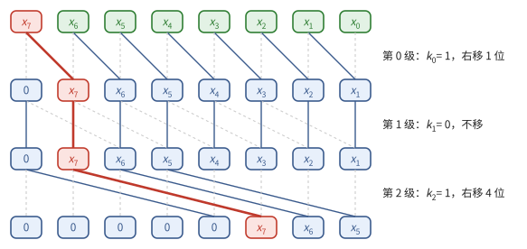

**图 2.5**　8 位右移器（$r = 3$）。每一级的每个方框是一个二选一选择器：竖线是"不移"，斜线是"移 $2^j$ 位"，由 $k_j$ 选择。图中 $k = 5 = 101_2$，红色的路径表示原来的第 7 位最终到达第 2 位。

> **命题 2.15（浮点单元的代价）** 精度为 $p$ 的浮点乘法器规模为 $\Theta(p^2)$，由尾数乘法器主导；浮点加法器规模为 $O(p \log p)$，由两个移位器和尾数加法器主导。二者的深度都是 $O(\log p)$。

*证明* 乘法器：尾数乘法器由命题 2.3，其余各步（指数加法、至多一位的移位、舍入）规模 $O(p)$。加法器：两个移位器由命题 2.14 各为 $O(p \log p)$；尾数加法器由命题 1.47 为 $O(p \log p)$；数前导零等价于从高位起求前缀"或"（第 1 章的前缀网络），再把第一个 1 的位置编码成二进制，规模 $O(p \log p)$、深度 $O(\log p)$。∎

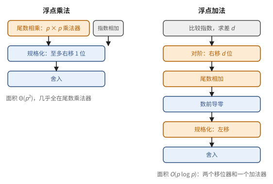

**图 2.6**　浮点乘法与浮点加法的数据通路。乘法器的面积几乎全在尾数相乘，加法器的面积分散在两个移位器和尾数加法器上。

乘法与加法常常连在一起出现：点积 $\sum_k a_k b_k$ 的每一步都是一次乘法接一次加法。把两者合成一条运算，中间的乘积就不必舍入：

> **定义 2.16（融合乘加）** **融合乘加**（fused multiply-add，FMA）计算 $\operatorname{fl}(ab + c)$：乘积 $ab$ 保留全部 $2p$ 位，与 $c$ 相加后只舍入一次。

少一次舍入有时差别很大。下面的例子正好碰上相消。

> **例 2.17** 在 $p = 4$ 的格式中，$a = b = (1.001)_2 = 1.125$，$c = -1.25$。精确的 $ab = 1.265625 = (1.010001)_2$。先乘后加：$\operatorname{fl}(ab) = (1.010)_2 = 1.25$，$\operatorname{fl}(\operatorname{fl}(ab) + c) = 0$。融合乘加：$ab + c = 0.015625 = 2^{-6}$，舍入后不变，是精确结果。

融合乘加的硬件比一个乘法器加一个加法器大不了多少：乘法器给出的 $2p$ 位乘积直接送进一个较宽的加法器，省去了中间的舍入。第 5 章的矩阵单元就是由大量乘加单元组成的。

## 2.5 求和的误差

点积和矩阵乘法要把成千上万个乘积加起来，每一次加法都按推论 2.11 带来一个相对误差。这些误差会积累到多大？本节先看一个低精度累加完全失败的例子（例 2.18），再证明顺序求和的误差界随项数线性增长（命题 2.20）、树形求和只随 $\log n$ 增长（命题 2.21），最后讨论浮点加法不满足结合律的后果。本节记 $s = \sum_{i=1}^n x_i$。

> **例 2.18（bf16 累加的停滞）** 用 bf16 累加器逐个加 4096 个 1.0。加到 256 时，$[256, 512)$ 中 bf16 的间距是 2，$256 + 1 = 257$ 恰在 256 和 258 中间，按偶数优先舍入回 256（例 2.8）。此后每一步都是如此，最终结果是 256，而不是 4096。用 f32 累加器则得到精确的 4096。

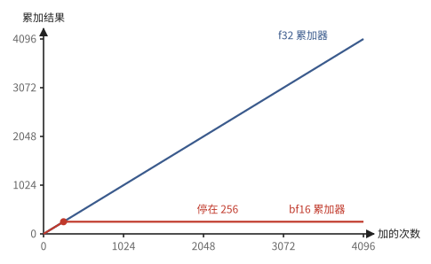

**图 2.7**　例 2.18：逐个加 1.0。f32 累加器得到 4096；bf16 累加器加到 256 之后，$256 + 1$ 舍入回 256，从此不再增长。

停滞的原因是：累加器越来越大，它的间距也越来越大，而每次加上的量不变，终于小于半个间距。一般的情形需要一个误差界。先证明一个关于舍入因子连乘的引理：

> **引理 2.19** 设 $\lvert \delta_k \rvert \le u$（$k = 1, \dots, m$），且 $mu < 1$。则
>
> $$
> \Big\lvert \prod_{k=1}^{m} (1 + \delta_k) - 1 \Big\rvert \le \gamma_m, \qquad \gamma_m = \frac{mu}{1 - mu}.
> $$

*证明* 乘积介于 $(1 - u)^m$ 与 $(1 + u)^m$ 之间。一方面 $(1 + u)^m \le e^{mu} \le \frac{1}{1 - mu}$（后一个不等式即 $e^{-t} \ge 1 - t$），所以 $(1 + u)^m - 1 \le \gamma_m$；另一方面 $1 - (1 - u)^m \le mu \le \gamma_m$（Bernoulli 不等式）。∎

> **命题 2.20（顺序求和）** 按 $\hat s_1 = x_1$，$\hat s_k = \operatorname{fl}(\hat s_{k-1} + x_k)$ 计算 $n$ 个数的和 $\hat s_n$，则
>
> $$
> \lvert \hat{s}_n - s \rvert \le \gamma_{n-1} \sum_{i=1}^n \lvert x_i \rvert .
> $$

*证明* 由标准模型，$\hat{s}_k = (\hat{s}_{k-1} + x_k)(1 + \delta_k)$，$\lvert \delta_k \rvert \le u$。逐层展开得

$$
\hat{s}_n = \sum_{i=1}^n x_i \prod_{k=\max(i,2)}^{n} (1 + \delta_k),
$$

即 $x_i$ 被它之后的每一次加法各乘上一个因子 $1 + \delta_k$，至多 $n - 1$ 个。由引理 2.19，每个乘积与 1 相差不超过 $\gamma_{n-1}$（$\gamma_m$ 随 $m$ 增大）。于是 $\lvert \hat s_n - s \rvert \le \sum_i \lvert x_i \rvert \gamma_{n-1}$。∎

证明表明，误差界由每个 $x_i$ 经过的加法次数决定。顺序求和中 $x_1$ 要经过 $n - 1$ 次；换成第 1 章的二叉树（例 1.8），每个数只经过 $\lceil \log n \rceil$ 次（图 2.8）：

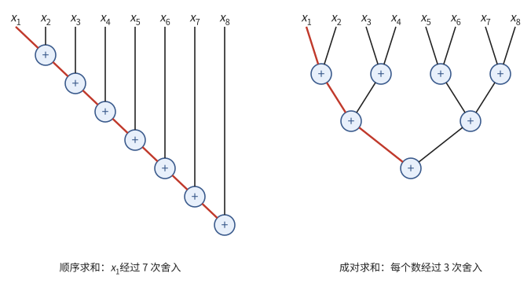

**图 2.8**　8 个数的两种求和顺序。每个圆圈是一次加法，也是一次舍入。左：顺序求和，$x_1$ 经过 7 次舍入（红色路径）；右：成对求和，每个数都只经过 3 次。

> **命题 2.21（树形求和）** 按二叉树（例 1.8）成对求和，误差界中的 $\gamma_{n-1}$ 换成 $\gamma_{\lceil \log n \rceil}$。

*证明* 与命题 2.20 相同，只是每个 $x_i$ 只被从叶到根的 $\lceil \log n \rceil$ 次加法各乘上一个因子（命题 1.38 的二叉树深度为 $\lceil \log n \rceil$）。∎

代入数字：$n = 4096$ 个 f32 数，顺序求和的相对误差界约 $4095 \times 6 \times 10^{-8} \approx 2.4 \times 10^{-4}$，成对求和约 $12 \times 6 \times 10^{-8} \approx 7 \times 10^{-7}$。bf16 的 $nu = 16 > 1$，顺序求和的误差界已经没有意义，例 2.18 正是这种情形。两个界都是最坏情况；若舍入误差可以看作独立的零均值随机变量，误差的典型大小是 $\sqrt{n}\,u$ 而不是 $nu$。但例 2.18 说明，最坏情况并非遥不可及：每次舍入都朝同一个方向时，误差就是线性积累的。

**浮点加法不满足结合律。** 例如在 f32 中，$10^8$ 落在 $[2^{26}, 2^{27})$ 中，间距是 $2^{26-23} = 8$：

$$
(10^8 + 1) - 10^8 = 0, \qquad (10^8 - 10^8) + 1 = 1 .
$$

所以第 1 章那些依赖结合律重新加括号的方法，用在浮点数上时会改变结果的最后几位。并行归约的加法顺序取决于划分方式；用原子加法累加时，顺序还取决于运行时谁先到达。同一个程序在不同的并行配置下，甚至同一配置的两次运行，结果都可能不同。要逐位可复现，必须固定归约树的形状（第 10 章）。

## 2.6 机器学习中使用的格式

2.2 节的 bf16 只是许多格式中的一种。一种格式由两个数决定：尾数字段的位数决定精度 $p$，从而决定 $u = 2^{-p}$（命题 2.10）；指数字段的位数决定范围，即多早溢出和下溢。总位数固定时，二者此消彼长。本节列出机器学习中常用的格式（下表与图 2.9），用两个数在各格式中的表示说明这种取舍（例 2.22），最后介绍整数格式。

下表中"位分配"是符号位、指数位、尾数位的位数，$p$ 等于尾数位数加 1。

| 格式 | 位分配 | $p$ | $u$ | 最大值 | 最小规格化数 |
| --- | --- | ---: | ---: | ---: | ---: |
| f32 | 1/8/23 | 24 | $2^{-24} \approx 6.0 \times 10^{-8}$ | $3.4 \times 10^{38}$ | $2^{-126}$ |
| tf32 | 1/8/10 | 11 | $2^{-11} \approx 4.9 \times 10^{-4}$ | 同 f32 | $2^{-126}$ |
| bf16 | 1/8/7 | 8 | $2^{-8} \approx 3.9 \times 10^{-3}$ | $3.4 \times 10^{38}$ | $2^{-126}$ |
| fp16 | 1/5/10 | 11 | $2^{-11}$ | 65504 | $2^{-14}$ |
| fp8 E4M3 | 1/4/3 | 4 | $2^{-4}$ | 448 | $2^{-6}$ |
| fp8 E5M2 | 1/5/2 | 3 | $2^{-3}$ | 57344 | $2^{-14}$ |
| fp4 E2M1 | 1/2/1 | 2 | $2^{-2}$ | 6 | 1 |

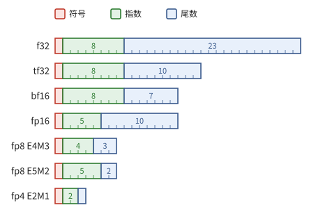

**图 2.9**　常用格式的位分配，每格一位，格中数字是这一段的位数。bf16 与 f32 的指数一样宽，所以表示范围相同；fp16 尾数多、指数窄。

> **例 2.22（同一个数在各格式中）** 把 $1/3$ 和 $1000$ 舍入到各格式（超出最大值时按通常的做法饱和到最大值）：
>
> | 格式 | $1/3$ 的表示 | 相对误差 | $1000$ 的表示 |
> | --- | --- | --- | --- |
> | f32 | 0.33333334 | $3.0 \times 10^{-8}$ | 1000 |
> | fp16 | 0.33325195 | $2.4 \times 10^{-4}$ | 1000 |
> | bf16 | 0.33398438 | $2.0 \times 10^{-3}$ | 1000 |
> | fp8 E4M3 | 0.34375 | $3.1 \times 10^{-2}$ | 448（溢出） |
> | fp8 E5M2 | 0.3125 | $6.3 \times 10^{-2}$ | 1024 |
> | fp4 E2M1 | 0.5（次正规数） | 50% | 6（溢出） |
>
> 以 E4M3 为例：$1/3 = (1.0101\cdots)_2 \times 2^{-2}$，保留 4 位有效数字时后面是 $1010\cdots$，超过半个间距，进位得 $(1.011)_2 \times 2^{-2} = 0.34375$。fp16 的 $1/3$ 比 bf16 准确 8 倍，但 fp16 最大只到 65504；E5M2 比 E4M3 粗，却能表示 1000。

几点说明：

- **bf16** 与 f32 指数位相同，表示范围相同，只是尾数从 23 位截短到 7 位。f32 转 bf16 只需舍去低 16 位尾数，不会溢出。这是它成为训练默认格式的原因。
- **fp16** 尾数多、指数少，范围只到 65504，最小规格化数只有 $6.1 \times 10^{-5}$，训练时大的激活容易溢出、小的梯度容易下溢，需要额外的缩放。
- **tf32** 不是存储格式，而是 NVIDIA 矩阵单元处理 f32 输入时内部使用的格式：输入舍入到 11 位精度再相乘。
- **fp8** 有两种：E4M3 精度高、范围小，常用于前向的权重和激活；E5M2 范围大、精度低，常用于反向的梯度。E4M3 不表示无穷大，只把指数与尾数全为 1 的编码留作 NaN，所以最大值是 $(1.110)_2 \times 2^8 = 448$。
- **fp4 E2M1** 只能表示 $0, 0.5, 1, 1.5, 2, 3, 4, 6$ 和它们的相反数（习题 2.10）。

**整数格式。** int8 用 8 位补码表示 $-128$ 到 $127$ 的整数 $q$，再配一个缩放因子 $s$，表示实数 $s \cdot q$。与浮点数不同，它的间距处处相同，都是 $s$。例如 $s = 0.01$ 时，int8 表示 $-1.28$ 到 $1.27$ 之间、间距 0.01 的数。两个 int8 之积的绝对值不超过 $2^{14}$，在 32 位整数（int32）中累加十万项也不会溢出，而且整数加法没有舍入误差。int8 和 int4 常用于推理（第 11 章）。

## 2.7 低精度相乘、高精度累加

有了各格式的精度，就可以比较它们的乘法器有多大（命题 2.15）；有了 2.5 节的误差界，就可以判断累加应当用什么格式。本节由这两点得出矩阵单元的设计原则（定义 2.24），并说明在这个原则下，乘法本身其实不产生误差（命题 2.25）。

浮点乘法器的规模由尾数乘法器主导，按 $p^2$ 估算各格式乘法器的相对大小：

| 格式 | f32 | tf32/fp16 | bf16 | fp8 E4M3 | fp8 E5M2 | fp4 E2M1 |
| --- | ---: | ---: | ---: | ---: | ---: | ---: |
| $p$ | 24 | 11 | 8 | 4 | 3 | 2 |
| $p^2$ | 576 | 121 | 64 | 16 | 9 | 4 |

一个 bf16 乘法器约为 f32 的九分之一，同样的面积里能多放约九倍。

> **注 2.23** 实际芯片中，每降一档精度（bf16 → fp8 → fp4），峰值算力通常翻一倍，而不是按 $p^2$ 增长。原因是乘法器之外的代价：把操作数送到乘法器的导线、寄存器和存储带宽都与位数成正比，而它们占了面积和能耗的大头（注 1.13、命题 1.14）。$p^2$ 说明的是方向：精度越低，乘法本身越不是瓶颈。

另一方面，浮点加法器只有 $O(p \log p)$ 的规模，用高精度并不贵；而累加的误差随项数积累（命题 2.20），低精度累加还会停滞（例 2.18）。由此得到加速器设计的第一条原则：**低精度相乘，高精度累加**。

> **定义 2.24（混合精度乘加）** 矩阵单元执行 $D = AB + C$，其中 $A, B$ 为低精度格式，$C, D$ 为 f32（整数输入时为 int32）。

这样做的乘法其实没有误差：

> **命题 2.25（低精度乘积是精确的）** 两个精度为 $p$ 的浮点数之积可以精确地写成精度为 $2p$ 的浮点数。因此若 $2p \le p'$，并且不出现溢出和下溢，它在精度为 $p'$ 的格式中精确。

*证明* 两个数是 $m_1 2^{k_1}$ 与 $m_2 2^{k_2}$，$m_1, m_2 < 2^p$ 为整数，积为 $(m_1 m_2) 2^{k_1 + k_2}$，而 $m_1 m_2 < 2^{2p}$ 是整数。∎

两个 bf16 之积有效位不超过 16 位，在 f32（$p = 24$）中精确；两个 E4M3 之积不超过 8 位，在 bf16 中都精确。所以混合精度乘加的误差只来自 f32 的累加和最后一次转回低精度。审查代码时要特别留意违反这一点的写法：**矩阵乘法和归约的累加器必须是 f32**。很多框架在两个 bf16 相乘时默认输出 bf16，如果不显式要求 f32 结果，后续的分块累加就会在 bf16 中进行（习题 2.9）。

## 2.8 块缩放

2.6 节的表说明，fp8 与 fp4 的范围太窄：E4M3 只到 448，E2M1 只到 6。模型的权重和激活直接存成这些格式，大的值会溢出，小的值会变成零。办法是让一小块数共用一个缩放因子。本节先用 8 个数的例子看清块缩放怎样工作、块的大小为什么要紧（例 2.26），再给出一般的定义（定义 2.27）和块内精度的界（命题 2.28），最后说明它与矩阵乘法怎样配合。

按 OCP Microscaling（MX）规范，一块数的缩放因子取 2 的整数次幂 $s = 2^{\lfloor \log_2 a \rfloor - e^E_{\max}}$，其中 $a$ 是块内最大的绝对值，$e^E_{\max}$ 是元素格式最大规格化数的指数（E2M1 的最大值 $6 = 1.5 \times 2^2$，所以 $e^E_{\max} = 2$）。这样 $a / s$ 落在 $[2^{e^E_{\max}}, 2^{e^E_{\max}+1})$ 中，恰好用上元素格式最大的一段；超出最大值的饱和到最大值。

> **例 2.26（一个离群值的影响）** 把 8 个数量化成 fp4 E2M1，其中 2.9 远大于其余各数：
>
> | | $x_0$ | $x_1$ | $x_2$ | $x_3$ | $x_4$ | $x_5$ | $x_6$ | $x_7$ |
> | --- | ---: | ---: | ---: | ---: | ---: | ---: | ---: | ---: |
> | 原值 | 0.02 | $-0.11$ | 0.05 | 0.31 | $-0.07$ | 2.9 | 0.01 | $-0.24$ |
> | 一块（$b = 8$） | 0 | 0 | 0 | 0.25 | 0 | 3 | 0 | $-0.25$ |
> | 两块（$b = 4$） | 0.03125 | $-0.125$ | 0.0625 | 0.25 | 0 | 3 | 0 | $-0.25$ |
>
> 一块时 $a = 2.9$，$s = 2^{1 - 2} = 0.5$，各数除以 $s$ 后是 $0.04, -0.22, 0.1, 0.62, -0.14, 5.8, 0.02, -0.48$，舍入到 E2M1 的 $\{0, 0.5, 1, 1.5, 2, 3, 4, 6\}$ 再乘回 $s$：8 个数里有 5 个变成 0。分成两块时，第一块的最大值是 0.31，$s = 2^{-2-2} = 1/16$，除以 $s$ 后是 $0.32, -1.76, 0.8, 4.96$，舍入为 $0.5, -2, 1, 4$，四个小数都保住了一两位有效数字；离群值 2.9 只影响它自己所在的块。

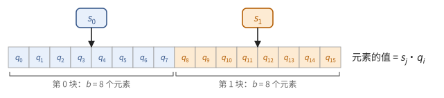

**图 2.10**　块缩放（$b = 8$）。每块存一个缩放因子 $s_j$ 和 8 个低精度元素 $q_i$，元素表示的值是 $s_j q_i$。

> **定义 2.27（块缩放格式）** 把向量 $x \in \mathbb{R}^n$ 分成长度为 $b$ 的块。第 $j$ 块存一个缩放因子 $s_j$（格式 $S$）和 $b$ 个元素 $q_i$（格式 $E$），表示的值为
>
> $$
> \hat{x}_i = s_{\lfloor i/b \rfloor} \cdot q_i .
> $$

常见的几种：

| 名称 | 块长 $b$ | 元素格式 $E$ | 缩放因子格式 $S$ |
| --- | ---: | --- | --- |
| MXFP8 / MXFP6 / MXFP4 | 32 | fp8 / fp6 / fp4 | E8M0（2 的整数次幂） |
| NVFP4 | 16 | fp4 E2M1 | fp8 E4M3，另有整个张量共用的一个 f32 因子 |
| 按通道、按组缩放的 int8/fp8 | 一行、一列或 64–128 个元素 | int8 或 fp8 | f32 或 bf16 |

MX 的缩放因子是 2 的幂，乘以它只改变指数，不引入舍入。NVFP4 用 E4M3 作缩放因子，因子本身可以不是 2 的幂，能更贴合 $a$。例 2.26 中小元素的命运，可以一般地写出来：

> **命题 2.28（块内的相对精度）** 在块缩放格式中，设块的最大绝对值为 $a$，元素格式的最大值为 $q_{\max}$、最小规格化数为 $q_{\min}$。若缩放后 $a / s \approx q_{\max}$，则块内满足
>
> $$
> \lvert x_i \rvert \ge a \cdot \frac{q_{\min}}{q_{\max}}
> $$
>
> 的元素获得相对误差不超过 $u_E$ 的表示；更小的元素只剩下次正规数的绝对精度，即 $s \cdot q_{\min} \cdot 2^{-(p_E - 1)}$ 量级。

*证明* $x_i / s$ 落在 $E$ 的规格化范围内，当且仅当 $\lvert x_i \rvert / s \ge q_{\min}$。代入 $s \approx a / q_{\max}$，再用命题 2.10。∎

对 E2M1，$q_{\min}/q_{\max} = 1/6$：一个块里比最大值小 6 倍以上的元素，只能落在 $\{0, 0.5\} \cdot s$ 上，这正是例 2.26 的一块情形。所以块越小，一个离群值影响的元素越少，这是 NVFP4 把块长从 32 减到 16 的原因。

块缩放与矩阵乘法配合得很好。设 $A$ 的每一行沿 $K$ 方向每 $b$ 个元素一个因子，$B$ 的每一列也沿 $K$ 方向每 $b$ 个元素一个因子，则

$$
C[i,j] = \sum_{t} s^A_{i,t}\, s^B_{t,j} \sum_{k \in \text{block } t} q^A_{i,k}\, q^B_{k,j}.
$$

例如 $K = 64$、$b = 32$ 时，外层只有 $t = 0, 1$ 两项：先用低精度乘法器算出两个长度为 32 的点积，各乘上一对因子，再在 f32 中相加。内层是低精度元素的点积，由低精度乘法器完成；外层每 $b$ 次乘加才多一次缩放乘法。第 5 章会看到，最新的矩阵单元直接在硬件中完成这个公式。

> **现状（2026-10）**：TPU v5e 起支持 int8 矩阵乘法，Ironwood（TPU v7）支持 fp8，TPU 8t 支持 fp4。NVIDIA 从 Hopper 起支持 fp8，Blackwell 起在硬件中支持 MX 格式与 NVFP4 的块缩放矩阵乘法，Rubin 的主打格式是 NVFP4。

## 2.9 用低精度拼出高精度

矩阵单元只有低精度乘法器。需要更高精度时，可以把一个数拆成几个低精度数之和，用多次低精度乘法拼出来。本节先手算一次拆分（例 2.29），再证明一个 f32 数恰好是三个 bf16 数之和（命题 2.30），由此算出 f32 精度的矩阵乘法要做几次 bf16 矩阵乘法（推论 2.31）。

> **例 2.29（把 f32 的 1/3 拆成三个 bf16）** f32 中离 $1/3$ 最近的数是 $x = (1.01010101010101010101011)_2 \times 2^{-2} \approx 0.3333333433$。依次取 bf16 舍入、求余数：
>
> 1. $x_1 = \operatorname{fl}_{\text{bf16}}(x) = (1.0101011)_2 \times 2^{-2} = 0.333984375$，余数 $r_1 = x - x_1 = -21845 \times 2^{-25} \approx -6.5103 \times 10^{-4}$；
> 2. $x_2 = \operatorname{fl}_{\text{bf16}}(r_1) = -(1.0101011)_2 \times 2^{-11} \approx -6.5231 \times 10^{-4}$，余数 $r_2 = r_1 - x_2 = 43 \times 2^{-25} \approx 1.2815 \times 10^{-6}$；
> 3. $43 = 101011_2$ 只有 6 位有效数字，$x_3 = \operatorname{fl}_{\text{bf16}}(r_2) = r_2$，余数为 0。
>
> 所以 $x = x_1 + x_2 + x_3$ 精确成立。每一步余数缩小约 $2^{-8}$ 倍；$x_2$ 是负的，因为第一步舍入时进了位。

> **命题 2.30（f32 拆成三个 bf16）** 设 $x$ 是 f32 规格化数，且下列运算中不出现下溢。令
>
> $$
> x_1 = \operatorname{fl}_{\text{bf16}}(x), \quad r_1 = x - x_1, \quad x_2 = \operatorname{fl}_{\text{bf16}}(r_1), \quad r_2 = r_1 - x_2, \quad x_3 = \operatorname{fl}_{\text{bf16}}(r_2),
> $$
>
> 则 $r_1, r_2$ 在 f32 中精确，且 $x = x_1 + x_2 + x_3$ 精确成立。

*证明* 设 $2^e \le \lvert x \rvert < 2^{e+1}$，记 $\epsilon = 2^{e-23}$（$x$ 在 f32 中的 ulp）。$x$ 是 $\epsilon$ 的整数倍。$x_1$ 是 $x$ 舍入到 8 位精度的结果，是 $2^{e-7}$ 的整数倍（若进位到 $2^{e+1}$ 也成立），因而也是 $\epsilon$ 的整数倍，所以 $r_1$ 是 $\epsilon$ 的整数倍；由命题 2.10，$\lvert r_1 \rvert \le 2^{-8} \lvert x \rvert$，它的有效位不超过 24 位，在 f32 中精确。同理 $x_2$ 和 $r_2$ 都是 $\epsilon$ 的整数倍（若 $r_1$ 的有效位不超过 8 位，舍入是精确的；否则舍入网格不小于 $\epsilon$），且 $\lvert r_2 \rvert \le 2^{-16} \lvert x \rvert$。最后 $r_3 = r_2 - x_3$ 是 $\epsilon$ 的整数倍且 $\lvert r_3 \rvert \le 2^{-24} \lvert x \rvert < 2^{-24} \cdot 2^{e+1} = \epsilon$，故 $r_3 = 0$。∎

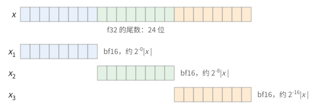

**图 2.11**　命题 2.30 的示意：$x_1$ 取走 $x$ 的尾数的高 8 位，$x_2$、$x_3$ 依次取走后面各 8 位。实际拆分时余数可能变号（例 2.29），图中没有画出。

于是两个 f32 数的乘积可以写成

$$
xy = \sum_{i=1}^{3} \sum_{j=1}^{3} x_i y_j ,
$$

其中每个 $x_i y_j$ 是两个 bf16 之积，由命题 2.25 在 f32 中精确。$x_i y_j$ 的大小约为 $2^{-8(i+j-2)} \lvert xy \rvert$（图 2.12）。$i + j \ge 5$ 的三项小于 f32 的舍入误差，可以舍去；保留 $i + j \le 4$ 的 6 项，得到接近 f32 精度的乘积。只拆成两段并保留 $i + j \le 3$ 的 3 项，得到约 16 位精度。

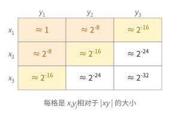

**图 2.12**　$xy$ 的 9 个部分乘积及其大小。橙色的 3 项（$i + j \le 3$）给出约 16 位精度，加上黄色的 3 项接近 f32 精度，白色的 3 项小于 f32 的舍入误差。

> **推论 2.31** 在只有 bf16 乘法器的矩阵单元上，接近 f32 精度的矩阵乘法要 6 次 bf16 矩阵乘法，约 16 位精度的要 3 次。

*证明* 矩阵乘法对 $A$、$B$ 都是线性的：把 $A = A_1 + A_2 + A_3$、$B = B_1 + B_2 + B_3$ 逐元素按命题 2.30 拆开，则 $AB = \sum_{i,j} A_i B_j$，按上面的分析保留 6 项或 3 项。每一项是一次 bf16 矩阵乘法，在 f32 中累加。∎

> **现状（2026-10）**：JAX 在 TPU 上的 `precision` 参数正是这样实现的：`DEFAULT` 做一次 bf16 乘法，`HIGH` 做 3 次，`HIGHEST` 做 6 次。NVIDIA GPU 上 f32 矩阵乘法可以用 tf32（一次，约 11 位精度）或"3xTF32"（三次）。

同样的思路也用于整数。若某个向量单元没有 32 位整数乘法器（命题 2.3 说明它很贵），可以把整数拆成几段，每段小到乘积能精确放进 f32 的 24 位尾数，用 f32 乘法算出部分积再移位相加（习题 2.12）。

## 2.10 随机舍入

最后回到舍入本身。例 2.18 的停滞来自最近舍入的系统性偏差：比半个间距小的增量每次都被舍掉，而且总是朝同一个方向。本节定义一种没有这种偏差的舍入（定义 2.32），证明它无偏并求出它的方差（命题 2.33），再说明它怎样用一次整数加法实现（命题 2.34）。

先看问题出在哪里。用 bf16 存一个权重 $w = 1$，训练的每一步加上一个 $10^{-3}$ 的更新。1 附近 bf16 的间距是 $2^{-7} \approx 0.0078$，$1.001$ 离 1 比离 $1 + 2^{-7}$ 近，按最近舍入回到 1。每一步都是如此，更新被永远丢掉，这与例 2.18 是同一现象。如果改为以 $0.001 / 0.0078 \approx 0.128$ 的概率进到 $1 + 2^{-7}$、其余时候留在 1，那么每一步的期望增量正好是 $10^{-3}$。

> **定义 2.32（随机舍入）** 设 $x$ 落在相邻的两个浮点数 $a < b$ 之间。**随机舍入**（stochastic rounding）$\operatorname{SR}(x)$ 以概率 $(b - x)/(b - a)$ 取 $a$，以概率 $(x - a)/(b - a)$ 取 $b$。

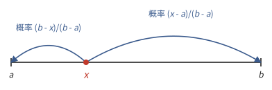

**图 2.13**　随机舍入：$x$ 舍入到两侧的浮点数，离哪一侧越近，舍入到那一侧的概率越大。

> **命题 2.33（随机舍入的均值与方差）** $\mathbb{E}[\operatorname{SR}(x)] = x$，$\operatorname{Var}[\operatorname{SR}(x)] = (x - a)(b - x) \le (b - a)^2 / 4$。

*证明* 记 $\theta = (x - a)/(b - a)$，则 $x = a + \theta(b - a)$。均值为 $a(1 - \theta) + b\theta = x$。方差为 $\mathbb{E}[\operatorname{SR}(x)^2] - x^2 = a^2(1 - \theta) + b^2 \theta - (a + \theta(b - a))^2 = \theta(1 - \theta)(b - a)^2 = (x - a)(b - x)$，在 $\theta = 1/2$ 时最大。∎

所以随机舍入用方差换掉了偏差：每次舍入的误差均值为零，标准差不超过半个间距。各步的误差互相抵消，而不是像最近舍入那样朝一个方向积累。实现它只需要一个随机整数：

> **命题 2.34（随机舍入的实现）** 设 $x \ge 0$，舍入时要舍去 $x$ 的二进制表示中的低 $k$ 位，这 $k$ 位组成的整数为 $F$（$0 \le F < 2^k$）。取 $[0, 2^k)$ 中均匀分布的随机整数 $R$，把 $R$ 加到这 $k$ 位上（产生的进位进入保留的部分），再舍去低 $k$ 位。所得结果就是 $\operatorname{SR}(x)$。

*证明* 记保留部分表示的数为 $a$，它加 1 个最低位是 $b$，则 $(x - a)/(b - a) = F / 2^k$。$F + R \ge 2^k$ 时产生进位，结果为 $b$，概率是 $F / 2^k$；否则结果为 $a$。∎

代价是每次舍入都要 $k$ 个随机比特，以及一次整数加法。在低精度训练中，权重或优化器状态用 bf16 存储时，常用随机舍入保住小于半个 ulp 的更新。

## 接口小结

1. 竖式乘法器用 $p^2$ 个与门产生部分积，再用 3:2 压缩树加起来，规模 $\Theta(p^2)$、深度 $O(\log p)$；加法器的规模是 $O(p)$ 到 $O(p \log p)$。乘法器比加法器大一个 $p$ 的因子。（命题 2.3）
2. 浮点数 $\pm m \cdot 2^{e - p + 1}$：在 $[2^e, 2^{e+1})$ 中间距为 $2^{e-p+1}$，相对间距与 $e$ 无关；指数字段减去偏置得指数，尾数字段前补一个 1 得有效数字。（定义 2.5、命题 2.7、例 2.4）
3. 最近舍入的相对误差不超过 $u = 2^{-p}$；正确舍入的运算满足标准模型 $\operatorname{fl}(a \circ b) = (a \circ b)(1 + \delta)$，$\lvert \delta \rvert \le u$。（命题 2.10、推论 2.11）
4. 浮点乘法器规模 $\Theta(p^2)$，浮点加法器 $O(p \log p)$；融合乘加只舍入一次。（命题 2.15、定义 2.16）
5. 顺序求和的误差界随项数线性增长，树形求和随 $\log n$ 增长；bf16 累加会停滞。浮点加法不满足结合律：改变归约树会改变结果的最后几位。（命题 2.20、2.21，例 2.18，2.5 节）
6. 各格式的精度与范围见 2.6 节的表；int8 是间距固定的定点数，乘积在 int32 中累加。（2.6 节）
7. 低精度相乘、f32 累加：$D = AB + C$；两个 bf16 之积在 f32 中精确，误差只来自累加；每降一档精度，峰值算力通常翻倍。（定义 2.24、命题 2.25、注 2.23）
8. 块缩放让低精度格式表示大动态范围；块内比最大值小 $q_{\max}/q_{\min}$ 倍以上的元素失去相对精度，块越小越好；块缩放矩阵乘法的内层是低精度点积，外层每块乘一次因子。（定义 2.27、命题 2.28）
9. f32 等于三个 bf16 之和；f32 精度的乘法可以用 6 次（约 16 位精度用 3 次）bf16 乘法拼出。（命题 2.30、推论 2.31）
10. 随机舍入无偏，方差不超过 $\mathrm{ulp}^2/4$，用"加上随机的低位再截断"实现，能保住小于半个 ulp 的更新。（命题 2.33、2.34）

## 习题

**习题 2.1** ★ 按命题 2.3，估算 bf16（$p = 8$）尾数乘法器与 f32（$p = 24$）尾数乘法器的规模之比，以及 3:2 压缩树的级数之差。

<details><summary>提示</summary>

规模按 $p^2$；级数按 $m \mapsto 2\lfloor m/3 \rfloor + (m \bmod 3)$ 从 $p$ 迭代到 2（习题 1.7）。

</details>
<details><summary>答案</summary>

规模之比 $64 / 576 = 1/9$。级数：$p = 24$ 需 7 级（习题 1.7）；$p = 8$：$8 \to 6 \to 4 \to 3 \to 2$，4 级。深度只相差几级门，面积却差 9 倍：低精度节省的主要是面积和能耗，而不是延迟。

</details>

**习题 2.2** ★ (a) 读出 bf16 比特串 `1 01111110 0100000` 表示的数。(b) 写出 $-6.5$ 的 bf16 比特串。(c) bf16 能表示的最大有限数是多少？

<details><summary>提示 1</summary>

照例 2.4 的四步做。(b) 先把 6.5 写成二进制小数，再化成 $(1.f)_2 \times 2^e$。

</details>
<details><summary>提示 2</summary>

(c) 指数字段全为 1 留作无穷大和 NaN，所以最大的指数字段是 $11111110_2 = 254$；尾数字段取全 1。

</details>
<details><summary>答案</summary>

(a) 符号位 1，负数；指数字段 $01111110_2 = 126$，$e = -1$；有效数字 $(1.0100000)_2 = 1.25$。值为 $-1.25 \times 2^{-1} = -0.625$。

(b) $6.5 = 110.1_2 = (1.101)_2 \times 2^2$。符号位 1，指数字段 $2 + 127 = 129 = 10000001_2$，尾数字段 $1010000$：`1 10000001 1010000`。

(c) $e = 254 - 127 = 127$，有效数字 $(1.1111111)_2 = 2 - 2^{-7}$，最大值 $(2 - 2^{-7}) \times 2^{127} \approx 3.39 \times 10^{38}$，与 f32 的最大值几乎相同。

</details>

**习题 2.3** ★ 由定义 2.5 推导：E4M3（$p = 4$，指数偏置 7）和 E5M2（$p = 3$，指数偏置 15）的最小规格化数和最小正次正规数各是多少？

<details><summary>提示 1</summary>

最小规格化数是 $2^{e_{\min}}$；E4M3 的指数字段从 1 开始表示规格化数，所以 $e_{\min} = 1 - 7$。

</details>
<details><summary>提示 2</summary>

最小正次正规数是 $1 \cdot 2^{e_{\min} - p + 1}$。

</details>
<details><summary>答案</summary>

E4M3：$e_{\min} = -6$，最小规格化数 $2^{-6} = 0.015625$，最小正次正规数 $2^{-6-3} = 2^{-9} \approx 0.00195$。

E5M2：$e_{\min} = 1 - 15 = -14$，最小规格化数 $2^{-14} \approx 6.1 \times 10^{-5}$，最小正次正规数 $2^{-14-2} = 2^{-16} \approx 1.5 \times 10^{-5}$。

</details>

**习题 2.4** ★ 在 $p = 4$ 的格式中计算 $ab - 1$，其中 $a = (1.001)_2 = 1.125$，$b = (1.110)_2 \times 2^{-1} = 0.875$。(a) 先乘后减，两次舍入，结果是多少？(b) 用融合乘加呢？(c) 精确值是多少？

<details><summary>提示 1</summary>

精确的 $ab = (1 + 2^{-3})(1 - 2^{-3}) = 1 - 2^{-6}$。它落在 $[0.5, 1)$ 中，这一段的间距是多少？

</details>
<details><summary>提示 2</summary>

$1 - 2^{-6} = (1.11111)_2 \times 2^{-1}$，保留 4 位有效数字时后面是 $11$，要进位。

</details>
<details><summary>答案</summary>

(a) $[0.5, 1)$ 中的间距是 $2^{-1-3} = 2^{-4}$。$ab = 1 - 2^{-6}$ 离 1 只有 $2^{-6}$，小于半个间距，$\operatorname{fl}(ab) = 1$，于是 $\operatorname{fl}(\operatorname{fl}(ab) - 1) = 0$。

(b) 融合乘加先精确算出 $ab - 1 = -2^{-6}$，它在格式中精确，结果是 $-0.015625$。

(c) $-2^{-6}$。先乘后减把结果完全丢掉了，这又是一次相消（例 2.13）：$\operatorname{fl}(ab)$ 的舍入误差 $2^{-6}$ 与结果一样大。

</details>

**习题 2.5** ★ 用 bf16 累加器把 1.0 加 $n$ 次（$n$ 很大），结果停在多少？如果每次加的是 0.25 呢？

<details><summary>提示 1</summary>

累加停在第一个满足"$s + 1$ 舍入回 $s$"的 $s$。条件是 1 不超过 $s$ 处间距的一半，且恰好一半时 $s$ 的尾数为偶数。

</details>
<details><summary>提示 2</summary>

bf16 在 $[2^e, 2^{e+1})$ 中的间距是 $2^{e-7}$。

</details>
<details><summary>答案</summary>

加 1.0：间距的一半等于 1 时 $2^{e-8} = 1$，$e = 8$，$s = 256$ 的尾数为偶数，$256 + 1$ 舍入回 256。结果停在 256。

加 0.25：同理需要 $2^{e-8} = 0.25$，$e = 6$，结果停在 64。一般地，加 2 的幂 $c$ 时停在 $256c$。

</details>

**习题 2.6** ☆ 把 $n$ 个数分成 $n/b$ 组，每组顺序求和，再把各组的和顺序相加。用命题 2.20 的方法给出误差界，并求使误差界最小的 $b$。

<details><summary>提示</summary>

每个 $x_i$ 至多经过组内 $b - 1$ 次和组间 $n/b - 1$ 次加法。

</details>
<details><summary>答案</summary>

误差界约 $\gamma_{b + n/b - 2} \sum \lvert x_i \rvert$。$b + n/b$ 在 $b = \sqrt{n}$ 时最小，误差界约 $2\sqrt{n}\,u$。矩阵单元内部先做长度固定的点积、再在外部累加，就是这种分组求和。

</details>

**习题 2.7** ★ 把向量 $x = (0.5, -1.2, 0.03, 2.0)$ 量化成 int8：取 $s = \max_i \lvert x_i \rvert / 127$，$q_i = \operatorname{round}(x_i / s)$。(a) 求 $s$、$q_i$ 和反量化后的 $s q_i$。(b) 两个这样的 int8 向量做点积，在 int32 中累加，最多累加多少项一定不会溢出？

<details><summary>提示</summary>

(b) $\lvert q_i q'_i \rvert \le 128^2 = 2^{14}$，int32 能表示的最大值约 $2^{31}$。

</details>
<details><summary>答案</summary>

(a) $s = 2.0/127 \approx 0.015748$。$x_i / s = 31.75, -76.2, 1.905, 127$，$q = (32, -76, 2, 127)$，反量化得 $(0.5039, -1.1969, 0.0315, 2.0)$。最大误差约 $s/2 \approx 0.008$，对每个元素都一样；但对 0.03 这样的小元素，相对误差高达 5%。

(b) int32 的最大值是 $2^{31} - 1$，每项至多 $2^{14}$（只有 $(-128)^2$ 取到），所以 $\lfloor (2^{31} - 1) / 2^{14} \rfloor = 2^{17} - 1 = 131071$ 项。实际的点积远短于此，所以 int8 乘积在 int32 中累加是精确的。

</details>

**习题 2.8** ★ 按 $p^2$ 估算，一个 E4M3 尾数乘法器是 bf16 的几分之一？如果芯片的 bf16 峰值是 $P$，fp8 峰值通常是多少？两者为什么不一致？

<details><summary>提示</summary>

对照注 2.23。

</details>
<details><summary>答案</summary>

$16/64 = 1/4$。但 fp8 峰值通常只是 $2P$，因为操作数的导线、寄存器和存储带宽与位数成正比，每降一半位数，它们能多供给一倍的操作数，而不是四倍。

</details>

**习题 2.9** ★（审查题）下面的 JAX 代码计算 $C = AB$，`a`、`b` 都是 bf16，$K = 8192$。已知 `jnp.dot` 对两个 bf16 输入默认返回 bf16，参数 `preferred_element_type` 可以指定结果类型。找出问题并给出修改。

```python
acc = jnp.zeros((M, N), jnp.bfloat16)
for k in range(0, K, 512):
    acc = acc + jnp.dot(a[:, k:k+512], b[k:k+512, :])
c = acc
```

<details><summary>提示</summary>

数一数结果经过了几次 bf16 舍入，再对照例 2.18。

</details>
<details><summary>答案</summary>

每个分块的点积结果被舍入成 bf16，16 个分块又在 bf16 累加器中相加。按命题 2.20，误差界约 $16 \times 2^{-8} \approx 6\%$ 乘以各分块和的绝对值之和；若分块和同号且量级相近，例 2.18 那样的停滞也会发生。修改：

```python
acc = jnp.zeros((M, N), jnp.float32)
for k in range(0, K, 512):
    acc = acc + jnp.dot(a[:, k:k+512], b[k:k+512, :],
                        preferred_element_type=jnp.float32)
c = acc.astype(jnp.bfloat16)   # 只在最后舍入一次
```

</details>

**习题 2.10** ★ (a) 列出 fp4 E2M1（$p = 2$，指数偏置 1）能表示的全部非负数。(b) 用 MXFP4 的规则量化块 $(0.1, 0.2, 3.0, -5.0)$（为简单起见块长取 4），求缩放因子、量化值和各元素的误差。

<details><summary>提示 1</summary>

(a) 指数字段 00 表示次正规数：$m \cdot 2^{e_{\min} - p + 1}$，$e_{\min} = 0$；指数字段 01、10、11 对应 $e = 0, 1, 2$，有效数字 $1.0$ 或 $1.5$。

</details>
<details><summary>提示 2</summary>

(b) $a = 5$，$\lfloor \log_2 5 \rfloor = 2$，E2M1 的 $e^E_{\max} = 2$，所以 $s = 2^0 = 1$。然后把每个数舍入到 (a) 中的集合，注意 5 恰在 4 和 6 中间。

</details>
<details><summary>答案</summary>

(a) $0, 0.5$（次正规），$1, 1.5$（$e = 0$），$2, 3$（$e = 1$），$4, 6$（$e = 2$）。

(b) $s = 1$。$0.1 \to 0$（误差 0.1），$0.2 \to 0$（误差 0.2，因为 $0.2 < 0.25$），$3.0 \to 3$（误差 0），$-5.0$ 恰在 $-4$ 和 $-6$ 中间，按偶数优先取有效数字为 $1.0$ 的 $-4$（误差 1）。小元素被清零，最大元素的误差高达 20%：这正是命题 2.28 说的现象，也是更小块长和更细缩放因子（NVFP4）的动机。

</details>

**习题 2.11** ★ 在命题 2.30 之后，为什么保留 $i + j \le 4$ 的 6 项就够了？如果只拆成两段 $x = x_1 + x_2 + r$，保留 $x_1 y_1 + x_1 y_2 + x_2 y_1$，相对误差大约是多少？

<details><summary>提示</summary>

$\lvert x_i \rvert \lesssim 2^{-8(i-1)} \lvert x \rvert$。把被舍去项的大小与 f32 的 $u = 2^{-24}$ 比较。

</details>
<details><summary>答案</summary>

$i + j \ge 5$ 的项大小约 $2^{-24} \lvert xy \rvert$，与 f32 本身的舍入误差同阶，舍去不影响 f32 精度。

两段时 $\lvert r \rvert \le 2^{-16} \lvert x \rvert$，舍去的 $x_2 y_2$ 约 $2^{-16} \lvert xy \rvert$，$r y$ 和 $x r$ 也约 $2^{-16}$，所以相对误差约 $2^{-16} \approx 1.5 \times 10^{-5}$，即"约 16 位精度"。

</details>

**习题 2.12** ☆ 某向量单元没有 32 位整数乘法器，但有 f32 乘法。设计一个算法，用尽量少的 f32 乘法计算两个 32 位无符号整数乘积的低 32 位（即 $ab \bmod 2^{32}$）。

<details><summary>提示 1</summary>

把 $a$ 拆成 $a = a_2 2^{22} + a_1 2^{11} + a_0$，每段不超过 11 位；$b$ 同样拆。两段的乘积不超过 22 位，在 f32 中精确。

</details>
<details><summary>提示 2</summary>

$a_i b_j$ 的权重是 $2^{11(i+j)}$。哪些项对 $\bmod 2^{32}$ 有贡献？

</details>
<details><summary>答案</summary>

只有 $11(i+j) < 32$，即 $i + j \le 2$ 的项有贡献：$(0,0), (0,1), (1,0), (0,2), (1,1), (2,0)$，共 6 次 f32 乘法。每个乘积转回整数，左移 $11(i+j)$ 位，在 32 位整数中相加（溢出自动取模）。连同拆分、转换、移位，一次 32 位整数乘法要几十条指令。所以在没有整数乘法器的机器上设计算法时，应避开整数乘法。

</details>

**习题 2.13** ★ 用 bf16 存 $w = 1$，每步加 $\delta = 10^{-3}$，共 1000 步。(a) 最近舍入下结果是多少？(b) 随机舍入下，结果的期望是多少？第一步进位的概率是多少？

<details><summary>提示</summary>

1 附近的间距是 $2^{-7}$。随机舍入每一步都无偏，期望可以逐步相加。

</details>
<details><summary>答案</summary>

(a) $1 + 10^{-3}$ 离 1 比离 $1 + 2^{-7}$ 近，每步都舍入回 1，结果是 1。

(b) 每一步都无偏（命题 2.33），期望是 $1 + 1000 \times 10^{-3} = 2$。第一步进位到 $1 + 2^{-7}$ 的概率是 $10^{-3} / 2^{-7} = 0.128$。

</details>
