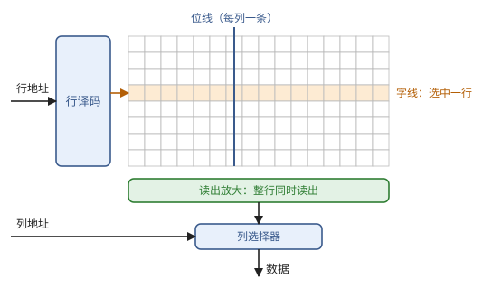
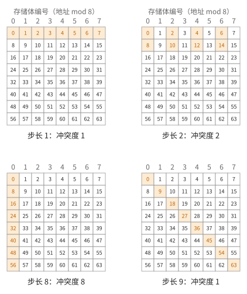
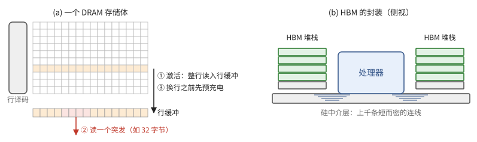
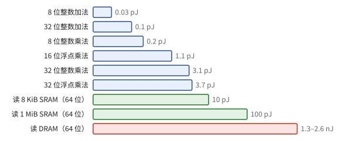
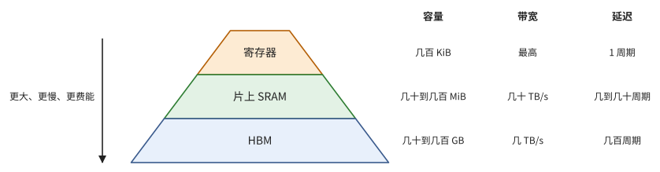

# 第 3 章　存储

运算需要操作数，操作数要存放在某处。本章自底向上考察三种存储：寄存器、SRAM 和 DRAM，回答每一种能存多少、每秒能读出多少、读一次要等多久、花多少能量。结论是一张从快而小到慢而大的层次表，以及一条贯穿全书的规律：从远处取一个数，比用它做一次运算贵几十到几百倍。

3.1–3.3 节依次讲寄存器堆、SRAM 和 DRAM，每一种都从电路结构推出它的性质；3.4 节比较运算与搬运的能耗，得出复用原则；3.5 节把各级存储排成层次。

> **在体系中的位置**：下层是第 1 章的寄存器与选择器。本章给出各级存储的容量、带宽、延迟、能耗和访问粒度。第 4 章用这些数字说明为什么需要流水线和大量并发请求；第 6 章把它们组装成芯片的存储层次和屋顶线；第 8 章用本章的分体存储讨论布局与存储体冲突。

## 3.1 寄存器与寄存器堆

第 1 章的寄存器（定义 1.21）存一个字，选择器（例 1.3）按地址从几个输入中选出一个。把 $R$ 个寄存器排在一起，配上按地址选择的电路，就是**寄存器堆**。本节说明它的代价主要在端口上（注 3.2）。

> **定义 3.1（寄存器堆）** 一个寄存器堆有 $R$ 个 $w$ 位的字，$r$ 个读端口和 $q$ 个写端口：每个周期可以同时读出 $r$ 个字、写入 $q$ 个字。

每个读端口是一个 $R$ 选一的选择器（习题 1.2），深度 $O(\log R)$。代价主要在端口：每个存储单元要为每个端口各接一条选择线和一条数据线，单元的边长随端口数线性增长，面积随端口数的平方增长。

> **注 3.2** 寄存器堆的面积约随端口数的平方增长，所以一个寄存器堆不能同时服务太多运算单元。宽的处理器要么把寄存器堆分成几块、每块只服务一部分单元，要么限制一条指令能同时读的寄存器数。后面讨论具体机器时会看到这两种做法。

寄存器堆是最快的存储，一个周期内读出，但容量很小：一个处理器核心的寄存器通常是几 KiB 到几百 KiB。

## 3.2 SRAM

寄存器堆快，但每个比特占的面积大，容量做不大。芯片上大容量的存储用 SRAM。本节说明它的结构，由此引出分体存储的模型（定义 3.3），并算出按固定步长访问时的冲突（命题 3.4）。

**静态随机存储器**（SRAM）的每个比特由 6 个晶体管组成：两个首尾相接的反相器保持一个稳定状态，两个开关管把它接到读写线上。单元排成 $\text{行} \times \text{列}$ 的阵列：地址的一部分经译码选中一行（字线），该行所有单元把值放到各自的列线（位线）上，读出电路放大后，再由地址的其余部分选出所需的列。（图 3.1）

**图 3.1**　SRAM 阵列。行地址经译码选中一条字线，这一行的所有单元同时把值放到各自的位线上，读出放大之后，列地址再从中选出所需的部分。

阵列越大，字线和位线越长，延迟和每次访问的能耗越大。所以大的 SRAM 总是由许多小阵列组成，每个小阵列独立工作。这引出下面的模型。

> **定义 3.3（分体存储）** 一个有 $k$ 个**存储体**（bank）的存储器，把地址 $a$ 映射到存储体 $\beta(a)$。每个存储体每个周期至多服务一次访问。一个周期内的一组访问 $a_0, \dots, a_{m-1}$ 中，落在同一存储体的访问数的最大值称为**冲突度**；完成这组访问需要的周期数等于冲突度。（访问同一个地址的多次读通常可以合并为一次，这里不计。）

最常见的映射是交错：$\beta(a) = a \bmod k$，其中 $a$ 以字为单位。程序最常见的访问是按固定步长访问一个数组，这时冲突度有一个简单的公式：

> **命题 3.4（步长访问的冲突度）** 在 $k$ 个存储体的交错存储中，$k$ 个访问 $a_0 + i s$（$i \in [k]$，步长 $s$）的冲突度是 $\gcd(s, k)$。

*证明* 第 $i$ 个访问落在存储体 $(a_0 + i s) \bmod k$。映射 $i \mapsto i s \bmod k$ 是加法群 $\mathbb{Z}_k$ 上的同态，像是由 $\gcd(s, k)$ 生成的子群，大小为 $k / \gcd(s, k)$，每个像恰有 $\gcd(s, k)$ 个原像。平移 $a_0$ 不改变这一点。∎

例如 $k = 32$：步长 1 无冲突；步长 2 冲突度 2；步长 32 时全部落在同一个存储体，冲突度 32，访问被完全串行化；步长 33 又无冲突。图 3.2 用 8 个存储体画出了同样的现象。

**图 3.2**　8 个存储体的交错存储：地址 $a$ 放在第 $a \bmod 8$ 列（存储体），橙色是 8 个访问各自的地址。冲突度是同一列中橙色格子的最大个数，等于 $\gcd(s, 8)$。

第 8 章会系统地讨论怎样摆放数组来避免冲突。

SRAM 的密度远低于 DRAM（6 个晶体管对 1 个晶体管加 1 个电容），所以芯片上能放的 SRAM 总量有限：现代加速器芯片上的 SRAM 总共在几十 MiB 到几百 MiB 之间。另一方面，许多存储体同时工作，片上 SRAM 的总带宽可以达到每秒几十 TB，延迟是几个到几十个周期。

## 3.3 DRAM 与 HBM

片上 SRAM 只有几十到几百 MiB，而一个模型的参数动辄几十 GB，必须放在芯片之外。本节说明片外存储 DRAM 的三个代价——分步访问、以突发为单位传输、延迟长——以及 HBM 怎样把它的带宽提上去。

**动态随机存储器**（DRAM）的每个比特只有一个晶体管和一个电容，所以密度高、单位容量便宜。代价是：

- **读出有破坏性，且要分步进行。** DRAM 芯片分成若干存储体，每个存储体是一个大阵列。访问时先**激活**一整行（通常 1–2 KiB），把它读入该存储体的行缓冲；再从行缓冲中读写若干列；换行之前要先**预充电**。访问已经打开的行很快，换行要多等几十纳秒。
- **以突发为单位传输。** 一次列访问传输一段连续的字节（一个突发，通常 32 或 64 字节）。只要 4 个字节，也要占用一个突发的传输时间。
- **延迟长。** 从发出请求到数据返回，通常要数百纳秒，即几百个处理器周期。这个数字几十年来改善很少。

DRAM 的带宽来自接口的宽度和频率：

$$
\text{带宽} = \text{数据线条数} \times \text{每条线每秒传输的比特数} / 8 .
$$

**高带宽存储**（HBM）把多片 DRAM 芯片垂直堆叠成一个**堆栈**，与处理器并排封装在同一块硅中介层上。中介层上可以布下普通电路板做不到的密集连线，每个堆栈有 1024 条（HBM3）或 2048 条（HBM4）数据线。一颗加速器旁边放 4 到 8 个堆栈，总带宽达到每秒数 TB，容量达到上百 GB。

**图 3.3**　(a) DRAM 的一个存储体：先激活一整行到行缓冲，再从行缓冲中按突发读出；换行之前要预充电。(b) HBM 堆栈与处理器并排放在硅中介层上，二者之间有上千条短连线。

> **现状（2026-10）**：HBM3e 每个堆栈约 1.2 TB/s、最多 36 GB；HBM4 把数据线加倍，每个堆栈约 2–3 TB/s。NVIDIA Rubin 用 8 个 HBM4 堆栈，共 288 GB、约 22 TB/s；Google TPU 8i 的 HBM 为 288 GB、约 8.6 TB/s。

对上层来说，DRAM 的三个性质最重要：容量大、带宽高但有限、延迟长且访问有最小粒度。第 4 章会证明，要在长延迟下跑满带宽，必须同时有大量请求在途。

## 3.4 能耗与距离

3.1–3.3 节给出了各级存储的容量、带宽和延迟，还剩下能耗。在功耗受限的芯片上（命题 1.14），能耗直接决定算力。本节比较运算与搬运的能耗，得出复用原则（推论 3.5）。

下表是常被引用的一组 45 nm 工艺下的能耗估计（Horowitz，2014）。绝对数值随工艺下降，但比例关系大体保持，而且运算的能耗下降得比搬运更快，所以比例只会更悬殊。

| 操作 | 能耗 |
| --- | ---: |
| 8 位整数加法 | 0.03 pJ |
| 32 位整数加法 | 0.1 pJ |
| 8 位整数乘法 | 0.2 pJ |
| 32 位整数乘法 | 3.1 pJ |
| 16 位浮点乘法 | 1.1 pJ |
| 32 位浮点乘法 | 3.7 pJ |
| 从 8 KiB SRAM 读 64 位 | 10 pJ |
| 从 1 MiB SRAM 读 64 位 | 100 pJ |
| 从 DRAM 读 64 位 | 1.3–2.6 nJ |

**图 3.4**　上表画成条形图，条长按对数刻度。从 DRAM 读一个字的能耗，比一次 32 位浮点乘法高约三个数量级。

几点观察：

- 8 位与 32 位整数乘法的能耗之比约为 $3.1 / 0.2 \approx 16 = (32/8)^2$，与命题 2.3 的 $p^2$ 规律一致。
- SRAM 越大，一次访问越贵：导线越长（注 1.13）。
- 从 DRAM 读一个 64 位字的能耗，相当于数百次 32 位浮点乘法。

由最后一条立即得到全书反复使用的一条原则：

> **推论 3.5（复用原则）** 一个从 DRAM 取来的操作数，若只参与一次运算就被丢弃，能耗几乎全部花在搬运上。要让运算本身成为能耗的主体，每个从 DRAM 取来的数必须在片上被反复使用数百次。

在功耗受限的芯片上（命题 1.14），能耗就是算力。所以推论 3.5 同时是性能原则：第 6 章会用带宽而不是能耗，把它重新表述为屋顶线，得到同样的结论。

## 3.5 存储层次

把 3.1–3.4 节的结果按距离运算单元由近到远排成一列，就得到存储层次（定义 3.6）。本节还说明中间各级的两种组织方式：缓存与便签存储。

> **定义 3.6（存储层次）** 一台机器的存储层次是一列存储级 $0, 1, \dots, L$：第 0 级是寄存器，第 $L$ 级是 DRAM（HBM）。随级数增加，容量 $C_\ell$ 增大，而带宽 $B_\ell$ 减小，延迟 $L_\ell$ 和每字节能耗 $E_\ell$ 增大。

**图 3.5**　存储层次（数字是现代加速器的量级）。越往下，容量越大，带宽越小，延迟越长。

中间各级有两种组织方式：

- **缓存**（cache）：程序只看到 DRAM 的地址，硬件自动决定把哪些数据留在片上。它需要额外存储地址标签并比较，还要有替换策略；命中与否在运行时才知道，执行时间因此难以预测。
- **便签存储**（scratchpad，或称软件管理的存储）：一块有自己地址空间的 SRAM。程序显式地把数据从 DRAM 拷入、用完再拷出。没有标签和替换的开销，执行时间可预测，但要求程序事先知道要用哪些数据。

神经网络的访问模式在编译时几乎完全已知，所以加速器大量使用便签存储，并配备专门的拷贝引擎（第 4 章的 DMA）。缓存也仍然存在，用来服务难以预知的访问。

## 接口小结

1. 寄存器堆一个周期内读出，容量为每核几 KiB 到几百 KiB；面积约随端口数的平方增长，所以同时访问它的单元数受限。（注 3.2）
2. SRAM 由许多存储体组成；一组访问的耗时等于冲突度。$k$ 个存储体的交错存储上，步长 $s$ 的 $k$ 个访问冲突度为 $\gcd(s, k)$。（定义 3.3、命题 3.4）
3. 片上 SRAM 总量为几十到几百 MiB，总带宽可达每秒几十 TB，延迟几个到几十个周期。（3.2 节）
4. DRAM/HBM 容量大（几十到几百 GB）、带宽为每秒数 TB、延迟为数百纳秒，并以几十字节的突发为最小传输单位。（3.3 节）
5. 从 DRAM 读一个字的能耗相当于数百次运算；每个从 DRAM 取来的数必须在片上被复用数百次。（3.4 节、推论 3.5）
6. 存储层次中，容量逐级增大，带宽逐级减小，延迟与能耗逐级增大；中间级可以是缓存或便签存储。（定义 3.6）

## 习题

**习题 3.1** ★ 一个 32 个存储体的交错存储，每个存储体宽 4 字节。32 个访问同时读取一个按行存放的 f32 矩阵 $X \in \mathbb{R}^{32 \times 32}$ 的某一列。冲突度是多少？若每行末尾补一个不用的元素，使行长变成 33，冲突度变成多少？

提示

第 $i$ 行第 $j$ 列的地址（以字计）是 $i \cdot (\text{行长}) + j$。用命题 3.4。

答案

行长 32 时步长 32，冲突度 $\gcd(32, 32) = 32$：32 个访问完全串行。行长 33 时步长 33，冲突度 $\gcd(33, 32) = 1$，一个周期完成。代价是多用 $1/32$ 的存储。第 8 章还会给出一种不浪费存储的办法。

**习题 3.2** ★ 在命题 3.4 的设定下，若只访问 $m < k$ 个地址 $a_0 + is$（$i \in [m]$），冲突度是多少？

提示

$i \mapsto is \bmod k$ 的周期是 $k / \gcd(s, k)$。

答案

记 $g = \gcd(s, k)$，周期 $t = k/g$。前 $m$ 个访问依次落在 $t$ 个不同存储体上循环，冲突度为 $\lceil m / t \rceil = \lceil m g / k \rceil$。

**习题 3.3** ★ 一个 HBM 堆栈有 1024 条数据线，每条线每秒传输 9.6 Gb。求一个堆栈的带宽。一颗芯片配 8 个这样的堆栈，总带宽是多少？

提示

带宽 = 数据线条数 × 每条线的速率 / 8。

答案

$1024 \times 9.6 \times 10^9 / 8 \approx 1.23 \times 10^{12}$ 字节/秒，约 1.2 TB/s。8 个堆栈约 9.8 TB/s。

**习题 3.4** ★ 按 3.4 节的表粗略估计：一次 16 位浮点乘加约 1.5 pJ，从 DRAM 读一个 16 位数约 0.5 nJ。(a) 若每次乘加的两个操作数都直接从 DRAM 读取，搬运能耗占总能耗的比例是多少？(b) 每个操作数至少要被复用多少次，搬运的能耗才不超过运算的能耗？

提示

设每个从 DRAM 读来的操作数参与 $r$ 次乘加，则每次乘加分摊的搬运能耗是 $2 \times 0.5 / r$ nJ。

答案

(a) 每次乘加搬运 1 nJ、运算 1.5 pJ，搬运占 $1000 / 1001.5 \approx 99.85\%$。

(b) 需要 $1000 / r \le 1.5$，即 $r \ge 667$。这正是推论 3.5 的"数百次"。第 6 章会看到，矩阵乘法通过分块恰好能做到这一点，而逐元素运算做不到。

**习题 3.5** ☆ DRAM 以 64 字节的突发为单位传输。一个程序随机读取 4 字节的元素，每个元素落在不同的突发中。它能用到峰值带宽的多少？如果改为每次读取连续的 64 字节呢？

提示

每个突发占用的传输时间相同，无论用到其中多少字节。

答案

随机读取时每 64 字节只用 4 字节，有效带宽为峰值的 $1/16$（行缓冲的换行开销会让它更低）。连续读取 64 字节时可以达到峰值。这条规律在 GPU 上表现为"访存合并"，在 TPU 上表现为 DMA 的最小粒度，后面会分别讲到。

