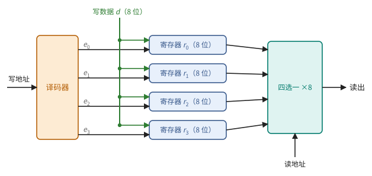
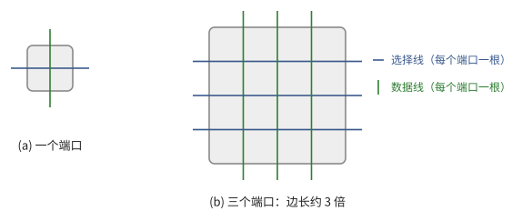
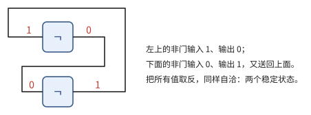
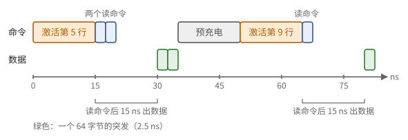

# 第 3 章　存储

运算需要操作数，操作数要存放在某处。本章自底向上考察三种存储：寄存器堆、SRAM 和 DRAM，对每一种回答四个问题：能存多少，每秒能读出多少，读一次要等多久，花多少能量。结论是一张从快而小到慢而大的层次表，以及一条贯穿全书的规律：从远处取一个数，比用它做一次运算贵几十到几百倍。

3.1 节用第 1 章的寄存器和选择器搭出寄存器堆，说明它的代价主要在端口上。3.2 节讲片上的大容量存储 SRAM，并证明一条几何事实：容量越大，一次访问要走的导线越长。由此引出 3.3 节的分体存储与存储体冲突。3.4 节讲片外的 DRAM 与 HBM，它们容量大、带宽高，但延迟长、有最小的访问粒度。3.5 节比较运算与搬运的能耗，得出复用原则；3.6 节把各级存储排成层次，并比较缓存与便签存储两种组织方式。

> **在体系中的位置**：下层是第 1 章的寄存器、选择器与代价模型（定义 1.11、1.21，例 1.3）。本章给出各级存储的容量、带宽、延迟、能耗和访问粒度，以及分体存储的冲突规律。第 4 章用这些数字说明为什么需要流水线和大量并发请求；第 6 章把它们组装成芯片的存储层次和屋顶线；第 8 章用本章的分体存储讨论布局与存储体冲突。

## 3.1 寄存器与寄存器堆

第 1 章的寄存器（定义 1.21）存一个字，选择器（例 1.3）按地址从几个输入中选出一个。本节把它们组合成可以按地址读写的一组寄存器，即寄存器堆（定义 3.3）；为此先补一个按地址"点名"的元件——译码器（定义 3.1）。本节的结论是：寄存器堆一个周期就能读出，但每增加一个端口，每个存储单元都要多接一组导线，面积随端口数的平方增长（例 3.5、注 3.6）。

定义 1.21 的寄存器在每个上升沿都存入 $D$ 上的值。要让它只在需要时才改写，就在 $D$ 前面接一个选择器：

$$
D = \operatorname{mux}(\mathit{we}, Q, d) ,
$$

其中 $\mathit{we}$ 称为**写使能**（write enable）。$\mathit{we} = 0$ 时 $D = Q$，寄存器在上升沿存回原来的值，等于不变；$\mathit{we} = 1$ 时存入新值 $d$。一组寄存器中，每个周期只该有一个（被写的那个）$\mathit{we} = 1$，这由下面的元件产生：

> **定义 3.1（译码器）** $k$ 位**译码器**（decoder）输入 $k$ 位地址 $t$，输出 $2^k$ 根线 $e_0, \dots, e_{2^k - 1}$，其中 $e_t = 1$，其余为 0。

> **命题 3.2** $k$ 位译码器可以用 $O(k\, 2^k)$ 个门、$O(\log k)$ 的深度实现。

*证明* 输出 $e_u$ 就是命题 1.4 证明中的 $m_u(t)$：$k$ 个文字（$t_i$ 或 $\neg t_i$）的与。用例 1.8 的二叉树计算，每个输出 $k - 1$ 个与门、深度 $\lceil \log k \rceil$，加上公用的 $k$ 个非门（深度 1）。∎

> **定义 3.3（寄存器堆）** 一个**寄存器堆**（register file）有 $R$ 个 $w$ 位的寄存器，$r$ 个读端口和 $q$ 个写端口，每个周期可以同时读出 $r$ 个字、写入 $q$ 个字。每个写端口用一个译码器把写地址变成各寄存器的写使能；每个读端口用 $w$ 个 $R$ 选一的选择器（习题 1.2），按读地址选出一个字。

> **例 3.4（一个 4 × 8 位的寄存器堆）** $R = 4$，$w = 8$，一个读端口、一个写端口（图 3.1）。某个周期要读 $r_2$、写 $r_1$：写地址 $01_2$ 经 2 位译码器只让 $e_1 = 1$，写数据接到全部 4 个寄存器的选择器上，但只有 $r_1$ 在下一个上升沿存入它；读地址 $10_2$ 送到 8 个四选一选择器，每个选出 $r_2$ 的一位。读是组合电路，同一个周期内就得到结果。



**图 3.1**　4 个 8 位寄存器组成的寄存器堆，一个写端口、一个读端口。写地址经译码器变成写使能，只有被选中的寄存器存入新值；读地址控制一组四选一选择器。

寄存器堆的读出只经过一个选择器，深度 $O(\log R)$，一个周期就能完成。它的代价在别处：

> **例 3.5（端口的代价）** 每个端口都要能单独访问每个存储单元：一个读端口需要一根横穿这一行的选择线（这个端口选中了哪一行）和一根纵穿这一列的数据线（读出的值从这里送出），写端口也一样。有 $n = r + q$ 个端口时，每个存储单元有 $n$ 根横线、$n$ 根竖线穿过（图 3.2），导线之间要留出间距，所以单元的边长至少正比于 $n$，面积至少正比于 $n^2$。两读一写（$n = 3$）的寄存器堆，若改成六读三写（$n = 9$），每个比特的面积约增大 9 倍。



**图 3.2**　一个存储单元与它的端口导线。左：一个端口，一横一竖；右：三个端口，三横三竖，单元的边长约为三倍，面积约为九倍。

> **注 3.6** 寄存器堆的面积约随端口数的平方增长，所以一个寄存器堆不能同时服务太多运算单元。宽的处理器要么把寄存器堆分成几块、每块只服务一部分单元，要么限制一条指令能同时读的寄存器数。后面讨论具体机器时会看到这两种做法。

寄存器堆是最快的存储，一个周期内读出，但容量很小：一个处理器核心的寄存器通常是几 KiB 到几百 KiB。

## 3.2 SRAM

寄存器堆快，但每个比特占的面积大，容量做不大。芯片上大容量的存储用 SRAM。本节先看它的一个比特怎样存储、许多比特怎样排成阵列并按地址读出（例 3.7），再证明一条几何事实：容量为 $C$ 的存储，总有一部分单元离访问点至少 $\Theta(\sqrt{C})$ 远（命题 3.8）。由定义 1.11，这意味着容量越大，每次访问越慢、越费能；这是下一节分体存储的出发点，也是整个存储层次的几何原因。

**一个比特。** 把两个非门首尾相接（图 3.3）：若左边非门的输入是 1，它输出 0，右边非门输出 1，又送回左边的输入，自洽；输入是 0 时同样自洽。这个环有两个稳定状态，就存下了一个比特，只要通着电就一直保持。再加两个开关把它接到读写用的导线上，**静态随机存储器**（static RAM，SRAM）的一个比特由 6 个晶体管组成（每个非门 2 个，两个开关各 1 个）。



**图 3.3**　两个首尾相接的非门有两个稳定状态，存下一个比特。SRAM 单元在此基础上加两个开关，由字线控制，把两端接到一对位线上。

**阵列。** 比特单元排成行与列的阵列：地址的一部分经译码（定义 3.1）选中一行，打开这一行的所有开关（这条线称为**字线**，word line）；这一行的每个单元把值放到自己所在列的**位线**（bit line）上，经读出放大后，再由地址的其余部分用选择器选出所需的列（图 3.4）。


**图 3.4**　SRAM 阵列。行地址经译码选中一条字线，这一行的所有单元同时把值放到各自的位线上，读出放大之后，列地址再从中选出所需的部分。

> **例 3.7（一个 64 KiB 阵列的寻址）** 64 KiB $= 2^{19}$ 比特，排成 512 行、每行 1024 比特。按 64 位的字访问，共 $2^{13}$ 个字，每行 16 个字。13 位字地址的高 9 位选行，低 4 位选这一行中的第几个字。字地址 4660 $= 0\text{x}1234$ 在第 $\lfloor 4660 / 16 \rfloor = 291$ 行的第 $4660 \bmod 16 = 4$ 个字。读一次要先点亮第 291 行的字线，1024 条位线全部动起来，最后只取其中 64 位。

例 3.7 中，字线横跨 1024 列，位线纵贯 512 行。阵列越大，这些导线越长，延迟和每次访问的能耗越大（注 1.13）。能不能靠巧妙的排布避开？不能：

> **命题 3.8（距离与容量）** 设存储的每个比特至少占面积 $a$，访问从平面上一点 $o$ 发起。则容量为 $C$ 比特的存储中，至少有一半的比特离 $o$ 的距离不小于 $\sqrt{aC/(2\pi)}$。

*证明* 以 $o$ 为圆心、$d$ 为半径的圆内至多放下 $\pi d^2 / a$ 个比特。取 $d = \sqrt{aC/(2\pi)}$，圆内至多 $C/2$ 个比特，其余至少 $C/2$ 个都在圆外。∎

由定义 1.11，导线的能耗正比于长度，所以访问一个大小为 $C$ 的存储，平均要付出 $\Omega(\sqrt{C})$ 的导线能耗和延迟，与电路怎样设计无关。容量翻四倍，这段距离就翻一倍。所以大的 SRAM 总是由许多小阵列组成：一次访问只激活其中一个小阵列（小阵列内部的字线和位线都短），代价主要是把地址送到这个小阵列、再把数据送回来的那段路，而这段路正比于 $\sqrt{C}$。3.5 节的实测能耗与此相符。

许多小阵列还带来一个好处：它们可以同时工作。现代加速器芯片上的 SRAM 总共在几十 MiB 到几百 MiB 之间，因为成千上万个小阵列可以同时访问，片上 SRAM 的总带宽可以达到每秒几十 TB；一次访问的延迟是几个到几十个周期。下一节说明这种"同时工作"有什么规矩。

## 3.3 分体存储与冲突

3.2 节说明大的 SRAM 由许多可以独立工作的小阵列组成。把它们当作若干个**存储体**，一个周期里，落在不同存储体上的访问可以同时完成，落在同一个存储体上的只能排队。这也是在不做多端口单元（例 3.5）的前提下，让一块存储每个周期服务多个访问的办法。本节先用 4 个存储体手算几种访问（例 3.9），再给出分体存储的模型（定义 3.10），并证明按固定步长访问时，排队的长度由一个最大公约数决定（命题 3.11）。

本节的地址都以字为单位。最常见的分体方法是**交错**（interleaving）：地址 $a$ 放在第 $a \bmod k$ 个存储体中，连续的地址轮流落在各个存储体上。

> **例 3.9（4 个存储体）** 地址 0–15 交错放在 4 个存储体中：第 $j$ 个存储体存放 $j, j + 4, j + 8, j + 12$。4 个运算单元同时各读一个数：
>
> | 访问的地址 | 落在的存储体 | 同一存储体上最多几个 | 需要的周期数 |
> | --- | --- | ---: | ---: |
> | 0, 1, 2, 3（步长 1） | 0, 1, 2, 3 | 1 | 1 |
> | 0, 2, 4, 6（步长 2） | 0, 2, 0, 2 | 2 | 2 |
> | 0, 4, 8, 12（步长 4） | 0, 0, 0, 0 | 4 | 4 |
> | 0, 5, 10, 15（步长 5） | 0, 1, 2, 3 | 1 | 1 |
>
> 步长 4 时四个访问全部挤在存储体 0 上，只能一个周期一个；步长 5 又恢复到一个周期完成。

> **定义 3.10（分体存储）** 一个有 $k$ 个**存储体**（bank）的存储器，把地址 $a$ 映射到存储体 $\beta(a)$。每个存储体每个周期至多服务一次访问。一个周期内的一组访问 $a_0, \dots, a_{m-1}$ 中，落在同一存储体的访问数的最大值称为**冲突度**（conflict degree）；完成这组访问需要的周期数等于冲突度。（访问同一个地址的多次读通常可以合并为一次，这里不计。）

程序最常见的访问是按固定步长访问一个数组，例 3.9 的规律这时有一个简单的公式：

> **命题 3.11（步长访问的冲突度）** 在 $k$ 个存储体的交错存储中，$k$ 个访问 $a_0 + i s$（$i \in [k]$，步长 $s$）的冲突度是 $\gcd(s, k)$。

*证明* 第 $i$ 个访问落在存储体 $(a_0 + i s) \bmod k$。映射 $i \mapsto i s \bmod k$ 是加法群 $\mathbb{Z}_k$ 上的同态，像是由 $\gcd(s, k)$ 生成的子群，大小为 $k / \gcd(s, k)$，每个像恰有 $\gcd(s, k)$ 个原像。平移 $a_0$ 不改变这一点。∎

例 3.9 中 $k = 4$：$\gcd(1, 4) = 1$，$\gcd(2, 4) = 2$，$\gcd(4, 4) = 4$，$\gcd(5, 4) = 1$。图 3.5 用 8 个存储体画出了同样的现象。


**图 3.5**　8 个存储体的交错存储：地址 $a$ 放在第 $a \bmod 8$ 列（存储体），橙色是 8 个访问各自的地址。冲突度是同一列中橙色格子的最大个数，等于 $\gcd(s, 8)$。

步长访问最常见的来源是矩阵的一列。

> **例 3.12（读矩阵的一列）** 8 个存储体，一个 $8 \times 8$ 的矩阵按行存放，第 $i$ 行第 $j$ 列在地址 $8i + j$。8 个运算单元同时读第 $j$ 列，地址是 $j, 8 + j, \dots, 56 + j$，步长 8，冲突度 $\gcd(8, 8) = 8$：8 个访问完全串行。若每行末尾空出一个字，行长变成 9，第 $i$ 行第 $j$ 列在地址 $9i + j$，读一列的步长是 9，冲突度 $\gcd(9, 8) = 1$，一个周期完成，代价是多用 $1/8$ 的存储。

第 8 章会系统地讨论怎样摆放数组来避免冲突，包括一种不浪费存储的办法。

## 3.4 DRAM 与 HBM

片上 SRAM 只有几十到几百 MiB，而一个模型的参数动辄几十 GB，必须放在芯片之外。本节讲片外的存储 DRAM：先说明它的一个比特为什么便宜，再用一次具体的访问过程（例 3.13）引出它的三个代价——分步访问、以突发为单位传输、延迟长，并算出随机小访问能用到的带宽（命题 3.14）；最后说明 HBM 怎样用又宽又短的接口把带宽提到每秒数 TB。

**一个比特。** **动态随机存储器**（dynamic RAM，DRAM）的每个比特只有一个晶体管和一个电容：电容上有电荷表示 1，没有表示 0。它比 SRAM 的 6 个晶体管小得多，所以密度高、单位容量便宜。代价是电荷会慢慢漏掉，要定期读出再写回（刷新）；读出时电容上的电荷被分到很长的位线上，读一次就破坏了原值，必须写回。

**一次访问。** DRAM 芯片分成若干个存储体，每个存储体是一个大阵列，配一个能放下一整行（通常 1–2 KiB）的**行缓冲**（row buffer）。访问分三步：

1. **激活**：把指定的一整行读入行缓冲（这一步同时完成了写回）；
2. **读写**：从行缓冲中读出或写入一段连续的字节，称为一个**突发**（burst），通常 32 或 64 字节；同一行可以连续读写多个突发；
3. **预充电**：要访问另一行之前，先关闭当前行，把位线恢复原状。

> **例 3.13（同一行与换行）** 设激活、从发出读命令到数据出现、预充电各需 15 ns，传送一个 64 字节的突发需 2.5 ns。在同一个存储体中先读第 5 行的两个突发，再读第 9 行的一个突发（图 3.6）：
>
> - 激活第 5 行，15 ns 后发出读命令，再过 15 ns 第一个突发开始送出；第二个突发紧接着送出，只多 2.5 ns；
> - 换到第 9 行，要先预充电 15 ns，再激活 15 ns，再等 15 ns 才有数据。
>
> 同一行中的后续突发几乎不要额外时间，换一行却要多等 45 ns。



**图 3.6**　例 3.13 的时间线。上：发给存储体的命令；下：数据线上传送的突发。读同一行的第二个突发几乎是免费的，换行要先预充电、再激活。

突发是传输的最小单位：只要 4 个字节，也要占用一个突发的传输时间。所以访问的粒度直接决定能用到多少带宽：

> **命题 3.14（小访问的有效带宽）** 设 DRAM 以 $b$ 字节的突发为单位传输，峰值带宽为 $B$。若程序的每次访问只用到某个突发中的 $s \le b$ 个字节，且各次访问落在不同的突发中，则有效带宽至多为 $B \cdot s / b$。

*证明* 每次访问至少占用一个突发的传输时间 $b/B$，只带回 $s$ 个有用的字节。∎

随机读取 4 字节的元素，在 64 字节的突发下至多用到峰值的 $1/16$；若还要换行，还更低。连续读取则可以接近峰值。这条规律在 GPU 上表现为"访存合并"，在 TPU 上表现为 DMA 的最小粒度，后面会分别讲到。

**带宽。** DRAM 的带宽来自接口的宽度和频率：

$$
\text{带宽} = \text{数据线条数} \times \text{每条线每秒传输的比特数} / 8 .
$$

例如普通电脑的一个 DDR5 内存通道有 64 条数据线、每条每秒传输 6.4 Gb，带宽是 $64 \times 6.4 \times 10^9 / 8 = 51.2$ GB/s。要再高，就要更多、更快的数据线，而电路板上的长导线又慢又费能（注 1.13）。

**延迟。** 从处理器发出请求到数据返回，除了例 3.13 的几十纳秒，还要经过片上网络、存储控制器的排队，通常共计数百纳秒，即几百个处理器周期。这个数字几十年来改善很少。

**HBM。** **高带宽存储**（high-bandwidth memory，HBM）的办法是把导线变短：把多片 DRAM 芯片垂直堆叠成一个**堆栈**，与处理器并排封装在同一块硅中介层上。中介层上可以布下电路板做不到的密集连线，每个堆栈有 1024 条（HBM3）或 2048 条（HBM4）数据线，每条只有几毫米长。一颗加速器旁边放 4 到 8 个堆栈，总带宽达到每秒数 TB，容量达到上百 GB。


**图 3.7**　(a) DRAM 的一个存储体：先激活一整行到行缓冲，再从行缓冲中按突发读出；换行之前要预充电。(b) HBM 堆栈与处理器并排放在硅中介层上，二者之间有上千条短连线。

> **现状（2026-10）**：HBM3e 每个堆栈约 1.2 TB/s、最多 36 GB；HBM4 把数据线加倍，每个堆栈约 2–3 TB/s。NVIDIA Rubin 用 8 个 HBM4 堆栈，共 288 GB、约 22 TB/s；Google TPU 8i 的 HBM 为 288 GB、约 8.6 TB/s。

对上层来说，DRAM 的三个性质最重要：容量大；带宽高但有限；延迟长，且访问有最小粒度。第 4 章会证明，要在长延迟下跑满带宽，必须同时有大量请求在途。

## 3.5 能耗与距离

3.1–3.4 节给出了各级存储的容量、带宽和延迟，还剩下能耗。在功耗受限的芯片上（命题 1.14），能耗直接决定算力。本节用一组实测的能耗比较运算与搬运（下表与图 3.8），用两个计算的能耗账（例 3.15）说明差别有多大，最后得出复用原则（推论 3.16）。

下表是常被引用的一组 45 nm 工艺下的能耗估计（Horowitz，2014）。绝对数值随工艺下降，但比例关系大体保持，而且运算的能耗下降得比搬运更快，比例只会更悬殊。

| 操作 | 能耗 |
| --- | ---: |
| 8 位整数加法 | 0.03 pJ |
| 32 位整数加法 | 0.1 pJ |
| 8 位整数乘法 | 0.2 pJ |
| 32 位整数乘法 | 3.1 pJ |
| 16 位浮点乘法 | 1.1 pJ |
| 32 位浮点乘法 | 3.7 pJ |
| 从 8 KiB SRAM 读 64 位 | 10 pJ |
| 从 1 MiB SRAM 读 64 位 | 100 pJ |
| 从 DRAM 读 64 位 | 1.3–2.6 nJ |


**图 3.8**　上表画成条形图，条长按对数刻度。从 DRAM 读一个字的能耗，比一次 32 位浮点乘法高约三个数量级。

几点观察：

- 8 位与 32 位整数乘法的能耗之比约为 $3.1 / 0.2 \approx 16 = (32/8)^2$，与命题 2.3 的 $p^2$ 规律一致。
- SRAM 从 8 KiB 增大到 1 MiB，容量是 128 倍，一次访问的能耗是 10 倍，与命题 3.8 的 $\sqrt{128} \approx 11$ 相符。
- 从 DRAM 读一个 64 位字的能耗，相当于数百次 32 位浮点乘法：数据要穿过芯片、封装和电路板上的长导线。

下面把这些数字代入两个计算，看看能量花在哪里。

> **例 3.15（点积与矩阵乘法的能耗账）** 按上表粗估：一次 16 位浮点乘加约 1.5 pJ；从 DRAM 读一个 16 位数约 0.5 nJ（64 位约 2 nJ 的四分之一）。
>
> (a) 两个长为 $n$ 的 bf16 向量做点积：$2n$ 个数各从 DRAM 读一次，各只参与一次乘加。每次乘加分摊 $2 \times 0.5 = 1$ nJ 的搬运，运算只有 1.5 pJ，搬运占能耗的 99.8%。
>
> (b) 两个 $n \times n$ 的 bf16 矩阵相乘，若每个元素从 DRAM 只读一次（第 6 章说明怎样做到）：$2n^2$ 个数、$n^3$ 次乘加，每个数参与 $n$ 次乘加。每次乘加分摊 $2n^2 \times 0.5\ \text{nJ} / n^3 = 1/n$ nJ。$n = 1000$ 时是 1 pJ，已经比运算本身还少。
>
> 两种计算的乘加完全相同，差别只在每个取来的数被用了几次。

由此立即得到全书反复使用的一条原则：

> **推论 3.16（复用原则）** 一个从 DRAM 取来的操作数，若只参与一次运算就被丢弃，能耗几乎全部花在搬运上。要让运算本身成为能耗的主体，每个从 DRAM 取来的数必须在片上被反复使用数百次。

在功耗受限的芯片上（命题 1.14），能耗就是算力。所以推论 3.16 同时是性能原则：第 6 章会用带宽而不是能耗，把它重新表述为屋顶线，得到同样的结论。

## 3.6 存储层次

把 3.1–3.5 节的结果按离运算单元由近到远排成一列，就得到存储层次（定义 3.17）。中间各级的组织方式有两种：硬件自动管理的缓存与程序显式管理的便签存储。本节用同一个计算的两种写法比较它们（例 3.18），并说明加速器为什么偏爱后者。

> **定义 3.17（存储层次）** 一台机器的**存储层次**（memory hierarchy）是一列存储级 $0, 1, \dots, L$：第 0 级是寄存器，第 $L$ 级是 DRAM（HBM）。随级数增加，容量 $C_\ell$ 增大，而带宽 $B_\ell$ 减小，延迟 $L_\ell$ 和每字节能耗 $E_\ell$ 增大。


**图 3.9**　存储层次（数字是现代加速器的量级）。越往下，容量越大，带宽越小，延迟越长。

容量与速度此消彼长，不是工程上的偶然：命题 3.8 说明容量越大，访问的距离越远；DRAM 又用速度换来了密度。中间各级有两种组织方式：

- **缓存**（cache）：程序只看到 DRAM 的地址，硬件自动决定把哪些数据留在片上。数据以**缓存行**（cache line，通常 64 或 128 字节，与突发相当）为单位进出；每一行要额外存一个地址标签，访问时比较标签判断是否命中，满了还要按某种替换策略选出牺牲者。命中与否在运行时才知道，执行时间因此难以预测。
- **便签存储**（scratchpad，或称软件管理的存储）：一块有自己地址空间的 SRAM。程序显式地把数据从 DRAM 拷入、用完再拷出。没有标签和替换的开销，执行时间可预测，但要求程序事先知道要用哪些数据。

> **例 3.18（两种写法）** 把 1 GiB 的数组 $x$ 逐元素乘 2，写到 $y$。有缓存时，程序只写计算本身，硬件在第一次访问每个缓存行时把它取来：
>
> ```python
> for i in range(n):
>     y[i] = 2 * x[i]          # 缺失时硬件自动取 x 所在的缓存行
> ```
>
> 用 1 MiB 的便签存储时，程序自己分块搬运：
>
> ```python
> for j in range(0, n, chunk):          # chunk 个元素恰好占 1 MiB 的一半
>     buf_x = copy_in(x[j:j+chunk])     # DRAM → 便签存储
>     buf_y = 2 * buf_x                 # 只访问片上存储
>     copy_out(y[j:j+chunk], buf_y)     # 便签存储 → DRAM
> ```
>
> 第二种写法更长，但程序知道下一块是哪些数据，可以在算这一块的同时就发出下一块的拷贝（第 4 章的 DMA、第 9 章的多缓冲）；计算部分只访问延迟固定的片上存储，用时可以事先算出。

神经网络的访问模式在编译时几乎完全已知，所以加速器大量使用便签存储，并配备专门的拷贝引擎（第 4 章的 DMA）。缓存也仍然存在，用来服务难以预知的访问。

## 接口小结

1. 寄存器堆：译码器产生写使能，选择器按地址读出，一个周期内完成；容量为每核几 KiB 到几百 KiB；面积约随端口数的平方增长，所以同时访问它的单元数受限。（定义 3.1、3.3，例 3.5，注 3.6）
2. 容量为 $C$ 的存储，至少一半的比特离访问点 $\Omega(\sqrt{C})$ 远：容量越大，每次访问越慢、越费能。（命题 3.8）
3. SRAM 由许多存储体组成；一组访问的耗时等于冲突度。$k$ 个存储体的交错存储上，步长 $s$ 的 $k$ 个访问冲突度为 $\gcd(s, k)$。（定义 3.10、命题 3.11）
4. 片上 SRAM 总量为几十到几百 MiB，总带宽可达每秒几十 TB，延迟几个到几十个周期。（3.2 节）
5. DRAM/HBM 容量大（几十到几百 GB）、带宽为每秒数 TB、延迟为数百纳秒；访问要先激活一行，以几十字节的突发为最小传输单位，每次只用 $s$ 字节的随机访问至多得到 $s/b$ 的带宽。（3.4 节、命题 3.14）
6. 从 DRAM 读一个字的能耗相当于数百次运算；每个从 DRAM 取来的数必须在片上被复用数百次。（3.5 节、推论 3.16）
7. 存储层次中，容量逐级增大，带宽逐级减小，延迟与能耗逐级增大；中间级可以是缓存或便签存储，加速器偏爱后者。（定义 3.17、例 3.18）

## 习题

**习题 3.1** ★ (a) 画出 2 位译码器，写出它的规模和深度。(b) 一个有 32 个寄存器、一个写端口的寄存器堆，写端口需要几位的译码器？它有多少根输出线？

<details><summary>提示</summary>

(a) 四个输出分别是 $\neg t_1 \wedge \neg t_0$、$\neg t_1 \wedge t_0$、$t_1 \wedge \neg t_0$、$t_1 \wedge t_0$。

</details>
<details><summary>答案</summary>

(a) 2 个非门（第 1 级）和 4 个二输入与门（第 2 级），规模 6，深度 2。

(b) $32 = 2^5$，需要 5 位译码器，32 根输出线，每根是一个寄存器的写使能，任一时刻恰有一根为 1。

</details>

**习题 3.2** ★ 一个向量处理器有 4 个运算单元，每个单元每周期要读 2 个操作数、写 1 个结果。(a) 若它们共用一个寄存器堆，需要多少个端口？按例 3.5，每个比特的面积是一读一写寄存器堆的多少倍？(b) 若把寄存器堆分成 4 块，每块只服务一个单元，总面积约是 (a) 的几分之一？代价是什么？

<details><summary>提示</summary>

面积按 $n^2$ 估计，$n$ 是端口数。分块后每块 3 个端口，容量不变时总比特数不变。

</details>
<details><summary>答案</summary>

(a) 8 个读端口、4 个写端口，$n = 12$；一读一写是 $n = 2$，面积比约 $(12/2)^2 = 36$ 倍。

(b) 每块 $n = 3$，每比特面积约为 $(3/12)^2 = 1/16$，总面积约为 (a) 的 $1/16$。代价是每个单元只能直接读写自己那一块里的数据，数据要在块之间移动时需要额外的指令或通路。这就是注 3.6 说的第一种做法。

</details>

**习题 3.3** ★ 一块 32 KiB 的 SRAM 排成 256 行、每行 1024 比特，按 32 位的字访问。(a) 字地址有几位？其中几位选行、几位选列？(b) 字地址 1000 在哪一行、这一行的第几个字？

<details><summary>提示</summary>

照例 3.7 做：先求字的个数和每行的字数。

</details>
<details><summary>答案</summary>

(a) $32\ \text{KiB} = 2^{18}$ 比特，共 $2^{18}/32 = 2^{13}$ 个字，地址 13 位。每行 $1024/32 = 32$ 个字，低 5 位选列，高 8 位选行（$2^8 = 256$ 行）。

(b) $\lfloor 1000/32 \rfloor = 31$，$1000 \bmod 32 = 8$：第 31 行的第 8 个字。

</details>

**习题 3.4** ★ 一个 32 个存储体的交错存储，每个存储体宽 4 字节。32 个访问同时读取一个按行存放的 f32 矩阵 $X \in \mathbb{R}^{32 \times 32}$ 的某一列。冲突度是多少？若每行末尾补一个不用的元素，使行长变成 33，冲突度变成多少？

<details><summary>提示</summary>

第 $i$ 行第 $j$ 列的地址（以字计）是 $i \cdot (\text{行长}) + j$。用命题 3.11。

</details>
<details><summary>答案</summary>

行长 32 时步长 32，冲突度 $\gcd(32, 32) = 32$：32 个访问完全串行。行长 33 时步长 33，冲突度 $\gcd(33, 32) = 1$，一个周期完成。代价是多用 $1/32$ 的存储。第 8 章还会给出一种不浪费存储的办法。

</details>

**习题 3.5** ★ 在命题 3.11 的设定下，若只访问 $m < k$ 个地址 $a_0 + is$（$i \in [m]$），冲突度是多少？

<details><summary>提示</summary>

$i \mapsto is \bmod k$ 的周期是 $k / \gcd(s, k)$。

</details>
<details><summary>答案</summary>

记 $g = \gcd(s, k)$，周期 $t = k/g$。前 $m$ 个访问依次落在 $t$ 个不同存储体上循环，冲突度为 $\lceil m / t \rceil = \lceil m g / k \rceil$。

</details>

**习题 3.6** ★ 沿用例 3.13 的数字（激活、读命令到数据、预充电各 15 ns，一个 64 字节突发 2.5 ns），只用一个存储体。(a) 连续读同一行中的 16 个突发，共需多少时间？有效带宽是多少？(b) 读 16 个突发，每个在不同的行中，共需多少时间？有效带宽是多少？

<details><summary>提示</summary>

(a) 一次激活、一次读延迟，然后 16 个突发首尾相接。(b) 每个突发都要预充电、激活、读延迟各一次（第一个可以不预充电）。

</details>
<details><summary>答案</summary>

(a) $15 + 15 + 16 \times 2.5 = 70$ ns，传送 1024 字节，约 14.6 GB/s；数据线本身的峰值是 $64\ \text{B} / 2.5\ \text{ns} = 25.6$ GB/s，突发越多越接近它。

(b) 第一个突发 $15 + 15 + 2.5 = 32.5$ ns，其余每个 $15 + 15 + 15 + 2.5 = 47.5$ ns，共 $32.5 + 15 \times 47.5 = 745$ ns，约 1.4 GB/s，只有 (a) 的十分之一。实际的 DRAM 有很多存储体，换行时可以让别的存储体先工作，把这些等待重叠起来；但前提是同时有很多请求，这正是第 4 章要讨论的。

</details>

**习题 3.7** ★ 一个 HBM 堆栈有 1024 条数据线，每条线每秒传输 9.6 Gb。求一个堆栈的带宽。一颗芯片配 8 个这样的堆栈，总带宽是多少？

<details><summary>提示</summary>

带宽 = 数据线条数 × 每条线的速率 / 8。

</details>
<details><summary>答案</summary>

$1024 \times 9.6 \times 10^9 / 8 \approx 1.23 \times 10^{12}$ 字节/秒，约 1.2 TB/s。8 个堆栈约 9.8 TB/s。

</details>

**习题 3.8** ★ 按 3.5 节的表粗略估计：一次 16 位浮点乘加约 1.5 pJ，从 DRAM 读一个 16 位数约 0.5 nJ。(a) 若每次乘加的两个操作数都直接从 DRAM 读取，搬运能耗占总能耗的比例是多少？(b) 每个操作数至少要被复用多少次，搬运的能耗才不超过运算的能耗？

<details><summary>提示</summary>

设每个从 DRAM 读来的操作数参与 $r$ 次乘加，则每次乘加分摊的搬运能耗是 $2 \times 0.5 / r$ nJ。

</details>
<details><summary>答案</summary>

(a) 每次乘加搬运 1 nJ、运算 1.5 pJ，搬运占 $1000 / 1001.5 \approx 99.85\%$。

(b) 需要 $1000 / r \le 1.5$，即 $r \ge 667$。这正是推论 3.16 的"数百次"。第 6 章会看到，矩阵乘法通过分块恰好能做到这一点，而逐元素运算做不到。

</details>

**习题 3.9** ☆ DRAM 以 64 字节的突发为单位传输。一个程序随机读取 4 字节的元素，每个元素落在不同的突发中。它能用到峰值带宽的多少？如果改为每次读取连续的 64 字节呢？

<details><summary>提示</summary>

命题 3.14。

</details>
<details><summary>答案</summary>

随机读取时每 64 字节只用 4 字节，有效带宽至多为峰值的 $1/16$（行缓冲的换行开销会让它更低）。连续读取 64 字节时可以达到峰值。这条规律在 GPU 上表现为"访存合并"，在 TPU 上表现为 DMA 的最小粒度，后面会分别讲到。

</details>

**习题 3.10** ☆ 按命题 3.8 的规律和 3.5 节的表，估计从一块 64 MiB 的片上 SRAM 读 64 位要多少能耗。与从 DRAM 读比较，这说明了什么？

<details><summary>提示</summary>

以 1 MiB、100 pJ 为基准，容量变为 64 倍，能耗约乘以 $\sqrt{64}$。

</details>
<details><summary>答案</summary>

约 $100 \times 8 = 800$ pJ，已经接近从 DRAM 读的 1.3–2.6 nJ。片上存储越大，离运算单元越远，每次访问越贵；所以芯片不会只有一块巨大的 SRAM，而是在运算单元旁边放小而快的存储（寄存器、小的本地 SRAM），再在外面放大的共享 SRAM，组成多级的层次（定义 3.17）。

</details>
