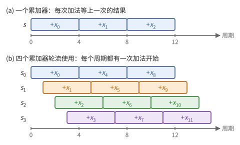
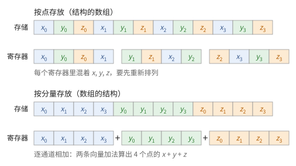
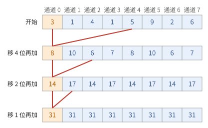
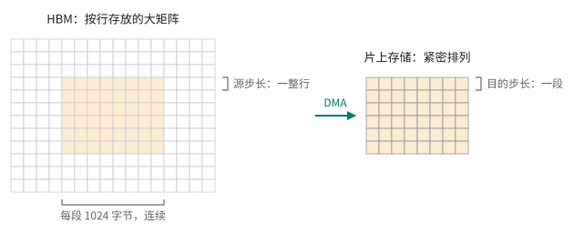
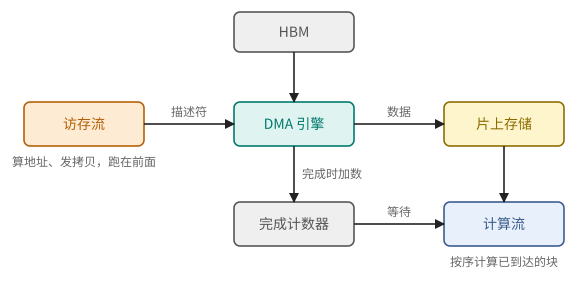

# 第 4 章　流水线、并行与控制

前三章给出了运算单元和存储，也给出了它们的延迟：一次乘加要几十级门，一次 HBM 访问要几百个周期。本章回答：怎样让这些单元每个周期都有活干？手段有三种：在时间上把一个单元切成多段（流水线），在空间上复制单元（SIMD），以及决定每个周期每个单元做什么（控制）。本章还引入一条在各层反复出现的定律：在途的工作量等于吞吐乘以延迟。

4.1 节讲流水线，4.2 节从中提炼出这条定律，并用它算出跑满 HBM 需要多少在途的请求。4.3 节讲空间上的复制，即 SIMD，以及它的三条代价；其中跨通道的数据交换最需要细说，单独放在 4.4 节。4.5 节讲专门搬运数据的 DMA 引擎和它的同步方式，这是后面一切异步程序的基础。最后两节讲控制：4.6 节是由编译器事先排好的静态调度，4.7 节是在运行时应对延迟的动态调度与多线程。

> **在体系中的位置**：下层是第 1 章的寄存器与时钟周期（命题 1.24）、第 2 章的运算单元、第 3 章各级存储的延迟和带宽。本章给出流水线单元的时间模型、Little 定律、SIMD 及跨通道通信的代价、DMA 引擎与完成计数，以及三种调度方式。第 5 章的矩阵单元是一条特殊的流水线；第 6 章的芯片模型用到本章的时间模型；第 9 章的异步程序建立在本章的 DMA 与完成计数之上；TPU 与 GPU 分别是本章两种调度思路的代表（第 15、21 章）。

## 4.1 流水线

一个深度为 $D$ 的组合电路，时钟周期至少是 $D\tau$（命题 1.24）。第 2 章的乘法器和浮点单元都有几十级门，若每个周期只能做完一次，时钟就很慢。本节先算一个例子：在电路中间插入寄存器、把它切成几段，时钟能快多少，又付出什么（例 4.1、命题 4.2）；然后给出上层使用流水线单元时唯一需要的两个数（定义 4.3）与时间公式（命题 4.4），得出让它满负荷的条件（推论 4.5），最后用求和的例子看这个条件怎样影响程序（例 4.6）。

做法如图 4.1：在深度为 $D$ 的电路中插入两级寄存器，切成 3 段，每段深度约 $D/3$。每个时钟周期，每段只需算完自己那一小段，结果存进段间的寄存器，下一个周期交给下一段。于是新的输入每个周期都可以进入，各段同时处理不同的输入（图 4.2）。

**图 4.1**　在深度为 $d$ 的组合电路中插入两级寄存器，切成 3 段，时钟周期约缩短为原来的三分之一。

**图 4.2**　4 级流水线。每个周期有一个新操作进入第 1 级，已在流水线中的操作各前进一级；稳定之后，4 级同时在处理 4 个不同的操作。

> **例 4.1（把一个乘加单元切成几段）** 设一个乘加单元的组合部分深度 $D = 60$，门延迟 $\tau = 15$ ps，寄存器开销 $t_{\text{reg}} = 30$ ps（定义 1.21）。不切分时周期为 $60 \times 15 + 30 = 930$ ps。均匀切成 $k$ 段，每段深度 $60/k$，周期为 $900/k + 30$ ps：
>
> | 段数 $k$ | 周期 | 时钟频率 | 一次运算的延迟 |
> | ---: | ---: | ---: | ---: |
> | 1 | 930 ps | 1.08 GHz | 930 ps |
> | 2 | 480 ps | 2.08 GHz | 960 ps |
> | 4 | 255 ps | 3.92 GHz | 1020 ps |
> | 8 | 142.5 ps | 7.02 GHz | 1140 ps |
> | 16 | 86.25 ps | 11.6 GHz | 1380 ps |
>
> 每个周期都能送进一组新的输入，所以吞吐随频率提高；但一次运算从进入到结果出来的时间并没有缩短，反而因为每段都多付一次寄存器开销而变长。段数越多，周期越接近 $t_{\text{reg}}$，收益越小。

> **命题 4.2（切分的收益）** 把深度为 $D$ 的组合电路均匀切成 $k$ 段（$k \mid D$），则时钟周期为 $T_k = D\tau/k + t_{\text{reg}}$，一次运算的延迟为 $k T_k = D\tau + k\, t_{\text{reg}}$，每秒完成的运算数为 $1/T_k$，总小于 $1/t_{\text{reg}}$。

*证明* 每段是两组寄存器之间深度为 $D/k$ 的组合电路，由命题 1.24，周期 $T_k = (D/k)\tau + t_{\text{reg}}$ 足够。一次运算依次经过 $k$ 段，每个周期前进一段；每个周期进入一次新的运算。∎

实际的频率还受功耗限制（命题 1.14），所以切分的段数有限。对上层而言，重要的是结论：一个运算单元有吞吐和延迟两个不同的数。上层使用它时不关心内部切成几段，只关心这两个数：

> **定义 4.3（流水线单元）** 一个**流水线单元**由两个参数刻画：**延迟**（latency）$L$，即一个操作从发出到结果可用的周期数；**发射间隔**（issue interval）$I$，即相邻两次发出操作至少相隔的周期数。$I = 1$ 时称为完全流水化。

> **命题 4.4（流水线的时间）** 向一个流水线单元连续发出 $n$ 个互相独立的操作，最后一个结果在第 $(n-1)I + L$ 个周期可用。若每个操作都依赖前一个操作的结果，则需要 $nL$ 个周期。

*证明* 独立时第 $j$ 个操作在第 $jI$ 个周期发出（$j \in [n]$），$L$ 个周期后可用。依赖时第 $j$ 个操作要等第 $j - 1$ 个结果可用才能发出。∎

所以流水线带来吞吐，而不是更短的延迟。一条依赖链在流水线上只能以 $1/L$ 的速率前进；只有互相独立的操作才能把流水线填满（图 4.3）。

**图 4.3**　延迟 $L = 4$、发射间隔 $I = 1$ 的单元。(a) 4 个独立操作在第 7 个周期全部完成；(b) 每个操作都要等前一个的结果（红色箭头），要 16 个周期。

> **推论 4.5** 要让延迟为 $L$、发射间隔为 $I$ 的单元保持满负荷，程序必须同时提供至少 $\lceil L / I \rceil$ 个互相独立的操作。

*证明* 一个操作发出后要 $L$ 个周期才有结果，这期间单元还能发出 $L/I$ 个操作，它们都不能依赖这个结果。∎

推论 4.5 直接改变程序的写法。下面是最常见的例子。

> **例 4.6（多个累加器）** 用一个 $L = 4$、$I = 1$ 的浮点加法器求 $n$ 个数的和。写成 $s \gets s + x_i$ 的循环时，每次加法都要等上一次的结果，由命题 4.4 需要 $4n$ 个周期，加法器四分之三的时间在空等。改用 4 个累加器 $s_0, \dots, s_3$，把 $x_i$ 加到 $s_{i \bmod 4}$ 上（图 4.4）：相邻的 4 次加法互不依赖，每个周期都能发出一次，约 $n + 3$ 个周期后得到 $s_0, \dots, s_3$，再用两级加法（例 1.8 的二叉树）合成总和。速度提高到约 4 倍。代价是加法的顺序变了，浮点结果的末几位会不同（2.5 节）。

**图 4.4**　例 4.6 中加法器的使用（$L = 4$）。每根条表示一次加法从发出到结果可用的 4 个周期。(a) 一个累加器：每次加法等上一次的结果，12 个周期只做 3 次；(b) 四个累加器轮流使用：每个周期都有一次加法开始。

## 4.2 Little 定律

推论 4.5 是一条更一般的规律的特例：在途的工作量等于吞吐乘以延迟。图 4.2 的 4 级流水线稳定之后，任一时刻恰有 4 个操作在途：每周期进入 1 个，每个停留 4 个周期。本节把这个计数写成定理（定理 4.7），把它用到存储系统上（推论 4.8、命题 4.9），并算出跑满 HBM 需要多少在途的请求（例 4.10）。

> **定理 4.7（Little 定律）** 一个处于稳定状态的系统，若单位时间平均进入 $\lambda$ 个任务，每个任务平均在系统内停留 $W$ 时间，则系统内的平均任务数为
>
> $$
> N = \lambda W .
> $$

*证明（确定性情形）* 设任务以固定速率 $\lambda$ 进入，每个停留恰好 $W$。时刻 $t$ 时在系统内的任务，正是在 $(t - W, t]$ 内进入的那些，共 $\lambda W$ 个。一般情形的证明见排队论教材，结论相同。∎

把"任务"换成"在途的数据"，就得到存储系统的两个版本：跑满带宽需要多少在途，以及给定的在途量能得到多少带宽。

> **推论 4.8（跑满带宽所需的并发量）** 要以带宽 $B$ 从延迟为 $L$ 的存储读取数据，任一时刻必须有至少 $B \cdot L$ 字节的请求已经发出、尚未返回。

> **命题 4.9（在途量决定带宽）** 若任一时刻至多有 $N$ 个请求在途，每个请求取 $s$ 字节，延迟为 $L$，则得到的带宽至多为 $N s / L$。

*证明* 由定理 4.7，单位时间完成的请求数 $\lambda = N_{\text{平均}} / L \le N / L$，带宽为 $\lambda s \le N s / L$。∎

> **例 4.10** 设 HBM 带宽 $B = 3\ \text{TB/s}$，延迟 $L = 500\ \text{ns}$。则任一时刻要有 $3 \times 10^{12} \times 5 \times 10^{-7} = 1.5 \times 10^6$ 字节，即约 1.5 MB 的请求在途。若每个请求取 64 字节，就是两万多个同时在途的请求。反过来，一个一次只发一个 64 字节请求、等它回来再发下一个的处理器，由命题 4.9 只能得到 $64\ \text{B} / 500\ \text{ns} \approx 0.13\ \text{GB/s}$，是峰值的两万分之一。

**图 4.5**　把存储系统想象成一根管道：每秒从出口流出 $B$ 字节，每个字节在管道中停留 $L$。要让出口不断流，管道里必须始终装着 $BL$ 字节。

加速器必须找到办法同时发出海量请求。按例 4.10 的数字，有两种思路：

- **让一次请求很大**：一次拷贝几百 KiB 到几 MiB 的连续数据。1.5 MB 的在途量只要两个 1 MiB 的拷贝就能装满，由少数几个专门的拷贝引擎（4.5 节）发出；
- **让请求者很多**：每个请求仍是 64 字节，但有成千上万个独立的执行流各自发出，合起来两万多个请求在途（4.7 节的多线程）。

后面会看到，TPU 主要走第一条路，GPU 主要走第二条路。

## 4.3 复制与 SIMD

流水线在时间上提高吞吐；另一种办法是在空间上复制单元。本节先算一笔账：复制完整的处理器，大部分能量花在控制上，而不是运算上（例 4.11）。由此引出 SIMD（定义 4.12）：一条指令驱动 $w$ 个通道，控制的开销摊薄为 $1/w$。代价有三条：分支要用掩码，数据必须预先排好（例 4.13），跨通道的通信昂贵；前两条在本节讨论，第三条放在下一节。

> **例 4.11（一条加法指令的能耗账）** 按 Horowitz（2014）对 45 nm 工艺下一个简单处理器的估计，执行一条 32 位整数加法指令约耗 70 pJ，其中加法本身只有 0.1 pJ（3.5 节的表）；其余是取指令、译码、读写寄存器堆和控制流水线。若一条指令让 8 个加法器同时工作，每次加法分摊约 9 pJ 的控制开销；让 128 个同时工作，只分摊约 0.5 pJ。

复制完整的处理器，每个都要自己取指令、译码。对简单的运算，这部分**控制开销**比运算本身大几百倍。解决办法是让许多运算共用一条指令：

> **定义 4.12（SIMD 单元）** 一个宽度为 $w$ 的 **SIMD 单元**（single instruction, multiple data，也称向量单元）由 $w$ 个**通道**（lane）组成，每个通道有自己的运算器和自己那一份寄存器；一条指令让所有通道对各自的数据做同一个运算。一个能装下 $w$ 个数、每个通道一个的寄存器称为**向量寄存器**。

**图 4.6**　宽度为 8 的 SIMD 单元执行一条带掩码的加法。每个通道只处理自己那一列；掩码为 0 的通道照样参与执行，只是结果不写回。

一条指令驱动 $w$ 个运算，控制开销被摊薄为原来的 $1/w$。代价有三条：

1. **所有通道做同样的事。** 遇到分支时，只能用**掩码**（mask，每个通道一个比特）关掉一部分通道：两边的分支都要执行，每个通道只保留自己那一边的结果（图 4.6）。例如 `if (x > 0) y = x; else y = -x;`：先算出掩码 $x > 0$，执行 $y \gets x$ 时只写回掩码为 1 的通道，执行 $y \gets -x$ 时只写回掩码为 0 的通道。若通道的选择不一致，两边的指令都要执行，效率最多降到一半，多重分支时更低（习题 4.7）。
2. **数据必须预先排好。** 每个通道只能访问自己那一份寄存器。数据在存储中怎样摆放，决定了它装入向量寄存器后落在哪个通道（下面的例 4.13，以及第 8 章）。
3. **跨通道的通信昂贵。** 让任意通道的数据去往任意通道，需要专门的交换网络（4.4 节）。

第 2 条值得用一个例子说明。

> **例 4.13（两种排布）** 有 $n$ 个三维的点，要对每个点算 $x + y + z$，SIMD 宽度为 4。若按点存放（每个点的 $x, y, z$ 相邻，称为"结构的数组"），一次装入 4 个连续的数得到 $x_0, y_0, z_0, x_1$，同一个寄存器里混着不同的分量，要先把它们重新排列才能相加。若按分量存放（所有 $x$ 相邻、所有 $y$ 相邻、所有 $z$ 相邻，称为"数组的结构"），一次装入 $x_0..x_3$、一次装入 $y_0..y_3$、一次装入 $z_0..z_3$，两条向量加法就算出 4 个点的结果（图 4.7）。同样的数据，换一种排布，就省掉了全部的重新排列。

**图 4.7**　例 4.13 的两种排布（宽度 4）。上：按点存放，一个向量寄存器里混着 $x, y, z$；下：按分量存放，每个寄存器只有一种分量，逐通道相加即可。

## 4.4 跨通道的数据交换

SIMD 的第三条代价来自硬件的形状：每个通道的运算器只连着自己的寄存器，数据要换到别的通道去，就需要一个交换网络。本节先比较两种网络的代价：任意置换至少要 $w \log w$ 量级的开关（命题 4.14），固定距离的循环移位只要 $w$ 根导线；然后用几次循环移位完成一次跨通道的求和（例 4.15）。这是后面各章在向量单元中、在 warp 内做归约的基本手法。

> **命题 4.14（置换网络的代价）** 让 $w$ 个通道的数据按任意置换重新排列。
>
> 1. 交叉开关（每个输入与每个输出之间一个交叉点）用 $w^2$ 个交叉点。
> 2. 任何由 $2 \times 2$ 开关（只有"直通"和"交换"两种状态）组成、能实现全部 $w!$ 个置换的网络，至少有 $\log_2 (w!) \ge w \log_2 w - w \log_2 e$ 个开关。
>
> Beneš 网络用 $(2\log w - 1) \cdot w/2$ 个开关、深度 $2\log w - 1$ 做到了任意置换（$w$ 为 2 的幂）。

*证明* 第 1 条由定义。第 2 条：$k$ 个开关共有 $2^k$ 种状态组合，每种组合实现一个置换；要实现全部 $w!$ 个置换，必须 $2^k \ge w!$。又 $\ln w! = \sum_{i=2}^{w} \ln i \ge \int_1^w \ln t\, dt = w \ln w - w + 1$，换成以 2 为底即得。Beneš 网络能实现任意置换是组合学中的经典结论，可以对 $w$ 归纳证明（见附录 E 的 Beneš 1965）。∎

**图 4.8**　在 8 个通道之间实现任意置换。(a) 交叉开关：每个输入与每个输出之间有一个交叉点；(b) Beneš 网络：每个方框是一个 2×2 开关（直通或交换），共 20 个，深度 5。

$w = 128$ 时，交叉开关要 16384 个交叉点，Beneš 网络要 832 个开关、13 级深，而且每做一次置换都要先算出每个开关的状态。相比之下，固定距离的**循环移位**（rotation：通道 $i$ 收到通道 $(i + k) \bmod w$ 的值，$k$ 固定）只要 $w$ 根固定的导线；按运行时给出的 $k$ 移位，也只要 $\log w$ 级选择器（命题 2.14 的移位器把两端接起来）。所以宽的 SIMD 单元一般只在通道之间提供少数几种廉价的通路，如循环移位；任意的置换、转置交给一个专门的、较慢的单元，或者绕道存储完成。

只用循环移位能做多少事？跨通道的求和就够用了：

> **例 4.15（用循环移位求和）** 8 个通道各有一个数：$3, 1, 4, 1, 5, 9, 2, 6$。
>
> 1. 把整个向量循环移位 4 位（通道 $i$ 得到通道 $i + 4$ 的值），与原向量逐通道相加：$8, 10, 6, 7, 8, 10, 6, 7$；
> 2. 循环移位 2 位再加：$14, 17, 14, 17, 14, 17, 14, 17$；
> 3. 循环移位 1 位再加：每个通道都是 $31$。
>
> 3 步，每步一条移位指令加一条加法指令，所有通道都得到了总和（图 4.9）。每个通道各自完成了一棵例 1.8 那样的二叉树，深度是 $\log_2 8 = 3$；代价是总共做了 $8 \times 3 = 24$ 次加法，而单独一棵树只要 7 次。在 SIMD 单元上这不吃亏：8 个通道本来就在同时工作。

**图 4.9**　例 4.15 的三步。每一行是一个向量寄存器；红线标出通道 0 每一步加上的是哪个通道的值。

程序的原则因此是：尽量让计算在通道内进行；跨通道的操作集中成少数几次归约或移位。

## 4.5 DMA 引擎与完成计数

4.2 节说，跑满带宽的一种办法是让每次请求都很大。专门做大块拷贝的单元叫 DMA 引擎。本节定义它（定义 4.16），用一个二维拷贝的描述符说明它能做什么（例 4.17），给出它与处理器同步的方式（定义 4.18），并算出单次拷贝要多大才能接近带宽（命题 4.19）。

> **定义 4.16（DMA 引擎）** **DMA 引擎**（direct memory access）是一个独立的单元：处理器把一个**描述符**（源地址、目的地址、形状与步长）交给它，它在后台完成整块拷贝，处理器在此期间继续执行别的指令。

> **例 4.17（拷贝矩阵的一块）** HBM 中有一个 $8192 \times 8192$ 的 bf16 矩阵，按行存放，每行 16384 字节。要把从第 $r_0$ 行、第 $c_0$ 列起的 $256 \times 512$ 一块拷到片上存储，紧密排列。这块在 HBM 中不连续：它是 256 段、每段 1024 字节，相邻两段的起点相隔 16384 字节（图 4.10）。一个描述符就能说清楚：
>
> | 字段 | 值 |
> | --- | --- |
> | 源起点 | 矩阵起点 $+ (8192 r_0 + c_0) \times 2$ |
> | 形状 | 256 段，每段 1024 字节 |
> | 源步长 | 16384 字节 |
> | 目的步长 | 1024 字节 |
>
> 一次共拷贝 256 KiB。每段 1024 字节是连续的，正好是许多个完整的突发（命题 3.14）。

**图 4.10**　例 4.17 的二维拷贝。左：HBM 中按行存放的大矩阵，要拷贝的块由 256 段连续的字节组成，段与段之间隔着一整行；右：片上存储中紧密排列的同一块。

处理器既然不等拷贝完成，就需要另一种办法得知它何时完成：

> **定义 4.18（完成计数器）** 处理器通过**完成计数器**（也称同步标志或信号量）得知拷贝何时完成。计数器 $c$ 初值为 0；DMA 引擎每完成一部分数据就把 $c$ 增加相应的量。处理器执行"等待 $c \ge n$，然后令 $c \gets c - n$"来确认 $n$ 个单位已经到达。

于是一次拷贝分成两个分开的动作：**发起**和**等待**。在两者之间，处理器可以做任何与这次拷贝无关的工作（图 4.11）。这是第 9 章一切异步程序的基础。

**图 4.11**　一次 DMA 拷贝。处理器发起拷贝后继续做别的工作，需要数据时等待完成计数器；只要别的工作够长，拷贝的时间就被完全藏起来了。

一次拷贝要多大才划算？用一个只有两个参数的模型回答：

> **命题 4.19（单次拷贝的效率）** 设一次拷贝 $S$ 字节的时间为
>
> $$
> T(S) = \alpha + S / \beta ,
> $$
>
> 其中 $\alpha$ 是与数据量无关的固定开销（启动、延迟），$\beta$ 是带宽。若一次只有一个拷贝在途，达到带宽的比例 $\eta$ 需要
>
> $$
> S \ge \frac{\eta}{1 - \eta}\, \alpha \beta .
> $$

*证明* 有效带宽为 $S / T(S)$，要求 $\frac{S/\beta}{\alpha + S/\beta} \ge \eta$，整理即得。∎

**图 4.12**　单次拷贝的效率 $\eta = S / (S + \alpha\beta)$。拷贝量等于 $\alpha\beta$ 时只达到一半带宽，要达到 90% 需要 $9\alpha\beta$。

> **例 4.20** 设 $\alpha = 500$ ns，$\beta = 1$ TB/s，则 $\alpha\beta = 500$ KB。一次拷贝 64 KiB 只达到 $65536 / (65536 + 500000) \approx 12\%$ 的带宽，1 MiB 约 68%，要 90% 需要 4.5 MB。片上存储往往放不下这么大的块；办法是同时让几个拷贝在途，它们的固定开销互相重叠，每个就可以小几倍（习题 4.11）。

$\alpha\beta$ 就是推论 4.8 中的"在途字节数"：只有一个拷贝时，它必须独自把带宽与延迟的乘积填满。

## 4.6 静态调度

处理器有多个单元：标量运算、向量运算、访存、矩阵运算等。每个周期，哪个单元执行哪条指令？这是控制的问题，有三种回答，区别在于怎样对待存储的长延迟（第 3 章）。本节讲第一种：由编译器事先排好，硬件照单执行（定义 4.21）。先用一个小调度看编译器要做什么（例 4.22），再说明它为什么必须与便签存储和 DMA 搭配，以及怎样用"解耦访存与执行"让访存提前进行。下一节讲另外两种回答。

> **定义 4.21（静态调度）** **静态调度**（static scheduling）的处理器每个周期发射一条很长的指令，称为**指令包**（bundle），其中每个单元有一个固定的**槽**（slot），没事做的槽填空操作 nop。硬件按顺序逐包发射，几乎不做检查；保证每条指令执行时操作数已经就绪，是编译器的责任。这种指令格式称为**超长指令字**（very long instruction word，VLIW）。

**图 4.13**　静态调度：编译器把同一周期要做的事装进一个指令包，每个单元在包里有固定的槽。

> **例 4.22（一个小调度）** 计算 $s = a_0 b_0 + a_1 b_1 + a_2 b_2 + a_3 b_3$。处理器每个指令包有一个乘法槽和一个加法槽；乘法的延迟是 2（第 $t$ 个包发出的乘法，结果在第 $t + 2$ 个包可用），加法的延迟是 1。四个乘积用二叉树相加：
>
> | 指令包 | 乘法槽 | 加法槽 |
> | ---: | --- | --- |
> | 0 | $m_0 = a_0 b_0$ | nop |
> | 1 | $m_1 = a_1 b_1$ | nop |
> | 2 | $m_2 = a_2 b_2$ | nop |
> | 3 | $m_3 = a_3 b_3$ | $t_0 = m_0 + m_1$ |
> | 4 | nop | nop |
> | 5 | nop | $t_1 = m_2 + m_3$ |
> | 6 | nop | $s = t_0 + t_1$ |
>
> 7 个指令包不能再少：只有一个乘法槽，$m_3$ 最早在第 3 个包发出、第 5 个包可用；$t_1$ 要等它，$s$ 又要等 $t_1$。编译器必须知道每条指令的延迟，才能排出这张表：若把 $t_1$ 放在第 4 个包，它读到的 $m_3$ 还没算出来，硬件不会检查，结果就是错的。

优点是不需要调度硬件，面积和能耗都省给了运算；执行时间完全由程序决定，可以事先算出（第 20 章）。前提是编译器必须知道每条指令的延迟。如果访存的延迟不可预测（例如缓存未命中，3.5 节），编译器就只能按最坏情况排，或者让整台机器停下来等。

所以静态调度与便签存储加 DMA（定义 3.17、4.5 节）是天然的搭配：计算指令只访问延迟固定的片上存储；与 DRAM 之间的搬运交给异步的 DMA，用完成计数器同步，延迟再长也不打乱指令包的节拍。

**解耦访存与执行。** 再进一步，可以把程序分成两个指令流：一个只负责算地址、发出拷贝请求，一个只负责计算，二者之间用队列（或完成计数器）连接（图 4.14）。访存的一侧不等计算，可以远远跑在前面，比如在计算第 $i$ 块时就发出第 $i + 2$ 块的拷贝；计算的一侧到用数据时才等待。后面两种具体机器都以不同的形式用到了这个思路。

**图 4.14**　解耦访存与执行。访存流只算地址、发拷贝，跑在前面；计算流按序处理已经到达的数据；二者之间用队列或完成计数器连接。

## 4.7 动态调度与多线程

静态调度把延迟交给编译器。另外两种控制方式在运行时应对延迟：动态调度在硬件中随机应变，多线程让别的指令流填补等待。本节简述前者（例 4.23），再用 Little 定律算出后者需要多少线程（命题 4.24），以及为此付出的寄存器代价（例 4.25）。

**动态调度。** 硬件用**记分板**（scoreboard）记录每个寄存器的值何时就绪、每个单元何时空闲，指令的操作数一就绪就发射。

> **例 4.23** 三条指令：$r_1 \gets \mathrm{load}(p)$，$r_2 \gets r_1 + 1$，$r_3 \gets r_4 \times r_5$。若装入未命中缓存、要等几百个周期，记分板看到第二条指令的 $r_1$ 未就绪，就让它等着；第三条与前两条无关，操作数已就绪，可以先发射。静态调度的处理器做不到这一点，只能按编译器排好的顺序走。

动态调度能自动适应不可预测的延迟，代价是调度硬件的面积和能耗，而且这部分开销按指令计，不随运算的位宽摊薄（例 4.11）。乱序执行的 CPU 把它做到了极致。

**多线程。** 处理器同时保存许多个独立指令流（**线程**，thread）的状态，每个周期从中挑一个就绪的发射。一个线程在等存储时，别的线程顶上（图 4.15）。需要多少个线程？由 Little 定律：

> **命题 4.24（隐藏延迟所需的线程数）** 设每个线程每发射一条指令后，平均要等 $L$ 个周期才能发射下一条（例如因为它在等访存），处理器每个周期发射一条指令。要让处理器不空闲，至少需要 $L$ 个线程。

*证明* 由定理 4.7，在途的指令数 = 发射速率 × 每条指令的等待时间 = $1 \times L$。每个线程同时至多有一条在途。∎

**图 4.15**　$L = 3$ 时，4 个线程轮流发射：每个线程发射一条指令后等待 3 个周期，这段时间由其余线程填满，处理器每个周期都有指令可发。

线程切换要快到每个周期都能换，所以所有线程的寄存器都要常驻在片上，不能换出换入。

> **例 4.25（多线程的寄存器代价）** 一个 SIMD 宽度为 32 的处理器，每个线程用 64 个向量寄存器，每个寄存器 $32 \times 4 = 128$ 字节，一个线程的寄存器共 8 KiB。若要靠 32 个线程隐藏延迟，寄存器就要 256 KiB，比许多 CPU 核心的整个一级缓存还大。

多线程与 SIMD 可以结合：每个线程本身是一条 SIMD 指令流，多个这样的线程轮流发射。4.2 节的第二条路"让请求者很多"，就是靠大量线程各自发出访存请求实现的。

## 接口小结

1. 切分流水线提高吞吐、不缩短延迟，周期不会短于寄存器开销。流水线单元由延迟 $L$ 和发射间隔 $I$ 刻画：$n$ 个独立操作用 $(n-1)I + L$ 个周期，依赖链用 $nL$ 个周期；满负荷需要 $\lceil L/I \rceil$ 个独立操作同时在途，例如用多个累加器求和。（命题 4.2、4.4，推论 4.5，例 4.6）
2. Little 定律：在途量 = 吞吐 × 延迟。跑满带宽 $B$、延迟 $L$ 的存储，需要 $BL$ 字节同时在途，对 HBM 是 MB 量级；$N$ 个 $s$ 字节的请求在途时，带宽至多 $Ns/L$。（定理 4.7、推论 4.8、命题 4.9）
3. SIMD 把控制开销摊到 $w$ 个通道；代价是分支要用掩码、数据要预先排好、跨通道通信昂贵。（定义 4.12、例 4.13）
4. 任意置换至少要 $\log_2(w!) \approx w \log w$ 个开关，循环移位只要 $w$ 根导线；跨通道的求和用 $\log w$ 次"循环移位再相加"完成。（命题 4.14、例 4.15）
5. DMA 引擎按描述符在后台做多维的块拷贝，发起与等待分离，用完成计数器同步；一次拷贝用时 $\alpha + S/\beta$，单个拷贝要接近带宽需要 $S \gg \alpha\beta$，否则让多个拷贝同时在途。（定义 4.16、4.18，命题 4.19）
6. 静态调度（VLIW）省掉调度硬件、执行时间可预先算出，但要求延迟可预测，所以与便签存储和 DMA 搭配，并可把访存与执行解耦；动态调度适应不可预测的延迟，代价是硬件；多线程用 $L$ 个线程隐藏 $L$ 个周期的延迟，代价是巨大的寄存器堆。（定义 4.21、4.6 节、命题 4.24）

## 习题

**习题 4.1** ★ 一个组合电路深度 $D = 40$，$\tau = 15$ ps，$t_{\text{reg}} = 30$ ps。(a) 分别切成 1、2、4、8 段，周期和一次运算的延迟各是多少？(b) 无论切多少段，每秒至多完成多少次运算？(c) 从 4 段增加到 8 段，吞吐提高多少？

提示

命题 4.2：$T_k = D\tau/k + t_{\text{reg}}$，延迟 $kT_k$。

答案

(a) $D\tau = 600$ ps。$k = 1$：周期 630 ps，延迟 630 ps；$k = 2$：330 ps，660 ps；$k = 4$：180 ps，720 ps；$k = 8$：105 ps，840 ps。

(b) 吞吐 $1/T_k < 1/t_{\text{reg}}$，即每秒不到 $3.3 \times 10^{10}$ 次。

(c) $180/105 \approx 1.71$ 倍，而段数翻了一倍；再往下切收益更小，延迟却越来越长。

**习题 4.2** ★ 一个 5 级、完全流水化的单元处理 100 个操作。(a) 操作互相独立时需要多少周期？流水线的利用率是多少？(b) 每个操作都依赖前一个的结果呢？

提示

命题 4.4，$L = 5$，$I = 1$。利用率 = 有效工作的周期数 / 总周期数。

答案

(a) $99 + 5 = 104$ 个周期，利用率 $100/104 \approx 96\%$。(b) $500$ 个周期，利用率 20%。

**习题 4.3** ★ 某个计算超越函数的单元延迟 $L = 7$，发射间隔 $I = 2$。(a) 要让它满负荷，需要多少个独立操作同时在途？(b) 连续发出 16 个独立操作，最后一个结果何时可用？(c) 若只算 1 个，"每个操作的平均周期数"是多少？

提示

推论 4.5 和命题 4.4。

答案

(a) $\lceil 7/2 \rceil = 4$。(b) $15 \times 2 + 7 = 37$ 个周期，平均每个约 2.3 个周期。(c) 7 个周期。批量处理时单元的代价是 $I$，单个处理时是 $L$。

**习题 4.4** ★ 用一个 $L = 6$、$I = 2$ 的加法器求 1200 个数的和。(a) 只用一个累加器要多少周期？(b) 至少要几个累加器才能让加法器满负荷？此时大约要多少周期？

提示

(a) 每次加法都等上一次，命题 4.4 的依赖情形。(b) 推论 4.5；满负荷时每 $I$ 个周期发出一次加法。

答案

(a) $1200 \times 6 = 7200$ 个周期。

(b) $\lceil 6/2 \rceil = 3$ 个累加器。1200 次加法每 2 个周期发出一次，约 $1199 \times 2 + 6 \approx 2400$ 个周期，再加两次合并累加器的加法（各 6 个周期）。约快 3 倍。

**习题 4.5** ★ 设 HBM 带宽 8 TB/s，延迟 600 ns。(a) 跑满带宽需要多少字节在途？(b) 若每个请求 64 字节，需要多少个请求同时在途？(c) 若每个请求是 1 MiB 的 DMA 拷贝呢？

提示

推论 4.8。

答案

(a) $8 \times 10^{12} \times 6 \times 10^{-7} = 4.8 \times 10^6$ 字节，约 4.8 MB。(b) 约 75000 个。(c) 约 5 个（$4.8 \times 10^6 / 2^{20} \approx 4.6$）。两种机器设计思路的差别（例 4.10 之后）在这里一目了然。

**习题 4.6** ★ 一个处理器核心至多同时有 8 个 64 字节的访存请求在途，延迟 400 ns。(a) 它能得到多少带宽？(b) 要跑满 2 TB/s 的 HBM，至少要多少个这样的核心？

提示

命题 4.9。

答案

(a) $8 \times 64\ \text{B} / 400\ \text{ns} = 1.28$ GB/s。(b) $2 \times 10^{12} / 1.28 \times 10^9 \approx 1563$ 个。所以靠"请求者多"的机器，必须有上千个能同时发出请求的执行流。

**习题 4.7** ★ 一个 32 通道的 SIMD 单元执行 `if (x > 0) {A} else {B}`，A 和 B 各 10 条指令。(a) 若一半通道走 A、一半走 B，执行多少条指令？效率是多少？(b) 若所有通道都走 A 呢？(c) 若有 4 路分支，各 10 条指令，且每个分支都有通道选择呢？

提示

掩码执行时，只要有一个通道选择某个分支，整个单元就要执行该分支。

答案

(a) 20 条，效率 50%。(b) 10 条（硬件可以检测到掩码全零而跳过 B），效率 100%。(c) 40 条，效率 25%。所以 SIMD 程序应当让同一组通道走同样的分支。

**习题 4.8** ☆ 沿用例 4.13：$n = 1024$ 个三维点，SIMD 宽度 8，要算每个点的 $x + y + z$。按分量存放时，一共要多少条向量装入和向量加法？按点存放时，若每重新排列一个向量寄存器要 2 条指令，大约多出多少条指令？

提示

按分量存放时，每 8 个点需要 3 次装入、2 次加法。按点存放时，每 8 个点的 24 个数装入 3 个寄存器，要先排成 $x$、$y$、$z$ 三个寄存器。

答案

按分量存放：$1024 / 8 = 128$ 组，每组 3 次装入、2 次加法，共 384 次装入、256 次加法。按点存放：同样 384 次装入、256 次加法，另外每组要把 3 个寄存器重排成 3 个，约 $3 \times 2 = 6$ 条指令，共多出约 768 条，比计算本身还多。

**习题 4.9** ☆ 对 $w = 128$ 个通道，比较交叉开关的交叉点数、命题 4.14 的开关数下界与 Beneš 网络的开关数。

提示

命题 4.14，$\log 128 = 7$，$\log_2 e \approx 1.44$。

答案

交叉开关 $128^2 = 16384$ 个交叉点。下界约 $128 \times 7 - 128 \times 1.44 \approx 712$ 个开关。Beneš 网络 $13 \times 64 = 832$ 个开关，深度 13，离下界不远。Beneš 网络便宜得多，但每次置换都要求解开关的设置，且深度更大，所以任意置换仍然是"慢"操作。

**习题 4.10** ★ (a) 用例 4.15 的方法求 16 个通道中的最大值，要几步？每一步循环移位多少？(b) 只想让通道 0 得到结果，能少做几步吗？(c) 若通道数是 12 而不是 2 的幂，怎样处理？

提示

(a) 取最大值和加法一样满足结合律、交换律。(b) 每一步本来就是整个向量的一条指令。(c) 把缺的通道补上一个不影响结果的值。

答案

(a) 4 步，依次循环移位 8、4、2、1 位，每步一次逐通道的取最大值。

(b) 不能：每一步都是一条作用于整个向量的指令，只要通道 0 的结果也得做满 $\log_2 16 = 4$ 步。深度 $\log w$ 是归约的下界（命题 1.38）。

(c) 放进 16 个通道中，多出的 4 个通道填 $-\infty$（求和时填 0），照 (a) 做 4 步。

**习题 4.11** ★ 一个 DMA 引擎的固定开销 $\alpha = 500$ 个周期，带宽 $\beta = 1$ KiB/周期。(a) 一次只有一个拷贝在途时，要达到 90% 的带宽，每次至少拷贝多少？(b) 若能同时有 4 个拷贝在途，且它们的固定开销可以完全重叠，每次至少拷贝多少？

提示

(a) 命题 4.19。(b) 4 个拷贝共同填满 $\alpha\beta$ 的"空档"。

答案

(a) $S \ge 9 \times 500 \times 1\ \text{KiB} = 4500\ \text{KiB} \approx 4.4$ MiB。(b) 约为 (a) 的四分之一，约 1.1 MiB。在片上存储有限时，"多个拷贝同时在途"是用更小的块达到带宽的办法，这是第 9 章多缓冲的动机。

**习题 4.12** ★ HBM 中有一个 $4096 \times 1024$ 的 f32 矩阵，按行存放。要把第 1024–1151 行、第 256–511 列这一块拷到片上存储并紧密排列。写出描述符：源起点（相对矩阵起点的字节偏移）、段数、每段字节数、源步长和目的步长。这次拷贝共多少字节？

提示

照例 4.17 做。每行 $1024 \times 4$ 字节；块有 128 行、256 列。

答案

每行 4096 字节。源起点 $(1024 \times 1024 + 256) \times 4 = 4195328$ 字节；128 段，每段 $256 \times 4 = 1024$ 字节；源步长 4096 字节；目的步长 1024 字节。共 $128 \times 1024 = 128$ KiB。

**习题 4.13** ☆ 一个 VLIW 处理器每个指令包有 1 个加法槽和 1 个乘法槽，两种运算的延迟都是 1 个周期。计算 $y = (a + b)(c + d) + e f$ 至少需要几个指令包？

提示

先画出依赖图：两次加法、两次乘法、一次最后的加法。每个包至多一次加法、一次乘法。

答案

包 1：$t_1 = a + b$，$t_3 = e f$。包 2：$t_2 = c + d$。包 3：$t_4 = t_1 t_2$。包 4：$y = t_4 + t_3$。共 4 个包。不能更少：两次加法 $a + b$ 与 $c + d$ 必须占两个包（只有一个加法槽），乘法 $t_1 t_2$ 必须在两者之后，最后的加法又在它之后，所以至少 $2 + 1 + 1 = 4$ 个包。编译器为 VLIW 机器做的，就是在资源限制下求这样的最短调度。

