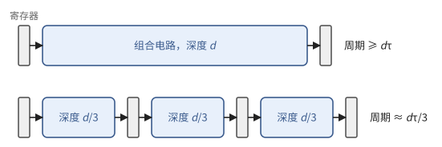
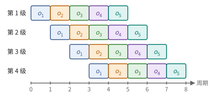
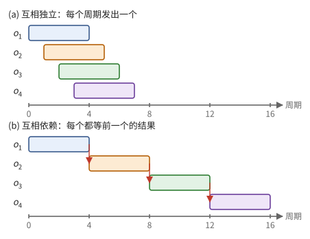
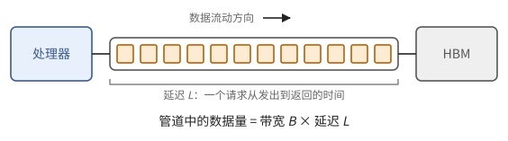
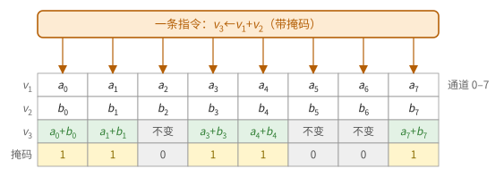
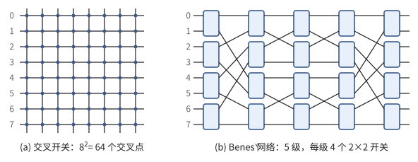
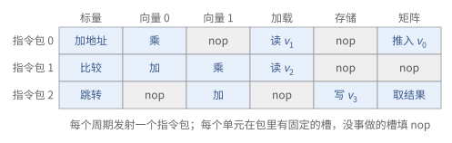
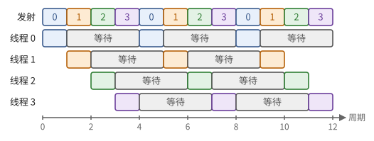
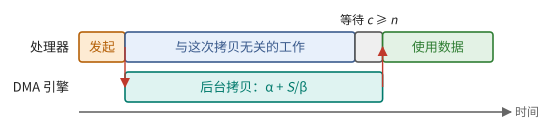
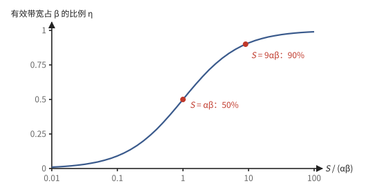

# 第 4 章　流水线、并行与控制

前三章给出了运算单元和存储，以及它们各自的延迟。本章回答：怎样让这些单元每个周期都有活干？有三种手段：在时间上把一个单元切成多级（流水线），在空间上复制单元（SIMD），以及决定每个周期每个单元做什么（控制）。本章还引入一条在各层反复出现的定律：在途的工作量等于吞吐乘以延迟。

4.1 节讲流水线，4.2 节从中提炼出这条定律；4.3 节讲空间上的复制，4.4 节讲控制的三种方式；4.5 节讲专门搬运数据的 DMA 引擎，它是后面一切异步程序的基础。

> **在体系中的位置**：下层是第 1 章的寄存器与时钟、第 3 章各级存储的延迟和带宽。本章给出流水线单元的时间模型、Little 定律、SIMD 的代价、三种调度方式和 DMA 引擎。第 5 章的矩阵单元是一条特殊的流水线；第 6 章的芯片模型用到本章的时间模型；第 9 章的异步程序建立在本章的 DMA 与完成计数之上；TPU 与 GPU 分别是本章两种调度思路的代表（第 15、21 章）。

## 4.1 流水线

一个深度为 $d$ 的组合电路，时钟周期至少是 $d\tau$（命题 1.24）。在中间插入寄存器，把它切成 $k$ 段，每段深度约 $d/k$，周期就可以缩短到约 $d\tau / k$。数据每个周期前进一段，新的输入每个周期都可以进入（图 4.1、图 4.2）。本节给出这样一个单元的时间模型（定义 4.1、命题 4.2），并得出让它满负荷的条件（推论 4.3）。

**图 4.1**　在深度为 $d$ 的组合电路中插入两级寄存器，切成 3 段，时钟周期约缩短为原来的三分之一。

**图 4.2**　4 级流水线。每个周期有一个新操作进入第 1 级，已在流水线中的操作各前进一级；稳定之后，4 级同时在处理 4 个不同的操作。

上层使用一个流水线单元时，不关心它内部切成几段，只关心两个数：

> **定义 4.1（流水线单元）** 一个**流水线单元**由两个参数刻画：**延迟** $L$，即一个操作从发出到结果可用的周期数；**发射间隔** $I$，即相邻两次发出操作至少相隔的周期数。$I = 1$ 时称为完全流水化。

> **命题 4.2（流水线的时间）** 向一个流水线单元连续发出 $n$ 个互相独立的操作，最后一个结果在第 $(n-1)I + L$ 个周期可用。若每个操作都依赖前一个操作的结果，则需要 $nL$ 个周期。

*证明* 独立时第 $j$ 个操作在第 $jI$ 个周期发出（$j \in [n]$），$L$ 个周期后可用。依赖时第 $j$ 个操作要等第 $j - 1$ 个结果可用才能发出。∎

所以流水线带来吞吐，而不是更短的延迟。一条依赖链在流水线上只能以 $1/L$ 的速率前进；只有互相独立的操作才能把流水线填满。

**图 4.3**　延迟 $L = 4$、发射间隔 $I = 1$ 的单元。(a) 4 个独立操作在第 7 个周期全部完成；(b) 每个操作都要等前一个的结果（红色箭头），要 16 个周期。

> **推论 4.3** 要让延迟为 $L$、发射间隔为 $I$ 的单元保持满负荷，程序必须同时提供至少 $\lceil L / I \rceil$ 个互相独立的操作。

## 4.2 Little 定律

推论 4.3 是一条更一般的规律的特例：在途的工作量等于吞吐乘以延迟。本节陈述这条定律（定理 4.4），把它用到存储系统上（推论 4.5），并算出跑满 HBM 需要多少在途的请求（例 4.6）。

> **定理 4.4（Little 定律）** 一个处于稳定状态的系统，若单位时间平均进入 $\lambda$ 个任务，每个任务平均在系统内停留 $W$ 时间，则系统内的平均任务数为
>
> $$
> N = \lambda W .
> $$

*证明（确定性情形）* 设任务以固定速率 $\lambda$ 进入，每个停留恰好 $W$。时刻 $t$ 时在系统内的任务，正是在 $(t - W, t]$ 内进入的那些，共 $\lambda W$ 个。一般情形的证明见排队论教材，结论相同。∎

把"任务"换成"在途的数据"，就得到存储系统的版本。

> **推论 4.5（跑满带宽所需的并发量）** 要以带宽 $B$ 从延迟为 $L$ 的存储读取数据，任一时刻必须有至少 $B \cdot L$ 字节的请求已经发出、尚未返回。

> **例 4.6** 设 HBM 带宽 $B = 3\ \text{TB/s}$，延迟 $L = 500\ \text{ns}$。则任一时刻要有 $3 \times 10^{12} \times 5 \times 10^{-7} = 1.5 \times 10^6$ 字节，即约 1.5 MB 的请求在途。若每个请求取 64 字节，就是两万多个同时在途的请求。

**图 4.4**　把存储系统想象成一根管道：每秒从出口流出 $B$ 字节，每个字节在管道中停留 $L$。要让出口不断流，管道里必须始终装着 $BL$ 字节。

一个顺序执行的处理器，一次发一个请求、等它回来再发下一个，带宽只有 $64\ \text{B} / 500\ \text{ns} \approx 0.13\ \text{GB/s}$，是峰值的两万分之一。加速器必须找到办法同时发出海量请求。有两种思路：

- 让一次请求本身很大：一次拷贝几百 KiB 到几 MiB 的连续数据，少数几个请求就能填满带宽；
- 让请求者很多：成千上万个独立的执行流各自发出小请求。

后面会看到，TPU 主要走第一条路，GPU 主要走第二条路。

## 4.3 复制与 SIMD

流水线在时间上提高吞吐；另一种办法是在空间上复制单元。本节说明复制的瓶颈在控制，SIMD（定义 4.7）怎样摊薄控制的开销，以及为此付出的三种代价。

复制 $p$ 个单元，吞吐提高 $p$ 倍，前提是每个周期有 $p$ 个独立的操作可做。但每个单元每次操作都需要一条指令：取指、译码、读寄存器。这部分**控制开销**与运算本身相比并不小，对简单的加法甚至更大。

> **定义 4.7（SIMD 单元）** 一个宽度为 $w$ 的 **SIMD 单元**（单指令多数据，也称向量单元）由 $w$ 个**通道**（lane）组成，每个通道有自己的运算器和自己那一份寄存器；一条指令让所有通道对各自的数据做同一个运算。

**图 4.5**　宽度为 8 的 SIMD 单元执行一条带掩码的加法。每个通道只处理自己那一列；掩码为 0 的通道照样参与执行，只是结果不写回。

一条指令驱动 $w$ 个运算，控制开销被摊薄为原来的 $1/w$。代价有三：

1. **所有通道做同样的事。** 遇到分支时，只能用**掩码**（每个通道一个比特）关掉一部分通道：两边的分支都要执行，每个通道只保留自己那一边的结果。若通道的选择不一致，效率最多降到一半（多重分支时更低）。
2. **数据必须预先排好。** 每个通道只能访问自己那一份寄存器。数据在存储中怎样摆放，决定了它装入寄存器后落在哪个通道（第 8 章）。
3. **跨通道的通信昂贵。** 让任意通道的数据去往任意通道，需要一个 $w \times w$ 的交叉开关，其面积随 $w^2$ 增长。

第 3 条代价能否用更巧妙的网络避开？只能部分避开：

> **命题 4.8（置换网络）** 实现 $w$ 个通道上任意置换的网络：交叉开关需要 $w^2$ 个交叉点；由 $2 \times 2$ 开关组成的 Beneš 网络需要 $(2\log w - 1) \cdot w/2$ 个开关，深度 $2\log w - 1$（$w$ 为 2 的幂）。

*证明从略*（Beneš 网络能实现任意置换是组合学中的经典结论，可对 $w$ 归纳证明）。∎

**图 4.6**　在 8 个通道之间实现任意置换。(a) 交叉开关：每个输入与每个输出之间有一个交叉点；(b) Beneš 网络：每个方框是一个 2×2 开关（直通或交换），共 20 个，深度 5。

所以宽的 SIMD 单元一般只在通道之间提供少数几种廉价的数据通路（例如固定距离的平移和循环移位），任意的置换、转置、跨通道归约要交给一个专门的、较慢的单元，或者绕道存储完成。程序应当尽量让计算在通道内进行。

## 4.4 控制：谁决定每个周期做什么

处理器有多个单元：标量运算、向量运算、访存、矩阵运算等。每个周期，哪个单元执行哪条指令？有三种做法，区别在于怎样对待存储的长延迟（第 3 章）：静态调度要求延迟可以预知，动态调度在硬件中随机应变，多线程让别的指令流填补等待（命题 4.9）。

**静态调度（VLIW）。** 编译器把可以同时执行的指令装进一条很长的指令字（**指令包**，bundle），每个单元在包里有一个固定的**槽**（slot）。硬件按顺序逐包发射，几乎不做检查。

- 优点：不需要调度硬件，面积和能耗都省给运算；执行时间完全由程序决定，可以事先算出。
- 前提：编译器必须知道每条指令的延迟。如果访存延迟不可预测（例如缓存未命中），整台机器就要停下来等。所以静态调度与便签存储加 DMA（定义 3.17）是天然的搭配：访存的延迟交给异步的 DMA，计算只访问延迟固定的片上存储。

**图 4.7**　静态调度：编译器把同一周期要做的事装进一个指令包，每个单元在包里有固定的槽。

**动态调度。** 硬件用**记分板**记录每个寄存器的值何时就绪、每个单元何时空闲，操作数一就绪就发射；乱序执行的 CPU 走到了极致。

- 优点：能自动适应不可预测的延迟。
- 代价：调度硬件的面积和能耗都很大，而且这部分开销按指令计，不随运算的位宽摊薄。

**多线程。** 处理器同时保存许多个独立指令流（**线程**）的状态，每个周期从中挑一个就绪的发射。一个线程在等存储时，别的线程顶上。需要多少个线程？由 Little 定律：

> **命题 4.9（隐藏延迟所需的线程数）** 设每个线程每发射一条指令后，平均要等 $L$ 个周期才能发射下一条（例如因为它在等访存），处理器每个周期发射一条指令。要让处理器不空闲，至少需要 $L$ 个线程。

*证明* 由 Little 定律，在途的指令数 = 发射速率 × 每条指令的等待时间 = $1 \times L$。每个线程同时至多有一条在途。∎

**图 4.8**　$L = 3$ 时，4 个线程轮流发射：每个线程发射一条指令后等待 3 个周期，这段时间由其余线程填满，处理器每个周期都有指令可发。

多线程的代价是：所有线程的寄存器都要常驻在片上（换出换入太慢），所以寄存器堆要非常大。

**解耦访存与执行。** 还有一种介于其间的组织：把程序分成两个指令流，一个只负责算地址、发出访存请求，一个只负责计算，二者之间用队列连接。访存流可以远远跑在计算流之前，把数据提前取来。后面两种具体机器都以不同的形式用到了这个思路。

## 4.5 DMA 引擎与完成计数

4.2 节末尾说，跑满带宽的一种办法是让每次请求都很大。专门做大块拷贝的单元叫 DMA 引擎。本节定义它（定义 4.10）以及它与处理器同步的方式（定义 4.11），并算出单次拷贝要多大才能接近带宽（命题 4.12）。

> **定义 4.10（DMA 引擎）** **DMA 引擎**（direct memory access）是一个独立的单元：处理器把一个**描述符**（源地址、目的地址、形状与步长）交给它，它在后台完成整块拷贝，处理器在此期间继续执行别的指令。

处理器既然不等拷贝完成，就需要另一种办法得知它何时完成：

> **定义 4.11（完成计数器）** 处理器通过**完成计数器**（也称同步标志或信号量）得知拷贝何时完成。计数器 $c$ 初值为 0；DMA 引擎每完成一部分数据就把 $c$ 增加相应的量。处理器执行"等待 $c \ge n$，然后令 $c \leftarrow c - n$"来确认 $n$ 个单位已经到达。

于是一次拷贝分成两个分开的动作：**发起**和**等待**。在两者之间，处理器可以做任何与这次拷贝无关的工作。这是第 9 章一切异步程序的基础。

**图 4.9**　一次 DMA 拷贝。处理器发起拷贝后继续做别的工作，需要数据时等待完成计数器；只要别的工作够长，拷贝的时间就被完全藏起来了。

一次拷贝要多大才划算？用一个只有两个参数的模型回答：

> **命题 4.12（单次拷贝的效率）** 设一次拷贝 $S$ 字节的时间为
>
> $$
> T(S) = \alpha + S / \beta ,
> $$
>
> 其中 $\alpha$ 是与数据量无关的固定开销（启动、延迟），$\beta$ 是带宽。若一次只有一个拷贝在途，达到带宽的比例 $\eta$ 需要
>
> $$
> S \ge \frac{\eta}{1 - \eta}\, \alpha \beta .
> $$

*证明* 有效带宽为 $S / T(S)$，要求 $\frac{S/\beta}{\alpha + S/\beta} \ge \eta$，整理即得。∎

**图 4.10**　单次拷贝的效率 $\eta = S / (S + \alpha\beta)$。拷贝量等于 $\alpha\beta$ 时只达到一半带宽，要达到 90% 需要 $9\alpha\beta$。

$\alpha\beta$ 就是推论 4.5 中的"在途字节数"：只有一个拷贝时，它必须独自把带宽与延迟的乘积填满。如果同时有多个拷贝在途，固定开销可以互相重叠，每个拷贝就可以小一些。

## 接口小结

1. 流水线单元由延迟 $L$ 和发射间隔 $I$ 刻画：$n$ 个独立操作用 $(n-1)I + L$ 个周期，依赖链用 $nL$ 个周期；满负荷需要 $\lceil L/I \rceil$ 个独立操作同时在途。（命题 4.2、推论 4.3）
2. Little 定律：在途量 = 吞吐 × 延迟。跑满带宽 $B$、延迟 $L$ 的存储，需要 $BL$ 字节同时在途，对 HBM 是 MB 量级。（定理 4.4、推论 4.5）
3. SIMD 把控制开销摊到 $w$ 个通道；代价是分支要用掩码、数据要预先排好、跨通道通信昂贵。（定义 4.7、命题 4.8）
4. 静态调度（VLIW）省掉调度硬件、执行时间可预先算出，但要求延迟可预测；动态调度适应不可预测的延迟，代价是硬件；多线程用大量线程隐藏延迟，代价是巨大的寄存器堆。（4.4 节、命题 4.9）
5. DMA 引擎在后台拷贝，发起与等待分离，用完成计数器同步；一次拷贝用时 $\alpha + S/\beta$，单个拷贝要接近带宽需要 $S \gg \alpha\beta$。（定义 4.10、4.11，命题 4.12）

## 习题

**习题 4.1** ★ 一个 5 级、完全流水化的单元处理 100 个操作。(a) 操作互相独立时需要多少周期？流水线的利用率是多少？(b) 每个操作都依赖前一个的结果呢？

提示

命题 4.2，$L = 5$，$I = 1$。利用率 = 有效工作的周期数 / 总周期数。

答案

(a) $99 + 5 = 104$ 个周期，利用率 $100/104 \approx 96\%$。(b) $500$ 个周期，利用率 20%。

**习题 4.2** ★ 设 HBM 带宽 8 TB/s，延迟 600 ns。(a) 跑满带宽需要多少字节在途？(b) 若每个请求 64 字节，需要多少个请求同时在途？(c) 若每个请求是 1 MiB 的 DMA 拷贝呢？

提示

推论 4.5。

答案

(a) $8 \times 10^{12} \times 6 \times 10^{-7} = 4.8 \times 10^6$ 字节，约 4.8 MB。(b) 约 75000 个。(c) 约 5 个（$4.8 \times 10^6 / 2^{20} \approx 4.6$）。两种机器设计思路的差别（例 4.6 之后）在这里一目了然。

**习题 4.3** ★ 某个计算超越函数的单元延迟 $L = 7$，发射间隔 $I = 2$。(a) 要让它满负荷，需要多少个独立操作同时在途？(b) 连续发出 16 个独立操作，最后一个结果何时可用？(c) 若只算 1 个，"每个操作的平均周期数"是多少？

提示

推论 4.3 和命题 4.2。

答案

(a) $\lceil 7/2 \rceil = 4$。(b) $15 \times 2 + 7 = 37$ 个周期，平均每个约 2.3 个周期。(c) 7 个周期。批量处理时单元的代价是 $I$，单个处理时是 $L$。

**习题 4.4** ★ 一个 DMA 引擎的固定开销 $\alpha = 500$ 个周期，带宽 $\beta = 1$ KiB/周期。(a) 一次只有一个拷贝在途时，要达到 90% 的带宽，每次至少拷贝多少？(b) 若能同时有 4 个拷贝在途，且它们的固定开销可以完全重叠，每次至少拷贝多少？

提示

(a) 命题 4.12。(b) 4 个拷贝共同填满 $\alpha\beta$ 的"空档"。

答案

(a) $S \ge 9 \times 500 \times 1\ \text{KiB} = 4500\ \text{KiB} \approx 4.4$ MiB。(b) 约为 (a) 的四分之一，约 1.1 MiB。在片上存储有限时，"多个拷贝同时在途"是用更小的块达到带宽的办法，这是第 9 章多缓冲的动机。

**习题 4.5** ★ 一个 32 通道的 SIMD 单元执行 `if (x > 0) {A} else {B}`，A 和 B 各 10 条指令。(a) 若一半通道走 A、一半走 B，执行多少条指令？效率是多少？(b) 若所有通道都走 A 呢？(c) 若有 4 路分支，各 10 条指令，且每个分支都有通道选择呢？

提示

掩码执行时，只要有一个通道选择某个分支，整个单元就要执行该分支。

答案

(a) 20 条，效率 50%。(b) 10 条（硬件可以检测到掩码全零而跳过 B），效率 100%。(c) 40 条，效率 25%。所以 SIMD 程序应当让同一组通道走同样的分支。

**习题 4.6** ☆ 对 $w = 128$ 个通道，比较交叉开关的交叉点数与 Beneš 网络的开关数。

提示

命题 4.8，$\log 128 = 7$。

答案

交叉开关 $128^2 = 16384$ 个交叉点；Beneš 网络 $13 \times 64 = 832$ 个开关，深度 13。Beneš 网络便宜得多，但每次置换都要求解开关的设置，且深度更大，所以任意置换仍然是"慢"操作。

**习题 4.7** ☆ 一个 VLIW 处理器每个指令包有 1 个加法槽和 1 个乘法槽，两种运算的延迟都是 1 个周期。计算 $y = (a + b)(c + d) + e f$ 至少需要几个指令包？

提示

先画出依赖图：两次加法、两次乘法、一次最后的加法。每个包至多一次加法、一次乘法。

答案

包 1：$t_1 = a + b$，$t_3 = e f$。包 2：$t_2 = c + d$。包 3：$t_4 = t_1 t_2$。包 4：$y = t_4 + t_3$。共 4 个包。不能更少：两次加法 $a + b$ 与 $c + d$ 必须占两个包（只有一个加法槽），乘法 $t_1 t_2$ 必须在两者之后，最后的加法又在它之后，所以至少 $2 + 1 + 1 = 4$ 个包。编译器为 VLIW 机器做的，就是在资源限制下求这样的最短调度。

