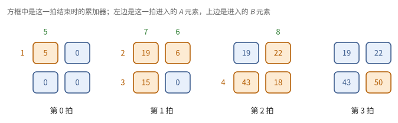
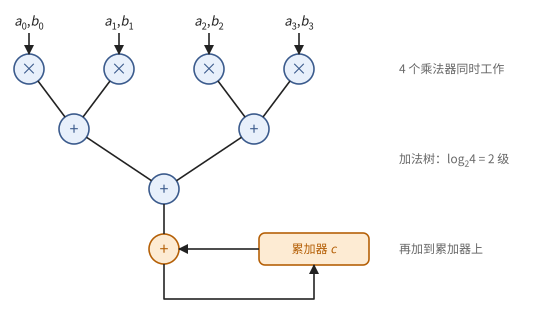
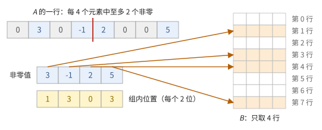

# 第 5 章　矩阵单元

第 2 章把一次乘加做得便宜，第 3 章说明取操作数昂贵，第 4 章给出了流水线。矩阵乘法 $C = AB$（$n \times n$）有 $n^3$ 次乘加，却只有 $3n^2$ 个数据，每个数据被使用 $n$ 次。本章说明怎样把成千上万个乘加单元排成阵列，让每个操作数从寄存器读出一次，就在阵列内部沿着短导线传给许多乘加单元。这样的阵列就是 TPU 的 MXU 和 GPU 的 Tensor Core 的共同原型。

5.1 节算一笔账，说明为什么要专门的阵列：用 SIMD 单元做矩阵乘法，大部分能量花在读寄存器上。5.2 节在一个 $2 \times 2$ 的阵列上逐拍算一次矩阵乘法，看清数据怎样流动。5.3 节把这个例子提炼成一般方法——一致递推的时空映射，由它推出三种阵列。5.4 节同样先手算、再证明，给出权重驻留阵列的时间。5.5 节把阵列抽象成固定形状的 MMA 操作，这是上层看到的接口；5.6 节把第 2 章的低精度格式、块缩放与结构化稀疏放进阵列。

> **在体系中的位置**：下层是第 2 章的混合精度乘加（定义 2.24）、第 3 章的寄存器堆端口与"距离即能耗"（注 3.6、3.5 节）、第 4 章的流水线（定义 4.3、命题 4.4）。本章用时空映射推导脉动阵列，给出矩阵单元对外的接口：固定形状的 MMA 操作、它的时间和利用率。第 6 章用它计算芯片的峰值算力；TPU 的 MXU（第 15 章）和 GPU 的 Tensor Core（第 21 章）是它的两种实现。

## 5.1 为什么要专门的矩阵单元

第 4 章的 SIMD 单元已经把控制的开销摊薄了。用它做矩阵乘法还缺什么？本节先算一笔能耗账（例 5.1），说明瓶颈在于每次乘加都要从寄存器堆读两个操作数；再给出矩阵单元的思路——操作数只从阵列的边上进入、在相邻单元之间传递，并把它的好处写成数量关系（命题 5.2）。

> **例 5.1（SIMD 做矩阵乘法的能耗账）** 一个 128 通道的 SIMD 单元做 bf16 矩阵乘法，每个通道每个周期做一次乘加，要从寄存器堆读出两个 bf16 操作数。按 3.5 节的表，一次 bf16 乘加约 1.5 pJ（例 3.15），从一块 8 KiB 的 SRAM 读 64 位约 10 pJ，读一个 16 位的操作数约 2.5 pJ，两个就是 5 pJ。读操作数的能耗是运算的三倍多。寄存器堆还要每周期供出 $2 \times 128 = 256$ 个操作数，端口的面积随之膨胀（注 3.6）。

问题不在乘加本身，而在于每次乘加都从远处（寄存器堆）取一次操作数。矩阵乘法中同一个 $A[i,k]$ 要与 $B[k, 0], B[k, 1], \dots$ 相乘 $N$ 次，同一个 $B[k,j]$ 要与 $A[0,k], A[1,k], \dots$ 相乘 $M$ 次。矩阵单元的办法是：把乘加单元排成二维阵列，操作数只从阵列的边上进入，然后在相邻的单元之间一格一格地传递（图 5.1）。相邻单元之间的导线很短，由定义 1.11，传递几乎不花能量。

**图 5.1**　操作数只从阵列的边上进入（橙色从左，绿色从上），在相邻单元之间沿短导线传递。

> **命题 5.2（边界供数）** 一个 $R \times C$ 的乘加阵列，若操作数只从边界进入，每周期进入的操作数为 $O(R + C)$ 个，而完成的乘加为 $RC$ 次。

*证明* 边界上只有 $2(R + C)$ 个单元，每个单元每周期从外部接收常数个操作数；阵列内部的每个单元每周期做一次乘加。∎

所以阵列越大，每个从寄存器读出的操作数被用得越多。一个 $128 \times 128$ 的阵列每周期做 16384 次乘加，只需从外部送入两组各 128 个数。问题是：数据应当怎样流动，才能让每个单元在正确的时刻拿到正确的一对操作数？下一节先在最小的例子上手算一次。

## 5.2 一个 2 × 2 的阵列

在推导一般方法之前，先在 $2 \times 2$ 的阵列上逐个周期地算一次矩阵乘法。本节的例子（例 5.3）展示了脉动阵列的三个特征：每个单元只和邻居交换数据；输入要错开时间进入（"斜排"）；整个计算像一道波阵面从一角扫到另一角。下一节会看到，这些特征都可以从一个线性函数 $t = i + j + k$ 推出来。

本节计算

$$
A = \begin{pmatrix} 1 & 2 \\ 3 & 4 \end{pmatrix}, \quad B = \begin{pmatrix} 5 & 6 \\ 7 & 8 \end{pmatrix}, \quad C = AB = \begin{pmatrix} 19 & 22 \\ 43 & 50 \end{pmatrix}.
$$

阵列有 4 个乘加单元，单元 $(i, j)$ 负责 $C[i, j]$，在自己内部保存一个累加器 $c_{ij}$（初值为 0）。$A$ 的第 $i$ 行从左边进入第 $i$ 行单元，每个周期向右走一格；$B$ 的第 $j$ 列从上边进入第 $j$ 列单元，每个周期向下走一格。每个周期，每个单元把这一拍从左边和上边收到的两个数相乘，加到累加器上，再把它们分别传给右边和下边的邻居。

要让 $A[i, k]$ 与 $B[k, j]$ 在单元 $(i, j)$ 相遇，进入的时刻必须错开：$A[i, k]$ 在第 $i + k$ 拍进入第 $i$ 行，$B[k, j]$ 在第 $j + k$ 拍进入第 $j$ 列。前者向右走 $j$ 格、后者向下走 $i$ 格，都在第 $i + j + k$ 拍到达单元 $(i, j)$。

> **例 5.3（逐拍计算）** 按上面的规则，各单元在每一拍做的乘加如下（空白表示这一拍空闲）：
>
> | 拍 | 单元 $(0,0)$ | 单元 $(0,1)$ | 单元 $(1,0)$ | 单元 $(1,1)$ |
> | ---: | --- | --- | --- | --- |
> | 0 | $1 \cdot 5 = 5$ | | | |
> | 1 | $5 + 2 \cdot 7 = 19$ | $1 \cdot 6 = 6$ | $3 \cdot 5 = 15$ | |
> | 2 | | $6 + 2 \cdot 8 = 22$ | $15 + 4 \cdot 7 = 43$ | $3 \cdot 6 = 18$ |
> | 3 | | | | $18 + 4 \cdot 8 = 50$ |
>
> 4 拍之后，4 个累加器恰好是 $C$ 的 4 个元素。第 1 拍，单元 $(0,1)$ 用的 $A[0,0] = 1$ 是单元 $(0,0)$ 上一拍用过、传过来的；单元 $(1,0)$ 用的 $B[0,0] = 5$ 也是。

**图 5.2**　例 5.3 的四拍。每个方框里是这一拍结束时的累加器，橙色表示这一拍在做乘加。工作的单元沿反对角线 $i + j = t - k$ 推进，像一道波阵面从左上扫到右下。

一般地，在 $M \times N$ 的阵列上做 $K$ 步，单元 $(i, j)$ 在第 $i + j, \dots, i + j + K - 1$ 拍工作，整个计算用 $M + N + K - 2$ 拍。输入错开进入的样子（第 $i$ 行比第 0 行晚 $i$ 拍开始）称为**斜排**（skew）。这样一拍一拍地让数据流过各个单元的阵列称为**脉动阵列**（systolic array），名字取自心脏的搏动。

## 5.3 一致递推与时空映射

5.2 节的阵列是凭直觉排出来的。本节把它提炼成一般方法：把矩阵乘法写成一种特殊的递推（一致递推），再给每次乘加指定一个时刻和一个处理单元（时空映射，定义 5.4）。定理 5.5 给出映射合法的条件。由同一个时刻函数 $t = i + j + k$ 和三个不同的投影方向，得到三种阵列（例 5.6），5.2 节的阵列是其中之一。

把矩阵乘法 $C = AB$ 写成在整点集合 $\mathcal{D} = [M] \times [N] \times [K]$ 上的递推。在点 $z = (i, j, k)$ 处做一次乘加：

$$
c_{i,j,k} = c_{i,j,k-1} + a_{i,j,k}\, b_{i,j,k}, \qquad a_{i,j,k} = a_{i,j-1,k}, \qquad b_{i,j,k} = b_{i-1,j,k},
$$

边界条件为 $c_{i,j,-1} = 0$，$a_{i,-1,k} = A[i,k]$，$b_{-1,j,k} = B[k,j]$，结果 $C[i,j] = c_{i,j,K-1}$。这里 $a_{i,j,k}$ 是"点 $(i,j,k)$ 处用到的那个 $A[i,k]$"，它沿 $j$ 方向逐点传递，这正是 $A$ 在 5.2 节中向右走；$b$ 沿 $i$ 方向传递，即 $B$ 向下走；$c$ 沿 $k$ 方向累加。每个点只依赖三个相邻的点，依赖向量是常数：

$$
d_c = (0, 0, 1), \qquad d_a = (0, 1, 0), \qquad d_b = (1, 0, 0).
$$

依赖向量处处相同的递推称为**一致递推**（uniform recurrence）。把它变成硬件，就是给每个点指定一个时刻和一个处理单元：

> **定义 5.4（时空映射）** 一个**时空映射**（space-time mapping）由**调度向量** $\lambda \in \mathbb{Z}^3$ 和**投影方向** $u \in \mathbb{Z}^3$ 组成：点 $z$ 在时刻 $t(z) = \lambda \cdot z$ 执行，由处理单元 $\pi(z)$ 执行，其中 $\pi$ 是沿 $u$ 方向的投影（$\pi(z) = \pi(z')$ 当且仅当 $z - z' \in \mathbb{Z} u$）。

5.2 节的阵列就是 $\lambda = (1, 1, 1)$、$u = (0, 0, 1)$：点 $(i, j, k)$ 在时刻 $i + j + k$ 由单元 $(i, j)$ 执行，同一个单元上的点只差 $k$。并不是每个 $(\lambda, u)$ 都能做成硬件：一个点不能在它依赖的值算出之前执行，一个处理单元也不能同时执行两个点。下面的定理说明，这两条要求就够了。

> **定理 5.5（时空映射的合法性）** 若
>
> 1. **因果性**：对每个依赖向量 $d$，$\lambda \cdot d \ge 1$；
> 2. **无冲突**：$\lambda \cdot u \ne 0$，
>
> 则时空映射给出一个合法的实现：每个处理单元每个时刻至多执行一个点；每个点执行时，它依赖的值已经算出。从 $z - d$ 到 $z$ 的数据，在处理单元 $\pi(z - d)$ 与 $\pi(z)$ 之间经过 $\lambda \cdot d$ 个周期的寄存器传递。

*证明* 因果性：点 $z$ 依赖 $z - d$，$t(z) - t(z - d) = \lambda \cdot d \ge 1$，所以依赖的值早已算出。无冲突：同一处理单元上的两个点相差 $c u$（$c \ne 0$），时刻相差 $c\,\lambda \cdot u \ne 0$。数据从 $\pi(z - d)$ 传到 $\pi(z)$，可用时间 $\lambda \cdot d$ 个周期，用这么多级寄存器延迟即可。∎

若 $\pi(d)$ 是零向量或单位向量，数据就只在单元内部停留或在相邻单元之间传递：全部通信都是局部的，没有长导线。这正是命题 5.2 所要的。在 5.2 节的阵列中，$\pi(d_a) = (0, 1)$（$A$ 向右一格），$\pi(d_b) = (1, 0)$（$B$ 向下一格），$\pi(d_c) = (0, 0)$（累加器不动）。

取 $\lambda = (1, 1, 1)$，三个依赖向量都满足 $\lambda \cdot d = 1$。三种自然的投影方向各给出一种阵列：

> **例 5.6（三种驻留方式）**
>
> - **输出驻留**（output stationary），$u = (0, 0, 1)$：处理单元 $(i, j)$ 负责 $C[i,j]$，部分和留在单元内累加；$A$ 的行沿 $j$ 方向流过，$B$ 的列沿 $i$ 方向流过。阵列形状 $M_a \times N_a$。这就是 5.2 节的阵列。
> - **权重驻留**（weight stationary），$u = (1, 0, 0)$：处理单元 $(k, j)$ 存放 $B[k, j]$，在整个计算中不动；$A$ 的每一行沿 $j$ 方向流过，部分和沿 $k$ 方向流动并累加，从阵列的一边流出。阵列形状 $K_a \times N_a$。
> - **输入驻留**（input stationary），$u = (0, 1, 0)$：处理单元 $(i, k)$ 存放 $A[i, k]$，$B$ 流过，部分和沿 $k$ 流动。
>
> 三种方式都满足 $\lambda \cdot u = 1 \ne 0$，都合法。

矩阵乘法中常把 $B$ 看作权重（一个神经网络层的参数），所以"权重驻留"指 $B$ 驻留。图 5.3 画出了迭代空间和权重驻留的投影。

**图 5.3**　矩阵乘法的迭代空间（$M = N = K = 3$）。每个点是一次乘加，三种颜色的箭头是三个依赖向量。沿 $u = (1, 0, 0)$ 投影（权重驻留）时，红线上的 3 个点由同一个处理单元 $(j, k) = (1, 1)$ 在不同时刻执行。

调度向量也可以违反因果性的严格形式。例如取 $\lambda \cdot d_a = 0$，意味着同一个 $a$ 值要在同一时刻送到一整行处理单元，即**广播**（broadcast）。广播需要一条横跨整行的长导线（注 1.13），所以脉动阵列的设计者宁可让数据一步一步地传。

## 5.4 权重驻留阵列

例 5.6 给出了阵列的形状，还没有回答它要用多少时间。本节以权重驻留为例（它是 TPU 的 MXU 的组织方式），先在 $2 \times 2$ 的阵列上逐拍算一次（例 5.7），再算出处理 $m$ 行的时间（命题 5.8），并说明填充、排空和装入权重的代价怎样被摊薄（推论 5.9）。

阵列大小 $K_a \times N_a$，单元 $(k, j)$ 存放权重 $B[k, j]$；$A$ 的 $m$ 行依次从左边进入，第 $k$ 列进入第 $k$ 行单元；部分和从上往下流，每经过一个单元加上一项，从底部流出时就是 $C$ 的一个元素（图 5.4）。按 $t = i + j + k$ 调度，单元 $(k, j)$ 在第 $i + j + k$ 拍处理 $A$ 的第 $i$ 行。

**图 5.4**　$3 \times 3$ 的权重驻留阵列。单元 $(k, j)$ 存放 $B[k, j]$ 不动；$A$ 的第 $k$ 列从左边进入第 $k$ 行，逐行错开一拍，使 $A[i, k]$ 恰好与上方流下来的部分和同时到达；部分和向下流动，每经过一个单元加上一项，从底部流出时就是 $C$ 的元素。

> **例 5.7（逐拍计算）** 沿用 5.2 节的 $A$、$B$。四个单元存放 $B[0,0] = 5$、$B[0,1] = 6$、$B[1,0] = 7$、$B[1,1] = 8$。各单元每一拍收到的部分和加上 $A[i,k] B[k,j]$ 后传给下方：
>
> | 拍 | 单元 $(0,0)$：存 5 | 单元 $(0,1)$：存 6 | 单元 $(1,0)$：存 7 | 单元 $(1,1)$：存 8 | 从底部流出 |
> | ---: | --- | --- | --- | --- | --- |
> | 0 | 行 0：$1 \cdot 5 = 5$ | | | | |
> | 1 | 行 1：$3 \cdot 5 = 15$ | 行 0：$1 \cdot 6 = 6$ | 行 0：$5 + 2 \cdot 7 = 19$ | | $C[0,0] = 19$ |
> | 2 | | 行 1：$3 \cdot 6 = 18$ | 行 1：$15 + 4 \cdot 7 = 43$ | 行 0：$6 + 2 \cdot 8 = 22$ | $C[1,0] = 43$，$C[0,1] = 22$ |
> | 3 | | | | 行 1：$18 + 4 \cdot 8 = 50$ | $C[1,1] = 50$ |
>
> 与例 5.3 一样用 4 拍，结果相同；不同的是权重始终不动，$A$ 的每一行流过阵列后就不再需要，可以紧接着送入下一行。

> **命题 5.8（权重驻留阵列的时间）** 在调度 $t = i + j + k$ 下，处理 $m$ 行需要 $m + K_a + N_a - 2$ 个周期。稳态时每周期进入一行 $A$、流出一行 $C$（长度 $N_a$），即每周期 $K_a N_a$ 次乘加。

*证明* 第 $i$ 行在单元 $(k, j)$ 上的时刻是 $i + j + k$，$t$ 的取值范围是 $0$ 到 $(m - 1) + (N_a - 1) + (K_a - 1)$。在 $K_a + N_a - 2 \le t \le m - 1$ 的稳态中，每个单元每拍都在工作。∎

额外的 $K_a + N_a - 2$ 个周期是流水线的**填充**与**排空**，相当于命题 4.4 中的延迟 $L$。所以利用率是 $m / (m + K_a + N_a - 2)$：$128 \times 128$ 的阵列处理 128 行只有 $128/382 \approx 34\%$，处理 1024 行约 80%。**一个权重块装入之后，必须连续处理很多行**，填充和排空的代价才能被摊薄。

装入权重也要时间：一次装入一行，$K_a \times N_a$ 的权重块需要 $K_a$ 个周期。解决办法是双缓冲：每个处理单元有两个权重寄存器，阵列用一份计算时，另一份在后台装入下一个权重块，用完后一个周期切换（图 5.5）。

> **推论 5.9** 带权重双缓冲的权重驻留阵列，若每个权重块至少处理 $K_a$ 行，装入权重的时间可以完全被计算掩盖。

*证明* 用当前权重块处理 $m \ge K_a$ 行需要至少 $m$ 个周期，这段时间足够在后台用 $K_a$ 个周期装入下一块。∎

**图 5.5**　权重双缓冲：用 $W_t$ 计算的同时，在后台装入 $W_{t+1}$。只要每个权重块的计算不短于装入，计算就不会停下来等权重。

> **注 5.10** 实际的矩阵单元不一定严格按 $t = i + j + k$ 每周期只过一个单元：可以在一个周期内让部分和穿过几个单元，或者在一列内部用加法树（命题 1.38）。所以实测的延迟可以小于 $K_a + N_a$；下一个权重块的计算也可以紧接着开始，与当前块的排空重叠。对编程而言，重要的是本节的两条结论：稳态吞吐是每周期一行；一份权重要被充分复用。

## 5.5 固定形状的 MMA

无论内部怎样实现，矩阵单元对程序呈现为一个固定形状的操作。本节定义这个操作（定义 5.11），介绍另一种常见的实现——点积单元，再算出大矩阵切成这种形状时的操作次数（例 5.12）和因补零造成的损失（命题 5.13）。上层只用这个接口，不再关心阵列内部的数据流动。

> **定义 5.11（MMA 操作）** 一个形状为 $(m, n, k)$ 的 **MMA 操作**（matrix multiply-accumulate）计算
>
> $$
> D = A B + C, \qquad A \in \mathbb{F}_{\text{low}}^{m \times k},\ B \in \mathbb{F}_{\text{low}}^{k \times n},\ C, D \in \mathbb{F}_{\text{f32}}^{m \times n}.
> $$

矩阵单元的接口由以下几项刻画：形状 $(m, n, k)$；支持的输入格式；操作数放在哪里（寄存器、单元内部的缓冲、片上存储）；延迟与发射间隔（定义 4.3）。对于权重驻留的脉动阵列，$(k, n) = (K_a, N_a)$，$m$ 可以是任意多行。

另一种常见实现是**点积单元**：每个输出元素配一组 $k$ 个乘法器和一棵加法树，一次操作完成一个小的 $m \times n \times k$ 乘法，操作数都来自寄存器（图 5.6）。它没有脉动阵列的填充与排空，但每次操作的操作数都要从寄存器送到每个乘法器旁边。二者对外的接口相同，都是定义 5.11。

**图 5.6**　点积单元算一个输出元素（$k = 4$）：4 个乘法器同时算出 $a_t b_t$，两级加法树把它们相加，再加上累加器 $c$。$m \times n$ 个这样的单元并排，就是一次 $(m, n, k)$ 的 MMA。

大矩阵要切成 MMA 的形状。先看形状整齐的情形。

> **例 5.12（切成权重块）** 在 $128 \times 128$ 的权重驻留阵列上计算 $M = 1024$、$K = N = 256$ 的矩阵乘法。$B$ 切成 $(256/128) \times (256/128) = 4$ 个权重块，每块装入一次，让 $A$ 相应的 1024 行（每行取 128 个元素）流过，结果按 $K$ 方向的两块相加。每块用 $1024 + 254 = 1278$ 个周期（命题 5.8），共 5112 个周期；理想情况是 $4 \times 1024 = 4096$ 个周期，利用率约 80%。若各块首尾重叠（注 5.10），可以接近 4096。

形状不整齐时，边缘不足的部分要补零：

> **命题 5.13（填充的利用率）** 用形状 $(m, n, k)$ 的 MMA 计算 $M \times N \times K$ 的矩阵乘法，需要 $\lceil M/m \rceil \lceil N/n \rceil \lceil K/k \rceil$ 次 MMA，利用率为
>
> $$
> \frac{MNK}{\lceil M/m \rceil m \cdot \lceil N/n \rceil n \cdot \lceil K/k \rceil k}.
> $$

*证明* 每个维度向上取整到 MMA 形状的倍数，补上的部分做的都是无用的乘加。∎

例如在 $N_a = 128$ 的阵列上，$N = 100$ 的利用率是 $100/128 \approx 78\%$，$N = 129$ 只有 $129/256 \approx 50\%$（图 5.7）。

**图 5.7**　在 $N_a = 128$ 的阵列上，$N = 129$ 比 $N = 100$ 多用一倍的时间，因为第二个块几乎全是补的零。

阵列越大，命题 5.2 的好处越大，但小矩阵和不整齐的形状浪费也越大。所以常见的设计不是一个巨大的阵列，而是若干个中等大小的阵列。

## 5.6 低精度、块缩放与稀疏

最后把第 2 章的数值格式放进阵列。本节依次说明四件事：低精度相乘、f32 累加在阵列中怎样进行；更窄的格式为什么使吞吐翻倍；块缩放的 MMA 多做哪些运算（例 5.14）；结构化稀疏怎样跳过一半的乘法（例 5.15）。

**混合精度。** 矩阵单元中的每个乘加都按定义 2.24 进行：低精度相乘，f32 累加。在权重驻留阵列中，存放的权重和流过的 $A$ 是低精度的，沿 $k$ 方向流动的部分和是 f32。由命题 2.25，两个 bf16 之积在 f32 中精确，误差只来自部分和的累加。

**更窄的格式。** 阵列中两个单元之间传递 $A$ 的导线、存放权重的寄存器都有固定的位宽。换成一半宽的格式时，同样的导线可以并排传两个数，每个单元放两个较小的乘法器，各自算出一个乘积再相加。例如 bf16 的 $128 \times 128$ 阵列处理 fp8 时，每个单元相当于做沿 $k$ 方向相邻的两次乘加，整个阵列如同一个 $256 \times 128$ 的 fp8 阵列。所以每降一档精度，每周期的乘加次数翻倍（注 2.23）。

**块缩放 MMA。** 若 $A$、$B$ 沿 $k$ 方向按长度 $b$ 的块缩放（2.8 节），一次 $k = tb$ 的 MMA 要额外接收 $t$ 对缩放因子：硬件先算出每个块内的低精度点积，乘以对应的 $s^A s^B$，再在 f32 中累加。

> **例 5.14** 一次 $(m, n, k) = (128, 128, 64)$ 的 MXFP8 MMA，块长 $b = 32$。每个输出元素沿 $k$ 有 2 个块：先算出两个长度为 32 的 fp8 点积 $p_0, p_1$，再算 $s^A_0 s^B_0 p_0 + s^A_1 s^B_1 p_1$ 加到累加器上。$64$ 次低精度乘加之外，只多 2 次缩放乘法，开销是 $1/b = 1/32$。缩放因子是 2 的幂时，乘以它只是加指数。

**结构化稀疏。** 训练好的权重中常有许多接近零的值。若把 $A$ 的每一行沿 $k$ 方向剪成"每 4 个元素中至多 2 个非零"（称为 **2:4 稀疏**），就可以只存非零值和它们在 4 个中的位置（每个 2 位），硬件按位置挑出 $B$ 中对应的行相乘。

> **例 5.15** $A$ 的一行是 $(0, 3, 0, -1 \mid 2, 0, 0, 5)$，每 4 个一组，各有 2 个非零。存成值 $(3, -1, 2, 5)$ 与组内位置 $(1, 3, 0, 3)$。计算这一行与 $B$ 的乘积时，硬件只取 $B$ 的第 1、3、4、7 行，做 4 次乘加而不是 8 次（图 5.8）。同样的乘法器，有效吞吐翻倍；代价是权重必须事先剪成这种形式，模型的精度可能受影响。

**图 5.8**　2:4 稀疏。上：$A$ 的一行，每 4 个元素中至多 2 个非零；中：只存非零值和组内位置；下：按位置从 $B$ 中挑出对应的行，只做一半的乘加。

> **现状（2026-10）**：TPU 的 MXU 是权重驻留的脉动阵列，v5p 及以前为 $128 \times 128$，v6e（Trillium）起为 $256 \times 256$。NVIDIA 的 Tensor Core 从 Volta 起以 warp 为单位执行小形状的 MMA，Hopper 起改为由一组 warp 发起、操作数直接取自片上共享存储的异步 MMA，Blackwell 起累加结果放在专门的张量存储中。Blackwell 在硬件中支持 MX 与 NVFP4 的块缩放 MMA；2:4 稀疏从 Ampere 起支持。两条路线的细节分别在第 15 章和第 21 章。

## 接口小结

1. 矩阵单元让操作数从边界进入、在相邻单元间传递：$R \times C$ 阵列每周期只需 $O(R + C)$ 个操作数，完成 $RC$ 次乘加；用 SIMD 做矩阵乘法时，读寄存器的能耗是运算的数倍。（命题 5.2、例 5.1）
2. 脉动阵列的输入要斜排，计算像一道波阵面扫过阵列；$M \times N$ 的输出驻留阵列做 $K$ 步用 $M + N + K - 2$ 拍。（5.2 节、例 5.3）
3. 时空映射 $(\lambda, u)$ 合法当 $\lambda \cdot d \ge 1$（对每个依赖向量）且 $\lambda \cdot u \ne 0$；输出驻留、权重驻留、输入驻留是三个投影方向。（定理 5.5、例 5.6）
4. $K_a \times N_a$ 的权重驻留阵列每周期处理一行 $A$；$m$ 行用 $m + K_a + N_a - 2$ 个周期；权重装入要 $K_a$ 个周期，双缓冲后可被掩盖。一个权重块要处理足够多的行。（命题 5.8、推论 5.9）
5. 矩阵单元对外是形状固定的 MMA 操作 $D = AB + C$，由形状、格式、操作数位置、延迟、发射间隔刻画；脉动阵列与点积单元是两种实现。大矩阵切成 MMA 的形状，不整齐的形状要补零，利用率见命题 5.13。（定义 5.11、例 5.12、命题 5.13）
6. 低精度相乘、f32 累加；每降一档精度吞吐翻倍；块缩放 MMA 的额外开销为 $1/b$；2:4 稀疏使有效吞吐翻倍。（5.6 节）

## 习题

**习题 5.1** ★ 沿用 5.2 节的规则，在 $3 \times 3$ 的输出驻留阵列上计算两个 $3 \times 3$ 矩阵的乘积。(a) 共需多少拍？(b) 单元 $(2, 1)$ 在哪几拍工作？它在第 4 拍用的是哪两个数？(c) 第 2 拍有哪些单元在工作？

提示

单元 $(i, j)$ 在第 $t$ 拍处理 $k = t - i - j$，要求 $0 \le k < 3$。

答案

(a) $M + N + K - 2 = 7$ 拍（第 0 到 6 拍）。

(b) 第 3、4、5 拍；第 4 拍 $k = 4 - 2 - 1 = 1$，用 $A[2, 1]$ 与 $B[1, 1]$。

(c) 满足 $0 \le 2 - i - j < 3$ 的单元：$i + j \le 2$，即 $(0,0), (0,1), (0,2), (1,0), (1,1), (2,0)$，共 6 个，分别处理 $k = 2, 1, 0, 1, 0, 0$。

**习题 5.2** ★ 对输出驻留的映射（$\lambda = (1, 1, 1)$，$u = (0, 0, 1)$），处理单元 $(i, j)$ 在哪些时刻工作？$A[i, k]$ 从阵列的哪一边进入、在何时到达单元 $(i, j)$？

提示

单元 $(i, j)$ 负责点 $(i, j, k)$，$k \in [K]$，时刻 $t = i + j + k$。$a$ 沿 $j$ 方向传递。

答案

单元 $(i, j)$ 在时刻 $i + j, i + j + 1, \dots, i + j + K - 1$ 工作。$A[i, k]$ 从第 $i$ 行的左端（$j = 0$）在时刻 $i + k$ 进入，每周期右移一个单元，在时刻 $i + j + k$ 到达单元 $(i, j)$。第 $i$ 行的输入比第 0 行晚 $i$ 个周期开始，这就是脉动阵列输入的"斜排"。

**习题 5.3** ★ 判断下列时空映射是否合法，不合法时说明违反了哪一条，以及它在硬件上意味着什么：(a) $\lambda = (1, 1, 0)$，$u = (0, 0, 1)$；(b) $\lambda = (1, 0, 1)$，$u = (0, 0, 1)$；(c) $\lambda = (1, 1, 1)$，$u = (1, -1, 0)$。

提示

逐个计算 $\lambda \cdot d_a$、$\lambda \cdot d_b$、$\lambda \cdot d_c$ 和 $\lambda \cdot u$。

答案

(a) $\lambda \cdot d_c = 0$：同一个 $C[i,j]$ 的所有 $K$ 次累加要在同一时刻完成，而 $u = d_c$ 又把它们放在同一单元上，$\lambda \cdot u = 0$，冲突。不合法。

(b) $\lambda \cdot d_a = 0$：$A[i,k]$ 要在同一时刻送到第 $i$ 行的所有单元，即广播；严格意义上不满足因果性，硬件上需要横跨整行的长导线。$\lambda \cdot u = 1$，没有冲突。这是一个"带广播的阵列"，可以实现，但失去了脉动阵列只用短导线的优点。

(c) 三个依赖向量都满足 $\lambda \cdot d = 1$，但 $\lambda \cdot u = 1 - 1 + 0 = 0$：$(i, j, k)$ 与 $(i + 1, j - 1, k)$ 被映射到同一个单元且时刻相同，冲突。不合法。

**习题 5.4** ★ 一个 $4 \times 4$ 的权重驻留阵列（$K_a = N_a = 4$）处理 $A$ 的 6 行。(a) 共需多少个周期？(b) $C[5, 3]$ 在第几拍从底部流出？(c) 第 5 拍有多少个单元在工作？

提示

单元 $(k, j)$ 在第 $i + j + k$ 拍处理第 $i$ 行；$C[i, j]$ 在经过最后一行单元 $k = K_a - 1$ 之后流出。

答案

(a) $6 + 4 + 4 - 2 = 12$ 个周期。

(b) 第 $5 + 3 + 3 = 11$ 拍经过单元 $(3, 3)$，这一拍结束时流出，正是最后一拍。

(c) 第 5 拍：单元 $(k, j)$ 处理第 $5 - j - k$ 行，要求 $0 \le 5 - j - k < 6$，即 $j + k \le 5$。只有单元 $(3, 3)$ 的 $j + k = 6$ 不满足，所以 15 个单元在工作。事实上，整个计算中没有一拍是 16 个单元全部工作的：由命题 5.8 的证明，全阵列工作要求 $6 \le t \le 5$。$m$ 太小时，阵列始终处在填充或排空之中。

**习题 5.5** ★ 在 $128 \times 128$ 的权重驻留阵列上（MMA 形状 $k = n = 128$，$m$ 任意）计算 $M = 4096$、$N = 100$、$K = 300$ 的矩阵乘法。只考虑补零，利用率是多少？

提示

命题 5.13，$m$ 方向不需要补零。

答案

$\lceil 300/128 \rceil = 3$ 个 $k$ 块（共 384），$\lceil 100/128 \rceil = 1$ 个 $n$ 块（共 128）。利用率 $\frac{100 \times 300}{128 \times 384} = \frac{30000}{49152} \approx 61\%$。

**习题 5.6** ★ 在 $K_a = N_a = 128$ 的权重驻留阵列上，每装入一个权重块只处理 $m$ 行。分别对 $m = 8$ 和 $m = 2048$ 计算命题 5.8 的利用率。

提示

$m / (m + K_a + N_a - 2)$。

答案

$m = 8$：$8 / 262 \approx 3\%$。$m = 2048$：$2048 / 2302 \approx 89\%$。（若下一个权重块的计算能紧接着开始、与当前块的排空重叠，利用率还会更高，见注 5.10。）第 11 章会看到，语言模型逐个生成词元时，每次只有很少的行，矩阵单元大部分时间在空等，这一阶段的瓶颈在别处。

**习题 5.7** ★ 一个 $128 \times 128$ 的 bf16 权重驻留阵列，时钟 1 GHz。(a) 它每秒完成多少 FLOP？(b) 稳态时每周期要送入和取出多少字节（$A$ 为 bf16，结果为 f32）？(c) 若改用 SIMD 单元做同样多的乘加，每次乘加从寄存器读两个 bf16 操作数，每周期要读多少字节？

提示

稳态每周期进入一行 $A$（128 个元素），流出一行结果（128 个元素）。一次乘加计 2 FLOP。

答案

(a) $2 \times 16384 \times 10^9 \approx 3.3 \times 10^{13}$，约 33 TFLOP/s。(b) 送入 $128 \times 2 = 256$ 字节，取出 $128 \times 4 = 512$ 字节，共 768 字节/周期。(c) $2 \times 16384 \times 2 = 65536$ 字节/周期，是 (b) 的 85 倍。这就是专门的矩阵单元存在的理由。

**习题 5.8** ★ 在 $128 \times 128$ 的权重驻留阵列上计算 $M = 2048$、$K = 512$、$N = 384$。(a) 要装入多少个权重块？(b) 按命题 5.8，各块之间不重叠时共需多少周期？利用率是多少？(c) 每个权重块处理 2048 行，权重双缓冲能否掩盖装入时间？

提示

(a) $B$ 是 $512 \times 384$。(c) 推论 5.9。

答案

(a) $(512/128) \times (384/128) = 4 \times 3 = 12$ 块。

(b) 每块 $2048 + 254 = 2302$ 个周期，共 27624；理想 $12 \times 2048 = 24576$，利用率约 89%。

(c) 能：每块计算 2048 个周期，远多于装入的 128 个周期（推论 5.9）。

**习题 5.9** ☆ 2:4 稀疏的权重矩阵，每个非零值是 bf16，位置用 2 位表示。与稠密存储相比，存储量是多少？若硬件吞吐翻倍，一个原本计算受限的矩阵乘法最多快几倍？

提示

每 4 个元素存 2 个值和 2 个位置。

答案

每 4 个元素存 $2 \times 16 + 2 \times 2 = 36$ 位，稠密为 64 位，约为 56%。计算受限时最多快 2 倍；但若因此变成受别的因素限制（第 6 章），实际加速更少。

**习题 5.10** ☆ 块长为 $b$ 的块缩放 MMA，计算 $m \times n \times k$ 的乘积，需要多少次缩放乘法？相对于乘加次数的比例是多少？

提示

每个输出元素、每个 $k$ 方向的块，乘一次 $s^A s^B$。

答案

$mn \cdot k/b$ 次，比例 $1/b$：MX 格式为 $1/32$，NVFP4 为 $1/16$。

