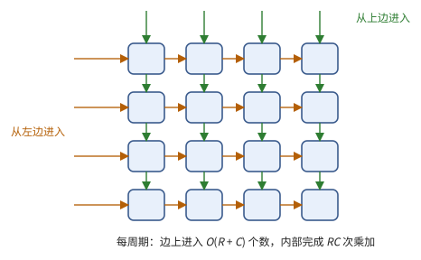
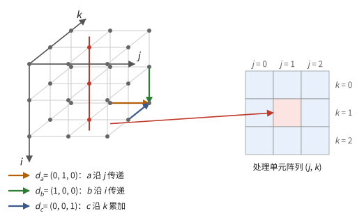
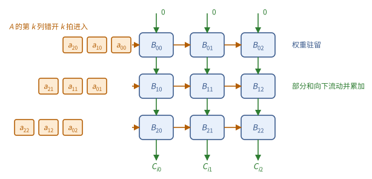
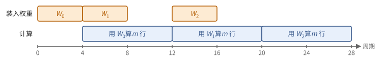

# 第 5 章　矩阵单元

第 2 章把一次乘加做得便宜，第 3 章说明取操作数昂贵，第 4 章给出了流水线。矩阵乘法有 $\Theta(n^3)$ 次乘加，却只有 $\Theta(n^2)$ 个数据，每个数据被使用 $n$ 次。本章说明怎样把成千上万个乘加单元排成阵列，让每个操作数从寄存器读出一次，就在阵列内部沿着短导线传给许多乘加单元。这样的阵列就是 TPU 的 MXU 和 GPU 的 Tensor Core 的共同原型。

> **在体系中的位置**：下层是第 2 章的混合精度乘加、第 3 章的寄存器堆端口与"距离即能耗"、第 4 章的流水线。本章用时空映射推导脉动阵列，给出矩阵单元对外的接口：固定形状的 MMA 操作、它的时间和利用率。第 6 章用它计算芯片的峰值算力；TPU 的 MXU（第 15 章）和 GPU 的 Tensor Core（第 21 章）是它的两种实现。

## 5.1 为什么要专门的矩阵单元

用第 4 章的 SIMD 单元做矩阵乘法，每次乘加要从寄存器堆读两个操作数。$w$ 个通道每周期要读 $2w$ 个操作数，寄存器堆的端口和能耗很快成为瓶颈（注 3.2、3.4 节）。

矩阵单元的办法是：操作数只从阵列的边上进入，在相邻的乘加单元之间逐个传递。相邻单元之间的导线很短，传递几乎不花能量。

**命题 5.1（边界供数）** 一个 $R \times C$ 的乘加阵列，若操作数只从边界进入，每周期进入的操作数为 $O(R + C)$ 个，而完成的乘加为 $RC$ 次。

**图 5.1**　操作数只从阵列的边上进入（橙色从左，绿色从上），在相邻单元之间沿短导线传递。

所以阵列越大，每个从寄存器读出的操作数被用得越多。一个 $128 \times 128$ 的阵列每周期做 16384 次乘加，只需从外部送入 128 个数、取出 128 个结果。问题是：怎样安排数据的流动，才能做到这一点？下面用一个一般方法推导出来。

## 5.2 一致递推与时空映射

把矩阵乘法 $C = AB$ 写成在整点集合 $\mathcal{D} = [M] \times [N] \times [K]$ 上的递推。在点 $z = (i, j, k)$ 处做一次乘加：

$$
c_{i,j,k} = c_{i,j,k-1} + a_{i,j,k}\, b_{i,j,k}, \qquad a_{i,j,k} = a_{i,j-1,k}, \qquad b_{i,j,k} = b_{i-1,j,k},
$$

边界条件为 $c_{i,j,-1} = 0$，$a_{i,-1,k} = A[i,k]$，$b_{-1,j,k} = B[k,j]$，结果 $C[i,j] = c_{i,j,K-1}$。这里 $a$ 沿 $j$ 方向被逐点"传递"，$b$ 沿 $i$ 方向传递，$c$ 沿 $k$ 方向累加。每个点只依赖三个相邻的点，依赖向量是常数：

$$
d_c = (0, 0, 1), \qquad d_a = (0, 1, 0), \qquad d_b = (1, 0, 0).
$$

这样的递推称为**一致递推**。把它变成硬件，就是给每个点指定一个时刻和一个处理单元。

**定义 5.2（时空映射）** 一个**时空映射**由**调度向量** $\lambda \in \mathbb{Z}^3$ 和**投影方向** $u \in \mathbb{Z}^3$ 组成：点 $z$ 在时刻 $t(z) = \lambda \cdot z$ 执行，由处理单元 $\pi(z)$ 执行，其中 $\pi$ 是沿 $u$ 方向的投影（$\pi(z) = \pi(z')$ 当且仅当 $z - z' \in \mathbb{Z} u$）。

**定理 5.3（时空映射的合法性）** 若

1. **因果性**：对每个依赖向量 $d$，$\lambda \cdot d \ge 1$；
2. **无冲突**：$\lambda \cdot u \ne 0$，

则时空映射给出一个合法的实现：每个处理单元每个时刻至多执行一个点；每个点执行时，它依赖的值已经算出。从 $z - d$ 到 $z$ 的数据，在处理单元 $\pi(z - d)$ 与 $\pi(z)$ 之间经过 $\lambda \cdot d$ 个周期的寄存器传递。

*证明* 因果性：点 $z$ 依赖 $z - d$，$t(z) - t(z - d) = \lambda \cdot d \ge 1$，所以依赖的值早已算出。无冲突：同一处理单元上的两个点相差 $c u$（$c \ne 0$），时刻相差 $c\,\lambda \cdot u \ne 0$。数据从 $\pi(z - d)$ 传到 $\pi(z)$，可用时间 $\lambda \cdot d$ 个周期，用这么多级寄存器延迟即可。∎

若 $\pi(d)$ 是零向量或单位向量，数据就只在单元内部停留或在相邻单元之间传递：全部通信都是局部的，没有长导线。这正是命题 5.1 所要的。

取 $\lambda = (1, 1, 1)$，即 $t(i, j, k) = i + j + k$，三个依赖向量都满足 $\lambda \cdot d = 1$。三种自然的投影方向各给出一种阵列。

**例 5.4（三种驻留方式）**

- **输出驻留**（output stationary），$u = (0, 0, 1)$：处理单元 $(i, j)$ 负责 $C[i,j]$，部分和留在单元内累加；$A$ 的行沿 $j$ 方向流过，$B$ 的列沿 $i$ 方向流过。阵列形状 $M_a \times N_a$。
- **权重驻留**（weight stationary），$u = (1, 0, 0)$：处理单元 $(j, k)$ 存放 $B[k, j]$，在整个计算中不动；$A$ 的每一行沿 $j$ 方向流过，部分和沿 $k$ 方向流动并累加，从阵列的一边流出。阵列形状 $K_a \times N_a$。
- **输入驻留**（input stationary），$u = (0, 1, 0)$：处理单元 $(i, k)$ 存放 $A[i, k]$，$B$ 流过，部分和沿 $k$ 流动。

三种方式都满足 $\lambda \cdot u = 1 \ne 0$，都合法。矩阵乘法中常把 $B$ 看作权重（一个神经网络层的参数），所以"权重驻留"指 $B$ 驻留。

**图 5.2**　矩阵乘法的迭代空间（$M = N = K = 3$）。每个点是一次乘加，三种颜色的箭头是三个依赖向量。沿 $u = (1, 0, 0)$ 投影（权重驻留）时，红线上的 3 个点由同一个处理单元 $(j, k) = (1, 1)$ 在不同时刻执行。

调度向量也可以违反因果性的严格形式。例如取 $\lambda \cdot d_a = 0$，意味着同一个 $a$ 值要在同一时刻送到一整行处理单元，即**广播**。广播需要一条横跨整行的长导线（1.2 节），所以脉动阵列的设计者宁可让数据一步一步地传。

## 5.3 脉动阵列的时间

以权重驻留为例。阵列大小 $K_a \times N_a$，存放一个 $K_a \times N_a$ 的权重块；$A$ 的 $m$ 行依次进入。（图 5.3）

**图 5.3**　$3 \times 3$ 的权重驻留阵列。单元 $(k, j)$ 存放 $B[k, j]$ 不动；$A$ 的第 $k$ 列从左边进入第 $k$ 行，逐行错开一拍，使 $A[i, k]$ 恰好与上方流下来的部分和同时到达；部分和向下流动，每经过一个单元加上一项，从底部流出时就是 $C$ 的元素。

**命题 5.5（权重驻留阵列的时间）** 在调度 $t = i + j + k$ 下，处理 $m$ 行需要 $m + K_a + N_a - 2$ 个周期。稳态时每周期进入一行 $A$、流出一行 $C$（长度 $N_a$），即每周期 $K_a N_a$ 次乘加。

*证明* $t$ 的取值范围是 $0$ 到 $(m - 1) + (N_a - 1) + (K_a - 1)$。∎

额外的 $K_a + N_a - 2$ 个周期是流水线的**填充**与**排空**（命题 4.2 的 $L$）。所以利用率是 $m / (m + K_a + N_a - 2)$：**一个权重块装入之后，必须连续处理很多行**，填充和排空的代价才能被摊薄。

装入权重也要时间：一次装入一行，$K_a \times N_a$ 的权重块需要 $K_a$ 个周期。解决办法是双缓冲：每个处理单元有两个权重寄存器，阵列用一份计算时，另一份在后台装入下一个权重块，用完后一个周期切换。

**推论 5.6** 带权重双缓冲的权重驻留阵列，若每个权重块至少处理 $K_a$ 行，装入权重的时间可以完全被计算掩盖。

**图 5.4**　权重双缓冲：用 $W_t$ 计算的同时，在后台装入 $W_{t+1}$。只要每个权重块的计算不短于装入，计算就不会停下来等权重。

**注 5.7** 实际的矩阵单元不一定严格按 $t = i + j + k$ 每周期只过一个单元：可以在一个周期内让部分和穿过几个单元，或者在一列内部用加法树（命题 1.27）。所以实测的延迟可以小于 $K_a + N_a$。对编程而言，重要的是本节的两条结论：稳态吞吐是每周期一行；一份权重要被充分复用。

## 5.4 固定形状的 MMA

无论内部怎样实现，矩阵单元对程序呈现为一个固定形状的操作。

**定义 5.8（MMA 操作）** 一个形状为 $(m, n, k)$ 的 **MMA 操作**计算

$$
D = A B + C, \qquad A \in \mathbb{F}_{\text{low}}^{m \times k},\ B \in \mathbb{F}_{\text{low}}^{k \times n},\ C, D \in \mathbb{F}_{\text{f32}}^{m \times n}.
$$

矩阵单元的接口由以下几项刻画：形状 $(m, n, k)$；支持的输入格式；操作数放在哪里（寄存器、单元内部的缓冲、片上存储）；延迟与发射间隔（定义 4.1）。

对于权重驻留的脉动阵列，$(k, n) = (K_a, N_a)$，$m$ 可以是任意多行。另一种常见实现是**点积单元**：每个输出元素配一棵长度为 $k$ 的乘法—加法树，一次操作完成一个小的 $m \times n \times k$ 乘法，操作数都来自寄存器。二者对外的接口相同，都是定义 5.8。

大矩阵必须切成 MMA 的形状，边缘不足的部分要补零。

**命题 5.9（填充的利用率）** 用形状 $(m, n, k)$ 的 MMA 计算 $M \times N \times K$ 的矩阵乘法，需要 $\lceil M/m \rceil \lceil N/n \rceil \lceil K/k \rceil$ 次 MMA，利用率为

$$
\frac{MNK}{\lceil M/m \rceil m \cdot \lceil N/n \rceil n \cdot \lceil K/k \rceil k}.
$$

例如在 $N_a = 128$ 的阵列上，$N = 100$ 的利用率是 $100/128 \approx 78\%$，$N = 129$ 只有 $129/256 \approx 50\%$。

**图 5.5**　在 $N_a = 128$ 的阵列上，$N = 129$ 比 $N = 100$ 多用一倍的时间，因为第二个块几乎全是补的零。

阵列越大，命题 5.1 的好处越大，但小矩阵和不整齐的形状浪费也越大。所以常见的设计不是一个巨大的阵列，而是若干个中等大小的阵列。

## 5.5 低精度、块缩放与稀疏

矩阵单元中的每个乘加都按定义 2.8 进行：低精度相乘，f32 累加。在权重驻留阵列中，沿 $k$ 方向流动的部分和是 f32。

**块缩放 MMA。** 若 $A$、$B$ 沿 $k$ 方向按长度 $b$ 的块缩放（2.5 节），一次 $k = tb$ 的 MMA 要额外接收 $t$ 对缩放因子：硬件先算出每个块内的低精度点积，乘以对应的 $s^A s^B$，再在 f32 中累加。每 $b$ 次乘加只多一次缩放乘法，开销是 $1/b$。

**格式与吞吐。** 同一个阵列处理更窄的格式时，可以在每个通道里并排放两个元素，沿 $k$ 方向一次处理两倍的长度。于是每降一档精度，每周期的乘加次数翻倍（注 2.7）。

**结构化稀疏。** 若 $A$ 沿 $k$ 方向每 4 个元素中至多 2 个非零（称为 2:4 稀疏），可以只存非零值和它们的位置（每个 2 位），硬件按位置挑出 $B$ 中对应的元素相乘。这样有效吞吐翻倍，代价是权重必须事先剪成这种形式。

> **现状（2026-10）**：TPU 的 MXU 是权重驻留的脉动阵列，v5p 及以前为 $128 \times 128$，v6e（Trillium）起为 $256 \times 256$。NVIDIA 的 Tensor Core 从 Volta 起以 warp 为单位执行小形状的 MMA，Hopper 起改为由一组 warp 发起、操作数直接取自片上共享存储的异步 MMA，Blackwell 起累加结果放在专门的张量存储中。Blackwell 在硬件中支持 MX 与 NVFP4 的块缩放 MMA；2:4 稀疏从 Ampere 起支持。两条路线的细节分别在第 15 章和第 21 章。

## 接口小结

1. 矩阵单元让操作数从边界进入、在相邻单元间传递：$R \times C$ 阵列每周期只需 $O(R + C)$ 个操作数，完成 $RC$ 次乘加。（命题 5.1）
2. 时空映射 $(\lambda, u)$ 合法当且仅当 $\lambda \cdot d \ge 1$（对每个依赖向量）且 $\lambda \cdot u \ne 0$；输出驻留、权重驻留、输入驻留是三个投影方向。（定理 5.3、例 5.4）
3. $K_a \times N_a$ 的权重驻留阵列每周期处理一行 $A$；$m$ 行用 $m + K_a + N_a - 2$ 个周期；权重装入要 $K_a$ 个周期，双缓冲后可被掩盖。一个权重块要处理足够多的行。（命题 5.5、推论 5.6）
4. 矩阵单元对外是形状固定的 MMA 操作 $D = AB + C$，由形状、格式、操作数位置、延迟、发射间隔刻画；不整齐的形状要补零，利用率见命题 5.9。（定义 5.8、命题 5.9）
5. 低精度相乘、f32 累加；块缩放 MMA 的额外开销为 $1/b$；每降一档精度吞吐翻倍；2:4 稀疏使有效吞吐翻倍。（5.5 节）

## 习题

**习题 5.1** ★ 对输出驻留的映射（$\lambda = (1, 1, 1)$，$u = (0, 0, 1)$），处理单元 $(i, j)$ 在哪些时刻工作？$A[i, k]$ 从阵列的哪一边进入、在何时到达单元 $(i, j)$？

提示

单元 $(i, j)$ 负责点 $(i, j, k)$，$k \in [K]$，时刻 $t = i + j + k$。$a$ 沿 $j$ 方向传递。

答案

单元 $(i, j)$ 在时刻 $i + j, i + j + 1, \dots, i + j + K - 1$ 工作。$A[i, k]$ 从第 $i$ 行的左端（$j = 0$）在时刻 $i + k$ 进入，每周期右移一个单元，在时刻 $i + j + k$ 到达单元 $(i, j)$。第 $i$ 行的输入比第 0 行晚 $i$ 个周期开始，这就是脉动阵列输入的"斜排"。

**习题 5.2** ★ 判断下列时空映射是否合法，不合法时说明违反了哪一条，以及它在硬件上意味着什么：(a) $\lambda = (1, 1, 0)$，$u = (0, 0, 1)$；(b) $\lambda = (1, 0, 1)$，$u = (0, 0, 1)$；(c) $\lambda = (1, 1, 1)$，$u = (1, -1, 0)$。

提示

逐个计算 $\lambda \cdot d_a$、$\lambda \cdot d_b$、$\lambda \cdot d_c$ 和 $\lambda \cdot u$。

答案

(a) $\lambda \cdot d_c = 0$：同一个 $C[i,j]$ 的所有 $K$ 次累加要在同一时刻完成，而 $u = d_c$ 又把它们放在同一单元上，$\lambda \cdot u = 0$，冲突。不合法。

(b) $\lambda \cdot d_a = 0$：$A[i,k]$ 要在同一时刻送到第 $i$ 行的所有单元，即广播；严格意义上不满足因果性，硬件上需要横跨整行的长导线。$\lambda \cdot u = 1$，没有冲突。这是一个"带广播的阵列"，可以实现，但失去了脉动阵列只用短导线的优点。

(c) 三个依赖向量都满足 $\lambda \cdot d = 1$，但 $\lambda \cdot u = 1 - 1 + 0 = 0$：$(i, j, k)$ 与 $(i + 1, j - 1, k)$ 被映射到同一个单元且时刻相同，冲突。不合法。

**习题 5.3** ★ 在 $128 \times 128$ 的权重驻留阵列上（MMA 形状 $k = n = 128$，$m$ 任意）计算 $M = 4096$、$N = 100$、$K = 300$ 的矩阵乘法。只考虑补零，利用率是多少？

提示

命题 5.9，$m$ 方向不需要补零。

答案

$\lceil 300/128 \rceil = 3$ 个 $k$ 块（共 384），$\lceil 100/128 \rceil = 1$ 个 $n$ 块（共 128）。利用率 $\frac{100 \times 300}{128 \times 384} = \frac{30000}{49152} \approx 61\%$。

**习题 5.4** ★ 在 $K_a = N_a = 128$ 的权重驻留阵列上，每装入一个权重块只处理 $m$ 行。分别对 $m = 8$ 和 $m = 2048$ 计算命题 5.5 的利用率。

提示

$m / (m + K_a + N_a - 2)$。

答案

$m = 8$：$8 / 262 \approx 3\%$。$m = 2048$：$2048 / 2302 \approx 89\%$。（若下一个权重块的计算能紧接着开始、与当前块的排空重叠，利用率还会更高，见注 5.7。）第 11 章会看到，语言模型逐个生成词元时，每次只有很少的行，矩阵单元大部分时间在空等，这一阶段的瓶颈在别处。

**习题 5.5** ★ 一个 $128 \times 128$ 的 bf16 权重驻留阵列，时钟 1 GHz。(a) 它每秒完成多少 FLOP？(b) 稳态时每周期要送入和取出多少字节（$A$ 为 bf16，结果为 f32）？(c) 若改用 SIMD 单元做同样多的乘加，每次乘加从寄存器读两个 bf16 操作数，每周期要读多少字节？

提示

稳态每周期进入一行 $A$（128 个元素），流出一行结果（128 个元素）。一次乘加计 2 FLOP。

答案

(a) $2 \times 16384 \times 10^9 \approx 3.3 \times 10^{13}$，约 33 TFLOP/s。(b) 送入 $128 \times 2 = 256$ 字节，取出 $128 \times 4 = 512$ 字节，共 768 字节/周期。(c) $2 \times 16384 \times 2 = 65536$ 字节/周期，是 (b) 的 85 倍。这就是专门的矩阵单元存在的理由。

**习题 5.6** ☆ 2:4 稀疏的权重矩阵，每个非零值是 bf16，位置用 2 位表示。与稠密存储相比，存储量是多少？若硬件吞吐翻倍，一个原本计算受限的矩阵乘法最多快几倍？

提示

每 4 个元素存 2 个值和 2 个位置。

答案

每 4 个元素存 $2 \times 16 + 2 \times 2 = 36$ 位，稠密为 64 位，约为 56%。计算受限时最多快 2 倍；但若因此变成受别的因素限制（第 6 章），实际加速更少。

**习题 5.7** ☆ 块长为 $b$ 的块缩放 MMA，计算 $m \times n \times k$ 的乘积，需要多少次缩放乘法？相对于乘加次数的比例是多少？

提示

每个输出元素、每个 $k$ 方向的块，乘一次 $s^A s^B$。

答案

$mn \cdot k/b$ 次，比例 $1/b$：MX 格式为 $1/32$，NVFP4 为 $1/16$。

