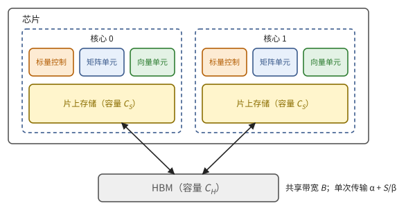
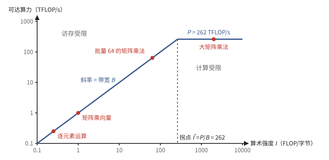
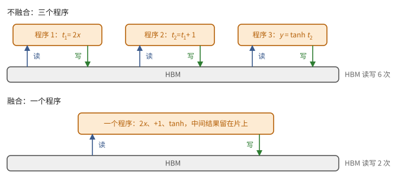
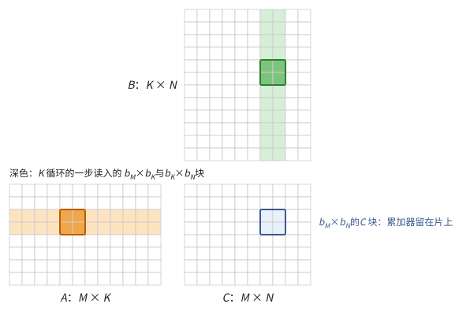
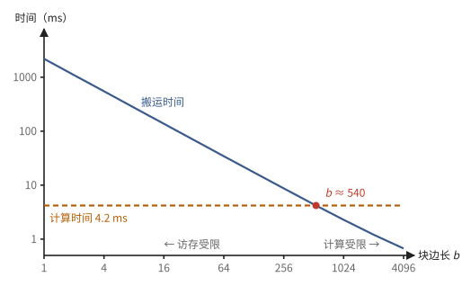
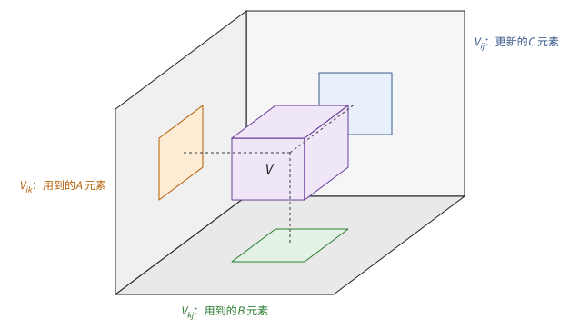
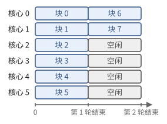
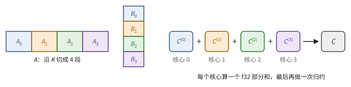

# 第 6 章　一颗芯片：屋顶线与数据复用

前五章给出了零件：运算单元、矩阵单元、各级存储、流水线、DMA。本章把它们组装成一颗芯片的抽象模型，并在这个模型上回答编程时最常问的问题：一个计算最快能多快？瓶颈在计算还是在搬运？矩阵乘法要怎样切块，才能让搬运不成为瓶颈，这样切是不是最好的？本章的结论是整本书的性能模型，之后每讲一个 kernel，都先用本章的方法估出它的上限。

6.1 节定义抽象芯片，并固定一颗参考芯片，本书第一、二部分的数值例子都在它上面计算。6.2 节从两个对照的计算出发，给出屋顶线：一个计算受限于计算还是受限于搬运，由一个比值决定。6.3 节讲访存受限的计算怎样优化。6.4 节是本章的中心，先列表算出不同的块大小下矩阵乘法的传输量，再求出最优的块形；6.5 节证明任何经典算法都不能比它少传输一个常数因子以上。最后三节把结论推广到多级存储（6.6 节）、一个维度很小的矩阵（6.7 节）和多个核心（6.8 节）。

> **在体系中的位置**：下层是第 3 章的存储层次与复用原则（定义 3.17、推论 3.16）、第 4 章的流水线与 DMA（命题 4.19）、第 5 章的矩阵单元。本章给出抽象芯片、屋顶线、矩阵乘法的分块理论与下界。第 7 章把它推广到多颗芯片；第 11 章用它分析 Transformer；两条路线的 kernel 章节（第 17、18、25、26 章）都从这里的估算开始。

## 6.1 抽象芯片

前五章的零件各有自己的代价模型。本节把它们组装成一颗抽象芯片（定义 6.1），并固定一颗参考芯片（例 6.2），算出它的峰值。

> **定义 6.1（抽象芯片）** 一颗抽象芯片由以下部分组成：
>
> - $p$ 个**核心**，每个核心有一个矩阵单元、一个向量单元、一个标量控制单元；
> - 每个核心有容量为 $C_S$ 的**片上存储**（SRAM，可以是便签存储也可以是缓存）；
> - 所有核心共享的**片外存储**（HBM），容量 $C_H$，带宽 $B$；
> - 在片外与片上存储之间搬运数据的机构（DMA 引擎或访存指令），单次传输的代价为 $\alpha + S/\beta$（命题 4.19）。
>
> 芯片的**峰值算力**是
>
> $$
> P = p \times (\text{每核心每周期的乘加数}) \times 2 \times f ,
> $$
>
> 其中 $f$ 是时钟频率。矩阵单元与向量单元的峰值相差很大，分别记作 $P_{\text{mat}}$ 和 $P_{\text{vec}}$。



**图 6.1**　抽象芯片（$p = 2$）。每个核心有自己的矩阵单元、向量单元、标量控制和片上存储；所有核心共享 HBM 及其带宽。

本书第一、二部分的例子都用下面这颗假想的芯片，它的数字与真实芯片的量级一致。

> **例 6.2（参考芯片 X）** 时钟 1 GHz；2 个核心；每个核心有 4 个 $128 \times 128$ 的 bf16 权重驻留阵列，每周期 $4 \times 16384 = 65536$ 次乘加；每个核心有 32 MiB 片上存储；HBM 容量 64 GB、带宽 $B = 1\ \text{TB/s}$。于是
>
> $$
> P_{\text{mat}} = 2 \times 65536 \times 2 \times 10^9 \approx 2.6 \times 10^{14}\ \text{FLOP/s}.
> $$
>
> 向量单元每核心每周期做 2048 次 f32 运算，$P_{\text{vec}} \approx 4.1 \times 10^{12}$ FLOP/s，只有矩阵单元的六十四分之一。

芯片 X 每秒能做 262 万亿次运算，而 HBM 每秒只能送来一万亿字节。下一节说明这两个数之比是整本书最重要的常数之一。

## 6.2 算术强度与屋顶线

一个计算在抽象芯片上要花多少时间？本节先在芯片 X 上算两个计算的时间（例 6.3）：一个全部时间花在搬运上，一个全部时间花在计算上。区分它们的是运算量与数据量之比（定义 6.4）。由此得到屋顶线（定理 6.5）：时间至少是计算时间与搬运时间中较大的那个；并按这个比值把计算分成访存受限与计算受限两类（定义 6.6），最后补上第三类：开销受限。

> **例 6.3（两个计算的时间账）** 在芯片 X 上：
>
> (a) 两个 $n = 2^{28}$ 元的 bf16 向量相加：$n$ 次加法，即 $2.7 \times 10^8$ 次运算；读两个向量、写一个，共 $6n \approx 1.6 \times 10^9$ 字节。用向量单元算要 $2.7 \times 10^8 / 4.1 \times 10^{12} \approx 65$ µs，搬运要 $1.6 \times 10^9 / 10^{12} = 1.6$ ms。
>
> (b) 两个 $8192 \times 8192$ 的 bf16 矩阵相乘：$2 \times 8192^3 \approx 1.1 \times 10^{12}$ 次运算；若每个矩阵只从 HBM 读写一次（此处暂且假定能做到，6.4 节说明怎样做到），共 $3 \times 8192^2 \times 2 \approx 4.0 \times 10^8$ 字节。用矩阵单元算要 $1.1 \times 10^{12} / 2.6 \times 10^{14} \approx 4.2$ ms，搬运只要 0.4 ms。
>
> 计算与搬运可以同时进行，所以 (a) 约 1.6 ms，几乎全花在搬运上；(b) 约 4.2 ms，几乎全花在计算上。

> **定义 6.4（算术强度）** 一个计算做 $F$ 次浮点运算，与片外存储之间传输 $Q$ 字节。它的**算术强度**（arithmetic intensity）是 $I = F / Q$（FLOP/字节）。

例 6.3 中 (a) 的强度是 $n / 6n \approx 0.17$，(b) 的强度约 $1.1 \times 10^{12} / 4.0 \times 10^8 \approx 2700$。

> **定理 6.5（屋顶线）** 在抽象芯片上，计算时间满足
>
> $$
> T \ge \max\!\left(\frac{F}{P},\ \frac{Q}{B}\right),
> $$
>
> 等价地，达到的算力不超过 $\min(P,\ I \cdot B)$。若计算与传输完全重叠，$T$ 接近这个下界；若二者完全不重叠，$T \approx F/P + Q/B$。

*证明* 计算单元每秒至多做 $P$ 次运算，片外存储每秒至多传输 $B$ 字节，两者都必须完成。算力 $F / T \le F / \max(F/P, Q/B) = \min(P, IB)$。∎

> **定义 6.6（拐点）** $I^* = P / B$ 称为屋顶线的**拐点**（ridge point）。$I < I^*$ 的计算称为**访存受限**（memory-bound），$I > I^*$ 的称为**计算受限**（compute-bound）。

参考芯片 X 的拐点是 $2.6 \times 10^{14} / 10^{12} = 262$ FLOP/字节。也就是说，每从 HBM 读一个字节，要做 262 次运算，矩阵单元才不会闲着。这与推论 3.16 用能耗得到的"每个数复用数百次"是同一件事。图 6.2 把定理 6.5 画成算力对强度的曲线，形状像一个屋顶，这是它名字的来由。



**图 6.2**　参考芯片 X 的屋顶线（双对数坐标）。拐点左边，可达算力等于强度乘以带宽，随强度线性上升；拐点右边，可达算力是峰值 $P$。红点是本章讨论的几种计算。

> **现状（2026-10）**：主流加速器的 bf16 拐点都在 200–600 FLOP/字节之间。例如 NVIDIA B200 约 $2.3 \times 10^{15} / 8 \times 10^{12} \approx 290$，Google TPU v7（Ironwood）的 fp8 峰值约 $4.6 \times 10^{15}$、HBM 约 $7.4 \times 10^{12}$ 字节/秒。拐点多年来保持在这个量级，甚至缓慢上升，因为算力增长快于带宽。

屋顶线不止一层：向量运算的屋顶是 $P_{\text{vec}}$，拐点只有 $4.1 \times 10^{12} / 10^{12} \approx 4$；片上存储的带宽也是一道屋顶（6.6 节）。

**第三种情形：开销受限。** 若计算很小，$F/P$ 和 $Q/B$ 都很小，时间由固定开销主导：启动一个程序、发起一次 DMA 的 $\alpha$、同步的等待。例如对 4 KB 的数据做一次逐元素运算，按带宽只要 4 ns，但启动一个程序常要几微秒。此时 $T \approx$ 固定开销的总和，减少调用次数（把小计算合并成大计算）才有用。

## 6.3 访存受限的计算：融合

访存受限的计算，时间等于字节数除以带宽，与算力无关。本节先看最典型的例子——逐元素运算（例 6.7），再说明连续的几个这样的运算应当合成一个（定义 6.8），以及这样做能省多少（命题 6.9、例 6.10）。

> **例 6.7（逐元素运算）** 对 $n$ 个 bf16 元素做 $y = \max(x, 0)$：$F = n$，$Q = 2n + 2n = 4n$（读 $x$、写 $y$），$I = 0.25$，远低于拐点。时间是 $4n / B$，与算力无关。对 $n = 2^{28}$，$Q = 1$ GiB，在参考芯片 X 上约 1.07 ms。

例 6.7 的时间全花在读写上。如果这样的运算接连做好几个，中间结果每次都写回 HBM 再读出，浪费就成倍增加。办法是：

> **定义 6.8（融合）** 把几个依次进行的运算合成一个程序，让中间结果留在片上而不写回片外存储，称为**融合**（fusion）。

> **命题 6.9** $k$ 个依次进行的逐元素运算，每个元素 $s$ 字节，不融合时传输 $2ksn$ 字节，融合后传输 $2sn$ 字节，时间缩短为 $1/k$（在访存受限时）。

*证明* 不融合时每个运算都读一次输入、写一次输出；融合后只读最初的输入、写最终的输出。∎

> **例 6.10** 在芯片 X 上对 $n = 2^{28}$ 个 bf16 元素算 $y = \tanh(2x + 1)$，这是三个逐元素运算（乘、加、tanh）。不融合时，三个程序各读写一次 1 GiB 的数据，共约 3.2 ms；融合成一个程序，中间结果 $2x$ 和 $2x + 1$ 只在片上存储（甚至寄存器）里停留，只读 $x$、写 $y$，约 1.07 ms（图 6.3）。



**图 6.3**　例 6.10 的两种做法。上：三个程序，每个都把结果写回 HBM、下一个再读出来；下：融合成一个程序，HBM 只被读写一次。

所以访存受限的计算，优化的方向不是减少运算，而是减少字节：融合、使用更窄的格式（第 2 章）。融合之后，有时又会变成受限于向量单元的算力（习题 6.2）。

## 6.4 矩阵乘法的分块

现在回答本章的中心问题：矩阵乘法要怎样切块，搬运才不成为瓶颈？本节先描述分块的算法，并对 $8192^3$ 的矩阵乘法列表算出不同块大小下的传输量（例 6.11）；然后写出一般的公式（命题 6.12），求出最优的块形（推论 6.13），得出几 MiB 的片上存储就足够的结论（推论 6.14）。

设片上存储能放 $\mathcal{M}$ 个字（用花体是为了与矩阵维度 $M$ 区分）。本节的传输量都以字计，乘以 $s$ 换成字节。

**不复用时**，每次乘加都从片外读 $A[i,k]$ 和 $B[k,j]$，$Q = 2MNK$ 字，$I = 2MNK / (2MNK \cdot s) = 1/s$，彻底访存受限。

**分块**：把 $C$ 切成 $b_M \times b_N$ 的块。对每个 $C$ 块，在片上保留它的累加器，沿 $K$ 方向每次读入 $A$ 的一个 $b_M \times b_K$ 块和 $B$ 的一个 $b_K \times b_N$ 块，乘加到累加器上；$K$ 方向走完后，把 $C$ 块写回一次（图 6.4）。$C$ 块的每个元素在片上被加了 $K$ 次；读入的每个 $A$ 元素被这个 $C$ 块的 $b_N$ 列用到，每个 $B$ 元素被 $b_M$ 行用到。块越大，每个读入的数用得越多。



**图 6.4**　分块矩阵乘法中的一个 $C$ 块（蓝色）。它需要 $A$ 的一个行条（浅橙）和 $B$ 的一个列条（浅绿）；$K$ 循环每一步读入其中深色的一对小块，乘加到片上的累加器。

> **例 6.11（块越大，搬运越少）** 在芯片 X 上算 $M = N = K = 8192$ 的 bf16 矩阵乘法，取正方形的 $C$ 块 $b_M = b_N = b$。按下面命题 6.12 的公式，传输量约为 $2MNK/b + MN$ 个字：
>
> | 块边长 $b$ | 传输量 | 搬运时间 | 算术强度 | 受限于 |
> | ---: | ---: | ---: | ---: | --- |
> | 1（不复用） | 2.2 TB | 2.2 s | 0.5 | 搬运 |
> | 16 | 138 GB | 138 ms | 8 | 搬运 |
> | 128 | 17.3 GB | 17.3 ms | 64 | 搬运 |
> | 512 | 4.4 GB | 4.4 ms | 248 | 二者相当 |
> | 1024 | 2.3 GB | 2.3 ms | 482 | 计算 |
> | 2048 | 1.2 GB | 1.2 ms | 910 | 计算 |
>
> 计算本身要 4.2 ms（例 6.3）。$b$ 每翻一倍，传输量约减半；$b$ 超过 500 左右，搬运时间就比计算短，矩阵乘法变成计算受限（图 6.5）。$b = 2048$ 时，片上要放 $2048^2$ 个 f32 累加器（16 MiB）和读入的小块，芯片 X 每核 32 MiB 的片上存储放得下。



**图 6.5**　例 6.11 的搬运时间（双对数坐标）。搬运时间与块边长成反比，与 4.2 ms 的计算时间交于 $b \approx 540$。

> **命题 6.12（分块的传输量）** 上述分块的片外传输量为
>
> $$
> Q = MNK\left(\frac{1}{b_N} + \frac{1}{b_M}\right) + MN \quad \text{（字）},
> $$
>
> 片上存储需要 $b_M b_N + b_K (b_M + b_N) \le \mathcal{M}$。

*证明* $A$ 的每个元素被每一列 $C$ 块读一次，共 $N / b_N$ 次，合计 $MK \cdot N/b_N$；$B$ 同理 $KN \cdot M / b_M$；$C$ 写一次。片上同时放着一个 $C$ 块和一对 $A$、$B$ 小块。∎

忽略 $MN$ 项，强度为

$$
I = \frac{2MNK}{sQ} \approx \frac{2 b_M b_N}{s (b_M + b_N)},
$$

只取决于块的形状，$b_M = b_N = b$ 时为 $b / s$。以后称它为**块的强度**：它也是单独一个 $C$ 块在 $K$ 循环中"运算量与读入量之比"。例 6.11 中 $s = 2$，强度约为 $b/2$。

片上存储有限，块的面积 $b_M b_N$ 受它限制。在面积固定时，什么形状最好？

> **推论 6.13（最优分块）** 当 $b_K$ 很小时，在约束 $b_M b_N \le \mathcal{M}$ 下，$Q$ 在 $b_M = b_N = \sqrt{\mathcal{M}}$ 时最小，
>
> $$
> Q \approx \frac{2MNK}{\sqrt{\mathcal{M}}} + MN, \qquad I \approx \frac{\sqrt{\mathcal{M}}}{s}\ \text{FLOP/字节}.
> $$

*证明* 由均值不等式，$\frac{1}{b_M} + \frac{1}{b_N} \ge \frac{2}{\sqrt{b_M b_N}} \ge \frac{2}{\sqrt{\mathcal{M}}}$，等号在 $b_M = b_N = \sqrt{\mathcal{M}}$ 时成立。$I = 2MNK / (sQ)$，忽略 $MN$ 项。∎

例如 $b_M b_N = 2^{20}$ 时，正方形 $1024 \times 1024$ 的 $\frac{2 b_M b_N}{b_M + b_N} = 1024$，换成 $4096 \times 256$ 的长条只有 $\frac{2 \cdot 2^{20}}{4352} \approx 482$，强度不到正方形的一半。算术强度随片上容量的**平方根**增长。参考芯片 X 每核 32 MiB，bf16 下约 $1.6 \times 10^7$ 个字，$\sqrt{\mathcal{M}} \approx 4000$，可达的强度约 2000 FLOP/字节，远超拐点 262。反过来，要达到拐点只需 $\sqrt{\mathcal{M}} / 2 \ge 262$，即 $\mathcal{M} \ge 2.7 \times 10^5$ 个字，约 0.5 MiB。

> **推论 6.14** 只要矩阵的三个维度都足够大，几 MiB 的片上存储就足以让矩阵乘法计算受限。

*证明* 由推论 6.13，强度约 $\sqrt{\mathcal{M}}/s$；主流芯片的拐点在几百（定理 6.5 之后的现状框），$\sqrt{\mathcal{M}}/s \ge 600$ 只需 $\mathcal{M} \ge (600 s)^2$ 个字，bf16 时约 1.4 M 个字，不到 3 MiB。三个维度都要至少有 $\sqrt{\mathcal{M}}$ 那么大，块才能取到这个大小。∎

## 6.5 传输量的下界

6.4 节的正方形分块是最好的分块，但会不会有完全不同的、更聪明的执行顺序，传输得更少？本节证明不会：任何经典的矩阵乘法算法，传输量都至少是 $MNK/\sqrt{\mathcal{M}}$ 的常数倍（定理 6.16）。证明的关键是一个关于三维点集及其三个投影的不等式（引理 6.15），先用两个例子看它说的是什么。

把一次乘加 $C[i,j] \mathrel{+}= A[i,k] B[k,j]$ 看作三维整点 $(i, j, k)$。一组乘加 $V$ 要用到的 $A$ 的元素，是 $V$ 在 $(i,k)$ 平面上的投影；用到的 $B$ 的元素和更新的 $C$ 的元素，分别是在 $(k,j)$ 和 $(i,j)$ 平面上的投影。$V$ 是一个 $b \times b \times b$ 的立方体时，$\lvert V \rvert = b^3$，三个投影各有 $b^2$ 个点：$b^3$ 次乘加只用到 $3b^2$ 个数。$V$ 是一根沿 $k$ 方向、长为 $b$ 的线时，$\lvert V \rvert = b$，投影的大小是 $b$、$b$、$1$：$b$ 次乘加用到 $2b + 1$ 个数。前者正是分块的做法。能不能找到投影更小、点更多的集合？

> **引理 6.15（Loomis–Whitney）** 对有限集 $V \subset \mathbb{Z}^3$，记 $V_{ij}, V_{ik}, V_{kj}$ 为它在三个坐标平面上的投影，则
>
> $$
> \lvert V \rvert^2 \le \lvert V_{ij} \rvert \cdot \lvert V_{ik} \rvert \cdot \lvert V_{kj} \rvert .
> $$

上面两个例子中等号都成立：$b^6 = b^2 \cdot b^2 \cdot b^2$，$b^2 = b \cdot b \cdot 1$。

*证明* 按 $k$ 把 $V$ 切成薄片：$V^k = \{(i, j) : (i, j, k) \in V\}$。记 $a_k$ 为 $V_{ik}$ 中第二个坐标为 $k$ 的点数，$c_k$ 为 $V_{kj}$ 中第一个坐标为 $k$ 的点数，则 $\sum_k a_k = \lvert V_{ik} \rvert$，$\sum_k c_k = \lvert V_{kj} \rvert$。薄片 $V^k$ 的点的 $i$ 坐标至多 $a_k$ 种、$j$ 坐标至多 $c_k$ 种，所以 $\lvert V^k \rvert \le a_k c_k$；又 $V^k \subset V_{ij}$，所以 $\lvert V^k \rvert \le \lvert V_{ij} \rvert$。于是 $\lvert V^k \rvert \le \sqrt{\lvert V_{ij} \rvert\, a_k c_k}$，对 $k$ 求和并用 Cauchy–Schwarz 不等式：

$$
\lvert V \rvert = \sum_k \lvert V^k \rvert \le \sqrt{\lvert V_{ij} \rvert} \sum_k \sqrt{a_k c_k} \le \sqrt{\lvert V_{ij} \rvert} \sqrt{\textstyle\sum_k a_k} \sqrt{\textstyle\sum_k c_k} = \sqrt{\lvert V_{ij} \rvert\, \lvert V_{ik} \rvert\, \lvert V_{kj} \rvert}.
$$

两边平方即得。∎

引理 6.15 说：三个投影都不大的集合，自己也不能大。片上只能放 $\mathcal{M}$ 个数，一段时间内能做的乘加也就有限。

> **定理 6.16（矩阵乘法的传输下界）** 在片上容量为 $\mathcal{M}$ 个字的机器上，用经典算法（逐一完成全部 $MNK$ 次乘加，不做重复计算）计算 $C = AB$，片外传输量至少为
>
> $$
> Q \ge \frac{MNK}{2\sqrt{2}\, \sqrt{\mathcal{M}}} - \mathcal{M} \quad \text{（字）}.
> $$

*证明* 把执行过程按传输次数切成若干段，每段恰好 $\mathcal{M}$ 次传输（最后一段可以更少）。考虑一段中执行的乘加集合 $V \subset [M] \times [N] \times [K]$。这一段用到的 $A$ 的元素，要么在段开始时已在片上（至多 $\mathcal{M}$ 个），要么在段内读入（至多 $\mathcal{M}$ 个），所以 $\lvert V_{ik} \rvert \le 2\mathcal{M}$；同理 $\lvert V_{kj} \rvert \le 2\mathcal{M}$。这一段更新的 $C$ 的部分和，在段结束时要么仍在片上（至多 $\mathcal{M}$ 个），要么在段内写出（至多 $\mathcal{M}$ 个），所以 $\lvert V_{ij} \rvert \le 2\mathcal{M}$。由引理 6.15，$\lvert V \rvert \le (2\mathcal{M})^{3/2}$。全部 $MNK$ 次乘加至少需要 $MNK / (2\mathcal{M})^{3/2}$ 段，除最后一段外每段有 $\mathcal{M}$ 次传输，故

$$
Q \ge \mathcal{M}\left(\frac{MNK}{(2\mathcal{M})^{3/2}} - 1\right) = \frac{MNK}{2\sqrt{2}\sqrt{\mathcal{M}}} - \mathcal{M}.
$$

∎



**图 6.6**　定理 6.16 的证明思路。一段时间内执行的乘加组成三维的点集 $V$（紫色），它用到的 $A$、$B$ 元素和更新的 $C$ 元素，正是 $V$ 在三个坐标平面上的投影。片上只放得下有限个元素，三个投影都不能大，由引理 6.15，$V$ 也就不能大。

> **注 6.17** 定理 6.16 的常数并不紧。Smith 等人（2017）证明了紧的主项 $2MNK/\sqrt{\mathcal{M}}$，正好等于推论 6.13 的分块所达到的传输量。所以**正方形分块在主项上是最优的**。这个结论只对经典算法成立；Strassen 一类算法用加法换乘法，但数值稳定性和与矩阵单元的配合都不好，加速器上不用。

## 6.6 多级分块

存储层次有多级（定义 3.17）：HBM、片上 SRAM、寄存器（或矩阵单元的操作数缓冲）。6.4 节只考虑了 HBM 与片上存储之间的一级。本节说明同样的分析可以逐级进行，每一级都有一道屋顶线（命题 6.18），并在芯片 X 上逐级检查一次（例 6.19）。

推论 6.13 对任意相邻的两级都成立：第 $\ell$ 级与上一级之间的传输量约为 $2MNK / \sqrt{C_\ell}$，其中 $C_\ell$ 是第 $\ell$ 级的容量（以字计）。每一级的传输都要在总时间内完成，于是：

> **命题 6.18（逐级的屋顶线）** 矩阵乘法在每一级都必须满足
>
> $$
> \frac{2MNK\, s}{\sqrt{C_\ell}\, B_\ell} \le T ,
> $$
>
> 其中 $B_\ell$ 是第 $\ell$ 级与上一级之间的带宽。只要有一级不满足 $\sqrt{C_\ell} / s \gtrsim P / B_\ell$，那一级就是瓶颈。

*证明* 第 $\ell$ 级要接收约 $2MNK s / \sqrt{C_\ell}$ 字节（推论 6.13，以第 $\ell$ 级的容量代替 $\mathcal{M}$），带宽为 $B_\ell$。计算受限即 $T \approx 2MNK / P$，代入整理即得第二个条件。∎

> **例 6.19（芯片 X 的三级）** 设芯片 X 的每个核心另有 256 KiB 的寄存器（含矩阵单元的操作数缓冲），片上存储到寄存器的带宽为每核 8 TB/s。一个核心的峰值 $P = 1.3 \times 10^{14}$ FLOP/s，逐级检查 bf16 矩阵乘法：
>
> | 级 | 容量（字） | $\sqrt{C_\ell}/s$ | 带宽 $B_\ell$ | 需要的强度 $P / B_\ell$ | 是否满足 |
> | --- | ---: | ---: | ---: | ---: | --- |
> | 片上存储 ← HBM | $1.6 \times 10^7$ | 约 2000 | 0.5 TB/s（两核共享 1 TB/s） | 262 | 满足 |
> | 寄存器 ← 片上存储 | $1.3 \times 10^5$ | 约 180 | 8 TB/s | 16 | 满足 |
>
> 两级都有余量。若片上存储到寄存器的带宽只有 0.5 TB/s，需要的强度就是 262，而寄存器一级只能提供约 180，瓶颈就转移到了这一级：HBM 再快也没用。

容量小的级（寄存器）带宽极大，容量大的级（HBM）带宽小。设计一颗芯片，就是让每一级的 $\sqrt{C_\ell} \cdot B_\ell$ 都跟得上 $P$；写一个矩阵乘法程序，就是为每一级选出合适的块大小。

## 6.7 矩阵的形状

推论 6.14 要求三个维度都足够大。神经网络中常见的情形是有一个维度很小：$C = AB$ 中 $A$ 是 $M \times K$ 的权重，$B$ 是 $K \times N$ 的输入，$N$ 是一次处理的样本数（批量大小）。本节算出这时的算术强度（命题 6.20），列出不同批量下的可达算力（例 6.21），由此得出小批量时"权重的字节数就是时间"。

> **命题 6.20（小批量的矩阵乘法）** 当 $N \ll M, K$ 时，$Q \approx s\,MK$（权重读一次），算术强度为
>
> $$
> I \approx \frac{2MNK}{s\,MK} = \frac{2N}{s} .
> $$
>
> 它要计算受限，需要 $N \ge s I^* / 2$。

*证明* $Q = s(MK + KN + MN) = sMK\,(1 + N/M + N/K)$，在 $N \ll M, K$ 时约等于 $sMK$。∎

> **例 6.21（批量与算力）** 在芯片 X 上，一个 $8192 \times 8192$ 的 bf16 权重矩阵乘以 $N$ 个输入向量。$s = 2$，强度约 $N$：
>
> | 批量 $N$ | 强度 | 可达算力（TFLOP/s） | 占峰值 |
> | ---: | ---: | ---: | ---: |
> | 1 | 1 | 1 | 0.4% |
> | 16 | 16 | 16 | 6% |
> | 64 | 64 | 64 | 24% |
> | 256 | 256 | 256 | 98% |
> | 1024 | 1024 | 262（峰值） | 100% |
>
> 读一次权重（128 MiB）要 134 µs。$N \le 256$ 时，无论 $N$ 是多少，时间都约是这 134 µs：矩阵单元在大部分时间里等数据。

在参考芯片 X 上，bf16 权重要求 $N \ge 262$。$N = 1$（矩阵乘向量）时只用到矩阵单元算力的 $1/262$，时间完全由读权重决定。由此得到两条实用结论：

- 小批量时，**权重的字节数就是时间**。把权重量化成 int8 或 fp8（$s = 1$）、fp4（$s = 1/2$），时间按比例缩短，与矩阵单元是否支持这种格式的乘法无关。
- 要用满矩阵单元，就要把足够多的样本攒在一起处理。第 11 章会看到，这是语言模型推理的核心矛盾。

## 6.8 多核心：并行分解

到此为止都把芯片当作一个整体。有 $p$ 个核心时，还要把工作分给它们。本节讨论两种分法：按输出分块，它的损失来自波次量化（命题 6.22）；沿 $K$ 方向切分，它的代价是部分和的归约（例 6.23）。

**按输出分块。** 把 $C$ 的块分给各核心，每个核心独立完成自己的块。没有核心之间的通信，但每个核心都要读它所需的 $A$ 行和 $B$ 列；共享的 HBM 带宽被所有核心分摊。

**波次量化。** 若 $C$ 共有 $t$ 个块，$p$ 个核心按轮次处理，每轮每个核心做一块，需要 $\lceil t / p \rceil$ 轮。最后一轮可能只有少数核心有活干。

> **命题 6.22** 按输出分块时，核心的平均利用率为 $\dfrac{t}{p \lceil t/p \rceil}$。

*证明* 共 $p \lceil t/p \rceil$ 个"核心·轮"，其中 $t$ 个在工作。∎

例如 $t = 140$、$p = 132$ 时要两轮，第二轮只有 8 个核心有活干，利用率 $140/264 \approx 53\%$。图 6.7 是一个更小的例子。



**图 6.7**　8 个块分给 6 个核心：第二轮只有 2 个核心有活，利用率 $8/12 \approx 67\%$。

块数恰好是核心数的整数倍时最好；块数远多于核心数时，最后一轮的浪费可以忽略。

**沿 $K$ 方向切分（split-K）。** 当 $M$ 和 $N$ 都小、$K$ 很大时，$C$ 只有很少几个块，不够分给所有核心。这时把 $K$ 切成 $p$ 段，每个核心算一个部分和 $C^{(r)} = A_{:, K_r} B_{K_r, :}$，最后求和 $C = \sum_r C^{(r)}$（图 6.8）。代价是额外写出和读入 $p$ 份 f32 部分和（$2 \times 4pMN$ 字节），以及一次归约（命题 1.38）。与读 $A$、$B$ 的 $sK(M + N)$ 字节相比，只要 $sK(M + N) \gg 8pMN$，这个代价就可以忽略。



**图 6.8**　沿 $K$ 切分：$A$ 的第 $r$ 段乘 $B$ 的第 $r$ 段，得到部分和 $C^{(r)}$，再把各部分和相加。

> **例 6.23** 在 4 个核心上算 $M = N = 128$、$K = 65536$ 的 bf16 矩阵乘法。按输出分块，$128 \times 128$ 的 $C$ 只有一块，只能给一个核心，其余三个闲着。沿 $K$ 切成 4 段，每个核心算一个 $128 \times 128 \times 16384$ 的部分和：读 $A$、$B$ 共 $2 \times 2 \times 128 \times 65536 = 32$ MiB，部分和的额外传输 $8 \times 4 \times 128^2 = 0.5$ MiB，只占 1.6%，却让 4 个核心都有活干。

## 接口小结

1. 抽象芯片：$p$ 个核心（矩阵单元、向量单元、控制单元、片上存储 $C_S$）共享 HBM（带宽 $B$）。峰值算力 $P = p \times \text{每周期乘加数} \times 2 \times f$；向量单元的峰值远低于矩阵单元。（定义 6.1、例 6.2）
2. 屋顶线：$T \ge \max(F/P, Q/B)$，拐点 $I^* = P/B$，主流加速器在 200–600 FLOP/字节。很小的计算受固定开销限制。（定理 6.5、定义 6.6、6.2 节）
3. 访存受限时，优化的是字节：融合、更窄的格式；$k$ 个逐元素运算融合后时间缩短为 $1/k$。（定义 6.8、命题 6.9）
4. 矩阵乘法按 $\sqrt{\mathcal{M}} \times \sqrt{\mathcal{M}}$ 分块，传输量约 $2MNK/\sqrt{\mathcal{M}}$ 字，算术强度约 $\sqrt{\mathcal{M}}/s$；块越大搬运越少，几 MiB 片上存储就足以计算受限。（命题 6.12、推论 6.13、6.14，例 6.11）
5. 经典矩阵乘法的传输量下界是 $\Omega(MNK/\sqrt{\mathcal{M}})$，正方形分块在主项上最优；证明依据 Loomis–Whitney 不等式。（引理 6.15、定理 6.16、注 6.17）
6. 多级存储逐级检查屋顶线：每一级都要 $\sqrt{C_\ell}/s \gtrsim P/B_\ell$。（命题 6.18、例 6.19）
7. 小批量矩阵乘法的强度约 $2N/s$；$N < sI^*/2$ 时时间由权重字节数决定。（命题 6.20、例 6.21）
8. 多核心按输出分块，注意波次量化；$M, N$ 小而 $K$ 大时沿 $K$ 切分，代价是部分和的传输与归约。（命题 6.22、例 6.23）

## 习题

**习题 6.1** ★ 在参考芯片 X 上，判断下列计算是计算受限还是访存受限，并估出时间下界：(a) $4096 \times 4096$ 乘 $4096 \times 4096$ 的 bf16 矩阵乘法（假定每个矩阵只读写一次）；(b) 对 $10^8$ 个 bf16 元素做 softmax，每个元素约 5 次向量运算，读写各一次；(c) $16384 \times 16384$ 的 bf16 矩阵乘一个向量。

<details><summary>提示</summary>

算出 $F$ 和 $Q$，比较 $F/P$ 与 $Q/B$。(b) 用向量单元的峰值 $P_{\text{vec}}$。

</details>
<details><summary>答案</summary>

(a) $F = 2 \times 4096^3 \approx 1.37 \times 10^{11}$，$Q = 3 \times 4096^2 \times 2 \approx 1.0 \times 10^8$ 字节，$I \approx 1370 > 262$，计算受限，时间约 $1.37 \times 10^{11} / 2.6 \times 10^{14} \approx 0.53$ ms。

(b) $F = 5 \times 10^8$，$Q = 4 \times 10^8$ 字节。$F / P_{\text{vec}} \approx 0.12$ ms，$Q/B = 0.4$ ms，访存受限，约 0.4 ms。

(c) $F = 2 \times 16384^2 \approx 5.4 \times 10^8$，$Q \approx 2 \times 16384^2 \approx 5.4 \times 10^8$ 字节，$I \approx 1$，访存受限，约 0.54 ms，矩阵单元几乎完全空闲。

</details>

**习题 6.2** ★ 在参考芯片 X 上对 $n = 2^{28}$ 个 bf16 元素依次做三个逐元素运算 $y = \tanh(2x + 1)$（乘、加、tanh）。(a) 不融合时需要多少时间？(b) 融合后呢？(c) 若向量单元算 tanh 要 20 次运算，融合后是计算受限还是访存受限？

<details><summary>提示</summary>

(a)(b) 命题 6.9；(c) 比较 $F/P_{\text{vec}}$ 与 $Q/B$。

</details>
<details><summary>答案</summary>

(a) 三个运算各读写 $4n$ 字节，共 $12n = 3$ GiB，约 3.2 ms。(b) $4n = 1$ GiB，约 1.07 ms。(c) $F \approx 22n \approx 5.9 \times 10^9$，$F/P_{\text{vec}} \approx 1.4$ ms，大于 1.07 ms，变成了向量单元受限。融合之后，逐元素运算也可能受限于向量单元，而不是带宽。

</details>

**习题 6.3** ★ 参考芯片 X 的一个核心有 32 MiB 片上存储。分块矩阵乘法中，$A$、$B$ 块为 bf16，$C$ 的累加器为 f32，$b_K = 512$，且 $A$、$B$ 的块都要双缓冲（各存两份）。取 $b_M = b_N = b$，$b$ 最大能取多少（取 128 的倍数）？此时算术强度是多少？

<details><summary>提示</summary>

片上存储：$4b^2 + 2 \times (2 \times 512 b \times 2)$ 字节 $\le 32$ MiB。强度用命题 6.12 计算：每个 $C$ 块的 $K$ 循环读 $2 \times 2 b K$ 字节，做 $2b^2K$ 次运算。

</details>
<details><summary>答案</summary>

约束 $4b^2 + 4096 b \le 33554432$。$b = 2432$ 时 $4b^2 \approx 2.37 \times 10^7$，$4096 b \approx 1.0 \times 10^7$，合计约 $3.37 \times 10^7$，略超；$b = 2304$ 时合计约 $3.07 \times 10^7$，满足。强度 $\approx 2b^2K / (4bK) = b/2 \approx 1150$ FLOP/字节，远超拐点 262。实际中块不必这么大：$b \ge 524$ 就已经计算受限，剩下的片上存储可以留给更深的流水线或其他数据。

</details>

**习题 6.4** ★ 片上存储只够放 $b_M b_N = 2^{18}$ 个累加器。比较 $b_M = b_N = 512$ 与 $b_M = 2048$、$b_N = 128$ 两种块形的强度（bf16）。哪一种更好？好多少？

<details><summary>提示</summary>

块的强度 $\frac{2 b_M b_N}{s(b_M + b_N)}$。

</details>
<details><summary>答案</summary>

正方形：$\frac{2 \cdot 2^{18}}{2 \cdot 1024} = 256$。长条：$\frac{2 \cdot 2^{18}}{2 \cdot 2176} \approx 120$。正方形好约 2.1 倍，与推论 6.13 一致：面积相同时，周长越小，读入的边越少。

</details>

**习题 6.5** ★ 对 $M = N = K = 8192$、$\mathcal{M} = 1.6 \times 10^7$ 个字，分别计算定理 6.16 的下界、注 6.17 的紧下界主项和推论 6.13 的分块传输量（以字计）。

<details><summary>提示</summary>

$\sqrt{\mathcal{M}} = 4000$，$8192^3 \approx 5.5 \times 10^{11}$。

</details>
<details><summary>答案</summary>

定理 6.16：$5.5 \times 10^{11} / (2.83 \times 4000) - 1.6 \times 10^7 \approx 4.9 \times 10^7 - 1.6 \times 10^7 \approx 3.3 \times 10^7$。紧主项：$2 \times 5.5 \times 10^{11} / 4000 \approx 2.7 \times 10^8$。分块：同为约 $2.7 \times 10^8$，加上 $MN \approx 6.7 \times 10^7$。定理 6.16 的常数差了约 8 倍，但量级正确；紧下界说明分块已经最优。

</details>

**习题 6.6** ☆ (a) 对 $V = \{(0,0,0), (1,1,1)\}$ 验证引理 6.15，等号成立吗？(b) 设一段时间内片上始终只放得下三个 $b \times b$ 的块（共 $3b^2$ 个字），并且这段时间不读写片外存储。用引理 6.15 说明这段时间至多做 $b^3$ 次乘加，并说明怎样恰好做到。

<details><summary>提示</summary>

(b) 不读写片外存储时，用到的 $A$、$B$ 元素和更新的 $C$ 元素都在片上：三个投影的大小之和不超过 $3b^2$。在和固定时，乘积何时最大？

</details>
<details><summary>答案</summary>

(a) $\lvert V \rvert = 2$，三个投影各有 2 个点，$4 \le 8$，等号不成立：这两次乘加没有共用任何操作数。

(b) 设三个投影的大小为 $x, y, z$，$x + y + z \le 3b^2$。由均值不等式 $xyz \le b^6$，由引理 6.15 $\lvert V \rvert \le \sqrt{xyz} \le b^3$。片上放 $A$、$B$、$C$ 各一个 $b \times b$ 块，做这两块之间的全部 $b^3$ 次乘加，就恰好达到。

</details>

**习题 6.7** ★ 一颗芯片每核心峰值 $P = 2 \times 10^{14}$ FLOP/s，片上存储每核 16 MiB、从 HBM 分得 1 TB/s，寄存器每核 128 KiB、从片上存储得到 4 TB/s。用命题 6.18 逐级检查 bf16 矩阵乘法，哪一级是瓶颈？

<details><summary>提示</summary>

两级的 $\sqrt{C_\ell}/s$ 与 $P/B_\ell$ 分别是多少？容量要换成字数。

</details>
<details><summary>答案</summary>

片上存储：$C = 8 \times 2^{20}$ 个字，$\sqrt{C}/s \approx 2896/2 \approx 1450$；需要 $P/B = 200$，满足。寄存器：$C = 65536$ 个字，$\sqrt{C}/s = 128$；需要 $2 \times 10^{14} / 4 \times 10^{12} = 50$，满足。两级都满足，矩阵乘法可以计算受限。若寄存器带宽只有 1 TB/s，需要 200 > 128，寄存器一级就成了瓶颈。

</details>

**习题 6.8** ★ 在参考芯片 X 上，一个 $8192 \times 8192$ 的 bf16 权重矩阵乘以 $N$ 个输入向量。(a) $N = 1$ 时需要多少时间？(b) $N$ 多大时计算时间与读权重的时间相等？(c) 权重改为 int8 存储（计算时转回 bf16），(a)(b) 的答案变成多少？

<details><summary>提示</summary>

读权重 $2 \times 8192^2$ 字节；计算 $2 \times 8192^2 N$ FLOP。

</details>
<details><summary>答案</summary>

(a) 权重 128 MiB，$1.34 \times 10^8 / 10^{12} \approx 134$ µs；计算只要 $1.34 \times 10^8 / 2.6 \times 10^{14} \approx 0.5$ µs。(b) $2 \times 8192^2 N / P = 2 \times 8192^2 / B$，$N = P/B = 262$。(c) 读权重减半，约 67 µs；平衡点变为 $N = 131$。小批量时，量化直接按比例缩短时间。

</details>

**习题 6.9** ★ 一颗芯片有 132 个核心。输出矩阵 $8192 \times 8192$，块大小 $256 \times 128$ 时有多少个块？需要几轮？利用率是多少？改用 $256 \times 256$ 的块呢？

<details><summary>提示</summary>

命题 6.22。

</details>
<details><summary>答案</summary>

$256 \times 128$：$32 \times 64 = 2048$ 个块，$\lceil 2048/132 \rceil = 16$ 轮，利用率 $2048 / 2112 \approx 97\%$。$256 \times 256$：$32 \times 32 = 1024$ 个块，8 轮，利用率 $1024/1056 \approx 97\%$。两者差不多。但若输出是 $2304 \times 2048$、块 $256 \times 128$，共 $9 \times 16 = 144$ 个块，要 2 轮，利用率只有 $144/264 \approx 55\%$；改用 $128 \times 128$ 的块得 288 个块、3 轮，利用率 $288/396 \approx 73\%$。一般原则：块数远大于核心数，或恰为核心数的整数倍。

</details>

**习题 6.10** ★ 计算 $C = AB$，$M = N = 64$，$K = 2^{20}$，bf16，在 2 个核心上。(a) 按输出分块能用上几个核心？(b) 改用 split-K 分成 2 段，额外的部分和传输是多少字节？与读 $A$、$B$ 的字节数相比如何？

<details><summary>提示</summary>

$C$ 只有一个 $64 \times 64$ 的块。部分和是 f32。

</details>
<details><summary>答案</summary>

(a) 一个块只能给一个核心，另一个核心闲置。(b) 两份 f32 部分和写出再读入：$2 \times 2 \times 64 \times 64 \times 4 = 131072$ 字节。读 $A$、$B$ 共 $2 \times 64 \times 2^{20} \times 2 = 2.7 \times 10^8$ 字节。额外开销不到 0.05%，split-K 让速度几乎翻倍。

</details>

**习题 6.11** ★（审查题）AI 写了一个分块矩阵乘法，伪代码如下（$C$ 在片外存储中）。估算它的片外传输量，指出问题并给出修改。

```text
for i0 in range(0, M, bM):
  for j0 in range(0, N, bN):
    for k0 in range(0, K, bK):
      a = load(A[i0:i0+bM, k0:k0+bK])
      b = load(B[k0:k0+bK, j0:j0+bN])
      c = load(C[i0:i0+bM, j0:j0+bN])
      c = c + a @ b
      store(C[i0:i0+bM, j0:j0+bN], c)
```

<details><summary>提示</summary>

数一数 $C$ 的每个元素被读写了几次。

</details>
<details><summary>答案</summary>

$C$ 块在每一步 $k_0$ 都被读一次、写一次，共 $K/b_K$ 次，$C$ 的传输量为 $2MN \cdot K/b_K$ 个字，而且若 $C$ 以 bf16 存储，还会有例 2.18 那样的精度问题。修改：在 $k_0$ 循环之前把累加器 $c$ 初始化为 f32 的零，留在片上；$k_0$ 循环结束后写回一次。这样 $C$ 只写 $MN$ 个字，传输量回到命题 6.12。

</details>

**习题 6.12** ☆ 证明：若只允许 $b_M = b_N = b$ 且 $b_K = b$（立方块），片上要放三个 $b \times b$ 块，最优的 $b$ 和传输量是多少？与推论 6.13 比较。

<details><summary>提示</summary>

$3b^2 \le \mathcal{M}$。

</details>
<details><summary>答案</summary>

$b = \sqrt{\mathcal{M}/3}$，$Q \approx 2MNK / b = 2\sqrt{3}\, MNK / \sqrt{\mathcal{M}}$，比推论 6.13 多 $\sqrt{3} \approx 1.73$ 倍。原因是 $A$、$B$ 的块占用了本可以给 $C$ 块的空间。取小的 $b_K$、把空间留给 $C$ 块更好。

</details>
