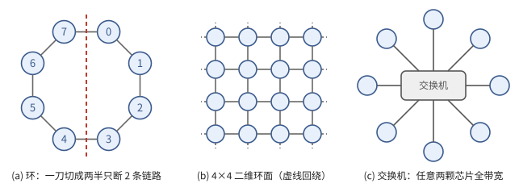
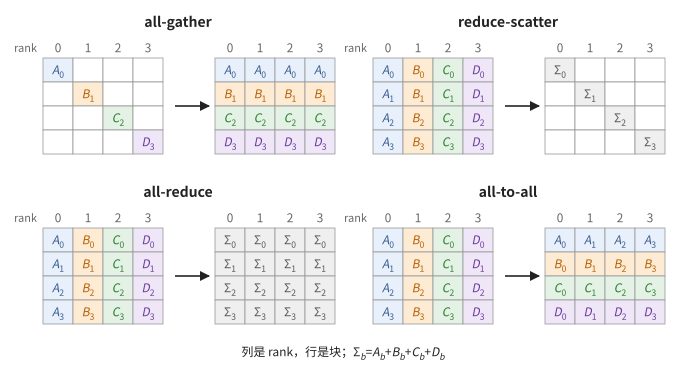
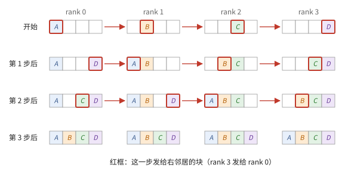
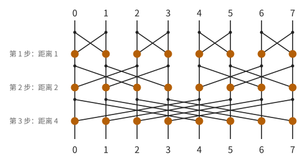
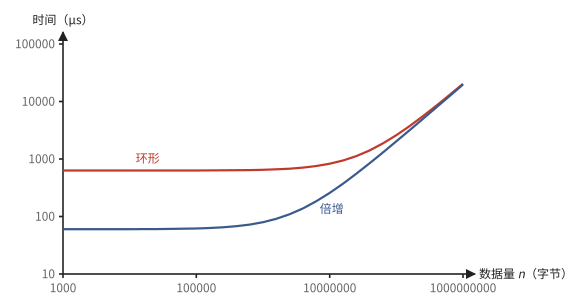
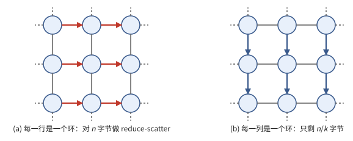
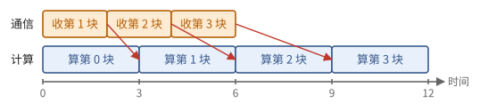
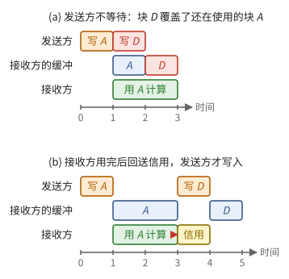

# 第 7 章　多颗芯片：互联与集合通信

一颗芯片的存储放不下大模型，算力也不够在可接受的时间内训练它，于是要把许多芯片连起来。本章回答：芯片之间怎样连接？多颗芯片一起完成一次求和、一次收集，需要多少时间？有没有下界，什么算法能达到它？

7.1 节给出一条链路的模型，7.2 节讲由链路组成的拓扑，以及衡量拓扑通信能力的二分带宽。7.3 节用一个具体的数值例子定义集合操作，7.4 节给出它们的带宽下界。接下来的三节讲达到或接近下界的算法：7.5 节的环形算法用满带宽，7.6 节的倍增算法减少步数，7.7 节把环形算法推广到多维环面。7.8 节说明通信怎样与计算重叠，7.9 节说明跨芯片的数据由谁搬运、双方怎样同步。

> **在体系中的位置**：下层是第 4 章的 α–β 传输模型与完成计数器（命题 4.19、定义 4.18）、第 6 章的抽象芯片，以及第 1 章的归约（命题 1.38）。本章给出链路、拓扑、集合操作的定义、算法与代价。第 12 章用它分析各种并行策略；第 14 章的 JAX 集合原语、第 19 章的 TPU 多芯片编程、第 27 章的多 GPU 编程都是本章的具体实现。

## 7.1 链路

两颗芯片之间怎样传数据？本节给出一条链路的模型（定义 7.1），用两次传输的例子说明它的两个参数各在什么时候起作用（例 7.2），并与片上的 HBM 比较。

> **定义 7.1（链路）** 两颗芯片之间的**链路**（link）是双向的点对点连接，每个方向的带宽为 $\beta$，延迟为 $\alpha$。通过一条链路发送 $m$ 字节需要 $\alpha + m/\beta$。一颗芯片的所有链路可以同时收发。

这与第 4 章的单次拷贝（命题 4.19）是同一个模型：$\alpha$ 是与数据量无关的固定开销，$m/\beta$ 是与数据量成正比的部分。

> **例 7.2** 设一条链路 $\beta = 100$ GB/s、$\alpha = 5$ µs。发送 1 GB 要 $5\ \mu\text{s} + 10\ \text{ms} \approx 10$ ms，几乎全是带宽项；发送 8 KB 要 $5\ \mu\text{s} + 0.08\ \mu\text{s} \approx 5$ µs，几乎全是固定开销。同样 1 GB 的数据，从 3 TB/s 的 HBM 读出只要 0.33 ms，是走链路的三十分之一。

芯片之间的链路带宽通常比 HBM 带宽小一到两个数量级（每秒几十到几百 GB，对每秒数 TB），所以多芯片程序的首要问题是少传输，以及让传输与计算重叠（7.8 节）。

## 7.2 拓扑与二分带宽

许多芯片用许多条链路连起来，连法就是拓扑。本节定义拓扑与衡量它的通信能力的二分带宽（定义 7.3），在三种常见的拓扑上算出它（例 7.4），并证明二分带宽给"每颗芯片都要与其余每颗芯片交换数据"的通信定下了时间下界（命题 7.5）。

> **定义 7.3（拓扑与二分带宽）** 芯片与链路组成的图称为**拓扑**（topology）。从一颗芯片到另一颗芯片最少要经过的链路数称为它们的距离（跳数），所有距离的最大值称为拓扑的**直径**。把芯片分成数量相等的两半，穿过这个划分的链路在一个方向上的总带宽，对所有划分取最小值，称为**二分带宽**（bisection bandwidth）。

二分带宽量的是拓扑最窄的"腰"：两半之间无论怎样通信，每秒至多能送过去这么多字节。常见的三种拓扑如图 7.1。

**图 7.1**　三种拓扑。(a) 8 颗芯片的环，红色虚线把它分成两半，只切断 2 条链路，所以二分带宽是 $2\beta$；(b) 二维环面，每一行、每一列都首尾相接；(c) 所有芯片接到一台交换机。

> **例 7.4（三种拓扑的二分带宽）**
>
> (a) **环**：8 颗芯片排成一圈，每颗连着左右两个邻居。任何把它分成两半的切法都至少切断 2 条链路，从正中切开恰好 2 条，二分带宽是 $2\beta$。最远的两颗芯片隔着 4 跳。
>
> (b) **环面**（torus）：$4 \times 4$ 的网格，每一行、每一列都首尾相接成环，芯片 $(x, y)$ 与 $(x \pm 1, y)$、$(x, y \pm 1)$（坐标模 4）相连。在第 1、2 列之间竖着切一刀，4 行中每一行的环都被切断两处（一处在中间，一处在回绕的地方），共 8 条链路，二分带宽是 $8\beta$。最远的两颗芯片隔着 $2 + 2 = 4$ 跳。
>
> (c) **交换机**：16 颗芯片各用一条链路接到一台无阻塞的交换机上，任意两颗之间都能以全带宽通信。一半芯片各以 $\beta$ 向另一半发送，二分带宽是 $8\beta$；任意两颗芯片隔着 2 跳（经过交换机）。

一般地：

| 拓扑 | 每颗芯片的链路数 | 直径（跳数） | 二分带宽 |
| --- | ---: | ---: | ---: |
| 环，$p$ 颗芯片 | 2 | $\lfloor p/2 \rfloor$ | $2\beta$ |
| $d$ 维环面 $k^d$（$p = k^d$） | $2d$ | $d \lfloor k/2 \rfloor$ | $2 k^{d-1} \beta$ |
| 交换机（无阻塞），$p$ 颗芯片 | 1（接到交换机） | 2 | $\frac{p}{2} \beta$ |

环面的链路都很短（每颗芯片只连着几何上相邻的芯片），便于大规模铺开，但二分带宽只随 $p^{(d-1)/d}$ 增长。交换机让任意两颗芯片之间都能以全带宽通信，但交换机本身的规模有限，大的系统要多级交换。实际系统常是分层的：一组芯片以高带宽互联（一个环面切片，或一台交换机下的一组），组与组之间通过较慢的数据中心网络相连。

二分带宽之所以重要，是因为凡是要大量穿过某个划分的通信，都受它限制。最极端的例子是每颗芯片都要与其余每颗芯片交换数据：

> **命题 7.5（全交换的二分下界）** 若 $p$ 颗芯片中每一颗都要向其余每一颗发送 $m$ 字节（**全交换**，all-to-all），则所需时间至少为
>
> $$
> \frac{(p/2)^2\, m}{W},
> $$
>
> 其中 $W$ 是二分带宽。

*证明* 取达到二分带宽的划分。一半中的 $p/2$ 颗芯片各要向另一半的 $p/2$ 颗芯片各发 $m$ 字节，共 $(p/2)^2 m$ 字节，全部要穿过这个划分，单方向带宽为 $W$。∎

还有一个更朴素的下界：每颗芯片要发出 $(p - 1)m$ 字节，若它的注入带宽为 $\beta$，至少要 $(p-1)m/\beta$。两个下界取较大者。

> **例 7.6** 16 颗芯片，每颗向其余每颗各发 1 MB，$\beta = 50$ GB/s。注入下界：$15\ \text{MB} / 50\ \text{GB/s} = 0.3$ ms。环上 $W = 2\beta = 100$ GB/s，二分下界 $64\ \text{MB} / 100\ \text{GB/s} = 0.64$ ms，比注入下界大一倍多；交换机上 $W = 8\beta = 400$ GB/s，二分下界只有 0.16 ms，时间由注入下界决定。

环上的二分下界随 $p^2$ 增长，交换机上与每颗芯片要发出的总量 $(p-1)m$ 同阶：全交换是环和环面的弱项。

## 7.3 集合操作

多芯片程序中的通信大多有固定的模式：每个参与者拿出一块数据，按同一个规则交换或归约。本节先用 4 颗芯片上的数值例子看这些模式（例 7.7），再给出定义（定义 7.8），并证明 all-reduce 可以拆成两个更基本的操作（命题 7.9）。

最常见的场景是数据并行训练：4 颗芯片各用一部分样本算出一份梯度，必须把 4 份梯度加起来，让每颗芯片都拿到总和，才能用同样的方式更新参数。

> **例 7.7（4 个参与者）** 4 颗芯片（编号 0–3，称为 **rank**）各持有一个长为 4 的向量，把它看成 4 块，每块一个数：
>
> | | 块 0 | 块 1 | 块 2 | 块 3 |
> | --- | ---: | ---: | ---: | ---: |
> | rank 0 | 1 | 2 | 3 | 4 |
> | rank 1 | 10 | 20 | 30 | 40 |
> | rank 2 | 100 | 200 | 300 | 400 |
> | rank 3 | 1000 | 2000 | 3000 | 4000 |
>
> 各块的总和是 $1111, 2222, 3333, 4444$。
>
> - **all-reduce**：结束时每个 rank 都持有 $(1111, 2222, 3333, 4444)$。
> - **reduce-scatter**：结束时 rank $r$ 只持有第 $r$ 块的总和：rank 0 持有 1111，rank 1 持有 2222，等等。
> - **all-gather**：开始时 rank $r$ 只持有一块（例如 rank $r$ 持有 reduce-scatter 的结果），结束时每个 rank 都持有全部 4 块。
> - **all-to-all**：rank $r$ 把自己的第 $q$ 块发给 rank $q$。结束时 rank 0 持有 $(1, 10, 100, 1000)$，rank 1 持有 $(2, 20, 200, 2000)$，等等：上表转置了。

> **定义 7.8（集合操作）** 设有 $p$ 个参与者（rank），编号 $0, \dots, p - 1$。把长度为 $n$ 的向量分成 $p$ 块：$x = (x^0, x^1, \dots, x^{p-1})$，每块长度 $n/p$。rank $r$ 持有的数据记作 $x_r$。
>
> - **all-gather**：rank $r$ 只持有一块 $x_r^r$；结束时每个 rank 都得到 $(x_0^0, x_1^1, \dots, x_{p-1}^{p-1})$。
> - **reduce-scatter**：rank $r$ 持有完整的 $x_r$；结束时 rank $r$ 得到 $\sum_q x_q^r$，即总和的第 $r$ 块。
> - **all-reduce**：rank $r$ 持有 $x_r$；结束时每个 rank 都得到 $\sum_q x_q$。
> - **all-to-all**：rank $r$ 持有 $x_r$；结束时 rank $q$ 得到 $(x_0^q, x_1^q, \dots, x_{p-1}^q)$。把 $p \times p$ 个块排成矩阵，第 $r$ 行是 rank $r$ 的数据，all-to-all 就是这个块矩阵的转置。
> - **broadcast**、**reduce**：从一个 rank 发给所有 rank；把所有 rank 的数据归约到一个 rank。
> - **置换**（collective permute）：每个 rank 把自己的数据发给 $\sigma(r)$，$\sigma$ 是一个置换。

这些操作统称**集合操作**（collective operation），因为所有 rank 一起参与。图 7.2 画出了前四种。

**图 7.2**　4 个 rank 上的四种集合操作，箭头左边是之前、右边是之后。每一列是一个 rank 的数据，$A, B, C, D$ 分别是 rank 0–3 原有的数据，下标是块号。

这里的"求和"可以换成任何满足结合律的运算（最大值、按位或等），与第 1 章相同。浮点数的求和顺序会影响结果的末位（2.5 节）。例 7.7 中，reduce-scatter 之后再做一次 all-gather，正好得到 all-reduce 的结果：

> **命题 7.9** all-reduce 等于先做 reduce-scatter、再做 all-gather。

*证明* reduce-scatter 之后 rank $r$ 持有 $\sum_q x_q^r$；all-gather 把这 $p$ 块拼起来，每个 rank 得到 $(\sum_q x_q^0, \dots, \sum_q x_q^{p-1}) = \sum_q x_q$。∎

> **注 7.10（对偶）** 把全部 rank 的数据看作一个大向量，all-gather 与 reduce-scatter 都是线性映射，而且互为转置：对标准内积，$\langle \mathrm{AG}(y), x \rangle = \langle y, \mathrm{RS}(x) \rangle$（习题 7.11）。所以前向做 all-gather 的地方，反向传播要做 reduce-scatter，反之亦然（第 12 章的 FSDP 就是这样）。

## 7.4 带宽下界

集合操作至少要多少时间？本节在每个 rank 的注入带宽为 $\beta$ 的假设下，给出 all-gather 与 reduce-scatter 的带宽下界（命题 7.11），并说明 all-reduce 的下界是它们的两倍。后面各节的算法都与这些下界比较。

本节以下假定每个 rank 每个方向的总注入带宽为 $\beta$（例如环上只用一个方向的一条链路），并用 α–β 模型计时。

> **命题 7.11（带宽下界）** all-gather 和 reduce-scatter 的时间至少为 $\frac{p-1}{p} \cdot \frac{n}{\beta}$。

*证明* all-gather：每个 rank 必须收到其余 $p - 1$ 块，共 $\frac{p-1}{p} n$ 字节，接收带宽为 $\beta$。reduce-scatter：rank $r$ 的结果依赖于其余每个 rank 的第 $r$ 块；一般而言这些块不可压缩，所以每个 rank 必须为其余 $p - 1$ 个 rank 各发出至少 $n/p$ 字节的信息，共 $\frac{p-1}{p} n$ 字节。∎

由命题 7.9，all-reduce 的带宽项不超过 $2\frac{p-1}{p} \frac{n}{\beta}$；可以证明这也是下界（Patarasuk 与 Yuan，2009）。例如 8 颗芯片、$\beta = 50$ GB/s、$n = 1$ GB：all-gather 至少 $\frac{7}{8} \times 20\ \text{ms} = 17.5$ ms，all-reduce 至少 35 ms。注意下界几乎与 $p$ 无关：芯片越多，每颗要收发的总量仍不超过 $n$ 的一两倍。

## 7.5 环形算法

怎样达到命题 7.11 的下界？本节讲最常用的办法：把 rank 排成一个环，每个 rank 只与右邻居通信。先在例 7.7 的数据上逐步走一遍环形 reduce-scatter（例 7.12），再看环形 all-gather（图 7.3），最后算出它们的时间，证明带宽项达到下界（命题 7.13）。

**环形 reduce-scatter**：共 $p - 1$ 步。第 $t$ 步（$t = 1, \dots, p-1$），rank $r$ 把它手中第 $(r - t) \bmod p$ 块的部分和发给右邻居 $r + 1$；右邻居把收到的部分和加上自己的这一块，留作下一步发送。

> **例 7.12（逐步的环形 reduce-scatter）** 沿用例 7.7 的数据。表中每格是这一步结束时该 rank 新得到的部分和（"块 $b$：值"）：
>
> | 步 | rank 0 | rank 1 | rank 2 | rank 3 |
> | ---: | --- | --- | --- | --- |
> | 1 | 块 2：$3000 + 3 = 3003$ | 块 3：$4 + 40 = 44$ | 块 0：$10 + 100 = 110$ | 块 1：$200 + 2000 = 2200$ |
> | 2 | 块 1：$2200 + 2 = 2202$ | 块 2：$3003 + 30 = 3033$ | 块 3：$44 + 400 = 444$ | 块 0：$110 + 1000 = 1110$ |
> | 3 | 块 0：$1110 + 1 = 1111$ | 块 1：$2202 + 20 = 2222$ | 块 2：$3033 + 300 = 3333$ | 块 3：$444 + 4000 = 4444$ |
>
> 例如第 1 步，rank 3 把自己的块 2（3000）发给 rank 0，rank 0 加上自己的块 2（3），得到 3003。数字的每一位恰好记录了哪些 rank 已经贡献：3003 来自 rank 0 和 rank 3，3033 又加上了 rank 1。3 步之后，rank $r$ 恰好持有第 $r$ 块的总和。每一步每个 rank 只发出一块、收到一块，所有 rank 同时进行。

**环形 all-gather**：同样的 $p - 1$ 步，但不做加法：每个 rank 把上一步收到的块（第一步是自己的块）原样转发给右邻居（图 7.3）。**环形 all-reduce** 就是二者接连进行（命题 7.9）。

**图 7.3**　4 个 rank 的环形 all-gather。每一步每个 rank 把上一步收到的块（红框）发给右邻居，3 步之后每个 rank 都有了全部 4 块。

> **命题 7.13（环形算法的时间）** 环形 all-gather 与 reduce-scatter 各用时 $(p-1)\left(\alpha + \frac{n}{p\beta}\right)$，环形 all-reduce 用时 $2(p-1)\left(\alpha + \frac{n}{p\beta}\right)$。带宽项达到命题 7.11 的下界。

*证明* 每步每个 rank 发送一块 $n/p$ 字节，所有 rank 并行，每步用时 $\alpha + n/(p\beta)$。带宽项 $(p-1) n / (p\beta)$ 与命题 7.11 相同。∎

若链路是双向的，把数据分成两半，在两个方向上各跑一个环，带宽项再减半。在 $d$ 维环面上，同样的思路可以用上全部 $2d$ 条链路。

## 7.6 倍增算法

环形算法有 $p - 1$ 步，每步付一次 $\alpha$。数据量大时这无关紧要，数据量小时 $\alpha$ 项就主导了时间。本节讲步数少的算法——递归倍增（命题 7.14），并比较两种算法在不同数据量下的时间（例 7.15），得出选择的规则。

**递归倍增**的 all-gather 用 $\log p$ 步：第 $t$ 步（$t = 0, 1, \dots$）每个 rank $i$ 与 rank $i \oplus 2^t$（编号按位异或）交换目前持有的全部数据，持有量每步加倍（图 7.4）。这是第 1 章倍增思想的又一次出现：$\log p$ 步之后，每个 rank 都"看到"了所有 rank。

**图 7.4**　8 个 rank 的递归倍增。每一步 rank $i$ 与 rank $i \oplus 2^t$（按位异或）交换数据，3 步之后每个 rank 都汇集了全部数据。

> **命题 7.14** 递归倍增 all-gather 用时 $\alpha \log p + \frac{p-1}{p} \frac{n}{\beta}$（与距离 $2^t$ 的 rank 之间有直接链路时）。递归减半 reduce-scatter 对称；二者组合得到 all-reduce，用时 $2\alpha \log p + 2\frac{p-1}{p}\frac{n}{\beta}$。

*证明* 第 $t$ 步交换 $2^t n/p$ 字节，$\sum_{t=0}^{\log p - 1} 2^t n/p = (p-1) n/p$。递归减半的 reduce-scatter 按相反的顺序进行：第一步与距离 $p/2$ 的 rank 交换一半数据并相加，以后每步交换的数据量减半。∎

> **例 7.15（两种算法的时间）** 64 个 rank 接在交换机上（任意两个之间都有全带宽的通路），$\alpha = 5$ µs，$\beta = 100$ GB/s，做 all-reduce。两种算法的带宽项相同，都是 $2 \cdot \frac{63}{64} \cdot \frac{n}{\beta}$；$\alpha$ 项分别是 $126\alpha = 630$ µs 与 $12\alpha = 60$ µs。$n = 64$ KB 时带宽项只有 1.3 µs，倍增算法快约 10 倍；$n = 1$ GB 时带宽项约 20 ms，两者只差 3%（图 7.5）。

**图 7.5**　例 7.15 中 all-reduce 的时间随数据量的变化（双对数坐标）。数据量小时两条线相差 $126\alpha$ 与 $12\alpha$ 之比，数据量大时都趋于带宽项。

在交换机上，倍增算法总是不差于环形算法。环形算法的优势在于它只需要相邻链路：在环或环面上，倍增算法中距离 $2^t$ 的交换要经过多跳，许多交换争用同一条链路，带宽项变差（习题 7.6）。所以一般的选择规则是：**小数据量时减少步数（$\alpha$ 项），大数据量时用满带宽（$\beta$ 项）**；在只有相邻链路的拓扑上，大数据量用环形算法。

## 7.7 多维环面上的集合操作

在 $p = k^d$ 的环面上，可以把所有芯片排成一个 $p$ 个 rank 的大环，但那样要 $2(p-1)$ 步，而且只用到每颗芯片的两条链路。本节说明更好的做法：逐维做环形算法（例 7.16），带宽项不变，步数大减（命题 7.17）。

在 $k \times k$ 的二维环面上做 all-reduce：先沿第一维（每一行是一个环）做 reduce-scatter，每个 rank 剩下 $n/k$；再沿第二维（每一列是一个环）对这 $n/k$ 做 reduce-scatter，剩下 $n/k^2$；然后按相反的顺序做两次 all-gather（图 7.6）。

**图 7.6**　$3 \times 3$ 环面上 all-reduce 的前半部分：先在每一行的环上做 reduce-scatter，再在每一列的环上对剩下的 $n/k$ 字节做 reduce-scatter。

> **例 7.16（4 × 4 环面）** 16 个 rank，$n$ 字节的 all-reduce。第一维的 reduce-scatter：4 个行环同时进行，每个 3 步，每步发 $n/4$ 字节，结束时每个 rank 持有 $n/4$。第二维：4 个列环同时进行，3 步，每步发 $n/16$ 字节，结束时持有 $n/16$。两次 all-gather 对称。共 $4 \times 3 = 12$ 步，单个 16 个 rank 的环要 $2 \times 15 = 30$ 步。带宽项是 $2 \cdot \frac{3}{4}(\frac{n}{\beta} + \frac{n}{4\beta}) \approx 1.88\, n/\beta$，单环是 $2 \cdot \frac{15}{16} \frac{n}{\beta} \approx 1.88\, n/\beta$，相同。

> **命题 7.17** 在 $k \times k$ 环面上，上述算法的带宽项为 $2\frac{k-1}{k}\left(\frac{n}{\beta} + \frac{n}{k\beta}\right)$，约为 $2n/\beta$，与同样 $p = k^2$ 个 rank 的单个大环相同，而步数从 $2(k^2 - 1)$ 降到 $4(k - 1)$。

*证明* 第一维的 reduce-scatter 作用在 $n$ 字节上，带宽项 $\frac{k-1}{k} \frac{n}{\beta}$；第二维作用在 $n/k$ 上，带宽项 $\frac{k-1}{k} \frac{n}{k\beta}$。all-gather 对称。$2\frac{k-1}{k}(1 + \frac{1}{k}) = 2\frac{k^2-1}{k^2}$，正是单环的系数。∎

## 7.8 通信与计算的重叠

集合操作由一步步的点对点传输组成，每一步之间可以插入计算。以环形 all-gather 为例：若最终要用收集到的全部块去做矩阵乘法，那么每收到一块就可以先乘这一块，同时接收下一块。本节算出这样重叠之后的总时间（命题 7.18），并用一个例子看什么时候通信能被完全隐藏（例 7.19）。

> **命题 7.18** 环形 all-gather 共 $p - 1$ 步，每步通信时间为 $t_c$；$p$ 块（含自己的一块）每块的计算时间为 $t_m$。若第 $j$ 块的计算可以与之后各块的通信同时进行，则总时间为
>
> $$
> \max\{\, p\,t_m,\ (p-1)\,t_c + t_m \,\}.
> $$
>
> 当 $t_m \ge t_c$ 时，总时间就是纯计算的时间 $p\,t_m$，通信被完全隐藏。

*证明* 第 $j$ 块（$j = 0$ 是自己的块）在时刻 $j t_c$ 到达，第 $j$ 块的计算在它到达且第 $j - 1$ 块算完之后开始。记 $F_j$ 为第 $j$ 块算完的时刻，则 $F_j = \max(F_{j-1}, j t_c) + t_m$，展开得 $F_{p-1} = \max_j \{ j t_c + (p - j) t_m \}$。括号内是 $j$ 的线性函数，最大值在 $j = 0$ 或 $j = p - 1$ 处取到。∎

**图 7.7**　命题 7.18 的时间线（$p = 4$，$t_c = 2$，$t_m = 3$）。每块到达之后就开始计算；因为 $t_m \ge t_c$，计算单元从不空等，总时间是 $4 t_m = 12$。

> **例 7.19** $p = 4$。若 $t_c = 2$、$t_m = 3$（图 7.7），重叠后总时间 $\max(12, 6 + 3) = 12$，就是纯计算的时间；不重叠要 $6 + 12 = 18$。若 $t_c = 3$、$t_m = 2$，重叠后 $\max(8, 9 + 2) = 11$：计算单元每算完一块都要等下一块，时间由通信决定，但仍比不重叠的 $9 + 8 = 17$ 少得多。

第 12 章会把这一点用到具体的并行策略上。

## 7.9 谁来搬运，怎样同步

前几节只计算了传输的时间，没有说明传输由谁执行、双方怎样知道它已经完成。本节补上这两点：先列出三种搬运方式，再用一个出错的例子说明为什么需要两个方向的同步（例 7.20）。

芯片之间的数据由谁来搬？常见的有三种：

- 芯片上的 DMA 引擎直接把数据写进另一颗芯片的存储（**远程 DMA**），并在接收方的完成计数器上加数（定义 4.18），接收方据此知道数据已到；
- 处理器的线程直接对另一颗芯片的存储发出读写指令；
- 经由主机和网卡转发，用于跨越较慢的网络。

无论哪种，接收方都要知道数据**已经到了**，这由完成计数器解决。另一个方向同样必要：发送方要知道接收方的缓冲**已经空出来了**，否则会覆盖对方还没用完的数据。

> **例 7.20（缓冲被覆盖）** 环形 all-gather 中，rank 1 在接收方 rank 2 只准备了一个接收缓冲。第 1 步，rank 1 写入块 $A$，rank 2 收到后开始用它做计算（比如乘法），要用 2 个单位时间。若 rank 1 在第 2 步不等待、立刻写入块 $D$，块 $D$ 就覆盖了 rank 2 正在用的块 $A$，结果是错的（图 7.8 上半）。正确的做法是：rank 2 用完块 $A$ 之后，回送一个信号给 rank 1，表示"缓冲空了，可以再写"；rank 1 收到这个信号才写入块 $D$（图 7.8 下半）。

**图 7.8**　例 7.20 的两种做法。上：发送方不等待，第二次写入覆盖了接收方还在使用的缓冲（红色）；下：接收方用完缓冲后回送信用，发送方收到之后才写入。

这个反向的信号通常称为**信用**（credit）：接收方每空出一个缓冲，就给发送方一份信用；发送方每写一个缓冲，就消耗一份。接收方有几个缓冲，发送方就最多能领先几步。图 7.9 把两个方向的约定画在一起。第 9 章会把这类约定写成先行发生关系，严格地讨论它们。

**图 7.9**　跨芯片传输的双向约定：数据和完成信号从发送方流向接收方，信用从接收方流回发送方。

## 接口小结

1. 链路：每方向带宽 $\beta$、延迟 $\alpha$，发送 $m$ 字节用 $\alpha + m/\beta$；芯片间带宽比 HBM 小一到两个数量级。（定义 7.1、例 7.2）
2. 环、环面、交换机的直径与二分带宽见 7.2 节的表；全交换的时间至少 $(p/2)^2 m / W$，也至少 $(p-1)m/\beta$；环和环面上前者随 $p^2$ 增长。（定义 7.3、命题 7.5）
3. 集合操作：all-gather、reduce-scatter、all-reduce、all-to-all（块矩阵的转置）、broadcast、reduce、置换；all-reduce = reduce-scatter 后接 all-gather；all-gather 与 reduce-scatter 互为转置。（定义 7.8、命题 7.9、注 7.10）
4. all-gather 与 reduce-scatter 的带宽项至少 $\frac{p-1}{p}\frac{n}{\beta}$，all-reduce 至少两倍。（命题 7.11）
5. 环形算法达到带宽下界，每次用时 $(p - 1)(\alpha + n/(p\beta))$；倍增算法只要 $\log p$ 步，在任意两点直连时总不差于环形算法，但在环和环面上远距离的交换会争用链路。小数据量减少步数，大数据量用满带宽。（命题 7.13、7.14，例 7.15）
6. 多维环面逐维做集合操作，带宽项不变、步数大减。（命题 7.17）
7. 集合操作逐步进行，可与计算流水重叠；每步计算不少于通信时，通信被完全隐藏。（命题 7.18）
8. 跨芯片传输需要两个方向的同步："数据已到"由完成计数器，"缓冲已空"由反向的信用。（7.9 节、例 7.20）

## 习题

**习题 7.1** ★ 求下列拓扑的直径和二分带宽（每条链路每方向带宽 $\beta$）：16 颗芯片的环；$4 \times 4$ 环面；$4 \times 4 \times 4$ 环面；64 颗芯片接在一台无阻塞交换机上。

提示

用 7.2 节的表。环面的二分要切断 $k^{d-1}$ 条链路两次（因为有回绕）。

答案

16 环：直径 8，二分 $2\beta$。$4 \times 4$ 环面：直径 4，二分 $2 \cdot 4\beta = 8\beta$。$4^3$ 环面：直径 6，二分 $2 \cdot 16 \beta = 32\beta$。64 交换机：直径 2，二分 $32\beta$。$4^3$ 环面与 64 交换机的二分带宽相同，但环面每颗芯片要 6 条链路。

**习题 7.2** ★ 沿用例 7.7 的数据。(a) 若 rank $r$ 只持有第 $r$ 块（rank 0 持有 1，rank 1 持有 20，rank 2 持有 300，rank 3 持有 4000），all-gather 之后每个 rank 持有什么？(b) 对原表做 all-to-all 之后，rank 2 持有什么？(c) 对原表先做 all-to-all，再让每个 rank 把自己持有的 4 个数相加，结果是什么？它与哪个集合操作的结果相同？

提示

(b) all-to-all 是块矩阵的转置，rank $q$ 得到每个 rank 的第 $q$ 块。

答案

(a) 每个 rank 都持有 $(1, 20, 300, 4000)$。

(b) $(3, 30, 300, 3000)$。

(c) rank $q$ 得到 $\sum_r x_r^q$，即 rank 0 得 1111，rank 1 得 2222，rank 2 得 3333，rank 3 得 4444，与 reduce-scatter 相同。所以 reduce-scatter 可以用 all-to-all 加上本地求和实现，但这样每个 rank 要收发 $\frac{p-1}{p} n$ 字节且不能边传边加，与环形算法的带宽项一样，却失去了只用相邻链路的好处。

**习题 7.3** ★ 3 个 rank 各持有 3 块：rank 0 为 $(1, 2, 3)$，rank 1 为 $(10, 20, 30)$，rank 2 为 $(100, 200, 300)$。照例 7.12 的规则做环形 reduce-scatter，写出每一步每个 rank 得到的部分和。

提示

第 $t$ 步 rank $r$ 发送第 $(r - t) \bmod 3$ 块给 rank $r + 1$。第 1 步 rank 0 发块 2、rank 1 发块 0、rank 2 发块 1。

答案

第 1 步：rank 1 得块 2：$3 + 30 = 33$；rank 2 得块 0：$10 + 100 = 110$；rank 0 得块 1：$200 + 2 = 202$。第 2 步：rank 1 得块 1：$202 + 20 = 222$；rank 2 得块 2：$33 + 300 = 333$；rank 0 得块 0：$110 + 1 = 111$。结束时 rank $r$ 持有第 $r$ 块的总和 111、222、333。

**习题 7.4** ★ 8 颗芯片组成环，$\beta = 50$ GB/s，$\alpha = 5$ µs。对 $n = 1$ GB 的数据做 all-reduce。(a) 用环形算法需要多少时间？(b) 若链路双向、分两半各跑一个环呢？(c) 若 $n = 8$ KB 呢？此时 $\alpha$ 项占多少？

提示

命题 7.13：$2(p-1)(\alpha + n/(p\beta))$。

答案

(a) $n/(p\beta) = 10^9 / (8 \times 5 \times 10^{10}) = 2.5$ ms；$14 \times (5\ \mu\text{s} + 2.5\ \text{ms}) \approx 35.1$ ms。(b) 带宽项减半，约 17.6 ms。(c) $n/(p\beta) = 0.02$ µs，$14 \times 5.02 \approx 70$ µs，几乎全是 $\alpha$。小消息应当改用步数少的算法，或者把多个小的集合操作合并成一个大的。

**习题 7.5** ★ 在每对 rank 之间都有直接链路的网络上，比较环形 all-reduce 与递归减半/倍增 all-reduce。当 $p = 64$、$\alpha = 5$ µs、$\beta = 100$ GB/s 时，数据量多大时两者相同？

提示

两者的带宽项相同（命题 7.13、7.14），只有 $\alpha$ 项不同。

答案

带宽项都是 $2\frac{p-1}{p}\frac{n}{\beta}$，$\alpha$ 项分别是 $2(p-1)\alpha = 126\alpha$ 和 $2\alpha\log p = 12\alpha$。所以在这种网络上递归算法总是不差于环形算法，不存在相同的点（只在 $n \to \infty$ 时比值趋于 1）。环形算法的优势只在于它只需要相邻链路：在环或环面上，递归算法的远距离交换会多跳并争用链路，带宽项变差。

**习题 7.6** ☆ 在 16 颗芯片的环上（只有相邻链路，每方向带宽 $\beta$）做递归倍增 all-gather。(a) 第 $t$ 步每个 rank 与距离 $2^t$ 的 rank 交换 $2^t n/16$ 字节。证明此时有一条链路在一个方向上要承载至少 $2^t$ 份这样的数据。(b) 由此估计带宽项，与环形 all-gather 的 $\frac{15}{16}\frac{n}{\beta}$ 比较。

提示

(a) 考虑从 rank 0 到 rank $2^t$ 这一段：rank $0, 1, \dots, 2^t - 1$ 中 $i \oplus 2^t = i + 2^t$ 的那些，向右发送的数据都要经过链路 $(2^t - 1, 2^t)$。

答案

(a) 对 $0 \le i < 2^t$，$i$ 的第 $t$ 位是 0，所以 $i \oplus 2^t = i + 2^t$。这 $2^t$ 个 rank 向右发送的数据都要经过链路 $(2^t - 1) \to 2^t$（若沿较短的方向走），这条链路承载 $2^t$ 份。

(b) 第 $t$ 步至少 $2^t \cdot 2^t n/16 / \beta$，四步合计至少 $(1 + 4 + 16 + 64)\frac{n}{16\beta} = \frac{85}{16}\frac{n}{\beta}$，约是环形算法的 5.7 倍。数据量大时，在环上应当用环形算法。

**习题 7.7** ★ 64 颗芯片，每颗芯片要向其余每颗芯片各发 1 MB（例如混合专家模型中把词元分发给专家）。$\beta = 100$ GB/s。分别在 64 环和无阻塞交换机上，用命题 7.5 求时间下界。

提示

$W$ 分别为 $2\beta$ 和 $32\beta$。

答案

$(p/2)^2 m = 1024 \times 1\ \text{MB} \approx 1.07 \times 10^9$ 字节。环：$/ (2 \times 10^{11}) \approx 5.4$ ms。交换机：$/(3.2 \times 10^{12}) \approx 0.34$ ms。相差 16 倍。（交换机上注入下界 $63\ \text{MB} / 100\ \text{GB/s} \approx 0.66$ ms 更大，所以实际约 0.66 ms，仍比环快 8 倍。）大量全交换的工作负载偏好交换机或高维的拓扑。

**习题 7.8** ★ 在 $8 \times 8$ 的二维环面上对 $n$ 字节做 all-reduce，用命题 7.17 的算法。(a) 每一阶段每个 rank 持有多少数据？(b) 总步数是多少？与 64 个 rank 的单环比较。

提示

四个阶段：第一维 reduce-scatter、第二维 reduce-scatter、第二维 all-gather、第一维 all-gather。

答案

(a) 开始 $n$；第一维 reduce-scatter 后 $n/8$；第二维 reduce-scatter 后 $n/64$；第二维 all-gather 后 $n/8$；第一维 all-gather 后 $n$。(b) 每阶段 7 步，共 28 步；单环为 $2 \times 63 = 126$ 步。带宽项约 $2 \cdot \frac{7}{8}(1 + \frac{1}{8}) \frac{n}{\beta} \approx 1.97 \frac{n}{\beta}$，与单环的 $2 \cdot \frac{63}{64}\frac{n}{\beta} \approx 1.97 \frac{n}{\beta}$ 相同。

**习题 7.9** ★（审查题）AI 为 $p$ 颗芯片的 all-reduce 写了这样的方案："每个 rank 把自己的完整向量发给其余每个 rank，然后各自求和。"在环上和在无阻塞交换机上，分别估算它的时间，与环形算法比较。

提示

每个 rank 要发出 $(p-1)n$ 字节。在环上，这还是一次全交换（命题 7.5），$m = n$。

答案

交换机上：每个 rank 发出 $(p-1)n$ 字节，至少 $(p-1)n/\beta$，是环形算法 $2\frac{p-1}{p}\frac{n}{\beta}$ 的 $p/2$ 倍。环上：由命题 7.5 至少 $p^2 n / (8\beta)$，是环形算法的约 $p^2/16$ 倍。$p = 64$ 时分别慢 32 倍和 256 倍。正确的做法是 reduce-scatter 加 all-gather。

**习题 7.10** ☆ 把环形 all-gather 与矩阵乘法重叠（命题 7.18）：$p = 8$，每步通信 $t_c = 1$ ms，每块计算 $t_m = 1.5$ ms。总时间是多少？与不重叠相比节省多少？

提示

不重叠时是 $(p-1)t_c + p\,t_m$（自己那块也要算）。重叠时用命题 7.18。

答案

不重叠：$7 + 12 = 19$ ms。重叠：$\max\{8 \times 1.5,\ 7 \times 1 + 1.5\} = \max\{12, 8.5\} = 12$ ms，通信完全隐藏，节省约 37%。

**习题 7.11** ☆ 把 $p$ 个 rank 的数据拼成一个大向量。all-gather 的输入是 $y = (y_0, \dots, y_{p-1})$（rank $r$ 持有一块 $y_r$），输出是 $p$ 份完整的 $(y_0, \dots, y_{p-1})$；reduce-scatter 的输入是 $x = (x_0, \dots, x_{p-1})$（rank $r$ 持有完整的 $x_r$），输出是 $(\sum_q x_q^0, \dots, \sum_q x_q^{p-1})$。证明二者对标准内积互为转置：$\langle \mathrm{AG}(y), x \rangle = \langle y, \mathrm{RS}(x) \rangle$。

提示

左边是 $\sum_r \langle (y_0, \dots, y_{p-1}), x_r \rangle = \sum_r \sum_b \langle y_b, x_r^b \rangle$。交换求和的次序。

答案

$\langle \mathrm{AG}(y), x \rangle = \sum_r \sum_b \langle y_b, x_r^b \rangle = \sum_b \langle y_b, \sum_r x_r^b \rangle = \langle y, \mathrm{RS}(x) \rangle$。所以若前向计算做了 all-gather，求梯度时就要对上游的梯度做 reduce-scatter，反之亦然。

