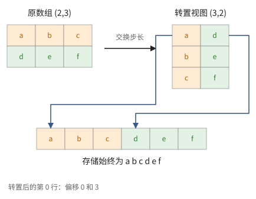
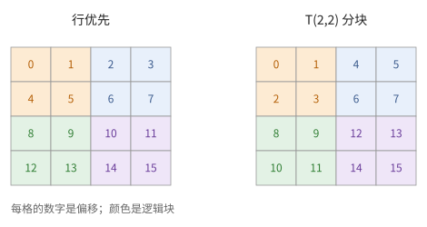
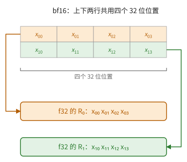
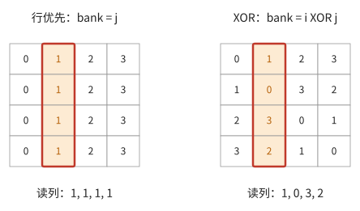
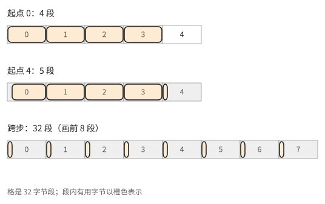
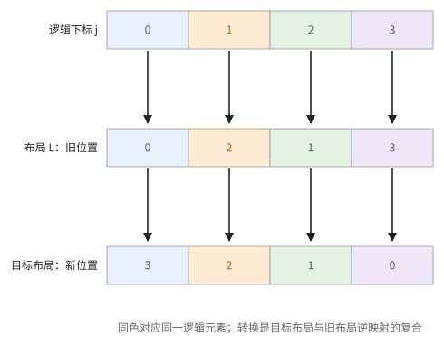

# 第 8 章　布局

数学上，一个数组是从下标集合到数值的函数；在机器上，它占据一段线性的存储，或者分散在若干存储体、若干寄存器的若干通道里。**布局**就是从逻辑下标到物理位置的映射。布局决定了一次访问是否连续（第 3 章的突发）、是否有存储体冲突（命题 3.11）、元素装入寄存器后落在哪个通道（第 4 章的 SIMD），以及矩阵单元能否直接使用这个操作数。kernel 语言中许多看似任意的限制，例如"块的最后两维必须是 8 和 128 的倍数"，都是布局的限制。

8.1 节把布局定义为函数；8.2–8.4 节讲三种基本手段：存储中的分块、寄存器中的映射、打包；8.5 节讲存储体冲突与交错；8.6 节把以上各种布局统一为 $\mathbb{F}_2$ 上的线性映射；8.7、8.8 节讲访存的合并与布局转换的代价。

> **在体系中的位置**：下层是第 3 章的突发与分体存储、第 4 章的 SIMD 通道、第 6 章的分块。本章把布局写成函数，给出分块、打包、交错三类布局及其代价，以及在 $\mathbb{F}_2$ 上统一处理它们的方法。TPU 路线（第 15、16 章）的寄存器分块与打包、GPU 路线（第 21–23 章）的访存合并、共享存储交错和 MMA 操作数布局，都是本章的实例。

## 8.1 布局即函数

本节把布局定义为从下标到物理位置的单射（定义 8.1），给出最常见的一类——步长布局（定义 8.2），并说明转置为什么可以只改步长、却改变了访问模式。

> **定义 8.1（布局）** 设数组的形状为 $(n_0, \dots, n_{d-1})$，下标集合 $\mathcal{I} = [n_0] \times \dots \times [n_{d-1}]$。一个**布局**是单射 $L: \mathcal{I} \to \mathcal{P}$，其中 $\mathcal{P}$ 是物理位置的集合：可以是线性存储中的偏移量（以元素计），也可以是（存储体，地址）或（寄存器，子通道，通道）这样的组合。

> **定义 8.2（步长布局）** 步长布局是 $L(i) = \sum_r i_r \sigma_r$，$\sigma = (\sigma_0, \dots, \sigma_{d-1})$ 称为**步长**。二维数组 $(n_0, n_1)$ 的**行优先**布局是 $\sigma = (n_1, 1)$，**列优先**布局是 $\sigma = (1, n_0)$。

一组同时访问的下标，若其像是一个区间，称这组访问是**连续的**。行优先布局中一行是连续的，一列不是。

转置一个步长布局的数组，在数学上只需交换步长：$(n_0, n_1)$ 行优先数组的转置，就是同一段存储在步长 $(1, n_1)$ 下的 $(n_1, n_0)$ 数组。框架把这种只改变映射、不移动数据的数组称为**视图**。但视图下的访问模式变了：原来连续的行，现在成了步长 $n_1$ 的列。若后续计算需要连续访问，就必须真正移动数据（8.8 节）。

> **例 8.3（同一段存储，两种读法）** 把 $2\times3$ 数组写成 $\begin{pmatrix}a&b&c\\d&e&f\end{pmatrix}$，行优先存储为 $a,b,c,d,e,f$，步长 $(3,1)$。转置视图形状为 $(3,2)$，步长 $(1,3)$：第 0 行读取偏移 0、3，得到 $a,d$；第 1 行读 1、4，得到 $b,e$。六个元素没有移动，但“同时读一行”的地址从连续变成跨步。
>
> 因此要分别问：转置的数学结果是什么，转置是否搬运数据，以及下一条运算怎样读取它。一个 `transpose` 的名字不能回答后两个问题。

**图 8.1**　转置视图改变逻辑坐标到偏移的映射；右边按转置后的行连线，底部的六个存储位置保持不变。

## 8.2 分块布局

硬件总以某个固定形状的块为单位搬运和计算，而在步长布局中，一个二维的小块一般不连续。本节定义分块布局（定义 8.4），比较它与行优先布局的连续性（命题 8.5），并说明它为什么总是跟着硬件的基本单位走。

> **定义 8.4（分块布局）** 二维数组 $(R, C)$ 以块 $(t_r, t_c)$ 分块（设 $t_r \mid R$，$t_c \mid C$）：块按行优先排列，块内元素也按行优先排列，
>
> $$
> L(i, j) = \left(\left\lfloor \tfrac{i}{t_r} \right\rfloor \tfrac{C}{t_c} + \left\lfloor \tfrac{j}{t_c} \right\rfloor\right) t_r t_c + (i \bmod t_r)\, t_c + (j \bmod t_c).
> $$
>
> 本书把它记作 $(R, C)$ 上的 $\mathrm{T}(t_r, t_c)$ 布局。

> **命题 8.5** 在 $\mathrm{T}(t_r, t_c)$ 布局中，每个对齐的 $t_r \times t_c$ 子块占据一段连续的存储；在行优先布局中，对齐的 $t_r \times t_c$ 子块连续，当且仅当 $t_r = 1$ 或 $t_c = C$。

*证明* 前者由定义 8.4：块内偏移取遍 $[t_r t_c]$。后者：行优先下子块的第一行末与第二行首相差 $C - t_c + 1$，连续当且仅当 $C = t_c$。∎

为什么要分块？因为硬件总是以某个固定形状的块为单位搬运和计算：一个向量寄存器装一个块，一次 DMA 的最小单位是一段连续字节，矩阵单元一次吃一个固定形状的操作数。让这样的块在存储中连续，它就能被一次读出。分块布局的块形状，通常就等于硬件的这个基本单位。

**填充。** 若 $R$ 不是 $t_r$ 的倍数，要补到 $\lceil R / t_r \rceil t_r$ 行。填充既占存储，也让计算单元在补零的部分上空转（命题 5.13）。

**多级分块。** 块内还可以再分块，例如先把数组分成 $(8, 128)$ 的块，每个块内再把相邻两行的元素交织存放（8.4 节）。多级分块是若干个单级分块布局的复合。

> **例 8.6（用十六个数看懂分块）** $4\times4$ 数组按 $\mathrm{T}(2,2)$ 存放。第一个块的逻辑元素是 $(0,0),(0,1),(1,0),(1,1)$，偏移为 0、1、2、3；第二个块是 $(0,2),(0,3),(1,2),(1,3)$，偏移 4、5、6、7。元素 $(2,1)$ 的块号为 $1\cdot2+0=2$，块内偏移为 $0\cdot2+1=1$，总偏移为 $2\cdot4+1=9$。行优先下它的偏移同样是 9，这是偶合；$(1,0)$ 的偏移从 4 变成 2。
>
> 布局改变的是“谁挨着谁”，不改变数组的数学值。真实的 DMA 若支持二维步长，也能从行优先数组搬出一个不连续的逻辑块；分块连续性减少的是分段与地址处理，并不意味着所有 DMA 都只能搬一个连续区间。

**图 8.2**　格内是物理偏移。四种颜色对应四个 2×2 块：行优先下同色元素分散，分块布局下同色元素连续。

## 8.3 寄存器中的布局

8.2 节讨论的是数组在存储中的样子。数组装入寄存器之后，每个元素落在哪个子通道、哪个通道，同样是一种布局，而且它决定了哪些运算便宜、哪些昂贵。本节说明不同运算对寄存器布局的要求，结论是命题 8.7 和随后的选择原则。

设向量寄存器的形状是 $S \times W$：$S$ 个**子通道**（sublane），每个子通道 $W$ 个**通道**（lane）。这是一维 SIMD（$S = 1$）的推广。一个 $t_r \times t_c = S \times W$ 的块装入一个寄存器时，自然的映射是 $(i, j) \mapsto$（子通道 $i$，通道 $j$）。

不同的运算对布局的要求不同：

- **逐元素运算**在每个（子通道，通道）位置上独立进行，任何布局都可以，只要所有操作数的布局相同。
- **沿某个轴的归约**：若这个轴映射到不同的寄存器（例如对很多个块按位置相加），归约只是寄存器之间的逐元素运算，很便宜；若这个轴映射到通道，就需要跨通道的数据交换（命题 4.14），慢而贵。
- **广播**：把一行广播到所有子通道，或把一列广播到所有通道，也都需要跨子通道或跨通道的数据通路。

> **命题 8.7** 两个布局不同的操作数做逐元素运算，必须先把其中一个变换到另一个的布局。这个变换是一个置换，要经过跨通道单元或存储完成。

所以选择布局的原则是：**让归约沿寄存器之间进行，让通道之间的数据交换尽量少，让相邻的运算使用相同的布局**。编译器的"布局分配"做的就是这件事；手写 kernel 时，这就是程序员的事。

> **例 8.8（归约轴在哪里）** 有两个 $2\times4$ 的寄存器 $R_0,R_1$，存一个 $4\times4$ 数组。若每个寄存器存两行，求列和先做 $R_0+R_1$，再合并两个子通道；求行和却要合并四个通道。若改为每个寄存器存两列，两个方向的角色就互换了。
>
> 这不是“行归约总贵、列归约总便宜”的规律：贵的是沿硬件通道搬运，数组的行列只是逻辑名称。应当先写出 $(i,j)\mapsto(\text{寄存器},\text{子通道},\text{通道})$，再判断。

## 8.4 打包

寄存器的每个位置通常是 32 位。存放 16 位、8 位、4 位的元素时，一个位置要放 2、4、8 个元素。本节定义怎样放（定义 8.9），并说明它对块的形状和类型转换的影响。

> **定义 8.9（打包）** **打包**规定哪些逻辑元素共用一个 32 位位置，以及它们在 32 位中的次序。对二维的块，常见两种：
>
> - **沿行打包**：$(2i, j)$ 与 $(2i + 1, j)$ 共用一个位置。于是一个 $S \times W$ 的 32 位寄存器装下 $2S \times W$ 个 bf16。
> - **沿列打包**：$(i, 2j)$ 与 $(i, 2j + 1)$ 共用一个位置，寄存器装下 $S \times 2W$ 个 bf16。

打包的方式影响三件事：

1. **块的形状随类型改变。** 沿行打包时，f32 的块是 $S \times W$，bf16 的块是 $2S \times W$，int8 的块是 $4S \times W$。类型转换会改变一个寄存器对应的逻辑块。
2. **转换要拆包或打包。** bf16 转 f32 时，一个打包的寄存器拆成两个 f32 寄存器。拆出来的两个寄存器各含哪些行，取决于打包方式（习题 8.3）；若与下游期望的布局不一致，还要再做一次置换。
3. **矩阵单元有自己期望的打包方式。** 操作数不符合时要先变换。

> **例 8.10（一个位置里装的是哪两个数）** 在沿行打包的 $2\times4$ bf16 块中，第 $j$ 个 32 位位置低半部存 $x_{0j}$、高半部存 $x_{1j}$。转成 f32 后，低半部拆成寄存器 $R_0=(x_{00},\ldots,x_{03})$，高半部拆成 $R_1=(x_{10},\ldots,x_{13})$。若消费者要的是相邻两列组成的向量，拆包之后还需换布局。
>
> 所以“bf16 转 f32”有两个问题：每个数怎样变宽，以及变宽后由谁持有。只核对数据类型，会漏掉第二个问题。

**图 8.3**　以四个 32 位位置为例，沿行打包的 bf16 拆成两个 f32 寄存器；箭头只表示元素归属，不表示具体指令。

## 8.5 存储体冲突与交错

回到命题 3.11：$k$ 个存储体交错存储时，步长 $s$ 的访问冲突度为 $\gcd(s, k)$。典型的问题是：$32 \times 32$ 的 f32 矩阵按行优先存放在 32 个 4 字节宽的存储体中，同时读一列，步长 32，冲突度 32。本节给出两种解决办法：填充，以及不浪费存储的交错（命题 8.11）。

第一种办法是**填充**：每行补一个元素，步长变成 33（习题 3.4）。代价是浪费存储，而且行的起点不再对齐。

第二种办法是**交错**（swizzle）：不改变每行的长度，而是在每一行内置换元素的存放位置。

> **命题 8.11（XOR 交错）** 把 $32 \times 32$ 矩阵的元素 $(i, j)$ 存放在第 $i$ 行的第 $j \oplus i$ 个位置（$\oplus$ 为按位异或，$i, j \in [32]$），则同时读一行或同时读一列都没有冲突。

*证明* 位置 $(i, j)$ 的地址是 $32 i + (j \oplus i)$，所在存储体是 $j \oplus i$。读第 $i$ 行：$j \mapsto j \oplus i$ 是 $[32]$ 上的双射，32 个访问落在 32 个不同的存储体。读第 $j$ 列：$i \mapsto j \oplus i$ 也是双射。∎

XOR 交错不浪费存储，也保持了每行的对齐，是共享存储中最常用的布局技巧。它可以推广到以更大的单位交错：例如每行 128 字节分成 8 个 16 字节的"块"，第 $i$ 行的第 $c$ 个块存放在位置 $c \oplus (i \bmod 8)$。

> **例 8.12（四个存储体的 XOR 表）** 用 $4\times4$ 数组和 4 个存储体缩小命题 8.11。行优先的存储体号每行都是 $0,1,2,3$；XOR 交错后四行分别是 $0123$、$1032$、$2301$、$3210$。读第 1 列时，行优先全部落在存储体 1，交错后依次落在 1、0、3、2。
>
> 读者可以直接看表验证双射。推广到 32 个存储体，只是把两个下标从 2 位扩大到 5 位。这里的交错单位是一个 4 字节元素；搬运引擎按 16 字节或 128 字节交错时，要按它的单位重新写映射，不能原封不动套这张表。

**图 8.4**　格内是存储体号。框出的列在左图挤到同一存储体，在右图分散到四个存储体。

命题 8.11 和例 8.12 还可以直接逐格核对：下面改变同时访问的行或列，再比较行优先与 XOR 交错的存储体号。每个存储体每轮只服务一个不同位置，冲突度就是同一存储体上的最大请求数。

## 8.6 $\mathbb{F}_2$ 上的线性布局

8.2–8.5 节的布局各有各的写法。本节说明，当各维长度都是 2 的幂时，它们都是 $\mathbb{F}_2$ 上的线性映射（定义 8.13），冲突分析因此变成线性代数（命题 8.14、例 8.15）。

当各维的长度都是 2 的幂时，下标 $i \in [2^n]$ 可以看作比特向量 $\vec{i} \in \mathbb{F}_2^n$。前面的布局大都可以写成 $\mathbb{F}_2$ 上的线性映射：

- 行优先布局把 $(\vec{i}, \vec{j})$ 映射为地址的比特 $(\vec{i}, \vec{j})$，即拼接；列优先是另一种拼接次序；
- 分块布局是比特的一个置换：块号的比特在高位，块内偏移的比特在低位；
- XOR 交错是在某些比特上加上另一些比特。

把这一观察作为定义：

> **定义 8.13（线性布局）** 一个**线性布局**是 $\mathbb{F}_2$ 上的线性映射 $L: \mathbb{F}_2^n \to \mathbb{F}_2^m$，即一个 $m \times n$ 的 0/1 矩阵，把逻辑下标的比特映射为物理位置的比特。物理位置的比特可以分组解释：哪些比特是地址，哪些是存储体号，哪些是寄存器号、子通道号、通道号。

线性的第一个好处是，冲突度可以直接从核算出：

> **命题 8.14** 设 $L$ 是线性布局，$\beta = P_{\text{bank}} \circ L$ 是"下标 $\mapsto$ 存储体号"的映射（$P_{\text{bank}}$ 取出存储体号的那几个比特）。一组同时进行的访问，若其下标构成一个陪集 $\vec{a} + U$（$U$ 是 $\mathbb{F}_2^n$ 的子空间），则冲突度为 $2^{\dim(U \cap \ker \beta)}$。特别地，访问无冲突当且仅当 $\beta|_U$ 是单射。

*证明* $\beta$ 在 $\vec{a} + U$ 上的每个像恰有 $\lvert U \cap \ker \beta \rvert = 2^{\dim(U \cap \ker \beta)}$ 个原像（线性映射的纤维是核的陪集）。∎

这把冲突分析变成了线性代数：

> **例 8.15** $32 \times 32$ 的 f32 矩阵，行号的比特 $\vec{r} \in \mathbb{F}_2^5$，列号的比特 $\vec{c} \in \mathbb{F}_2^5$。行优先时存储体号是 $\vec{c}$，即 $\beta(\vec{r}, \vec{c}) = \vec{c}$。读一列时 $U = \{(\vec{r}, 0)\}$，$U \subset \ker \beta$，冲突度 $2^5 = 32$。XOR 交错时 $\beta(\vec{r}, \vec{c}) = \vec{c} + \vec{r}$，在 $U$ 上是单射，冲突度 1；读一行时 $U = \{(0, \vec{c})\}$，也是单射。

线性布局的另一个好处是：布局的复合是矩阵乘法，从布局 $L_1$ 变换到 $L_2$ 所需的数据移动是 $L_2 \circ L_1^{-1}$（$L_1$ 可逆时）。编译器可以统一地处理各种布局之间的变换。

> **现状（2026-10）**：Triton 编译器从 2025 年起用这种 $\mathbb{F}_2$ 上的"线性布局"统一表示寄存器、共享存储和 MMA 操作数的布局（Zhou 等，ASPLOS 2026）。NVIDIA 的 CuTe 用另一套代数（形状与步长的复合、整除与补）描述同样的对象，第 23 章会用到。

> **例 8.16（把冲突化成一个两行矩阵）** 在四存储体例子中，把行号写成 $(r_1,r_0)$、列号写成 $(c_1,c_0)$。交错后的存储体比特为 $(r_1+c_1,r_0+c_0)$，矩阵是
> $$
> \beta=\begin{pmatrix}1&0&1&0\\0&1&0&1\end{pmatrix}.
> $$
> 读一列时固定 $c$，可变子空间由前两个坐标张成；限制矩阵是单位矩阵，核维数 0，冲突度 $2^0=1$。行优先的限制矩阵为零，核维数 2，冲突度 $2^2=4$。这正好复现例 8.12 的表，不需要记住另一条硬件口诀。

## 8.7 访存合并与对齐

DRAM 以突发为单位传输（3.4 节），片上存储的访问也常以若干字节的段为单位。一组同时发出的访问的代价，取决于它们触及多少个不同的段。本节定义合并（定义 8.17），算出连续访问与跨步访问的段数（命题 8.18），由此得出第一条布局原则。

> **定义 8.17（合并）** 设访问的最小单位是对齐的 $g$ 字节段。一组同时发出的访问触及的不同段的个数称为它的**段数**；有用的字节数与 $g \times \text{段数}$ 之比称为**效率**。段数取到最小值时，称这组访问是**合并的**。

> **命题 8.18** $W$ 个通道各读一个 $s$ 字节的元素，设 $s\mid g$、各元素地址按 $s$ 对齐（故单个元素不跨段）：
>
> 1. 若元素连续，且起始地址按 $g$ 对齐，段数为 $\lceil Ws / g \rceil$，效率最高；起始地址不对齐时最多多一个段。
> 2. 若元素间步长为 $\sigma$ 个元素，且 $\sigma s \ge g$，每个通道各占一个段，段数为 $W$，效率为 $s / g$。

*证明* (1) $Ws$ 个连续字节至少覆盖 $\lceil Ws/g \rceil$ 个段，对齐时恰好如此。(2) 相邻两个元素相距不少于一个段长，各落在不同的段中。∎

DMA 也一样：拷贝一个子块时，子块的每一行是一段连续字节，行数越多、每行越短，效率越低。所以无论在哪种机器上，**让同时访问的元素在存储中连续**都是第一条布局原则。

> **例 8.19（连续仍要检查起点）** 32 个通道各读一个 f32，段长 $g=32$ 字节。起点 0 时，地址字节区间为 $[0,128)$，触及段 0–3，效率 100%；起点 4 时为 $[4,132)$，触及段 0–4，效率 $128/160=80\%$。每个通道改读第 $32i$ 个元素时，地址相距 128 字节，触及 32 个段，效率 $128/1024=12.5\%$。
>
> 对齐损失和跨步损失是两件事。前者多一个段，后者可能每个通道各占一个段。这里计的是请求段流量；缓存命中后实际走到 HBM 的流量还需另算。

**图 8.5**　三种访问触及的 32 字节段。橙色是有用字节，空白是随请求带回却未使用的字节。

## 8.8 布局转换的代价

布局不合适时可以转换，但转换不是免费的。

需要实际移动元素的转置、重排，在物理上是数据的置换。若通过存储完成，至少要把数据读写一遍；在 SIMD 机器上还要经过跨通道的单元，或者借助存储完成（例如按行写入一块 XOR 交错的存储，再按列读出）。

所以布局设计的一条原则是**让生产者直接按消费者需要的布局写出**：例如把权重事先以矩阵单元需要的方向存放，或者利用矩阵单元在读入操作数时就能顺便转置的能力，而不是在计算过程中显式地转置。

> **例 8.20（什么时候值得搬一次）** 设有 $S$ 字节数据，显式布局转换要读写各一次，带宽上限为 $B$，理想时间至少 $2S/B$。原布局使后续每次处理平均搬 $4S$，转换后每次只搬 $S$；重复 $q$ 次，分别是 $4qS/B$ 和 $(2+q)S/B$。在这个只计带宽的模型中，$q\ge1$ 就可能收回转换的代价。
>
> 但若后续只有一次很小的运算，转换的启动开销可能使它不划算。若生产者已经能按目标布局写出，则额外的 $2S/B$ 可以直接消失。这是用命题 6.9 的融合思想处理布局。

**图 8.6**　颜色追踪同一逻辑元素；布局转换把旧物理位置换成目标位置。

## 接口小结

1. 布局是从逻辑下标到物理位置的单射；步长布局 $L(i) = \sum_r i_r \sigma_r$，转置只改步长（视图），但改变了访问的连续性。（定义 8.1、8.2）
2. 分块布局 $\mathrm{T}(t_r, t_c)$ 让每个对齐的块连续，块形状通常等于硬件的基本单位；不整除时要填充。（定义 8.4、命题 8.5）
3. 寄存器中，逐元素运算对布局无要求但操作数布局须一致；沿通道的归约与广播需要跨通道通路；布局不同的操作数要先置换。（8.3 节、命题 8.7）
4. 打包让一个 32 位位置放多个窄元素；打包方式决定块形状如何随类型变化，以及类型转换后元素落在哪里。（定义 8.9）
5. XOR 交错使行和列的访问都无存储体冲突，且不浪费存储。（命题 8.11）
6. 2 的幂形状的布局是 $\mathbb{F}_2$ 上的线性映射；冲突度为 $2^{\dim(U \cap \ker \beta)}$；布局变换是 $L_2 \circ L_1^{-1}$。（定义 8.13、命题 8.14）
7. 同时访问的元素应连续且对齐；步长不小于段长时，效率降为 $s/g$。（命题 8.18）
8. 布局转换是置换，至少读写一遍数据；应让生产者直接按消费者的布局写出。（8.8 节）

## 习题

**习题 8.1** ★ 一个 $(64, 512)$ 的 f32 数组采用 $\mathrm{T}(8, 128)$ 布局。求元素 $(13, 300)$ 的偏移量。它与哪些元素位于同一个块中？

提示 1

先把下标分解为块号和块内坐标；两部分最后才合成偏移。

提示 2

代入定义 8.4：$C / t_c = 4$，块大小 $1024$。

答案

块号 $\lfloor 13/8 \rfloor \cdot 4 + \lfloor 300/128 \rfloor = 4 + 2 = 6$，块内偏移 $(13 \bmod 8) \cdot 128 + (300 \bmod 128) = 640 + 44 = 684$，偏移量 $6 \times 1024 + 684 = 6828$。同一块是行 $8$–$15$、列 $256$–$383$ 的元素。

**习题 8.2** ★ 一个 $(100, 300)$ 的 f32 数组采用 $\mathrm{T}(8, 128)$ 布局，需要填充到多大？存储（以及逐元素运算的工作量）多出百分之几？若改成 $(104, 384)$ 的数组呢？

提示 1

分别判断行数和列数能否整除，不要只给总元素数取整。

提示 2

两维分别向上取整到 8 和 128 的倍数。

答案

填充到 $(104, 384)$，$39936 / 30000 \approx 1.33$，多出约 33%。$(104, 384)$ 本身已经整除，不用填充。在这类硬件上，让张量的最后两维是块形状的倍数，可以免去这部分浪费。

**习题 8.3** ★ 一个 $8 \times 128$ 的 32 位寄存器存放 $16 \times 128$ 的 bf16 块，沿行打包。把它转换成 f32，得到两个 $8 \times 128$ 的寄存器 $R_{\text{lo}}$、$R_{\text{hi}}$（分别取每个 32 位位置的低 16 位和高 16 位）。(a) 若 $(2i, j)$ 在低位、$(2i+1, j)$ 在高位，$R_{\text{lo}}$ 含哪些行？(b) 若改为 $(i, j)$ 与 $(i + 8, j)$ 共用一个位置呢？(c) 下游希望得到"第 0–7 行"和"第 8–15 行"两个寄存器，哪种打包方式不需要额外的置换？

提示 1

给每个逻辑行标上所在子通道和高低半字，再比较下游需要的分组。

提示 2

子通道 $s$ 的低位分别是第 $2s$ 行或第 $s$ 行。

答案

(a) $R_{\text{lo}}$ 的子通道 $s$ 是第 $2s$ 行，即第 $0, 2, \dots, 14$ 行；$R_{\text{hi}}$ 是奇数行。(b) $R_{\text{lo}}$ 是第 0–7 行，$R_{\text{hi}}$ 是第 8–15 行。(c) (b) 的打包方式。(a) 的方式要再做一次跨子通道的置换，把偶数行和奇数行重新排列。这说明为什么要清楚硬件的打包方式：同样的"bf16 转 f32"，指令数可以差很多。

**习题 8.4** ★ 共享存储每行 128 字节，以 16 字节为单位分成 8 个块；存储体的组织使得同一时刻读取 8 个不同"块位置"的 16 字节没有冲突。一个 $8 \times 8$ 的块矩阵（每个元素 16 字节）按行存放，要同时读取一列的 8 个块。设计一个交错，使行与列的读取都没有冲突，并证明。

提示 1

先以 16 字节块为一个逻辑元素，把问题缩成 8 个位置的置换。

提示 2

把命题 8.11 中的 32 换成 8。

答案

把块 $(r, c)$ 存放在第 $r$ 行的位置 $c \oplus r$（$r, c \in [8]$）。读一行：$c \mapsto c \oplus r$ 是 $[8]$ 上的双射；读一列：$r \mapsto c \oplus r$ 也是双射。这正是 GPU 上 128 字节交错的原理（第 23 章）。

**习题 8.5** ★ 对例 8.15，写出行优先与 XOR 交错两种布局的存储体映射 $\beta$ 的 $5 \times 10$ 矩阵（列按 $(\vec{r}, \vec{c})$ 排列），计算读一列与读一行时 $U \cap \ker \beta$ 的维数。若改为交错 $\beta(\vec{r}, \vec{c}) = \vec{c} + (r_0, r_1, 0, 0, 0)$（只用行号的低两位），读一列的冲突度是多少？

提示 1

读一行固定行比特，读一列固定列比特；分别确定可变子空间。

提示 2

行优先：$\beta = [\,0 \mid I_5\,]$；XOR：$\beta = [\,I_5 \mid I_5\,]$。

答案

行优先：读一列 $U = \mathbb{F}_2^5 \times 0 \subset \ker \beta$，维数 5，冲突度 32；读一行 $U = 0 \times \mathbb{F}_2^5$，$\beta|_U$ 是单射，冲突度 1。XOR：两种读取都是单射，冲突度 1。只用低两位时，$\beta(\vec{r}, 0) = (r_0, r_1, 0, 0, 0)$，核在 $U$ 上是 $r_0 = r_1 = 0$ 的 3 维子空间，冲突度 $2^3 = 8$。

**习题 8.6** ★ 32 个通道各读一个 f32，段长 $g = 32$ 字节，起始地址按 32 字节对齐。分别对步长 1、2、32（以元素计）求段数与效率。

提示 1

先写 32 个起始字节地址，再把每个地址除以 32 取整，数不同的商；假定起点按段对齐。

提示 2

命题 8.18。

答案

步长 1：128 字节，4 段，效率 100%。步长 2：跨 256 字节，8 段，效率 50%。步长 32：每个元素相距 128 字节，32 段，效率 $4/32 = 12.5\%$。

**习题 8.7** ★（审查题）一个 kernel 把 $64 \times 64$ 的 f32 矩阵按行优先写入共享存储（32 个 4 字节宽的存储体），随后 32 个通道各读一列中的一个元素（即同时读第 $j$ 列的 32 个元素）来做转置。指出性能问题，给出两种修改，并比较它们的代价。

提示 1

先问 HBM 访问还是共享存储访问出问题，再求列地址的 bank 号。

提示 2

行长 64，步长 64，$\gcd(64, 32)$ 是多少？

答案

步长 64，冲突度 $\gcd(64, 32) = 32$，每次读一列要 32 个周期。修改一：每行填充 1 个元素，步长 65，冲突度 1，多用 $64 \times 4$ 字节。修改二：XOR 交错，元素 $(i, j)$ 存于第 $i$ 行的位置 $j \oplus (i \bmod 32)$（只交错低 5 位），读一列的 32 个元素落在 32 个不同的存储体，不浪费存储、保持行对齐，但读写时要计算交错后的地址。

**习题 8.8** ★（综合审查题）一个矩阵先由生产者写出，再由同一个消费者读取四次。原布局每次读 4 MiB，目标布局每次读 1 MiB；显式转换需读写共 2 MiB。只计带宽，比较保持原布局、先转换、生产者直接写目标布局的流量。

提示 1

分别计一次性成本和每次消费成本；生产者本来必要的写入在三方案中抵消。

提示 2

原布局为 $4\times4$ MiB；转换方案多一次 2 MiB，之后是四次 1 MiB。

答案

分别为 16、6、4 MiB。直接按消费者布局写出省去显式转换；这是流量比较，若有不同的布局生成开销，时间还要另算。

