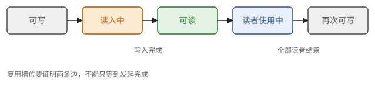
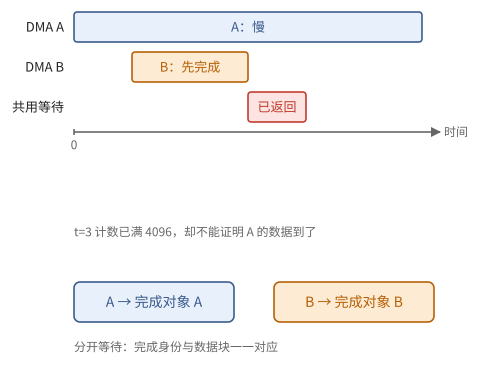
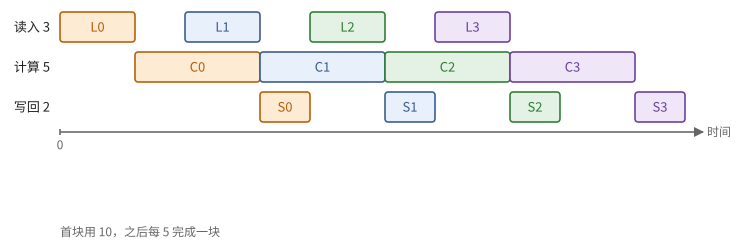
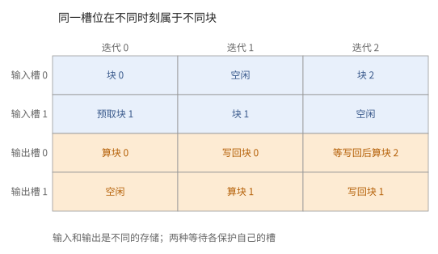

# 第 9 章　异步程序与软件流水线

第 4 章给出了异步拷贝：发起与等待分离，用完成计数器同步。第 6 章说明，访存与计算必须重叠，时间才能接近屋顶线。本章把这样的程序当作数学对象来推理：什么时候可以读一个缓冲，什么时候可以覆盖它，需要几个缓冲，流水线怎样排，以及最常见的几类错误。这些推理在两条路线上完全相同，只是同步原语的名字不同。

9.1 节用先行发生关系定义数据竞争，得到使用缓冲的两条规则；9.2 节给出建立先行发生的工具——信号量；9.3 节计算多缓冲流水线的时间和所需的缓冲数；9.4 节写出软件流水线的标准形式并逐条验证；9.5 节列出典型错误；9.6 节初步讨论多个指令流共享存储时写入何时可见。

> **在体系中的位置**：下层是第 4 章的 DMA 与完成计数器、Little 定律，第 6 章的传输代价，第 7 章的跨芯片同步。本章给出先行发生关系、信号量、多缓冲定理、软件流水线的标准形式、错误分类和内存一致性的基本概念。TPU 路线的 Pallas 流水线（第 16–19 章）和 GPU 路线的异步拷贝、TMA、mbarrier 与 warp 专门化（第 23 章）都是本章的实例。

## 9.1 事件与先行发生

异步程序难以推理，是因为事件发生的先后不再由程序文本决定。本节用先行发生关系（定义 9.1）刻画哪些先后是有保证的，用它定义数据竞争（定义 9.2），并得出使用缓冲的两条规则：读之前（命题 9.3）与覆盖之前（命题 9.4）。

> **定义 9.1（执行与先行发生）** 一次**执行**由若干**事件**组成：每个指令流中的指令、每个异步操作的发起与完成。**先行发生**关系 $\to$ 是由下列关系生成的传递闭包：
>
> 1. **程序次序**：同一指令流中，先执行的指令 $\to$ 后执行的指令；
> 2. **异步操作**：一个异步操作的发起 $\to$ 它的完成；
> 3. **同步**：一次信号 $\to$ 观察到这次信号的等待返回。
>
> $\to$ 是一个严格偏序。不能由 $\to$ 比较的两个事件称为**并发的**。

> **定义 9.2（数据竞争）** 两次访问同一存储位置，至少一次是写，且二者并发，称为**数据竞争**。

异步拷贝也是访问：一次从 $X$ 到 $Y$ 的 DMA，在发起与完成之间的某个时刻读 $X$、写 $Y$。若还规定了所有非交换操作的次序，且原语本身确定，没有数据竞争的程序结果才与各事件实际发生的时刻无关；有数据竞争的程序，结果取决于时序，可能时对时错。对一块用 DMA 搬运的缓冲，避免竞争就是下面两条规则。

> **命题 9.3（读之前）** 一个由 DMA 写入的缓冲，只有在这次 DMA 的完成 $\to$ 读取时，读取才没有竞争。具体地说，读之前必须等待这次 DMA 的完成计数器。

> **命题 9.4（覆盖之前）** 要向缓冲 $X$ 写入新内容（无论用计算还是 DMA），所有读取 $X$ 旧内容的事件都必须 $\to$ 这次写入。特别地，若 $X$ 的旧内容正被一个向外的 DMA（例如写回 HBM）读取，必须先等这个 DMA 完成。

两个命题都是定义 9.2 的直接推论。命题 9.3 很少被忘记，因为读到错数据的结果明显；命题 9.4 常被忘记，因为出错只在时序不巧时发生（9.5 节）。

> **例 9.5（写完和读完是两条不同的边）** 缓冲 $X$ 先装第 0 块，再装第 2 块。令 $L_0$ 是读入完成，$C_0$ 是计算读取 $X$，$L_2$ 是覆盖。正确顺序必须包含 $L_0\to C_0\to L_2$。若计算结果还在 $X$ 中并要写回，记 $S_0$ 为写回读完，则覆盖还必须等 $S_0\to L_2$。
>
> 发起写回发生在 $S_0$ 之前，却不能代替 $S_0$。审查时把每个缓冲的所有读者列出来，就能发现这条容易漏掉的边。



**图 9.1**　同一个槽的生命周期：可写、读入中、可读、读者使用中、再次可写。每次复用都要经过读入完成和所有读者结束两道关。


## 9.2 信号量

定义 9.1 的第三种先行发生来自同步。本节给出建立同步的基本工具——计数信号量（定义 9.6），说明它怎样与 DMA 的完成计数配合，以及一个容易犯的错误（注 9.7）。

> **定义 9.6（计数信号量）** 一个**计数信号量**是一个非负整数 $c$，支持两种操作：
>
> - $\operatorname{signal}(n)$：$c \leftarrow c + n$。由一个指令流执行，或由 DMA 引擎在完成时执行，也可以来自另一个核心或另一颗芯片。
> - $\operatorname{wait}(n)$：阻塞直到 $c \ge n$，然后 $c \leftarrow c - n$。

一次 $\operatorname{wait}(n)$ 返回时，它"消费"了累计到那时为止的若干次 signal。若一个信号量只服务于一个 DMA，且等待的量恰好等于这次 DMA 增加的量，那么 wait 返回就意味着这个 DMA 已经完成。

> **注 9.7** 若两个并发的 DMA 向同一个信号量 signal，一次 $\operatorname{wait}(n)$ 可能被其中任何一个满足：等待者不能确定是哪一个完成了。所以**并发的异步操作应各用一个信号量**，或者等待它们的总和。

有些硬件的计数器按**字节**计数：等待者事先声明期望的字节数，DMA 引擎每到达一批数据就计入，计满即视为完成。这种"按事务计数"的方式与定义 9.6 是同一个模型，只是计数单位不同。

**屏障**（barrier）是信号量的一个常见用法：$p$ 个参与者各向其余 $p - 1$ 个参与者 signal，再 wait 收到 $p - 1$ 次。屏障之前的所有事件 $\to$ 屏障之后的所有事件。

> **例 9.8（计满不等于等对）** DMA A、B 各搬 4096 字节，共用一个完成计数器。程序先 `wait(4096)`，然后读取 A 的目的缓冲。若 B 先完成，计数已经够，等待返回，而 A 还没写完。
>
> 修复有两种：A、B 各用一个计数器，分别等待；或者 `wait(8192)` 后再读取两块。第二种允许共用，但失去了“一块到了就先算一块”的机会。同步对象的身份决定可用的重叠，计数单位只决定什么时候够。



**图 9.2**　后发的 B 也能满足共用计数器上的等待。拆成两个同步对象后，A 的消费者只会被 A 的完成释放。


## 9.3 多缓冲

有了同步工具，就可以让读入、计算、写回三件事重叠起来。本节算出这样做的总时间（命题 9.9）和所需的缓冲数（定理 9.10）。

考虑一个典型的访存受限循环：有 $T$ 个块，每块要读入（时间 $t_L$）、计算（$t_C$）、写回（$t_S$）。

只用一个缓冲时，三步只能依次进行，总时间 $T(t_L + t_C + t_S)$。用两个输入缓冲，就可以在计算第 $t$ 块时读入第 $t + 1$ 块；写回也用两个缓冲并异步进行。

> **命题 9.9（流水线的总时间）** 若 $s$ 个阶段各占用不同的资源、彼此可以并行，第 $i$ 阶段每块用时 $t_i$，且缓冲足够，则处理 $T$ 块的总时间为
>
> $$
> (T - 1) \max_i t_i + \sum_i t_i .
> $$

*证明* 这是命题 4.4 的推广：最慢的阶段每 $\max_i t_i$ 处理一块，第一块要依次经过所有阶段（填充），最后一块之后没有新块（排空）。严格的证明与命题 7.18 相同，对块逐个写出完成时刻的递推即可。∎

所以多缓冲把每块的时间从 $\sum_i t_i$ 降到 $\max_i t_i$。下一个问题是：需要多少个缓冲？

> **定理 9.10（所需缓冲数）** 设每块的读入从发起到完成需要固定时间 $\lambda>0$，各读入可流水执行且带宽跟得上。消费者每 $\tau>0$ 时间开始处理一块，并在整个 $\tau$ 内占用该块的输入槽。要维持这个稳态节奏，输入缓冲至少需要
>
> $$
> \left\lceil \frac{\lambda}{\tau} \right\rceil + 1
> $$
>
> 个。

*证明* 稳态下每 $\tau$ 发起一次读入，每次在途 $\lambda$，由 Little 定律（定理 4.7）在途的块约 $\lambda / \tau$ 个，向上取整；另有一块正被消费，它的缓冲也不能被覆盖（命题 9.4）。∎

用 α–β 模型，$\lambda = \alpha + S/\beta$。两种情形：

- 若 $S/\beta \le \tau$（每块的传输时间不超过计算时间），缓冲数由 $\lambda / \tau$ 决定。固定开销 $\alpha$ 大时需要更多缓冲；$\lambda \le \tau$ 时两个缓冲（双缓冲）就够。
- 若 $S/\beta > \tau$，带宽本身跟不上，再多缓冲也没有用：每块至少需要 $S/\beta$，这正是访存受限（定理 6.5）。

> **例 9.11（把八块的时间算到底）** 读入、计算、写回分别用 3、5、2 个时间单位，三者资源独立。单缓冲处理 8 块需要 $8(3+5+2)=80$。有足够缓冲时，第一块用 10，之后每 5 完成一块，命题 9.9 给出 $10+7\cdot5=45$。
>
> 若读入和写回共用一个不可同时使用的引擎，便不能把它们当作两个独立阶段；该引擎每块的服务量为 $3+2=5$，必须据此重新排程。流水线图中的重叠先要由资源允许，再由同步保证。



**图 9.3**　例 9.11 的前四块。各道是独立资源，每块内部依次经过读入、计算、写回；颜色标识块号。

> **例 9.12（带宽足够，两个槽仍可能不够）** 每块 64 KiB，传输带宽 64 KiB/单位，固定等待 6 单位，总延迟 $\lambda=7$；计算每块用 $\tau=2$。带宽服务时间为 1，跟得上每 2 单位一块，但必须提前 4 步发起，按定理 9.10 要 5 个输入槽，容量 320 KiB。
>
> 这说明“大块”和“深预取”解决不同问题：前者摊薄固定开销，后者提供在途量。若带宽降到每块要 3 单位，再增加槽也无法维持每 2 单位消费一块。


## 9.4 软件流水线

把循环的各次迭代错开，让第 $i$ 次的计算与第 $i + 1$ 次的读入、第 $i - 1$ 次的写回同时进行，称为**软件流水线**。本节写出双缓冲的标准形式，并用命题 9.3、9.4 逐条验证它没有数据竞争。`start_load(t, s)` 发起把第 $t$ 块读入输入缓冲 `inp[s]` 的 DMA，完成时 signal 信号量 `sem_in[s]`；`start_store(t, s)` 发起把 `out[s]` 写回第 $t$ 块的 DMA，完成时 signal `sem_out[s]`。

```python
start_load(0, 0)                      # 序幕：先发起第 0 块
for t in range(T):
    s = t % 2
    if t + 1 < T:
        start_load(t + 1, 1 - s)      # inp[1-s] 上次被第 t-1 次计算使用，已经算完
    wait(sem_in[s])                   # 命题 9.3：读 inp[s] 之前
    if t >= 2:
        wait(sem_out[s])              # 命题 9.4：覆盖 out[s] 之前，第 t-2 块的写回必须完成
    out[s] = f(inp[s])
    start_store(t, s)
for t in range(max(T - 2, 0), T):     # 尾声：等待最后的写回
    wait(sem_out[t % 2])
```

逐条验证它没有数据竞争：

- 读 `inp[s]` 之前等待了它的读入（命题 9.3）。
- 读入 `inp[1-s]` 时，它的上一个使用者是第 $t - 1$ 次的计算，计算与本条语句在同一指令流中，按程序次序已经结束（命题 9.4）。
- 写 `out[s]` 之前等待了第 $t - 2$ 块的写回（命题 9.4）。
- 每个信号量同一时刻只服务于一个 DMA（注 9.7）。

若要预取得更远，第 $t$ 次迭代发起第 $t + d$ 块的读入，就需要 $d + 1$ 个输入缓冲（定理 9.10 中 $\lceil \lambda/\tau \rceil = d$）。

实际的 kernel 语言大都能自动生成这种结构：程序员只描述每块的计算和块的下标，编译器生成序幕、稳态与尾声。即便如此，理解这个标准形式仍然必要：手写更复杂的流水线（例如不同块的计算量不同、多个输入以不同节奏到达）时，要用它来检查正确性；审查自动生成的代码时，也要知道它应该是什么样子。

> **例 9.13（沿槽号追一遍双缓冲）** 取 $T=3$。序幕装块 0 到槽 0；第 0 步发起块 1 到槽 1，等槽 0，计算并写回块 0；第 1 步发起块 2 到槽 0，此时块 0 的输入已经读完，但其输出可能仍在写回；第 2 步读取槽 0 的新输入，覆盖输出槽 0 之前另等块 0 的写回。
>
> 输入、输出若使用不同的存储，这两个等待分别保护不同位置；若做原地处理，输入槽也成了写回源，必须合并生命周期，不能直接照搬两个独立缓冲数组的代码。



**图 9.4**　三次迭代的输入槽和输出槽。槽号相同不表示同一块；输入槽等待读入，输出槽复用前等待上一轮写回。


## 9.5 典型错误

下面列出异步程序的典型错误，每一种都对应于违反前面的某条规则；其中死锁有一个简单的刻画（命题 9.14）。审查 AI 写的异步代码时，可以按这张清单逐条检查。

1. **读之前没有等待**（违反命题 9.3）。读到旧数据或部分写入的数据。
2. **覆盖之前没有等待**（违反命题 9.4）。最常见的是忘记等待向外的 DMA：上面代码中删掉 `wait(sem_out[s])`，大多数时候结果仍然正确（因为写回通常比下一次计算快），只在写回偶尔变慢时出错。这类错误在测试中很难发现，要靠审查。
3. **计数不匹配**。等待的量与 signal 的量不一致（例如一方按字节、一方按块计数），或者两个并发的 DMA 共用一个信号量（注 9.7）。
4. **死锁**。两个指令流互相等待对方的 signal，而各自的 signal 都排在 wait 之后。
5. **残留计数**。程序结束时信号量不为 0，影响下一次使用同一信号量的程序。
6. **序幕与尾声的越界**。最后一次迭代发起了第 $T$ 块的读入，或者漏掉了最后几次写回的等待。

> **命题 9.14（死锁）** 在每个等待都有确定的未来信号生产者、计数匹配、参与者最终会获得执行资源的有限模型中，一组只通过信号量同步的指令流发生死锁，当且仅当存在一个等待的环：流 $P_1$ 在等一个只有 $P_2$ 在其当前位置之后才会发出的 signal，$P_2$ 在等 $P_3$，……，$P_k$ 在等 $P_1$。特别地，若每个参与者都**先 signal、后 wait**，就不会因这一组同步而死锁。

*证明* 若没有这样的环，等待关系是有限的无环图，总有一个流不在等待或它等待的 signal 已经发出，它可以前进；归纳即得。若每个参与者在任何 wait 之前已发出全部 signal，则没有流在等一个尚未发出的 signal 之外的东西。∎

> **例 9.15（有环和没有生产者）** 流 A 先等 B 的信号再发信号，流 B 先等 A 再发信号，等待图有环。把双方都改成先发再等，消除该环。
>
> 另一段程序只有 A 在等“第三次完成”，但总共只发起两次 DMA：它永不返回，却没有等待环。这里是计数或协议不匹配。只有每个等待都确实有一个将来会执行的生产者，并且不受其他资源死锁限制时，命题 9.14 的等待图判据才适用。


## 9.6 内存一致性初步

多个指令流（多个核心、多个线程、多颗芯片）共享存储时，一个流按程序次序做的两次写，在另一个流看来不一定按同样的次序生效：硬件可能为了性能而重排或缓冲写操作。只有通过同步建立的先行发生关系，才保证可见的次序。本节给出处理这个问题的基本概念：释放与获取（定义 9.16），以及由它们保证的消息传递（命题 9.17）。

> **定义 9.16（释放与获取）** 一次 signal 若具有**释放**语义，则发出它之前的所有写，对任何以**获取**语义观察到这次 signal 的流都可见；一次 wait 若具有获取语义，则它之后的读能看到所观察的释放之前的写。**栅栏**（fence）是只建立次序、不传递数据的指令。每种次序保证都有一个**作用域**：只对同一核心内、整颗芯片内，还是对其他芯片也成立。作用域越大，代价越高。

> **命题 9.17（消息传递）** 生产者写数据，再以释放语义 signal 一个标志；消费者以获取语义等待该标志，再读数据。若两次同步的作用域都包含双方，消费者读到的就是生产者写入的数据。

缺少释放或获取语义时，消费者可能已经看到了标志，却读到旧数据。DMA 引擎的完成计数通常已经对它搬运的数据提供了这种保证；线程直接读写共享存储时，则要显式使用带释放/获取语义的操作或栅栏。

> **例 9.18（标志的数值与数据的可见性）** 生产者先写 `data=7`，再写 `flag=1`；消费者看见 `flag=1`，并不自动推出看见 `data=7`。应把标志的写作为释放、把观察标志作为获取，且作用域覆盖两者。此时由命题 9.17，数据写入先行发生于消费读取。
>
> 栅栏只排顺序，没有“对方已经走到哪”的信息；信号若没有相应的可见性语义，也只告诉你一个数变了。真正的协议需要把完成身份、可见性和作用域一起规定。


## 接口小结

1. 先行发生是由程序次序、异步操作的发起到完成、signal 到观察它的 wait 生成的偏序；并发的读写构成数据竞争。（定义 9.1、9.2）
2. 读一个由 DMA 写入的缓冲之前要等这次 DMA；覆盖一个缓冲之前要等它的所有读者，包括向外的 DMA。（命题 9.3、9.4）
3. 计数信号量：signal 加、wait 等够再减；并发的异步操作各用一个信号量；屏障是信号量的组合。（定义 9.6、注 9.7）
4. 有 $s$ 个可并行阶段、缓冲充足时，$T$ 块用时 $(T-1)\max_i t_i + \sum_i t_i$；不让消费者等待需要 $\lceil \lambda/\tau \rceil + 1$ 个输入缓冲；传输时间超过计算时间时多缓冲无效。（命题 9.9、定理 9.10）
5. 双缓冲软件流水线的标准形式见 9.4 节，审查时逐条对照命题 9.3、9.4 和注 9.7。（9.4 节）
6. 六类典型错误：读前未等、覆盖前未等、计数不匹配、死锁、残留计数、序幕尾声越界；先 signal 后 wait 不会死锁。（9.5 节、命题 9.14）
7. 跨流共享存储时，用释放/获取语义建立可见次序，注意作用域。（定义 9.16、命题 9.17）

## 习题

**习题 9.1** ★ 有 8 块，每块读入 3 ms、计算 2 ms、写回 1 ms。(a) 单缓冲需要多少时间？(b) 读入、计算、写回三者可以并行且缓冲充足时呢？(c) 这个循环是什么受限的？

<details><summary>提示 1</summary>

先判定三阶段是否共享资源；单缓冲相加，独立流水线看最慢阶段。

</details>
<details><summary>提示 2</summary>

命题 9.9。

</details>
<details><summary>答案</summary>

(a) $8 \times 6 = 48$ ms。(b) $7 \times 3 + 6 = 27$ ms。(c) 读入最慢，是访存受限的：再优化计算也没有用，要减少读入的字节（例如更窄的格式）或提高带宽利用率。

</details>

**习题 9.2** ★ 每块读入的固定开销 $\alpha = 6$ µs，传输时间 $S/\beta = 3$ µs，每块计算 $\tau = 4$ µs。(a) 需要几个输入缓冲？(b) 若块大小减半（$S/\beta = 1.5$ µs，$\tau = 2$ µs，$\alpha$ 不变）呢？(c) 若 $S/\beta = 5$ µs、$\tau = 4$ µs 呢？

<details><summary>提示 1</summary>

把单次完成延迟和纯带宽服务时间分开：前者影响槽数，后者限制稳态节奏。

</details>
<details><summary>提示 2</summary>

定理 9.10，$\lambda = \alpha + S/\beta$。

</details>
<details><summary>答案</summary>

(a) $\lambda = 9$，$\lceil 9/4 \rceil + 1 = 4$ 个。(b) $\lambda = 7.5$，$\lceil 7.5 / 2 \rceil + 1 = 5$ 个：块越小，固定开销越显著，要预取得越远。(c) 传输慢于计算，访存受限，每块至少 5 µs，增加缓冲无济于事。

</details>

**习题 9.3** ★（审查题）下面的双缓冲循环由 AI 写出。找出错误，说明在什么情况下它会给出错误的结果。

```python
start_load(0, 0)
for t in range(T):
    s = t % 2
    if t + 1 < T:
        start_load(t + 1, 1 - s)
    wait(sem_in[s])
    out[s] = f(inp[s])
    start_store(t, s)
wait(sem_out[0]); wait(sem_out[1])
```

<details><summary>提示 1</summary>

为输入、输出分别列全部读者，找出覆盖时仍可能活跃的异步读。

</details>
<details><summary>提示 2</summary>

对照 9.4 节的标准形式。第 $t$ 次迭代写 `out[s]` 时，谁可能还在读它？尾声的两次等待对所有 $T$ 都对吗？

</details>
<details><summary>答案</summary>

两处错误。一，写 `out[s]` 之前没有等待第 $t - 2$ 块的写回（违反命题 9.4）：若那次写回较慢，第 $t$ 块的结果会覆盖尚未写出的第 $t - 2$ 块，HBM 中第 $t - 2$ 块得到的是部分新数据。这个错误只在写回偶尔变慢时出现。二，信号量 `sem_out[s]` 在循环中被 signal 了多次却从未在循环中 wait，计数会累积；尾声各 wait 一次，留下残留计数（错误 5），而且 $T = 1$ 时 `sem_out[1]` 从未被 signal，尾声会死锁。修改见 9.4 节。

</details>

**习题 9.4** ★（审查题）一个 kernel 同时发起两次 DMA，分别把 $A$ 的块读入 `a_buf`、把 $B$ 的块读入 `b_buf`，两者完成时都对同一个信号量 `sem` 加 1。随后执行 `wait(sem, 1)`，然后读 `a_buf` 与 `b_buf`。指出错误并修改。

<details><summary>提示 1</summary>

完成计数器不记录是哪个 DMA 完成；列出 A 先到和 B 先到两种时序。

</details>
<details><summary>提示 2</summary>

注 9.7。

</details>
<details><summary>答案</summary>

`wait(sem, 1)` 只保证两次 DMA 中**某一次**完成，另一次可能尚未完成，读取存在数据竞争。修改：`wait(sem, 2)` 后再读两个缓冲；或者给两次 DMA 各用一个信号量，分别等待，这样可以在 $A$ 先到时先做只依赖 $A$ 的工作。

</details>

**习题 9.5** ★ 两个核心要交换数据：每个核心把自己的块写到对方的缓冲中，并 signal 对方的信号量。核心 0 的代码是"等待自己的信号量；把块发给核心 1"，核心 1 的代码对称。会发生什么？怎样修改？

<details><summary>提示 1</summary>

先画两核心的等待边，问第一个信号究竟由谁发。

</details>
<details><summary>提示 2</summary>

命题 9.14。

</details>
<details><summary>答案</summary>

两个核心都在等待对方的 signal，而 signal 都排在 wait 之后，形成等待的环，死锁。改为"先发送并 signal 对方，再等待自己的信号量"。还要注意命题 9.4：发送之前，对方的接收缓冲必须已经空出来（例如上一轮的数据已被用完），否则需要对方先发一个"缓冲已空"的信号。

</details>

**习题 9.6** ☆ 生产者线程写入数组 `data`，然后普通地（不带释放语义）把标志 `flag` 置 1；消费者线程循环读 `flag` 直到为 1，然后读 `data`。说明可能出现的错误结果，并按命题 9.17 修改。

<details><summary>提示 1</summary>

分别考虑“标志看见了”与“数据看见了”，再检查双方作用域。

</details>
<details><summary>提示 2</summary>

两次写在消费者看来的次序不一定与程序次序相同。

</details>
<details><summary>答案</summary>

消费者可能看到 `flag = 1`，却读到 `data` 的旧值：对 `data` 的写在它看来晚于对 `flag` 的写。修改：生产者以释放语义写 `flag`（或在写 `flag` 之前放一个作用域足够的栅栏），消费者以获取语义读 `flag`（或在读 `data` 之前放栅栏）。

</details>

**习题 9.7** ☆ 证明命题 9.9：写出第 $j$ 块在第 $i$ 阶段完成时刻 $F_{i,j}$ 的递推，并求 $F_{s, T-1}$。

<details><summary>提示 1</summary>

每块到达某阶段时，同时等待前一阶段提供数据与本阶段腾出资源。

</details>
<details><summary>提示 2</summary>

$F_{i,j} = \max(F_{i-1,j}, F_{i,j-1}) + t_i$，其中 $F_{0,j} = 0$，$F_{i,-1} = 0$。

</details>
<details><summary>答案</summary>

$F_{s,T-1}$ 等于网格 $\{1..s\} \times \{0..T-1\}$ 中从 $(1, 0)$ 到 $(s, T-1)$、每步向右或向下的路径上 $t_i$ 之和的最大值。每条路径恰好经过每个阶段至少一次，共 $s + T - 1$ 个格子，其中有 $T - 1$ 个"额外"的格子可以放在任意阶段；最大值是把它们都放在最慢的阶段，得 $\sum_i t_i + (T - 1)\max_i t_i$。

</details>

**习题 9.8** ★（综合审查题）输入槽 s 的 DMA 已完成，随后发起一个异步 MMA 读取 s。AI 立即发布“槽空”信号。给出出错时序，并写出授权下一轮 DMA 的正确事件链。

<details><summary>提示 1</summary>

发起不等于读完；下一轮写者可能比矩阵执行器读取更早到达。

</details>
<details><summary>提示 2</summary>

将本轮 DMA 写完、MMA 读完、发布空信号、下轮 DMA 覆盖四个事件依次连接。

</details>
<details><summary>答案</summary>

错误时序为 MMA 发起 → 空信号 → 新 DMA 覆盖 → 旧 MMA 才读取，计算使用新数据。正确链是本轮写完 → 读取已被授权 → MMA 的相关读取全部完成 → 空信号 → 下轮等待空信号返回 → 覆盖。等待对象还需对应本轮 MMA，且提供合适的可见性。

</details>
