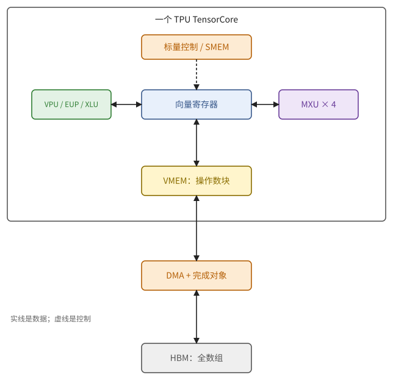
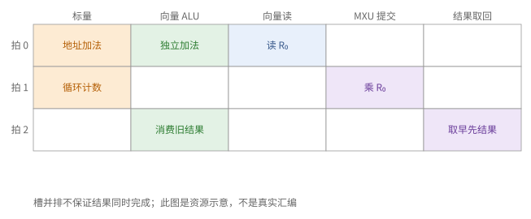
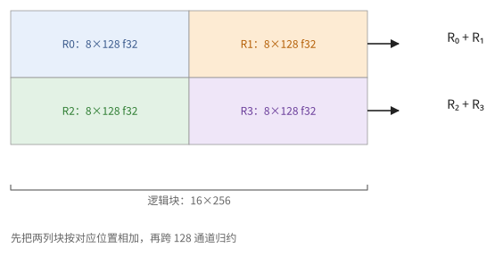
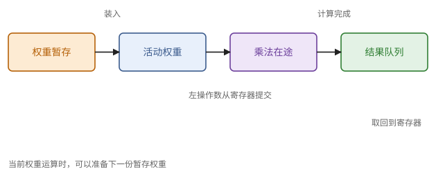
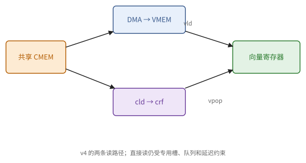
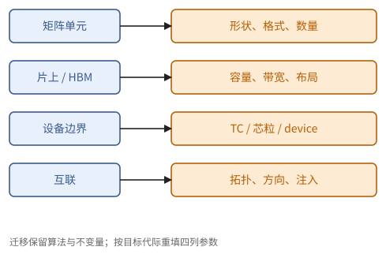

# 第 15 章　TPU 的结构

从本章起是 TPU 路线。TPU 是第 6 章抽象芯片的一个实例，而且是"静态"的那一类：片上存储由软件管理，数据靠 DMA 搬运，指令由编译器排成超长指令字（VLIW），硬件按顺序执行。第 4 章说过，这种组织省掉了调度硬件，代价是要求延迟可以预知；回报是**一段程序要多少周期，可以从它的指令直接算出来**（第 20 章）。

本章自底向上地描述一颗 TPU 芯片：15.1 节给出全貌；15.2–15.4 节依次讲一个 TensorCore 的标量单元、向量单元和 MXU；15.5 节讲存储与 DMA；15.6–15.8 节讲多个核心、SparseCore 与芯片间互联；15.9 节比较各代。具体到周期的数字，取自对 TPU v4 的公开实测（ayaka14732 的 pallas-tpu-tutorial），其余各代的参数取自 Google 的公开资料，都标明了来源与日期。

> **在体系中的位置**：下层是第一、二部分：矩阵单元（第 5 章）、存储（第 3 章）、流水线与 DMA（第 4 章）、芯片模型（第 6 章）、互联（第 7 章）、布局（第 8 章）、异步（第 9 章）。本章给出 TensorCore 的组成、各单元的接口与代价、存储与 DMA、多核与芯粒、SparseCore、ICI 与各代的差别。第 16 章的 Pallas 编程模型、第 17–19 章的 kernel 和第 20 章的静态分析都以本章为前提。

## 15.1 总览

本节先给出全貌：TPU 芯片的每个部件对应于抽象芯片的哪一部分，以下各节再逐个展开。

一颗 TPU 芯片的主要组成，以及它们与抽象芯片（定义 6.1）的对应：

| 抽象芯片 | TPU |
| --- | --- |
| 核心 | **TensorCore**（TC），每颗芯片 1 或 2 个 |
| 控制单元 | TensorCore 的**标量单元**，按 VLIW 指令包顺序执行 |
| 向量单元 | **VPU**：二维 SIMD，寄存器形状 $8 \times 128$ |
| 矩阵单元 | **MXU**：权重驻留的脉动阵列，每个 TC 若干个 |
| 片上存储 | **VMEM**（向量存储，便签式）、**SMEM**（标量存储） |
| 片外存储 | **HBM** |
| 搬运机构 | **DMA 引擎**，完成时增加**同步标志**（信号量） |
| 其他 | **SparseCore**（不规则访存与部分集合通信）、**ICI**（芯片间互联） |

没有缓存：程序显式地把数据从 HBM 拷进 VMEM，计算单元只访问 VMEM 和寄存器。

> **定义 15.1（本章使用的 TensorCore 接口）** 把一个 TensorCore 看成局部执行器：状态包括标量寄存器、向量寄存器、VMEM/SMEM、矩阵单元的权重与结果队列、DMA 完成对象；操作包括发射标量/向量指令、提交矩阵运算、发起搬运与等待；代价分别由单元的延迟、发射间隔、存储容量和传输带宽给出。**TensorCore**（TPU execution core）在这里指整个局部执行器，**MXU**（matrix multiply unit）只是其中的矩阵单元。

> **例 15.2（把真实芯片放回抽象模型）** 以 v5e 为例，一个芯片有一个 TensorCore，其中有四个 MXU、向量单元和标量单元。计算 $Y=\max(AB,0)$ 时，HBM 保存整个 $A,B,Y$；DMA 搬进操作数块；MXU 计算部分乘积；向量单元完成累加与最大值；DMA 写回。
>
> 四个 MXU 不等于四台 JAX 设备。框架可见的设备、芯片、TensorCore、MXU 是四种粒度，容量和峰值必须说明按哪种粒度计。

**图 15.1**　TensorCore 内的数据流。标量控制向各单元发指令；DMA 搬存储块，VPU 操作寄存器，MXU 持有权重并异步返回结果。

> **现状（2026-10-07）**：本节 v5e 的部件组成据 Google Cloud 的 [v5e 架构文档](https://docs.cloud.google.com/tpu/docs/v5e)；型号参数与单位见附录 A。四 MXU 是硬件组成事实，具体程序怎样分配它们由编译器决定。

## 15.2 标量单元与指令包

定义 15.1 把发射列为操作，但一拍究竟能送出哪些操作还未规定。本节用第 4 章的槽模型把指令包与执行单元对应起来；例 15.3 区分发射资源与结果就绪。

标量单元是 TensorCore 的"控制器"。本节说明它做什么，以及它发射的指令包有哪些槽：这些槽决定了每个周期至多能做哪些事。它有 32 个 32 位**标量寄存器**和十几个 1 位的**谓词寄存器**，访问 SMEM（v4 上 1 MiB），负责：

- 计算地址、循环计数与分支；
- 发起 DMA；
- 把向量、矩阵指令按程序次序送给相应的单元。

TensorCore 的程序是一串**指令包**（bundle，定义见 4.6 节）。v4 的一个指令包最多含 12 条指令，每条占一个固定的**槽**，每个槽连着一类单元：

| 槽 | 用途 |
| --- | --- |
| `s0`、`s1` | 标量运算、比较、分支；发起 DMA；读写 SMEM |
| `va0`、`va1` | 向量 ALU：逐元素运算、比较、选择、类型转换 |
| `vld`、`vst` | VMEM 与向量寄存器之间的读写 |
| `vx0`、`vx1` | 送往跨通道单元（XLU）和矩阵单元（MXU）的指令 |
| `vr0`、`vr1` | 从这些单元的结果队列中取回结果 |
| `misc` | 同步与杂项：等待同步标志、计数器加减、跟踪标记 |
| `cld` | 从核间共享存储读取（v4 特有，见 15.5 节） |

指令包中的各条指令同时发射。所以每个周期 TensorCore 至多做：两次标量运算、两次向量 ALU 运算、一次向量读、一次向量写、两次送往 XLU/MXU、两次取回。编译器的任务是把程序排进这些槽，同时满足依赖与资源的限制（习题 4.13）。指令包里还有一些全包共享的字段（例如立即数的个数、向量指令能读的标量寄存器个数），也限制了能并排放的指令（注 3.6 的一个实例）。

每条指令都可以带谓词前缀，谓词为假时不执行。这是标量层面的条件执行；向量层面的条件执行用掩码（4.3 节）。

> **例 15.3（同拍发射与同拍完成）** 设一个指令包并排放一次独立的标量地址加法、一次向量加法和一次 VMEM 载入。它们可同拍发射，因为使用不同槽；不能由此推断同拍完成。若向量加法的源恰是本包刚载入的数据，是否能同包使用要由 ISA 的依赖规则决定，不能只看还有空槽。
>
> 把程序排进指令包，需要同时检查槽容量与数据就绪。“还有六个空槽”只说明资源没装满，依赖链仍可能禁止把后面的指令提前。

**图 15.2**　每列是一类发射槽，每行是一拍的示意指令包。空槽不是自动可用的并行度；箭头表示跨拍的数据依赖。

## 15.3 向量单元

由定义 15.1，向量寄存器是局部数值状态。本节把定义 8.9 的打包与寄存器形状对应起来，沿数据位置判断逐元素运算和归约的代价；例 15.4 手算一个块的寄存器归属。

**向量寄存器**（VREG）的形状是 $8 \times 128$ 个 32 位：8 个**子通道**（sublane），每个 128 个**通道**（lane），共 4 KiB。v4 有 32 个向量寄存器，v5p 有 64 个。一条向量指令（例如 `vmul.8x128.f32`）对整个寄存器的 1024 个元素做同一个运算。两个向量 ALU 槽意味着每周期至多两条这样的指令。

**布局与打包**（第 8 章）。一个 f32 的 $8 \times 128$ 块恰好装满一个向量寄存器，这就是 TPU 上数组的默认分块布局 $\mathrm{T}(8, 128)$ 的来由。窄类型沿子通道方向打包（定义 8.9）：一个寄存器装 $16 \times 128$ 个 bf16、$32 \times 128$ 个 int8。所以 Pallas 要求块的最后两维是 $(8, 128)$ 的倍数（bf16 时为 $(16, 128)$），不满足时要么报错，要么付出填充与重排的代价。

**两个方向的不对称。** 沿子通道方向（同一通道的 8 个元素之间）的移动由向量 ALU 中的循环移位完成，便宜（v4 上结果 2 个周期后可用）。沿通道方向（128 个通道之间）的移动要经过专门的**跨通道单元**（XLU），它做转置、通道置换和跨通道归约，慢而贵：v4 上从提交到可以取回要 69–79 个周期，同一个 XLU 每 8 个周期才能接收一个寄存器。所以：

- 沿行（通道方向）的归约，例如对每行求和，要么交给 XLU，要么先把数据转置；
- 沿列（子通道与寄存器之间）的归约是寄存器之间的逐元素加法加上子通道内的移位，很便宜。

设计 kernel 时，应当让需要归约的轴尽量落在寄存器之间（8.3 节）。

**超越函数**（指数、倒数、平方根倒数、tanh、对数）由**扩展一元流水线**（EUP）计算：v4 上延迟 7 个周期，每 2 个周期接收一个寄存器（推论 4.5：要连续提交至少 4 个才能填满它）。

**整数。** v4 的向量单元有整数加减、位运算、移位，但没有 32 位整数乘法器：32 位整数乘法被编译器展开成几十条指令（习题 2.12）。int8 在向量单元中只是存储格式；它的用处在节省容量与带宽，以及送入 MXU。

> **例 15.4（从形状推回寄存器个数）** 一个 $16\times256$ f32 块共有 4096 个元素，需要 4 个 $8\times128$ 向量寄存器；同形状的 bf16 块含 8192 字节，在沿子通道打包的模型中只需 2 个寄存器。求每行和时，先把左右两个 128 列块按位置相加，之后每 8 行只做一次跨通道归约。
>
> 若逐寄存器先做跨通道归约再相加，就把昂贵的跨通道操作做了两遍。计算顺序来自布局的下标映射，不是 `sum(axis=...)` 的 Python 拼写。

**图 15.3**　16×256 的 f32 块由四个 8×128 寄存器覆盖；先合并列块的对应位置，再沿通道归约。

## 15.4 MXU

MXU 是第 5 章的权重驻留脉动阵列。本节说明一次矩阵乘法在指令层面分哪几步，每一步要多少周期。v5p 及以前是 $128 \times 128$，v6e（Trillium）起是 $256 \times 256$。输入为 bf16（或更窄的格式），在 f32 中累加。

以 v4 为例，一次矩阵乘法 $\text{LHS} \cdot \text{RHS}$（RHS 是 $128 \times 128$ 的权重块）在指令层面分四步：

1. **推入权重**：把 RHS 的若干个向量寄存器依次推入 MXU 的**暂存区**。bf16 的 $128 \times 128$ 块是 8 个打包的寄存器，推 8 次；
2. **装入**：一条指令把暂存区整块装入 MXU 的**权重寄存器**（gains）。暂存区与权重寄存器分开，就是推论 5.9 的权重双缓冲：MXU 用旧权重计算时，下一份权重可以推入暂存区；
3. **乘**：每条乘法指令送入一个 LHS 寄存器（8 行 f32 或 16 行打包的 bf16），与当前权重相乘；
4. **取回**：结果（f32，每 8 行一个寄存器）进入 MXU 的结果队列，再逐个取回到向量寄存器。

**时间**（v4 实测）：MXU 每 8 个周期接收一个 8 行的寄存器，即每周期一行，与命题 5.8 一致；从乘法指令到结果可以取回约 83 个周期（四个 MXU 中有两个约 101 个周期）；取回也是每 8 个周期一个。由推论 4.5，要让一个 MXU 不停，约需 $83 / 8 \approx 10$ 条乘法同时在途，然后交替发出乘法与取回。一个 TensorCore 有 4 个 MXU，每周期共 $4 \times 128 \times 128 = 65536$ 次乘加。

**其他细节**：

- **推入时转置**：权重可以在推入时顺便转置（进入另一个暂存区），所以 $\text{LHS} \cdot \text{RHS}^{\mathsf T}$ 不需要事先转置 RHS（8.8 节的原则）。
- **f32 输入**：默认舍入成 bf16 再乘；要 f32 精度，按推论 2.31 拆成 3 或 6 次 bf16 乘法。
- **K 方向的累加**：v4 的 MXU 不在内部跨权重块累加，$K > 128$ 时各块的部分积取回后由向量单元相加（`pltpu.get_tpu_info()` 报告的累加器数为 0）。
- **形状**：MXU 的基本单位是一个 $128 \times 128$（或 $256 \times 256$）的权重块。$N$ 或 $K$ 不是它的倍数时，按命题 5.13 浪费算力。

> **例 15.5（一个乘积经过哪些状态）** 取 $A[16,256],B[256,128]$，把 K 分成两个 128 块。先推入 $B_0[128,128]$ 的打包寄存器并装入权重状态，再提交 $A_0[16,128]$；结果分成两份 $8\times128$ f32 寄存器取回。第二个 K 块同样产生两份结果，向量单元对应相加。
>
> 第一份部分积取回之前，可以准备第二份权重，但不能覆盖仍被第一轮使用的状态。权重暂存、活动权重、在途乘法和结果队列必须分别看作状态；`A @ B` 把它们全部隐藏了。

**图 15.4**　MXU 的四步接口：推权重到暂存、装入活动权重、提交左操作数、取回结果。下一份权重的推入可与当前乘法重叠。

## 15.5 存储与 DMA

定义 15.1 的运算单元需要局部操作数；本节用各内存空间的访问权限说明数从哪里来，再以例 15.6 分开固定开销和带宽项。

| 存储 | 范围 | 容量（v4） | 用途 |
| --- | --- | --- | --- |
| 向量寄存器 | 每 TC | 32 × 4 KiB | 向量与矩阵运算的操作数 |
| VMEM | 每 TC | 16 MiB | kernel 的工作区；块从 HBM 拷入这里 |
| SMEM | 每 TC | 1 MiB | 标量：下标、偏移、循环参数 |
| CMEM | 每芯片（v4） | 128 MiB | 两个 TC 共享的片上存储 |
| HBM | 每芯片 | 32 GiB | 全部数组 |

普通向量载入与写回在 VMEM 和寄存器之间进行；标量载入与写回在 SMEM 和标量寄存器之间进行。HBM 中的算术操作数必须先用 DMA 搬入局部存储。CMEM 还存在另一条读取通路，不能把它与普通 VMEM 载入混为一谈。

> **现状（2026-10-08）**：教程对 v4 的观察给出两种 CMEM 读法：CMEM → DMA → VMEM → 寄存器，或 `cld` → CMEM 结果队列 → `vpop` → 寄存器。后一条有专用槽和队列，容量较大的共享存储因此也能直接供给寄存器，但其延迟与吞吐不等于 VMEM。公开 Pallas 的 CMEM scratch 分配在该教程的环境中受限；有硬件通路不等于有可用的公开分配接口。来源与版本见附录 B、E。

**DMA。** DMA 指令由标量单元发出，指定源、目的（可以是 HBM、VMEM、SMEM，也可以是另一个 TC 或另一颗芯片的存储）、长度和步长，以及完成时要增加的**同步标志**。等待用"等到标志不小于 $n$，再减去 $n$"两条指令完成，正是定义 4.18 与定义 9.6。DMA 的长度单位是 512 字节的块；地址不对齐或行太短，都会降低效率（命题 8.18）。

**代价**（v4 实测，1.05 GHz）：HBM → VMEM 一次拷贝约 $484 + 1.1K$ 个周期（$K$ 为 KiB 数），带宽约 970 GB/s，固定开销约 0.46 µs。两个 TC 同时从 HBM 读，共享这个带宽。由命题 4.19，一次拷贝要达到 90% 的带宽需要约 4 MiB；同时让几个拷贝在途，可以用更小的块达到同样的效率（习题 4.11）。

> **例 15.6（小搬运为什么输在固定开销）** 用附录 A 的 v4 实测模型作估算：4 KiB 搬运需 $484+1.1\cdot4\approx488$ 周期，256 KiB 需约 766 周期。载荷增为 64 倍，时间只增约 1.57 倍，因此后者的平均载荷速率约高 41 倍。
>
> 这不是新硬件的保证，也不是建议把块无限放大；更大块占用 VMEM，多个独立拷贝共享 HBM 带宽。模型说明应分别优化单次传输的摊销与总在途量。

**图 15.5**　v4 的共享 CMEM 既可 DMA 到 VMEM，也可经专用读取与结果队列进入寄存器。

## 15.6 多核心：megacore 与芯粒

例 15.2 区分了设备、芯片和矩阵单元。本节进一步说明多个 TensorCore 怎样共享存储、怎样呈现给框架；例 15.7 据此划出本地计算和跨设备通信的边界。

- **v4 与 v5p**：一颗芯片有两个 TensorCore，共享 HBM。它们通常作为一个设备呈现（称为 **megacore**），编译器或 kernel 把工作分给两个 TC；也可以把每个 TC 作为一个设备（split）。Pallas 中，`dimension_semantics` 为 `"parallel"` 的 grid 维会被分给两个 TC（第 16 章）。
- **v5e 与 v6e**：每颗芯片一个 TensorCore。
- **Ironwood（TPU7x）**：每颗芯片由两个**芯粒**（chiplet）组成，每个芯粒一个 TensorCore、两个 SparseCore、96 GB HBM，二者之间以比一条 ICI 链路快约 6 倍的片间接口相连。JAX 把每个芯粒作为一个独立的设备，所以一颗芯片是两个设备，它们之间的通信用集合操作完成。

> **例 15.7（先分清共享什么）** 两 TensorCore 共用一份 HBM 时，给它们分配独立输出块可以提高计算并行，但不能把同一 HBM 带宽算两遍。若两个芯粒被框架呈现为两设备，跨设备的数据则要通过通信原语传递，不能把一个设备的 VMEM ref 当作另一个设备的本地 ref。
>
> 因此先画设备边界和存储归属，再写 mesh；仅按“每芯片两个核心”猜分布式程序，会在通信和容量两本账上同时出错。

## 15.7 SparseCore

例 15.6 分析规则块的搬运；本节改看数据决定地址的不规则访问。例 15.8 表明嵌入查找的主要工作是取行与归约，而非稠密乘法。

TensorCore 擅长规则的稠密计算，不擅长数据依赖的不规则访存：例如推荐模型的词嵌入查找，要按一批下标从巨大的表中取出若干行，再求和。**SparseCore** 是专门处理这类访存的较小的核心，从 v4 开始出现：v5p 与 Ironwood 每颗芯片 4 个，v6e 2 个。它们执行 gather/scatter 与分段归约，并在较新的代际中承担一部分集合通信（例如数据依赖的 all-gather），从而把 TensorCore 解放出来做矩阵运算。SparseCore 也可以用 Pallas 编程（第 16 章末的现状框）。

> **例 15.8（一个索引怎样牵动大表）** 嵌入表 $E[10^7,128]$ 以 bf16 存储，约 2.56 GB。一批 1024 个随机下标取出 1024 行，有效载荷约 256 KiB；没有足够连续性时，读取延迟与请求粒度比 FLOP 数更重要。
>
> 把这项操作伪装成一个稠密 one-hot 矩阵乘法，数学上可行，却制造了巨大无用工作。适合索引、gather 与分段归约的执行器，应按访问结构分析，而不是按稠密矩阵峰值分析。

## 15.8 芯片间互联

定义 12.1 的 mesh 只是逻辑坐标。本节用第 7 章的链路和环面模型说明这些坐标怎样对应真实 ICI；例 15.9 展示为什么排列设备会改变物理链路负载。

最后走出芯片。TPU 芯片之间用 **ICI**（inter-chip interconnect）直接相连，组成环面（定义 7.3）：

- **v4、v5p**：三维环面；v4 用光路交换机（OCS）把 $4 \times 4 \times 4$ 的立方体连成更大的切片，并可重新配置。v4 每条链路每方向约 45 GB/s。
- **v5e、v6e**：二维环面，最大 256 颗芯片（$16 \times 16$）；v6e 每颗芯片 4 个 ICI 端口，双向合计 800 GB/s。
- **Ironwood**：三维环面，以 $4 \times 4 \times 4 = 64$ 颗芯片的立方体为单位，立方体之间经 OCS 相连，一个超级节点最多 9216 颗芯片；每颗芯片 ICI 双向合计 1200 GB/s。

分配给一个作业的一组芯片称为**切片**（slice），切片之间以及更大的规模上，通过数据中心网络（DCN）通信，带宽低得多。第 12 章的原则在这里具体化：带宽需求最高的并行方式放在切片内、沿 ICI 的轴上；数据并行可以跨切片走 DCN。

> **例 15.9（逻辑轴对应哪条物理路）** 一个 $4\times4$ 的二维切片中，让 mesh 的 x、y 轴分别沿两条物理环面方向。沿 x 的环形传递保持 y 坐标不变，邻居通常是直接链路；若把设备编号随意打散，同样一次逻辑 ppermute 可能走多跳。
>
> 逻辑通信量相同，不代表每条物理链路的负载相同。第 7 章的拓扑与二分带宽模型在这里负责补上“通信实际走哪条路”的账。

## 15.9 各代的变化

前面已经建立本地状态、操作、存储归属与外部通信。本节把各代的变化集中到现状表；注 15.10 说明哪些论证保留，哪些参数必须重新查证。

> **现状（2026-10）**：

| | v4 | v5e | v5p | v6e | Ironwood（TPU7x） | TPU 8t / 8i |
| --- | --- | --- | --- | --- | --- | --- |
| 每芯片 TC | 2（megacore） | 1 | 2（megacore） | 1 | 2（两个芯粒，两个设备） | — |
| MXU | $128^2$ | $128^2$ | $128^2$ | $256^2$ | $256^2$ | — |
| bf16 峰值（每芯片） | 275 TFLOP/s | 197 | 459 | 918 | 2307 | — |
| 更窄的格式 | — | int8 | int8 | int8 | fp8（4614 TFLOP/s） | fp4 |
| HBM | 32 GiB，1.2 TB/s | 16 GB，0.8 TB/s | 95 GB，2.8 TB/s | 32 GB，1.6 TB/s | 192 GB，7.4 TB/s | 216 / 288 GB，6.5 / 8.6 TB/s |
| 片上 VMEM | 16 MiB/TC | 约 128 MiB | — | — | — | 128 MB / 384 MB |
| ICI 拓扑 | 3D 环面 + OCS | 2D 环面 | 3D 环面 | 2D 环面 | 3D 环面 + OCS | 3D 环面（8t）/ Boardfly（8i） |

表中"—"表示本书写作时没有找到可靠的公开数字。TPU 8i 用专门的集合通信加速单元（CAE）取代了 SparseCore，以降低 decode 中集合通信的延迟（12.8 节）；它的 Boardfly 拓扑把 1024 颗芯片的最大跳数从三维环面的 16 降到 7。

各代之间，TensorCore 的组织（标量单元 + VLIW、二维 SIMD 的向量单元、权重驻留的 MXU、便签式 VMEM 与 DMA）保持不变；变的是 MXU 的大小和个数、支持的格式、VMEM 与 HBM 的容量与带宽、互联的拓扑。所以本部分后面各章的方法对各代都适用，只是数字不同。

> **注 15.10（代际迁移时重算哪些量）** 可以保留数学分块、缓冲所有权与归约不变量；必须重新核对矩阵形状、窄格式支持、VMEM 预算、设备边界、HBM/ICI 带宽和公开的编译接口。不能由“同为 TPU”推出某代的周期、槽数和指令拼写在另一代有效。

**图 15.6**　代际变化分为单元、存储、设备边界与互联四列。迁移时逐列核对，而不是把整颗芯片当成一个峰值数字。

> **例 15.11（新一代更大的芯片预算怎样使用）** 用附录 A 的 TPU 8t/8i 系统级标称值看一个工作区：一个 kernel 需要 160 MB 的片上数据，8t 的全芯片 128 MB 已不足，8i 的全芯片 384 MB 只是通过总量检查。还必须核对分配到哪一个 TensorCore、每核心可用容量、双缓冲和布局填充，不能把芯片总 SRAM 全部授权给任意一个局部块。
>
> 若 decode 中每步的链路载荷很小而集合操作很多，CAE 与较短网络直径可能减少固定延迟；若本步主要读取巨大 KV，HBM 与片上驻留仍是另一项限制。新一代的价值要映射到具体资源账，不是只比较 FP4 峰值。

> **现状（2026-10-07）**：本例的芯片级 VMEM 标称值与 CAE 来自 [TPU 8t/8i 技术介绍](https://cloud.google.com/blog/products/compute/tpu-8t-and-tpu-8i-technical-deep-dive/)。按 TensorCore 的参数另见附录 A 的 JAX 来源；该例没有假定全部芯片容量属于一个 kernel 实例。

## 接口小结

1. TPU = 标量单元（VLIW 控制、SMEM、发起 DMA）+ 向量单元（$8 \times 128$ 的二维 SIMD）+ 若干 MXU（权重驻留）+ VMEM（便签式）+ DMA 与同步标志；没有缓存。（15.1 节）
2. 一个指令包至多 12 条指令，各占固定的槽；每周期至多两条向量 ALU 指令、一次向量读、一次向量写、两次送往 XLU/MXU、两次取回。（15.2 节）
3. 数组的默认布局是 $\mathrm{T}(8, 128)$，窄类型沿子通道打包（bf16 为 $16 \times 128$）；沿子通道的移动便宜，沿通道的移动要经过慢的 XLU；超越函数由 EUP 计算。（15.3 节）
4. MXU 的使用：推入权重（暂存区，可转置）、装入、逐个寄存器相乘、从结果队列取回；每周期一行，延迟约 80–100 周期，需要约 10 条乘法同时在途；f32 输入默认舍入为 bf16；v4 上 K 方向的累加在向量单元中进行。（15.4 节）
5. 存储：寄存器、VMEM、SMEM、（v4 的 CMEM）、HBM；DMA 以 512 字节为单位，v4 上 HBM → VMEM 约 $484 + 1.1K$ 周期。（15.5 节）
6. v4/v5p 两个 TC 组成 megacore；v5e/v6e 一个 TC；Ironwood 两个芯粒、两个设备。SparseCore 处理不规则访存与部分集合通信。（15.6、15.7 节）
7. ICI 组成二维或三维环面，切片之间走 DCN。各代的数字见 15.9 节，组织方式不变。（15.8、15.9 节）

8. 审查一次张量运算时，沿 HBM → DMA → VMEM → 寄存器 → VPU/MXU → 写回追踪每份数据；设备粒度与单元粒度分别计账。（定义 15.1、例 15.2、15.5）

## 习题

**习题 15.1** ★ 由 15.4 节的数字验证 TPU v4 的 bf16 峰值：每个 TC 4 个 $128 \times 128$ 的 MXU，每芯片 2 个 TC，时钟约 1.05 GHz。

提示 1

逐级数乘加：阵列面积、每 TC 阵列数、每芯片 TC 数、时钟；一次乘加为两 FLOP。

提示 2

峰值 = 每周期乘加数 × 2 × 频率（定义 6.1）。

答案

$2 \times 4 \times 16384 \times 2 \times 1.05 \times 10^9 \approx 2.75 \times 10^{14}$，即 275 TFLOP/s，与表中一致。

**习题 15.2** ★ 在 v4 的一个 TC 上，要让一个 MXU 持续工作，至少需要多少条乘法指令同时在途？这些在途的结果要占多少个向量寄存器？v4 有 32 个向量寄存器，同时让 4 个 MXU 都满负荷时会遇到什么问题？

提示 1

在途数量由延迟除发射间隔决定；在途结果不必已经占向量寄存器。

提示 2

推论 4.5，$L \approx 83$，$I = 8$。每条乘法（8 行 f32 输出）的结果占一个寄存器；但结果在取回之前存放在 MXU 自己的结果队列中。

答案

约 $\lceil 83/8 \rceil = 11$ 条。在取回之前，结果放在 MXU 的结果队列里，不占向量寄存器，所以寄存器的压力主要来自 LHS 输入与取回后的结果：每个 MXU 每 8 个周期要送入一个 LHS 寄存器、取回一个结果寄存器。4 个 MXU 每 8 个周期共 4 次送入、4 次取回，还要从 VMEM 读入 LHS、把结果写回或累加；`vld`/`vst` 每周期各一次，`vx`/`vr` 每周期各两次，加上 K 方向累加的向量加法（每个结果一次 `vadd`），都在这些槽的能力之内，但需要编译器把循环展开得足够深，并保证寄存器够用。这正是手写或审查 kernel 时要算的账。

**习题 15.3** ★ 对一个 $(1024, 1024)$ 的 f32 数组逐元素求 $e^x$。(a) 它占多少个向量寄存器大小的块？(b) 在 v4 的一个 TC 上，EUP 至少需要多少周期？(c) 从 HBM 读入、写回需要多少周期？哪个是瓶颈？

提示 1

将逻辑元素数换成 f32 寄存器块数，再分别估单元服务量与 HBM 字节量。

提示 2

(b) 每 2 个周期一个寄存器（15.3 节）。(c) 读写各 4 MiB，按 15.5 节的 $1.1$ 周期/KiB 估计（读写共享带宽）。

答案

(a) $1024 \times 1024 / 1024 = 1024$ 块。(b) 约 2048 个周期（约 2 µs）。(c) 读写共 8 MiB，约 $8192 \times 1.1 \approx 9000$ 个周期（约 8.6 µs）。HBM 是瓶颈，EUP 只用了约四分之一的时间：逐元素运算访存受限（例 6.7）。

**习题 15.4** ★ 一个 kernel 要对 $(4096, 4096)$ 的 f32 矩阵按行求和（每行 4096 个元素求和，得到 4096 个结果）。比较两种做法的代价：(a) 按原布局，每个块内沿通道归约，交给 XLU；(b) 先在寄存器之间沿列方向相加，最后只对少量数据做跨通道归约。哪种更好？为什么？

提示 1

比较两种算法跨通道归约的次数，而不是只比较最后输出元素数。

提示 2

$\mathrm{T}(8, 128)$ 布局下，一行的 4096 个元素分布在 32 个块中，每块里占一个子通道的 128 个通道。先把同一行的 32 个块逐元素相加，再处理剩下的 128 个通道。

答案

(a) 每个块都要一次跨通道归约，共 $4096 \times 4096 / 1024 = 16384$ 次 XLU 提交，每 8 个周期一次（两个 XLU 时每 4 个周期一次），约 6.5 万个周期。(b) 对每 8 行，先把它们的 32 个块逐元素相加（31 次向量加法，向量 ALU 每周期两次），得到一个 $8 \times 128$ 的块，再做一次跨通道归约。跨通道归约降到 512 次，向量加法约 $512 \times 31 / 2 \approx 8000$ 个周期。(b) 快得多，而且与读入数据的 HBM 时间（64 MiB，约 7 万个周期）相比，(b) 的计算可以被访存掩盖，(a) 则不能。

**习题 15.5** ★ 在 v4 上，用一次 DMA 从 HBM 拷贝 $S$ 字节到 VMEM。(a) $S = 64$ KiB 时，有效带宽是峰值的多少？(b) 一次只有一个拷贝在途时，$S$ 多大才能达到 90%？(c) VMEM 只有 16 MiB，这对双缓冲的块大小意味着什么？

提示 1

先把固定项与随载荷增长项分开，有效带宽取载荷除总时间。

提示 2

$T(S) = 484 + 1.1 K$ 周期。

答案

(a) $1.1 \times 64 / (484 + 70.4) \approx 13\%$。(b) 需要 $1.1K / (484 + 1.1K) \ge 0.9$，$K \ge 3960$，约 3.9 MiB。(c) 双缓冲的输入与输出各两份，四个约 4 MiB 的块就占满 16 MiB。所以实际 kernel 要么同时让多个较小的拷贝在途（固定开销互相重叠），要么接受较低的带宽效率；第 16 章的自动流水线默认采用前一种思路的简单形式（双缓冲），块大小需要权衡。

**习题 15.6** ★ 在一个 $4 \times 4 \times 4$ 的 v4 切片上，对每颗芯片上的 1 GB 数据做 all-reduce。每条链路每方向 45 GB/s，每颗芯片 6 条链路。用第 7 章的方法估计带宽项。

提示 1

逐阶段指出实际用了哪些方向的链路；全部六端口不一定在每阶段同时承担同一消息。

提示 2

命题 7.17 推广到三维、双向：逐维做 reduce-scatter 与 all-gather，每一维的环可以双向使用，带宽项约为 $2n / \beta_{\text{inj}}$，$\beta_{\text{inj}}$ 是每颗芯片在一个阶段中实际使用的注入带宽。

答案

逐维进行时，每个阶段只使用一维的两条链路（双向各一个环），$\beta_{\text{inj}} = 2 \times 45 = 90$ GB/s，带宽项约 $2 \times 10^9 \times (1 + \frac{1}{4} + \frac{1}{16}) \times \frac{3}{4} / (9 \times 10^{10}) \approx 22$ ms（逐维数据量依次变为 $n, n/4, n/16$）。若把数据分成三份、三维同时进行（每份从不同的维开始），可以同时用上全部 6 条链路，时间约降为三分之一，约 7–8 ms。

**习题 15.7** ☆ 为什么 TPU 的 VMEM 是便签存储而不是缓存？列出至少三条理由，并各自指出它对应第一部分的哪个结论。

提示 1

分别从容量管理、静态延迟、数据复用与控制开销解释便签存储。

提示 2

对照定义 3.17、4.6 节与第 6 章。

答案

(1) 神经网络的访问模式在编译时已知，便签存储省去了标签与替换逻辑的面积和能耗（定义 3.17）。(2) 静态调度要求延迟可预测，缓存的命中与否不可预测（4.6 节）。(3) 显式的 DMA 允许一次搬运很大的块，用少数几个请求就填满带宽，而不需要海量的线程（例 4.10、命题 4.19）。(4) 分块的大小、复用的方式由程序决定，可以按第 6 章的理论精确地安排。

**习题 15.8** ★（综合审查题）一个 $16\times256$ 的 f32 块按 $8\times128$ 向量片分布。若每片各做一次行归约，再合并；或先在左右片之间逐元素求和再行归约，分别需几次跨通道提交？哪项工作仍不能消除？

提示 1

两块行方向与两块列方向，共四片；归约最后一维需通道交换。

提示 2

每 8 行的两列片可先相加成一片，因此 XLU 次数减半。

答案

前者需四次跨通道提交，后者需两次，但还需两次寄存器间逐元素加法。二者数学和相同，浮点合并次序可能不同；是否更快取决于 VPU 与 XLU 的相对资源，下界应分别计量。

