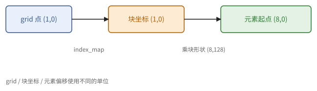
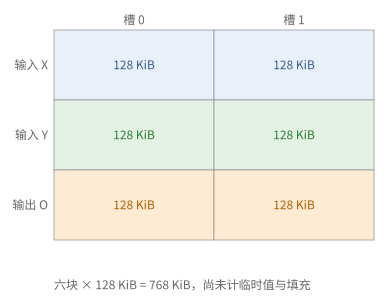
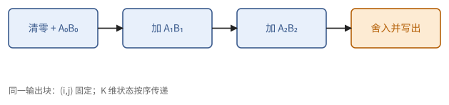
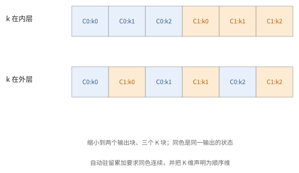
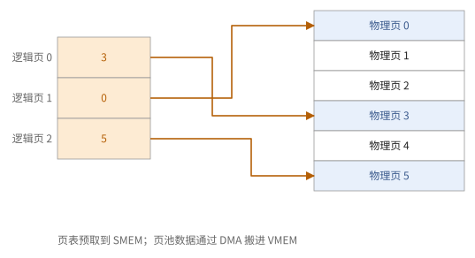
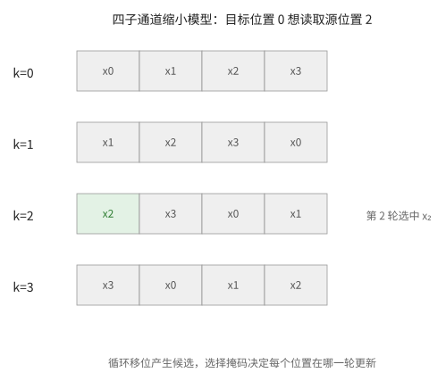
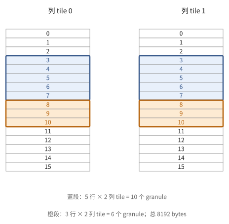
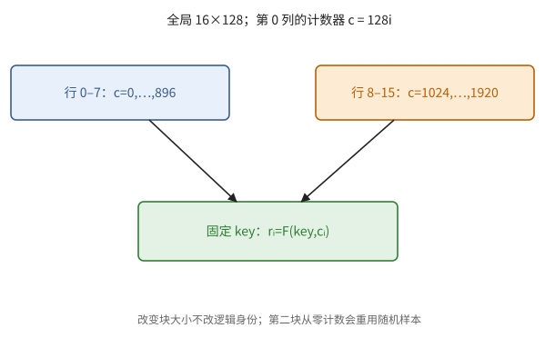

# 第 16 章　Pallas TPU 编程

XLA 自动完成融合、分块和流水线，大多数程序不必关心这些。但第 11 章算出的那些关键计算（注意力、分组矩阵乘法、量化矩阵乘法、带特殊通信的矩阵乘法），常常需要按第 6–10 章的理论专门安排数据流，而 XLA 的通用策略做不到。**Pallas** 是 JAX 中写这种 kernel 的语言：程序员描述块的划分与每块的计算，编译器（Mosaic）生成 DMA、流水线和 TensorCore 的指令。

16.1 节先把一个 Pallas kernel 写成数学对象，给出正确性条件和数据量公式；16.2–16.5 节讲 BlockSpec、kernel 体、内存空间和维度语义；16.6–16.8 节讲 DMA、标量预取与布局约束；16.9 节把重排、扫描和选择落实到硬件操作；16.10 节讨论随机数与重放。已有可执行 kernel 在 JAX 0.11.2 的 TPU 解释器上验证；新增的数学构造与硬件清单讨论不冒充真机验证。

> **在体系中的位置**：下层是第 13 章的 jaxpr 与 `jit`、第 15 章的 TensorCore、第 8 章的布局、第 9 章的流水线。本章给出 Pallas kernel 的语义、正确性条件、数据量公式和各种编程手段。第 17–19 章的 kernel 都用本章的手段写成；第 20 章分析它们编译出的指令。

## 16.1 kernel 的数学描述

本节先不看语法，把一个 Pallas kernel 写成数学对象（定义 16.1），由此推出它正确的条件（命题 16.2）和 HBM 数据量的公式（命题 16.3）。后面各节的写法，都可以对照这两条来检查。

> **定义 16.1（Pallas kernel）** 一个 Pallas kernel 由以下几部分组成：
>
> - **grid**：一个整数格 $\mathcal{G} = [g_0] \times \dots \times [g_{r-1}]$，称为迭代空间；
> - 对每个输入和输出 $X_m$：一个**块形状** $b_m$ 和一个**下标映射** $\varphi_m: \mathcal{G} \to$ 块坐标；
> - **kernel 体** $\kappa$：一个以若干块为参数的函数。
>
> 它的语义是：按字典序遍历 $\gamma \in \mathcal{G}$，对每个 $\gamma$，取出每个输入的第 $\varphi_m(\gamma)$ 块，执行 $\kappa$，把结果写入每个输出的第 $\varphi_m(\gamma)$ 块。块坐标是块的编号而不是元素的偏移：形状为 $(b_0, b_1)$ 的块，坐标 $(i, k)$ 对应元素 $[i b_0, (i+1) b_0) \times [k b_1, (k+1) b_1)$。

这就是第 6 章的分块，写成了程序：grid 是分块后的循环，下标映射说明每一步用到哪些块。

> **命题 16.2（输出的正确性条件）** 设输出 $Y$ 的下标映射为 $\varphi_Y$。
>
> 1. 若 $\varphi_Y$ 不是单射，则映到同一个输出块的那些 grid 点，在遍历次序中必须**连续**，并且对应的 grid 维必须按顺序执行（16.5 节的 `"arbitrary"`）。此时这个输出块在这些步之间留在 VMEM 中，可以被累加；当下标改变时才写回 HBM。
> 2. 若 $\varphi_Y$ 不是满射，未被覆盖的输出块的内容未定义。

*证明* 自动流水线只在输出块的下标改变时写回（16.2 节）。若映到同一块的步不连续，这个块会被写回、之后又以未初始化的缓冲重新开始，先前的结果被覆盖；若这些步被分给不同的核心并行执行，就是对同一块的数据竞争（定义 9.2）。未被映到的块从未被写。∎

> **命题 16.3（数据量）** 自动流水线只在相邻两步的块下标不同时重新读入一个输入块。所以输入 $X_m$ 的 HBM 读取量为
>
> $$
> (\text{遍历中 } \varphi_m(\gamma) \text{ 改变的次数} + 1) \times (\text{块的字节数}),
> $$
>
> 输出同理。

所以 grid 维的**次序**决定了数据量：把一个输入的下标不依赖的维放在最内层，这个输入就不会被重复读取。第 6 章的分块分析（命题 6.12）在 Pallas 中就是数一数各个下标映射改变了几次（习题 16.1）。

> **例 16.4（grid 点不是线程编号）** 数组 $X[16,256]$，块 $[8,128]$，grid $(2,2)$，映射 $(i,j)\mapsto(i,j)$。四个点依次选左上、右上、左下、右下块；点 $(1,0)$ 选元素行 8–15、列 0–127。
>
> 若错误地返回 `(8*i,128*j)`，BlockSpec 仍会把它解释为块坐标，再乘一次块尺寸，于是越界。写下四个 grid 点和实际元素区间，比查看 API 的完整参数表更快发现这类错。



**图 16.1**　grid 坐标先经过 index_map 得到块坐标，再乘 block_shape 得到元素起点。这两次映射的单位不同。


## 16.2 BlockSpec 与自动流水线

定义 16.1 中的块形状和下标映射，在程序中由 BlockSpec 给出。本节用一个最简单的例子说明它的写法，以及编译器据此生成的自动流水线。

`pl.BlockSpec(block_shape, index_map)` 描述一个操作数的块形状与下标映射。最简单的例子是逐行分块的加法：

```python
def add_kernel(x_ref, y_ref, o_ref):
    o_ref[...] = x_ref[...] + y_ref[...]

def add(x, y, bm=256):
    M, N = x.shape
    spec = pl.BlockSpec((bm, N), lambda i: (i, 0))       # 第 i 步用第 i 个行块
    return pl.pallas_call(
        add_kernel,
        out_shape=jax.ShapeDtypeStruct(x.shape, x.dtype),
        grid=(M // bm,),
        in_specs=[spec, spec],
        out_specs=spec,
    )(x, y)
```

（在没有 TPU 的机器上检查语义时，给 `pallas_call` 加上 `interpret=pltpu.InterpretParams()`。）

编译器为它生成的正是 9.4 节的软件流水线：每个操作数在 VMEM 中有两个缓冲；第 $t$ 步计算时，第 $t + 1$ 步的输入块已经在读入，第 $t - 1$ 步的输出块正在写回。程序员不写任何 DMA 或同步，正确性由编译器保证。

两个可以调节的参数：

- **缓冲数**：`pl.BlockSpec(..., pipeline_mode=pl.Buffered(3))` 让这个操作数用三个缓冲，即提前两步预取。当每块的计算时间小于读入的延迟时（定理 9.10），需要更深的预取。
- **VMEM 预算**：所有操作数的（缓冲数 × 块字节数）加上 scratch，必须放进 VMEM。编译器参数 `vmem_limit_bytes` 设定上限。块越大，固定开销占比越小（命题 4.19），但 VMEM 越紧。

> **例 16.5（从三个块推回缓冲容量）** 逐元素加法的输入、输出块均为 $[256,128]$ f32，每块 128 KiB；三份操作数各双缓冲，共 $3\cdot2\cdot128=768$ KiB。若输入各改为三缓冲而输出仍双缓冲，预算变为 1 MiB。
>
> 这只是显式块预算，还要给临时值、布局填充和编译器工作区留余量。把 `num_stages` 或缓冲数从 2 增到 3，影响的是同时存活的数据，而不是数学输出的形状。



**图 16.2**　两个输入和一个输出各有两槽。kernel 体看见当前块，流水线还保存上一块写回与下一块读入所需的存储。


## 16.3 kernel 体：ref 与值

下面看 kernel 体 $\kappa$ 怎样写。本节说明 ref 与值的区别、值上的运算由哪些单元执行，并写出分块矩阵乘法的完整 kernel（例 16.6）。

kernel 体的参数是 **ref**：指向 VMEM（或 SMEM、HBM）中一块存储的引用，可读可写。

- `x_ref[...]` 把整块读成一个**值**（一个 JAX 数组，编译后在向量寄存器中）；`x_ref[pl.ds(start, size), :]` 读动态的一段；`o_ref[...] = v` 写回。
- 值上的运算就是 `jnp` 的运算，编译器把它们映射到 TensorCore 的单元：`jnp.dot` 用 MXU；指数、倒数等用 EUP；逐元素运算用向量 ALU；沿最后一维（通道方向）的归约和转置用 XLU（15.3 节）。
- `pl.program_id(d)` 是当前 grid 点的第 $d$ 个坐标，`pl.num_programs(d)` 是第 $d$ 维的大小。
- `pl.when(cond)` 包装只在条件成立时执行的代码（标量单元上的分支）；kernel 体内的循环用 `jax.lax.fori_loop`。

> **例 16.6（分块矩阵乘法）**
>
> ```python
> def mm_kernel(a_ref, b_ref, o_ref, acc_ref):
>     k = pl.program_id(2)
>
>     @pl.when(k == 0)
>     def _():
>         acc_ref[...] = jnp.zeros_like(acc_ref)
>
>     acc_ref[...] += jnp.dot(a_ref[...], b_ref[...], preferred_element_type=jnp.float32)
>
>     @pl.when(k == pl.num_programs(2) - 1)
>     def _():
>         o_ref[...] = acc_ref[...].astype(o_ref.dtype)
>
> def matmul(a, b, bm=128, bn=128, bk=128):
>     M, K = a.shape
>     _, N = b.shape
>     return pl.pallas_call(
>         mm_kernel,
>         out_shape=jax.ShapeDtypeStruct((M, N), a.dtype),
>         grid=(M // bm, N // bn, K // bk),
>         in_specs=[pl.BlockSpec((bm, bk), lambda i, j, k: (i, k)),
>                   pl.BlockSpec((bk, bn), lambda i, j, k: (k, j))],
>         out_specs=pl.BlockSpec((bm, bn), lambda i, j, k: (i, j)),
>         scratch_shapes=[pltpu.VMEM((bm, bn), jnp.float32)],
>         compiler_params=pltpu.CompilerParams(
>             dimension_semantics=("parallel", "parallel", "arbitrary")),
>     )(a, b)
> ```
>
> 用本章的工具检查它：
>
> - **正确性**（命题 16.2）：输出的下标 $(i, j)$ 在 $k$ 维上不变，映到同一块的步是连续的（$k$ 在最内层），且 $k$ 维标为 `"arbitrary"`。累加器是 f32 的 scratch，在 $k = 0$ 时清零，在最后一步写出一次（避免了习题 2.9 与习题 6.11 的两个错误）。
> - **数据量**（命题 16.3）：$A$ 的块 $(i, k)$ 每步都变，读 $\frac{M}{b_M}\frac{N}{b_N}\frac{K}{b_K}$ 次，每次 $s b_M b_K$ 字节，共 $s MK \cdot \frac{N}{b_N}$；$B$ 共 $s KN \cdot \frac{M}{b_M}$；$C$ 写 $MN$ 个元素一次。与命题 6.12 相同。

> **例 16.7（沿三个 K 块追踪累加器）** 例 16.6 取 $K=384,b_K=128$。第 0 步先清零再写 $A_0B_0$，第 1 步变为 $A_0B_0+A_1B_1$，第 2 步加 $A_2B_2$，此时才写输出。若每一步都清零，最后只剩第三项；若每一步都把累加器转 bf16，便多次舍入。
>
> 数学不变量是“第 k 步结束时，累加器包含第 0 到 k 块的部分和”。这是 ref 的可变状态；块读出的值只代表读出时的快照，不能把旧值误当成会随 ref 更新的对象。



**图 16.3**　同一输出块的 K 维按顺序累加；清零、累加、最后写出各有确定位置。输出块切换时开始一条新的状态链。




**图 16.4**　缩小的 grid 遍历保留三个 K 块；连续驻留是累加状态正确性的条件之一。

<div class="widget" data-widget="blockmap"></div>

## 16.4 内存空间与 scratch

例 16.6 用一块 scratch 作累加器。本节说明操作数和 kernel 内部的存储可以放在哪里。

每个操作数可以指定**内存空间**：

| 内存空间 | 含义 |
| --- | --- |
| `pltpu.VMEM`（分块操作数的默认值） | 块被自动流水线拷入 VMEM |
| `pltpu.SMEM` | 放入标量存储，用于下标、偏移等标量 |
| `pl.ANY`（或 `pltpu.HBM`） | 留在 HBM，kernel 得到一个指向 HBM 的 ref，必须自己用 DMA 搬运（16.6 节） |

`scratch_shapes` 声明 kernel 内部使用的存储，在整个 kernel 的执行期间（跨所有 grid 步）都存在：

- `pltpu.VMEM(shape, dtype)`：累加器、手动 DMA 的缓冲；
- `pltpu.SMEM(shape, dtype)`：标量的中间结果；
- `pltpu.SemaphoreType.DMA((n,))`：$n$ 个 DMA 信号量（定义 9.6）；`pltpu.SemaphoreType.REGULAR` 用于核心之间、芯片之间的普通信号（第 19 章）。

> **例 16.8（ref 的位置决定允许的动作）** 指向 HBM 的 ref 表示一块远端存储，不代表它已在向量寄存器中。要做向量加法，先把所需数据 DMA 到 VMEM，再从 VMEM 读成值；SMEM 中的小整数表用于生成地址，不是大张量算术的替代工作区。
>
> 同一形状和 dtype 的两个 ref 若位于不同内存空间，能合法执行的操作也可能不同。kernel 的类型规格需要同时写出数值类型和内存空间。


## 16.5 维度语义与多核

例 16.6 还给每个 grid 维标了语义。本节说明这种标注的含义，以及标错的后果（命题 16.9）。

`dimension_semantics` 为每个 grid 维声明一种语义：

- `"parallel"`：这一维的各步互相独立，可以以任何次序执行，也可以分给多个 TensorCore（megacore，15.6 节）；
- `"arbitrary"`：这一维必须按顺序执行，因为各步之间有状态传递（累加到输出或 scratch）。

> **命题 16.9** 若某个输出（或 scratch 中的累加器）的块在某一维上保持不变并被累加，这一维必须是 `"arbitrary"`。把它标为 `"parallel"`，在有多个 TensorCore 时就是数据竞争。

在只有一个 TensorCore 的芯片上，错误的标注可能恰好不出错，换到 megacore 的芯片上才出错。这是审查时要逐维检查的一点（习题 16.3）。

> **例 16.10（拆输出与拆状态的区别）** 固定 $K$ 循环，两输出块 $(i,j)=(0,0),(1,0)$ 有互不重叠的输出与各自的逻辑累加状态，可以分给两个 TensorCore。相反，固定输出块而让两个 K 步并行，则它们同时修改同一累加器。
>
> 若确实要把 K 拆开并行，应给每个 K 分片独立部分和，并增加一次归约。给维度标 `parallel` 只是声明，不能代替这次算法改写。


## 16.6 手动 DMA 与信号量

自动流水线覆盖了"每步取固定的块"的情形。以下情形需要自己写 DMA：访问模式依赖于数据、各阶段的节奏不同、需要跨越 grid 步的特殊重叠，以及跨核心、跨芯片的拷贝（第 19 章）。本节用一个双缓冲的例子说明写法，并逐条对照第 9 章检查它。

做法是把输入留在 HBM（`memory_space=pl.ANY`），在 scratch 中声明 VMEM 缓冲和 DMA 信号量，用 `pltpu.make_async_copy(src, dst, sem)` 建立拷贝，`.start()` 发起，`.wait()` 等待。下面的 kernel 用双缓冲按行块求列和：

```python
def colsum_kernel(x_hbm, o_ref, buf, sem):
    bm = buf.shape[1]
    nblk = x_hbm.shape[0] // bm

    def copy(t, slot):
        return pltpu.make_async_copy(x_hbm.at[pl.ds(t * bm, bm)], buf.at[slot], sem.at[slot])

    copy(0, 0).start()                                   # 序幕
    o_ref[...] = jnp.zeros_like(o_ref)

    def body(t, carry):
        slot = t % 2
        @pl.when(t + 1 < nblk)
        def _():
            copy(t + 1, 1 - slot).start()                # buf[1-slot] 已在第 t-1 步用完
        copy(t, slot).wait()                             # 命题 9.3：读之前等待
        o_ref[...] += buf[slot].sum(axis=0, keepdims=True)
        return carry

    jax.lax.fori_loop(0, nblk, body, 0)

def colsum(x, bm=128):
    M, N = x.shape
    return pl.pallas_call(
        colsum_kernel,
        out_shape=jax.ShapeDtypeStruct((1, N), x.dtype),
        in_specs=[pl.BlockSpec(memory_space=pl.ANY)],
        out_specs=pl.BlockSpec(memory_space=pltpu.VMEM),
        scratch_shapes=[pltpu.VMEM((2, bm, N), x.dtype), pltpu.SemaphoreType.DMA((2,))],
    )(x)
```

逐条对照第 9 章：读 `buf[slot]` 之前等待了它的拷贝（命题 9.3）；向 `buf[1-slot]` 发起拷贝时，它的上一个读者是第 $t - 1$ 步的计算，按程序次序已经结束（命题 9.4）；两个缓冲各用一个信号量（注 9.7）。注意这里沿行块的求和是寄存器之间的逐元素加法，不需要跨通道的归约（习题 15.4）。

**嵌套流水线**：`pltpu.emit_pipeline(body, grid=..., in_specs=..., out_specs=...)` 在一个 kernel 的内部，对留在 HBM 中的 ref 再生成一个自动流水线。它适合"外层按数据决定处理哪一段、内层规则地分块"的情形，例如对每个专家的那一段词元做分块矩阵乘法（第 17 章）。

> **例 16.11（手动搬运也要保持单位）** 输入 $X[384,128]$，每块 128 行，缓冲为 `buf[2,128,128]`。块编号 t 的 HBM 元素起点为 $128t$，目的槽为 $t\bmod2$。第 1 步预取块 2 时，槽 0 的块 0 已经完成计算，因此输入槽可以覆盖。
>
> 若将同一槽用作异步写回的源，计算结束就不够，必须等待写回读完。把第 9 章的所有读者列出来，才知道何时发给下一块信用。


## 16.7 标量预取与数据依赖的下标

有时要读哪一块取决于数据：按下标表取出行块（gather）、MoE 中每个专家的词元区间、分页 KV cache 的页表。自动流水线要在执行第 $t$ 步之前就发起第 $t + 1$ 步的拷贝，所以必须在执行之前就知道下标。**标量预取**把若干个小的整数数组在 grid 开始之前拷入 SMEM，并把它们作为额外参数传给所有的下标映射：

```python
def copy_kernel(idx_ref, x_ref, o_ref):                  # 预取的参数排在最前
    o_ref[...] = x_ref[...]

def gather_blocks(x, idx, bm=8):
    M, N = x.shape
    grid_spec = pltpu.PrefetchScalarGridSpec(
        num_scalar_prefetch=1,                           # 第一个参数 idx 被预取到 SMEM
        grid=(idx.shape[0],),
        in_specs=[pl.BlockSpec((bm, N), lambda i, idx_ref: (idx_ref[i], 0))],
        out_specs=pl.BlockSpec((bm, N), lambda i, idx_ref: (i, 0)),
    )
    return pl.pallas_call(
        copy_kernel,
        out_shape=jax.ShapeDtypeStruct((idx.shape[0] * bm, N), x.dtype),
        grid_spec=grid_spec,
    )(idx, x)
```

第 $i$ 步读入第 `idx[i]` 个行块。下标映射在标量单元上执行，应当保持简单（几次加法、比较、查表）。由命题 16.3，若相邻两步的 `idx` 相同，这一块不会被重复读入。

> **例 16.12（页表是小控制数据）** 逻辑页大小为 16 行，页表为 $(3,0,5)$。逻辑第 0、1、2 页分别来自页池的物理行 48–63、0–15、80–95。预取到 SMEM 的是三个页号，不是三页完整数据；下标映射查页号，DMA 再搬真正的键值块。
>
> 页号可以在运行时改变，但每次搬运的块形状仍固定。动态地址和动态形状是两种不同的问题，前者可由预取解决，后者通常仍需填充或分档。



**图 16.5**　逻辑页表保存物理页号。DMA 从页池相应块读入，页内连续，逻辑相邻页未必物理相邻。


## 16.8 形状与布局的约束

最后列出写 kernel 时最常碰到的约束。

- **块的最后两维**必须分别是 8 和 128 的倍数，或者等于数组相应维的全长；bf16 时第一个要求变为 16 的倍数，int8 时为 32（15.3 节的布局与打包）。数组的形状不满足时，应当在 kernel 之外补齐（习题 8.2）。
- **不是所有 `jnp` 运算都能编译。** 一般来说，逐元素运算、沿某一维的归约、矩阵乘法、广播、对齐的切片可以；任意的 gather、改变最后两维的 reshape、复杂的索引常常不行，或者要付出重排的代价。编译失败时，先想它对应哪些硬件操作（第 15 章），换一种对硬件友好的写法。
- **解释器不检查这些约束。** `interpret=pltpu.InterpretParams()` 在 CPU 上模拟 DMA 与信号量，可以检查 kernel 的语义，但它会接受真实 TPU 上不合法的块形状（例如行数为 100 的块），也不反映任何性能。解释器中正确，只说明语义正确。
- **查看编译结果**：可以导出 Mosaic 降低后的中间表示，以及最终的 TensorCore 指令包（第 20 章）。

> **现状（2026-10）**：Pallas 的 TPU 后端还提供 `pl.kernel` 等更底层的入口，可以直接以核心为单位编程，并用于 SparseCore；TPU 8t/8i 的 SparseCore 与集合通信加速单元也通过 Pallas 编程。Pallas 的接口仍在演进，本章用到的 `pallas_call`、`BlockSpec`、`PrefetchScalarGridSpec`、`make_async_copy` 是其中最稳定的部分。

> **例 16.13（解释器接受不等于布局合适）** 形状 $[100,300]$ 的 f32 数组按 $[8,128]$ 对齐，外部可填充为 $[104,384]$，总元素从 30000 增为 39936，多出约 33.1%。最终输出截回原区域；归约的填充值则取决于语义：求和用 0，求最大值用 $-\infty$。
>
> 解释器能检查索引、状态和同步，却不会因这种不自然形状产生真实的布局失败或代价。应把语义验证、真实后端可编译性、资源预算三项证据分开。


## 16.9 从数组原语到数据通路

由例 16.8，ref 的存储位置决定操作是否合法；由命题 8.7，相同数学运算也会因布局多出置换。本节把这两件事用在 gather、scatter、扫描和 top-k 上：先确定元素移动的范围，再选择能表达它的通路。沿用第 15 章的寄存器坐标，$s$ 表示子通道，$l$ 表示通道；下面的八子通道构造只是该模型的例子。

> **定义 16.14（收集与散布）** **收集**（gather）按目的位置指定读者：$y_j=x_{p_j}$，重复的 $p_j$ 允许同一输入被多次读取。**散布**（scatter）按源位置指定写者：$y_{p_j}\gets x_j$。若 $p_j$ 重复，必须另行规定覆盖次序、相加或取最大等冲突语义。

> **命题 16.15（无冲突散布改成收集）** 若 $p:[n]\to[n]$ 是一个已知排列，则散布 $y_{p(j)}=x_j$ 等价于收集 $y_d=x_{p^{-1}(d)}$。若 $p$ 不单射，则不存在这样的逆排列。

*证明* 每个目的 $d$ 恰有一个原像 $j=p^{-1}(d)$，代入散布定义即可。若两个源共享一个目的，逆映射不能同时返回两者。∎

> **例 16.16（用循环移位合成子通道收集）** 要算 $y_{s,l}=x_{i_{s,l},l}$，其中 $0\le i_{s,l}<8$。第 $k$ 轮令 $r^{(k)}_{s,l}=x_{(s+k)\bmod8,l}$，仅在 $i_{s,l}=(s+k)\bmod8$ 的位置选择它，$k=0,\ldots,7$。每个输出恰好在一轮选中正确元素。
>
> 这需要七次一步循环移位及八次选择；它证明操作可合成，不证明合成操作便宜。让索引轴落在有直接 gather 能力的通道方向，通常能省去这组操作。

转置、拼接与转换也要按同一原则审查。交换未分块的外层轴可能只是改解释方式；交换寄存器的最后两维要经过跨通道通路。对齐拼接可以分别写入不重叠区域；跨越打包边界的拼接还需掩码、移位与合并。数值转换改变值，位型重解释只改变读法，二者不能互换；窄格式拆包后还可能需要换布局（例 8.10）。

若是在一个已经分配的大缓冲中追加几行，数学对象是一次状态更新，不必重新产生整个拼接数组。例如 $X[32,128]$ f32 的第 $[5,8)$ 行被三行新数据覆盖，载荷只有 $3\cdot128\cdot4=1536$ 字节；其他行保持原值。把缓冲作为 JAX Ref 传入可表达这类局部修改，调用前后状态要显式列入规格，未覆盖行由旧状态提供，不能把它们当作未初始化输出。第 13 章的不可变数组与这种可变 Ref 是不同对象；显式可变状态也不授权修改追踪时的全局 Python 字典。最新来源里的 `jax.new_ref` 写法列在附录 B。

> **例 16.17（非对齐行窗口的分段）** 使用定义 8.4 的 $\mathrm{T}(8,128)$ f32 布局，数组有 256 列。窗口行 $[3,11)$、全部列，跨两行 tile：前五行在第一行 tile，后三行在第二行 tile。每段包含两个列 tile，列 tile 内的行连续，列 tile 间有固定步长，因此可用两个跨步搬运描述，分别搬 10 和 6 个 512 字节单位。
>
> 总载荷为 $8\cdot256\cdot4=8192$ 字节，即 16 个单位。若目的保持同样的分块布局，两段写入目的 tile 的互补行区间；目的布局也必须列入规格。编译器若只接受一个对齐窗口，拒绝的是这次降低方式，不能据此判定这 8192 字节在硬件上不可搬运。

扫描还要注意移位的环绕部分。第 $k$ 级并行前缀把位置 $j-2^k$ 的值加到 $j$，但只在 $j\ge2^k$ 时相加；用循环移位实现时，低位置必须屏蔽绕回的数据（第 1 章的前缀递推）。另一种构造把行向量 $x$ 右乘上三角矩阵 $U$，$U_{ij}=1$ 当且仅当 $i\le j$，则 $(xU)_j=\sum_{i\le j}x_i$。两者数学输出相同，前者付交换与加法，后者付矩阵操作及可能的格式转换；浮点运算的次序也不同。

> **例 16.18（top-k 的有效性不能用值代替）** 一行只有两个有效位置，值为 4、1，另有填充值 $-\infty$；要求输出四项。每轮选最大值后把其值改为 $-\infty$，第三轮起可能重选已经选过的位置。应保留有效且未选的布尔掩码，在没有候选时输出无效标记；若必须补足位置，另行规定填充位置的次序。相等值的下标次序也属于规格。

> **现状（2026-10-08）**：来源在 TPU v4 上观察到 lane gather 的 `vsetperm`—`vperm`—`vpop`，子通道 gather 需移位与选择合成；`jnp.cumsum`、部分 scatter、无符号 maximum、显式 MXU FIFO 接口和不足有效项的 top-k 有降低或正确性边界。这些是该环境的观察，逐项出处见附录 B、E，不能把某一 API 的失败当成硬件定理。运行时的对齐提示 `pl.multiple_of` 是程序员承诺，也不能修复错误的实际起点。




**图 16.6**　四子通道的缩小模型展示移位与选择合成 gather；实际八子通道需要覆盖八轮。




**图 16.7**　两列 tile 中的行窗口分成五行和三行两段，总载荷按 granule 守恒。

## 16.10 随机数：状态、位置与分布

13.7 节用显式 key 保持纯函数语义；例 13.12 说明设备编号派生可能改变随机流。本节从定义 15.1 的局部状态出发，分开顺序生成与按位置生成，再说明重放和 dropout 各要求什么。这里 $q$ 表示有限的生成器状态，$k$ 表示密钥，$c$ 表示逻辑计数器。

> **定义 16.19（两种随机数接口）** **有状态生成器**（stateful PRNG）是确定映射 $(q',r)=G(q)$，每次生成推进状态。**计数器式生成器**（counter-based PRNG）是确定函数 $r=F(k,c)$，一个逻辑随机样本由密钥与计数器共同确定。伪随机是算法性质；同一输入确定同一输出是这两种接口的共同要求。

> **命题 16.20（按位置重放的条件）** 若实现 $F$、密钥 $k$、逻辑位置到计数器的映射 $c(i)$ 都保持不变，则第 $i$ 个随机样本与分块次序、设备分配无关。对有状态接口，仅固定初始状态而改变每个逻辑位置消耗随机数的次序，一般不能保证这个性质。

*证明* 前者每次求的是同一个函数值 $F(k,c(i))$。后者的第 $t$ 次输出是 $G$ 从初始状态推进 $t$ 次的结果；改变位置对应的 $t$ 就可能改变输出。∎

> **例 16.21（局部编号重复与全局形状变化）** 全局数组有 16 行、每行 128 列，按行优先令 $c(i,j)=128i+j$。两个行块各自从局部计数器 0 开始，会重复随机样本；正确第二块从 $8\cdot128$ 开始。若全局列数改为 256，同一位置 $(1,0)$ 的计数器从 128 变为 256，也不能要求它得到旧值。
>
> 训练步号、用途、层号、样本号和元素位置应共同确定逻辑随机样本。若注意力反向要重放 dropout，必须使用前向同一映射；只保存一个相同 seed 而换一种 tile 遍历不够。

> **现状（2026-10-08）**：教程在 v4 上把硬件随机状态识别为 64 个 xorshift128+ 实例，每个两个 64 位字；一条 `vrng` 各推进八步，给出一个寄存器的比特。状态归物理 TensorCore；相同状态在两核得到相同序列。`prng_seed` 会混合种子，区别于直接装入全零硬件状态；运行时前导也可能重设状态。Pallas 的有状态接口、Pallas key/`sample_block` 与普通 JAX key 的序列契约不能混同。来源和 API 索引见附录 B、E。

顺序生成器的状态还必须有有效性与生命周期契约。全零 xorshift 状态会永远输出零；直接装入状态前应排除它，API 接受 seed=0 不等于把硬件状态全清零。精确续接随机流应保存并恢复生成器状态，或者改为按调用身份重新派生；不能假定两次 executable 调用之间无人改变某个物理核心的状态。

选择生成器时还要算代价。有状态接口把一次种子混合摊到很多输出；计数器接口要对各位置混合，但更容易重放。v4 的向量整数乘法需要合成，而加法、异或、移位有直接操作，因此算法轮数不能直接换成机器指令数；也不能把这一事实推广到有整数乘法指令的其他目标。整块展开过大时，中间字会造成寄存器溢出，分块生成要把计数器区间一起传下去。

比特还不是需要的分布。设 $b$ 个随机比特给出整数 $K\in\{0,\ldots,2^b-1\}$。

> **命题 16.22（离散均匀数的端点）** $U=K/2^b$ 落在 $[0,1)$，可取 0；$V=(K+1)/2^b$ 落在 $(0,1]$，最小值为 $2^{-b}$。按整数阈值 $K<\lfloor p2^b\rfloor$ 产生伯努利事件，其概率与 $p$ 的差小于 $2^{-b}$。用 $V$ 产生 $-\log V$ 时，尾部上限为 $b\log2$。

*证明* 直接列出整数取值。满足阈值的整数个数为 $\lfloor p2^b\rfloor$；对数单调，最小的 $V$ 给最大的 $-\log V$。∎

所以指数、Gumbel 或正态变换前，要规定开放端点；不能把含 0 的 $U$ 直接送入 $\log$。有限精度尾部也属于数值规格。正态变换还会消耗额外的多项式与超越函数操作，瓶颈可能从比特生成转到变换。第 2 章的随机舍入同样要规定输入范围：位型加噪再截低位需要另行处理 NaN payload、溢出和非正规数，不能仅以普通正数的例子证明全输入正确。




**图 16.8**　全局计数器与设备分块分开；改变行块大小不应改变逻辑样本身份。

<div class="widget" data-widget="rng"></div>

## 接口小结

1. Pallas kernel = grid + 每个操作数的块形状与下标映射 + kernel 体；语义是按字典序遍历 grid，对映射到的块执行 kernel 体。（定义 16.1）
2. 输出块被多个 grid 点共用时，这些点必须连续、对应的维必须是 `"arbitrary"`；未被覆盖的输出未定义。（命题 16.2、16.9）
3. 输入块只在下标改变时重新读入；grid 维的次序决定 HBM 数据量。（命题 16.3）
4. 自动流水线默认双缓冲，`pl.Buffered(n)` 加深；VMEM 预算 = Σ 缓冲数 × 块大小 + scratch。（16.2 节）
5. kernel 体中 ref 读写块，值上的 `jnp` 运算映射到 MXU、EUP、向量 ALU、XLU；`program_id`、`pl.when`、`fori_loop`。（16.3 节）
6. 内存空间 VMEM、SMEM、ANY/HBM；scratch 包括累加器、缓冲、信号量。（16.4 节）
7. 手动 DMA：`make_async_copy(...).start()/.wait()`，按第 9 章检查；`emit_pipeline` 生成嵌套流水线。（16.6 节）
8. 标量预取让下标映射依赖于数据。（16.7 节）
9. 块的最后两维须是 $(8, 128)$ 的倍数（窄类型更大）；解释器只验证语义。（16.8 节）

10. gather 规定读位置，scatter 还要规定冲突；已知排列可逆转为 gather。非对齐窗口需分段并同时规定目的布局，扫描需屏蔽环绕，top-k 需独立有效性状态。（定义 16.14、命题 16.15、例 16.16–16.18）
11. 随机数的重放需要固定生成算法、key 与全局计数器映射；状态式随机流还受消费次序影响。分布的端点、概率分辨率和尾部截断也是规格。（定义 16.19、命题 16.20、例 16.21、命题 16.22）

## 习题

**习题 16.1** ★ 对例 16.6 的矩阵乘法，$M = N = K = 4096$，bf16，$b_M = b_N = 512$，$b_K = 1024$。(a) 按命题 16.3 计算 $A$、$B$、$C$ 的 HBM 数据量。(b) 若把 grid 改为 $(j, i, k)$ 的次序（下标映射相应调整），数据量变吗？(c) 若改为 $(k, i, j)$ 呢？这样做合法吗？

<details><summary>提示 1</summary>

先列 grid 遍历的相邻点，比较各输入块号何时变化；再检查同一输出块出现的连续性。

</details>
<details><summary>提示 2</summary>

(c) 用命题 16.2 检查输出的下标 $(i, j)$ 在遍历中是否连续。

</details>
<details><summary>答案</summary>

(a) $A$：$2 \cdot 4096^2 \cdot \frac{4096}{512} = 256$ MiB；$B$ 同为 256 MiB；$C$：$2 \cdot 4096^2 = 32$ MiB。(b) 不变：每步仍是三个块都可能改变，$A$、$B$ 的读取次数不变。(c) $k$ 在最外层时，同一个输出块 $(i, j)$ 在每一轮 $k$ 中出现一次，不连续，违反命题 16.2 的第 1 条：每轮结束时都会写回、下一轮从未初始化的缓冲重新开始，结果错误。要这样遍历，就必须把输出放在 HBM 中自己读出、累加、写回，数据量也会增加 $K/b_K$ 倍（习题 6.11）。

</details>

**习题 16.2** ★ 接习题 16.1 (a)，双缓冲时 VMEM 中要放多少字节？能否放进 16 MiB？若 $b_K$ 改为 4096 呢？

<details><summary>提示 1</summary>

逐操作数算一块字节数，乘同时存在的槽数，最后加累加器。

</details>
<details><summary>提示 2</summary>

$A$ 块、$B$ 块、$C$ 块各两份，加上 f32 累加器。

</details>
<details><summary>答案</summary>

$A$ 块 $512 \times 1024 \times 2 = 1$ MiB，两份 2 MiB；$B$ 块同为 2 MiB；$C$ 块 bf16 $0.5$ MiB，两份 1 MiB；累加器 f32 1 MiB。共 6 MiB，放得下。$b_K = 4096$ 时 $A$、$B$ 各 8 MiB，共 18 MiB，放不下。

</details>

**习题 16.3** ★（审查题）AI 写的矩阵乘法与例 16.6 相同，只是 `dimension_semantics=("parallel", "parallel", "parallel")`。在 v5e 上测试通过，在 v5p 上结果偶尔错误。解释原因。

<details><summary>提示 1</summary>

并行语义是无状态依赖的声明；先指出哪一维实际修改同一逻辑累加器。

</details>
<details><summary>提示 2</summary>

v5e 每芯片一个 TensorCore，v5p 两个（15.6 节）。命题 16.9。

</details>
<details><summary>答案</summary>

$k$ 维上输出块与累加器保持不变并被累加，必须是 `"arbitrary"`。标为 `"parallel"` 后，在两个 TensorCore 的芯片上，编译器可以把 $k$ 维分给两个核心，它们各自有累加器却写同一个输出块（或者执行次序被打乱，$k = 0$ 的清零不再是第一步），结果取决于时序。v5e 只有一个核心，按顺序执行，碰巧正确。

</details>

**习题 16.4** ★（审查题）下面是 16.6 节 kernel 的一个变体。找出错误。

```python
def body(t, carry):
    slot = t % 2
    copy(t, slot).wait()
    @pl.when(t + 1 < nblk)
    def _():
        copy(t + 1, slot).start()
    o_ref[...] += buf[slot].sum(axis=0, keepdims=True)
    return carry
```

<details><summary>提示 1</summary>

沿迭代 t 标每个槽的内容和读者，再看新 DMA 的目的槽。

</details>
<details><summary>提示 2</summary>

第 $t + 1$ 块被拷进了哪个缓冲？那个缓冲此时谁在用？

</details>
<details><summary>答案</summary>

第 $t + 1$ 块被拷进了 `buf[slot]`，而这个缓冲正要被本步的求和读取：违反命题 9.4，读到的可能是第 $t + 1$ 块的部分数据。而且第 $t + 1$ 步等待的是 `sem[(t+1) % 2]`，与发起时用的 `sem[slot]` 不一致（错误 3）。应当拷进 `buf[1 - slot]`、用 `sem[1 - slot]`，并且发起在读之前或之后都可以（因为目标缓冲不同）。

</details>

**习题 16.5** ★ 分页的 KV cache 把每个序列的键值存放在若干个固定大小的"页"中，页表 `pages[s, p]` 给出序列 $s$ 的第 $p$ 页在大数组中的位置。用标量预取写出一个 grid 为 $(s, p)$ 的 kernel 的 KV 输入的 BlockSpec。

<details><summary>提示 1</summary>

页表内容是物理页号；BlockSpec 返回块坐标，不是页起点的元素偏移。

</details>
<details><summary>提示 2</summary>

把页表作为标量预取的参数，下标映射查表。

</details>
<details><summary>答案</summary>

`pl.BlockSpec((page_size, d), lambda s, p, pages_ref: (pages_ref[s, p], 0))`，其中 KV 数组的形状是 $(\text{总页数} \times \text{page\_size}, d)$，`num_scalar_prefetch=1`，页表作为第一个参数。真实的分页注意力还要处理每个序列的页数不同（第 18 章），可以再预取一个"每序列页数"的数组，在 kernel 体中用 `pl.when` 跳过多余的页。

</details>

**习题 16.6** ★ 一个 f32 数组形状为 $(1000, 256)$，有人用 $(100, 256)$ 的块写了 Pallas kernel，在解释器中正确，在 TPU 上编译失败。为什么？给出两种修改。

<details><summary>提示 1</summary>

语义模拟与真实布局约束是两项检查；行块需满足 tile 粒度或全长例外。

</details>
<details><summary>提示 2</summary>

16.8 节第一条与第三条。

</details>
<details><summary>答案</summary>

块的倒数第二维 100 不是 8 的倍数，也不等于全长 1000，违反了布局约束；解释器不检查这一点。修改一：块取 $(200, 256)$ 或 $(40, 256)$ 等 8 的倍数且整除 1000 的值（如 $(200, 256)$：200 是 8 的倍数，1000/200 = 5）。修改二：在 kernel 外把数组补到 $(1024, 256)$，用 $(128, 256)$ 或 $(256, 256)$ 的块，最后截掉多余的行。

</details>

**习题 16.7** ☆ 某个 kernel 每步的计算只要 0.3 µs，读入一块要 $\alpha = 0.5$ µs 加上 $0.2$ µs 的传输。按定理 9.10 需要几个缓冲？在 Pallas 中怎样设定？

<details><summary>提示 1</summary>

先检查带宽服务项小于计算节奏，再按总完成延迟确定预取距离。

</details>
<details><summary>提示 2</summary>

$\lambda = 0.7$，$\tau = 0.3$。

</details>
<details><summary>答案</summary>

$\lceil 0.7 / 0.3 \rceil + 1 = 4$ 个缓冲，即 `pipeline_mode=pl.Buffered(4)`。另一种办法是增大块，使每步计算更长、固定开销占比更小；在 VMEM 允许时，这通常更好。

</details>

**习题 16.8** ★ 写出计算 $y = \sum_k X[k, :]$（对 $(K, N)$ 数组按列求和）的 Pallas kernel 的 grid、BlockSpec 和维度语义，块为 $(b_K, b_N)$。

<details><summary>提示 1</summary>

每个输出列块需要遍历所有行块，求和维不能被标为独立并行。

</details>
<details><summary>提示 2</summary>

grid 取 $(N / b_N, K / b_K)$，让求和的维在最内层。

</details>
<details><summary>答案</summary>

grid $= (N/b_N, K/b_K)$；输入 `pl.BlockSpec((bK, bN), lambda j, k: (k, j))`；输出 `pl.BlockSpec((1, bN), lambda j, k: (0, j))`；`dimension_semantics=("parallel", "arbitrary")`。kernel 体在 $k = 0$ 时清零输出块，然后 `o_ref[...] += x_ref[...].sum(axis=0, keepdims=True)`。由命题 16.3，每个输入块只读一次；输出块在 $k$ 维上连续，满足命题 16.2。输出数组的形状是 $(1, N)$，块的第一维 1 等于全长，满足 16.8 节的约束。若输入是 bf16，累加应在 f32 中进行（例如用 f32 的 scratch 累加，最后写出）。

</details>

**习题 16.9** ★（综合审查题）输出数组有三个行块，grid 只有 $(2,)$，输出映射为 `lambda i:(i,0)`。解释器得到前两块正确，是否可接受？若把映射改为 `lambda i:(0,0)`，又有什么问题？

<details><summary>提示 1</summary>

分别检查满射和单射；算到的区域正确不代表全输出已定义。

</details>
<details><summary>提示 2</summary>

第一种遗漏第 2 块；第二种两步写同一块并遗漏其余块，还需说明如何累加和顺序。

</details>
<details><summary>答案</summary>

均不可直接接受。第一种第 2 块从未写入，内容未定义，应扩 grid 或明确只返回两块。第二种只有第 0 块被覆盖；若是累加须连续、顺序执行并初始化状态，若是普通覆盖只保留最后一次。无论哪种，未覆盖的其余输出仍未定义。

</details>

**习题 16.10** ★（审查题）两个行块分别用同一 key 生成局部随机数组，块内都令计数器从零开始。为什么不是“换个 tile 次序仍相同”的实现？给出保持全局样本身份的计数器规格。

<details><summary>提示 1</summary>

先比较两个块内位置 (0,0) 的密钥和计数器；确定它们是否其实调用同一个函数值。

</details>
<details><summary>提示 2</summary>

全局数组每行 C 列，块 t 从第 tb 行开始。把局部行 s 写回全局行号。

</details>
<details><summary>答案</summary>

两个块都求 F(key,0)，重复了随机样本。应令 c(t,s,l)=(tb+s)C+l，并固定算法、全局 C 和用途/步号的密钥派生。改变 b 或执行次序时，逻辑位置 (i,l) 的 c=iC+l 不变，故由命题 16.20 保持同一随机样本。只声明“计数器式”而未指定全局寻址并不够。

</details>

**习题 16.11** ★ 取 b=10，K 在 0 到 1023 上均匀，V=(K+1)/1024。估算 -log V 的最大值；若用 K/1024 代替 V，新增什么边界问题？

<details><summary>提示 1</summary>

对数是单调函数，最大输出出现在最小的正输入。

</details>
<details><summary>提示 2</summary>

用命题 16.22；再检查 K=0，而不只检查普通正数。

</details>
<details><summary>答案</summary>

最大值为 10 log 2，约 6.931；连续指数分布仍有概率 1/1024 超过此值，但这个离散构造永不产生它。改成 K/1024 会以概率 1/1024 取零，-log 0 为正无穷。规格需选择合适的开放端点并接受或处理尾部变化，不能声称两种写法完全等价。

</details>

**习题 16.12** ★ 四位置的 scatter 排列为 p=(2,0,3,1)，输入为 (a,b,c,d)。写出输出及等价 gather 的下标。若把 p 改成 (2,0,2,1)，还可用同一方法吗？

<details><summary>提示 1</summary>

按源位置逐一填输出；再从每个目的位置反查源位置。

</details>
<details><summary>提示 2</summary>

命题 16.15 要求排列；重复目的地址让逆映射失去唯一性。

</details>
<details><summary>答案</summary>

输出为 (b,d,a,c)，逆排列为 (1,3,0,2)，所以 gather 读取这四个输入位置。第二种 p 的目的 2 有 a、c 两个写者，目的 3 无写者；必须规定覆盖次序或归约，并处理未写位置，不能直接用逆排列。

</details>
