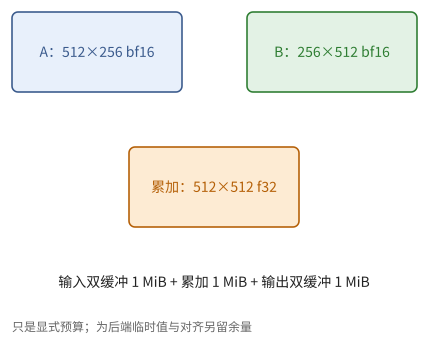
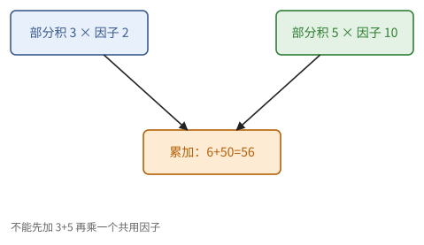
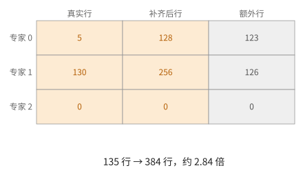

# 第 17 章　TPU kernel：矩阵乘法与访存受限算子

本章用第 16 章的手段写出 TPU 上最常用的几类 kernel：分块矩阵乘法与它的结尾融合、量化矩阵乘法、归一化与 softmax 这类访存受限的算子，以及 MoE 的分组矩阵乘法。每一节都按同样的步骤进行：先用第 6 章估出上限，再选块和 grid，最后对照第 16 章的正确性条件。本章的 kernel 都在 TPU 解释器中验证过语义。

17.1、17.2 节讲分块矩阵乘法与结尾融合；17.3 节讲量化矩阵乘法；17.4 节讲访存受限的算子；17.5 节讲分组矩阵乘法；17.6 节把审查的要点汇总成清单。

> **在体系中的位置**：下层是第 6 章的屋顶线与分块理论、第 10 章的归约、第 11 章的工作负载、第 15 章的 TensorCore、第 16 章的 Pallas。本章给出矩阵乘法块大小的选法、结尾融合、量化的缩放放在哪里、归一化的代数技巧、分组矩阵乘法的写法。第 18 章的注意力在此基础上加入在线 softmax；第 19 章加入跨芯片通信。

## 17.1 分块矩阵乘法

例 16.6 已经给出了分块矩阵乘法的结构，剩下的问题是块取多大。本节求出计算受限所需的块（命题 17.1），对照各代 TPU 的数字，并列出选块时的其他考虑。

> **命题 17.1（计算受限所需的块）** 对 $C$ 的一个 $b_M \times b_N$ 块，$K$ 循环的每一步读入 $A$、$B$ 各一块（$s b_K (b_M + b_N)$ 字节），做 $2 b_M b_N b_K$ 次运算，强度为
>
> $$
> I_{\text{块}} = \frac{2 b_M b_N}{s (b_M + b_N)}, \qquad b_M = b_N = b \text{ 时 } I_{\text{块}} = \frac{b}{s}.
> $$
>
> 要计算受限，需要 $b \ge s \cdot P / B$。

*证明* 定理 6.5 与命题 6.12 用在单个块上。∎

用 15.9 节的数字（bf16，$s = 2$）：

| 芯片 | $P / B$（FLOP/字节） | 所需的 $b$ |
| --- | ---: | ---: |
| v4（每芯片） | $275 / 1.2 \approx 229$ | $\ge 458$，取 512 |
| v5e | $197 / 0.82 \approx 240$ | $\ge 480$，取 512 |
| v6e | $918 / 1.64 \approx 560$ | $\ge 1120$ |
| Ironwood（每个芯粒） | $1154 / 3.69 \approx 313$ | $\ge 626$，取 640 或 768 |

块越大，片上存储的需求也越大：双缓冲的 $A$、$B$ 块共 $2 \times 2 s b_K b$ 字节，f32 累加器 $4b^2$，输出块双缓冲 $2 s b^2$。$b = 1024$、$b_K = 512$ 时约 12 MiB：放得进 v5e 的约 128 MiB，在 v4 的 16 MiB 中就很紧（习题 17.1）。

选块时还要考虑：

- **MXU 的形状**：$b_N$ 与 $b_K$ 应是 MXU 宽度（128 或 256）的倍数（命题 5.13）。
- **grid 的步数**：每个 grid 步都有标量簿记与发起 DMA 的固定开销，块太小时它占主导（6.2 节的"开销受限"）。
- **多核心**：在 megacore 的芯片上，`"parallel"` 的维被分给两个 TensorCore，所以 $\frac{M}{b_M} \cdot \frac{N}{b_N}$ 至少要有 2，最好远大于 2（命题 6.22）。
- **问题的形状**：$M$ 很小时（decode，命题 6.20）任何块都访存受限，这时应当让 $b_N$、$b_K$ 大、$b_M$ 等于 $M$，目标是以最大的效率读一遍权重，而不是追求强度。

> **例 17.2（一个可逐项审查的块候选）** 取 bf16 的 $b_M=b_N=512,b_K=256$。每步读 A、B 各 256 KiB，运算量 $2\cdot512^2\cdot256=134217728$ FLOP，块强度 256 FLOP/字节。双缓冲输入共 1 MiB，f32 累加器 1 MiB，双缓冲 bf16 输出再占 1 MiB，显式预算共 3 MiB。
>
> 能放下不等于达到峰值：输出写回尚未计入强度，有限 K 的序幕尾声、向量累加和实际 DMA 速率都会降低收益。这个候选的意义是三本账都能手算，再核对附录 A 中所用芯片的峰值和单位。



**图 17.1**　单个 K 步的两个输入块与跨 K 保留的输出累加块；下面把双缓冲与累加器预算分别列出。


## 17.2 结尾融合

矩阵乘法之后常常跟着逐元素的运算：加偏置、激活函数、残差加法、转换为低精度。若分开计算，$C$ 要写回 HBM 再读出来（命题 6.9）。在 kernel 的最后一个 $K$ 步，累加器还在 VMEM 中，正好在这里完成这些运算：

```python
def mm_bias_gelu_kernel(x_ref, w_ref, b_ref, o_ref, acc_ref):
    k = pl.program_id(2)

    @pl.when(k == 0)
    def _():
        acc_ref[...] = jnp.zeros_like(acc_ref)

    acc_ref[...] += jnp.dot(x_ref[...], w_ref[...], preferred_element_type=jnp.float32)

    @pl.when(k == pl.num_programs(2) - 1)
    def _():
        y = acc_ref[...] + b_ref[...].astype(jnp.float32)    # b_ref 是偏置的 (1, bn) 块
        o_ref[...] = jax.nn.gelu(y).astype(o_ref.dtype)
```

偏置的 BlockSpec 为 `pl.BlockSpec((1, bn), lambda i, j, k: (0, j))`：它只依赖于 $j$，由命题 16.3，在 $i, k$ 变化时不会重复读入。融合省掉了 $C$ 的一次写回与读出（$2 s MN$ 字节），而增加的运算在最后一步进行，与 $K$ 循环相比很少。

> **例 17.3（只能在完整和之后做的运算）** 设两部分积为 $C_0=-3,C_1=5$，偏置为 1。正确结果是 $\operatorname{ReLU}(C_0+C_1+1)=3$。若各 K 步分别加偏置，得到 $-3+1+5+1=4$；若分别做 ReLU 后相加，得到 $0+5=5$。
>
> 线性累加、按输出通道缩放和非线性激活要区分：偏置只加一次，非线性只作用在完整结果上。融合不仅决定位置，还必须保持数学顺序。


**图 17.2**　K 部分积先汇成完整 f32 结果，再执行偏置、激活、舍入与写回。结尾不能随意挪进 K 循环。


## 17.3 量化矩阵乘法

量化是 decode 最有效的加速手段之一（11.6 节）。设权重 $W$ 以 int8 存储为 $Q$，带缩放因子。本节回答两个问题：缩放放在哪里，乘法由谁来做。缩放的位置取决于缩放的粒度：

> **命题 17.4（缩放的位置）**
>
> 1. **按输出通道缩放**：$W[k, j] = s_j Q[k, j]$。则 $C[:, j] = s_j \cdot (A\, Q)[:, j]$，缩放可以在结尾对累加器乘一次。
> 2. **沿 $K$ 方向按组缩放**：$W[k, j] = s_{t, j} Q[k, j]$，$t = \lfloor k/g \rfloor$。则 $C = \sum_t (A_{:, \text{组 } t}\, Q_{\text{组 } t, :}) \odot s_{t, :}$，每一组的部分积必须先乘以这一组的缩放，再累加。

*证明* (1) 缩放不依赖于求和下标 $k$，可以提到求和之外。(2) 缩放依赖于 $k$ 所在的组，只能在组内提出。∎

所以按组缩放时，应当取 $b_K = g$（或 $g$ 的倍数，并在块内逐组处理），每个 $K$ 步把这一步的部分积乘以对应的缩放行，再加到累加器上。

量化 kernel 的另一个问题是**谁来做乘法**：

- **只量化权重**（int8 或 int4 权重，bf16 激活）：kernel 读入 int8 的 $Q$ 块，在 VMEM 中转为 bf16，再送 MXU。转换是向量单元的工作，每块 $b_K b_N$ 次，被 $b_M$ 行分摊；decode 时 $b_M$ 很小，转换可能比读权重还慢，这时要检查向量单元是否成为瓶颈。收益来自读权重的字节减半（命题 6.20）。
- **权重与激活都量化**：v5e 起 MXU 支持 int8 乘 int8、int32 累加，峰值是 bf16 的两倍；Ironwood 支持 fp8；TPU 8t 支持 fp4（15.9 节）。这在计算受限的情形下有用。

> **例 17.5（两个 K 组不能共用最后一个缩放）** 两个组的未缩放部分积分别为 3、5，缩放为 2、10。正确输出 $2\cdot3+10\cdot5=56$；先累加再乘最后一个因子得 $10(3+5)=80$。
>
> 缩放若只依赖输出列，可从求和里提出；若依赖 K 组，则每组内部先完成乘积，再乘该组因子并加到总累加器。一个更大的 $b_K$ 横跨多个缩放组时，仍须在块内部维持组边界。



**图 17.3**　组内乘积各乘自己的缩放因子，然后汇入 f32 总累加器。组边界是数值语义，不能被较大的 tile 擦掉。


## 17.4 访存受限的算子

归一化、softmax、逐元素运算都是访存受限的：强度为常数（11.2 节）。对它们，目标是**每个字节只读写一次**，并且向量单元、EUP、XLU 都跟得上 HBM。本节以 RMSNorm 和 softmax 为例，并给出一个更好的做法：把归一化折进相邻的矩阵乘法（命题 17.6）。

**RMSNorm**。对 $X \in \mathbb{R}^{N \times D}$ 的每一行 $x$，$y = x \cdot r \odot g$，$r = (\operatorname{mean}(x^2) + \varepsilon)^{-1/2}$。按行分块，每个块 $(b_N, D)$ 包含完整的行：

1. 求每行的平方和：先在寄存器之间逐元素相加，再做一次跨通道归约（习题 15.4）；
2. $r$ 用 EUP 的平方根倒数；
3. 乘以 $r$ 和 $g$，写回。

每个元素读一次、写一次，运算量很少，是标准的访存受限 kernel。

更好的做法是根本不单独做这一步。

> **命题 17.6（把归一化折进矩阵乘法）** 设 $R = \operatorname{diag}(r_1, \dots, r_N)$，$G = \operatorname{diag}(g)$，则
>
> $$
> \operatorname{RMSNorm}(X)\, W = R\, \big(X\, (G W)\big).
> $$

*证明* $\operatorname{RMSNorm}(X) = R X G$，矩阵乘法满足结合律。∎

于是：$GW$ 可以离线算好（$g$ 并入权重）；$r$ 只需一遍读 $X$ 的平方和（或者在产生 $X$ 的那个 kernel 中顺便算出）；矩阵乘法照常计算 $X(GW)$，在结尾融合中对每行乘以 $r_i$。归一化不再需要单独读写一遍 $X$。

**Softmax**（一行能放进 VMEM 时）：求最大值（跨通道归约）、减去最大值后求指数（EUP）、求和（跨通道归约）、乘以和的倒数（EUP）。每个寄存器大小的块要两次 XLU 归约和若干次 EUP 运算；按 15.3 节的数字，EUP 每 2 个周期一块、XLU 每 8 个周期一块（两个 XLU 时每 4 个周期），而 HBM 每块（4 KiB）约 4.4 个周期（v4）。XLU 与 HBM 的速度相当，所以要先在寄存器之间做部分归约，减少跨通道归约的次数。一行放不进 VMEM 时，用在线 softmax（命题 10.4），或者干脆与后续的计算融合（第 18 章）。

> **例 17.7（折进权重的前提）** 设 $x=(3,4)$，$g=(2,1)$，$W=(1,2)^{\mathsf T}$，忽略 epsilon，则 $r=\sqrt2/5$。先归一化并乘 g，再投影得 $r(6+8)=14r$；先令 $W'=GW=(2,2)^{\mathsf T}$，计算 $xW'=14$，结尾乘 r，结果相同。
>
> 这是精确算术的恒等式。推理时 g 与 W 固定，可以预合并；训练时 g 或 W 更新后必须重新构造 W′，自动微分也要保持对原参数的依赖。量化、舍入或额外非线性会使两条数值路径不再逐位相同。


## 17.5 分组矩阵乘法

MoE 层（11.5 节）把词元按专家排序后，要对每个专家 $e$ 计算 $Y_e = X_e W_e$，各组的行数 $n_e$ 不同。本节给出两种写法：把每组补齐到块，或者不补齐。

**补齐到块的做法。** 把每个专家的行数补齐到 $b_M$ 的倍数，于是每个行块恰好属于一个专家。用标量预取传入"第 $i$ 个行块属于哪个专家"的数组 `tile_expert`，权重的下标映射据此选择专家：

```python
def gmm(x, w, tile_expert, bm=128, bn=128, bk=128):
    # x: [T, K]，行已按专家排序并补齐；w: [E, K, N]；tile_expert[i] 是第 i 个行块的专家
    T, K = x.shape
    E, _, N = w.shape
    grid_spec = pltpu.PrefetchScalarGridSpec(
        num_scalar_prefetch=1,
        grid=(T // bm, N // bn, K // bk),
        in_specs=[pl.BlockSpec((bm, bk), lambda i, j, k, te: (i, k)),
                  pl.BlockSpec((1, bk, bn), lambda i, j, k, te: (te[i], k, j))],
        out_specs=pl.BlockSpec((bm, bn), lambda i, j, k, te: (i, j)),
        scratch_shapes=[pltpu.VMEM((bm, bn), jnp.float32)],
    )
    return pl.pallas_call(
        gmm_kernel,                      # 与例 16.6 的 mm_kernel 相同，只是用 w_ref[0]
        out_shape=jax.ShapeDtypeStruct((T, N), x.dtype),
        grid_spec=grid_spec,
        compiler_params=pltpu.CompilerParams(
            dimension_semantics=("parallel", "parallel", "arbitrary")),
    )(tile_expert, x, w)
```

由命题 16.3，相邻的行块属于同一个专家时，权重块不会因为专家改变而重新读入（但仍会因 $k$、$j$ 的改变而读入，与普通矩阵乘法相同）。

**补齐的代价。** 每个专家至多补 $b_M - 1$ 行，总共至多 $E(b_M - 1)$ 行无用计算。decode 时 $n_e$ 很小（命题 11.10），补齐可能比真实的行还多。

**不补齐的做法。** 让一个行块可以跨越两个专家的边界：grid 遍历的是"（行块，专家）对"，一个跨越边界的行块被访问两次，每次只保留属于当前专家的行（用掩码），写回时也只写这些行。每条组边界至多增加一次访问，所以访问次数不超过 $\lceil T / b_M \rceil + E$，而无用计算来自掩码掉的行，同样不超过 $E \cdot b_M$ 行，但不需要在 HBM 中存放补齐的数据。这需要预取两个数组（每次访问的行块号与专家号），以及在结尾写回时用掩码。

> **例 17.8（补齐怎样吞掉小组的工作）** 三个专家分别有 5、130、0 行，$b_M=128$。补齐后行数为 128、256、0，总共 384，而真实只有 135，行工作膨胀到约 2.84 倍。空专家应跳过，不能生成一个只有填充的块。
>
> 分组 GEMM 的性能不能只由所有词元总数判断，还取决于组的分布和边界。对小组，缩小行块或让调度按有效区间组织，可能比增加矩阵块的强度更有价值。



**图 17.4**　真实组边界与按 128 行补齐后的布局。橙色是有效词元，灰色是空转区域；空组没有任何计算块。


## 17.6 审查要点

最后把本章的检查步骤汇总起来。审查一个 TPU 矩阵乘法类 kernel 时，按以下顺序检查：

1. **上限**：按命题 17.1 与命题 6.20 估出它应当是计算受限还是访存受限，时间下界是多少。
2. **块与布局**：块的最后两维满足 $(8, 128)$ 的倍数（窄类型更大）；$b_N, b_K$ 是 MXU 宽度的倍数；VMEM 预算放得下。
3. **正确性**：累加器是 f32、在第一个 $K$ 步清零、只在最后一步写出；$K$ 维是 `"arbitrary"`（命题 16.2、16.9）。
4. **数据量**：用命题 16.3 数一数每个输入被读了几次，与命题 6.12 的理想值比较。
5. **融合**：紧跟的逐元素运算是否放进了结尾；归一化能否折进矩阵乘法（命题 17.6）。
6. **量化**：缩放的位置是否符合命题 17.4；只量化权重时，转换的向量运算是否成为瓶颈。

> **例 17.9（从一句规格得到四条不变量）** 规格为 $Y=\operatorname{ReLU}(XW+b)$，bf16 输入输出、f32 累加。审查先写：每个输出块只有一个逻辑所有者；第 k 步累加器等于前 k+1 个 K 块的和；偏置和 ReLU 只在最后一步；输出写回完成后才复用其缓冲。
>
> 再用命题 16.3 数 A、B 的读入次数。这样可分别定位数学错误、状态错误、同步错误和额外流量；某组随机样本算对不能代替这四种论证。


## 接口小结

1. 正方形块 $b$ 的强度是 $b/s$；计算受限需要 $b \ge sP/B$，bf16 时在 v4/v5e 上约 512，v6e 上约 1100，Ironwood 每芯粒约 640。块的大小还受 VMEM、MXU 形状、grid 步数与核心数限制。（命题 17.1）
2. 逐元素的后续运算融合进最后一个 $K$ 步，省掉 $C$ 的一次往返。（17.2 节）
3. 按输出通道缩放在结尾乘一次；沿 $K$ 按组缩放必须在每组累加前乘。只量化权重的收益来自字节数，要检查转换是否成为瓶颈。（命题 17.4、17.3 节）
4. 访存受限的算子应每字节只读写一次，并让 XLU、EUP 跟上 HBM；RMSNorm 可以折进后续的矩阵乘法。（17.4 节、命题 17.6）
5. 分组矩阵乘法用标量预取选择专家的权重；补齐至多浪费 $E(b_M - 1)$ 行，不补齐时访问次数至多 $\lceil T/b_M \rceil + E$。（17.5 节）
6. 审查顺序：上限、块与布局、正确性、数据量、融合、量化。（17.6 节）

## 习题

**习题 17.1** ★ 在 v4 的一个 TensorCore 上（VMEM 16 MiB），bf16 矩阵乘法取 $b_M = b_N = b$，$b_K = 512$，输入块与输出块都双缓冲，累加器为 f32。$b$ 最大能取 128 的多少倍？这个 $b$ 能否满足命题 17.1？

<details><summary>提示 1</summary>

容量账按双缓冲输入、f32 累加、双缓冲输出三类相加；先不计隐藏临时空间。

</details>
<details><summary>提示 2</summary>

VMEM：$2 \times 2 \times 512 b \times 2$（$A$、$B$ 双缓冲）$+ 4b^2$（累加器）$+ 2 \times 2b^2$（输出双缓冲）$\le 16$ MiB。

</details>
<details><summary>答案</summary>

约束 $4096 b + 8 b^2 \le 16777216$。$b = 1280$ 时 $5.2 \times 10^6 + 1.31 \times 10^7 \approx 1.83 \times 10^7$，超出；$b = 1152$ 时 $4.7 \times 10^6 + 1.06 \times 10^7 \approx 1.53 \times 10^7$，满足。所以最大取 1152（9 倍的 128）。命题 17.1 要求 $b \ge 458$，满足；实际上 $b = 512$ 就够，剩下的 VMEM 可以留给更深的预取或融合的数据。

</details>

**习题 17.2** ★ $M = N = 8192$、$K = 4096$ 的 bf16 矩阵乘法后跟偏置和 GELU。在 v5e 上（$P = 197$ TFLOP/s，$B = 0.82$ TB/s）比较融合与不融合的时间下界。

<details><summary>提示 1</summary>

融合前后 FLOP 主项基本相同，改变的是中间 C 的一次往返与启动。

</details>
<details><summary>提示 2</summary>

矩阵乘法本身：运算 $2MNK$，数据量用 $b = 512$ 的分块估计。不融合时，GELU 要读写一次 $C$。

</details>
<details><summary>答案</summary>

运算 $2 \times 8192^2 \times 4096 \approx 5.5 \times 10^{11}$，约 2.79 ms。数据量：$A$、$B$ 各被读 $8192/512 = 16$ 次，$2 \times 2 \times 8192 \times 4096 \times 16 \approx 2.1$ GB，加上写 $C$ 的 134 MB，约 2.28 GB，约 2.8 ms，与计算相当（$b = 512$ 刚好在拐点附近）。不融合时还要读写 $C$ 各一次（268 MB），约 0.33 ms，总时间约 3.1 ms 以上；融合后约 2.8 ms。另外，若 $b$ 取 1024，矩阵乘法部分的数据量减半，变为明确的计算受限。

</details>

**习题 17.3** ★ 权重 $W \in \mathbb{R}^{4096 \times 4096}$ 以 int8 存储，沿 $K$ 方向每 128 个元素一组、每组每列一个缩放因子。(a) 缩放因子共有多少个？占多少字节（bf16）？(b) 写出 kernel 中每个 $K$ 步（$b_K = 128$）的累加语句。(c) 若作者把所有缩放留到结尾、对累加器乘一个"平均缩放"，错在哪里？

<details><summary>提示 1</summary>

缩放依赖组号和输出列；两维的组合数决定元数据大小。

</details>
<details><summary>提示 2</summary>

命题 17.4 的第 2 条。

</details>
<details><summary>答案</summary>

(a) $32 \times 4096 = 131072$ 个，256 KiB，相对 16 MiB 的权重约 1.6%。(b) `acc_ref[...] += jnp.dot(x_ref[...], q_ref[...].astype(jnp.bfloat16), preferred_element_type=jnp.float32) * s_ref[...]`，其中 `s_ref` 是这一组的 $(1, b_N)$ 缩放行。(c) 缩放依赖于组，不能提到对 $k$ 的求和之外；用平均值代替，相当于对每组的部分积乘错了因子，误差与各组缩放的差异成正比。

</details>

**习题 17.4** ★ 证明命题 17.6 中 $r$ 的计算可以与前一个算子融合：设 $X = X_0 + F(X_0)$（残差加法），说明如何在计算 $X$ 的 kernel 中顺便算出每行的 $r$，以及这样做在数据量上省了什么。

<details><summary>提示 1</summary>

只有完整行 X 可用时才能求其平方和；先确定它是否全部驻留同一逻辑任务。

</details>
<details><summary>提示 2</summary>

计算 $X$ 的 kernel 已经把 $X$ 的每一行放在 VMEM 中。

</details>
<details><summary>答案</summary>

在写出 $X$ 的每个行块之前，对它的每一行求平方和（先寄存器间相加，再跨通道归约），写出 $r$（每行一个数）。之后的矩阵乘法读 $X$ 与 $r$，计算 $r_i \cdot (X (GW))_{i,:}$。与单独的 RMSNorm kernel 相比，省掉了读 $X$、写归一化结果、再读归一化结果的三遍，换成只多写、多读 $N$ 个数。

</details>

**习题 17.5** ★ 一个 MoE 层有 $E = 64$ 个专家，decode 一步共 $T = 512$ 个（词元，专家）对，大致均匀分布。$b_M = 128$。(a) 补齐的做法中，有多少行是补出来的？无用计算占多少？(b) 不补齐的做法中，最多访问多少个行块？(c) 若 $b_M$ 改为 8 呢？

<details><summary>提示 1</summary>

先算每专家真实行数，再分别向上取整；空专家无需输出块。

</details>
<details><summary>提示 2</summary>

每个专家约 8 行。

</details>
<details><summary>答案</summary>

(a) 每个专家约 8 行，补到 128 行，共补约 $64 \times 120 = 7680$ 行，无用计算约 $7680 / 8192 \approx 94\%$。(b) 至多 $\lceil 512/128 \rceil + 64 = 68$ 次访问，每次算 128 行、只保留其中一部分，无用计算同样很多，但不需要存补齐的数据。(c) $b_M = 8$ 时补齐几乎为零，但 MXU 每次只处理 8 行，填充与排空的代价（命题 5.8）和每步的固定开销都很大。decode 中 MoE 本来就访存受限（命题 11.10），所以真正的目标是以最高效率读一遍所有专家的权重，行数的浪费是次要的。

</details>

**习题 17.6** ★（审查题）AI 写的只量化权重的矩阵乘法用于 decode（$M = 8$），每个 $K$ 步把 $(b_K, b_N) = (2048, 2048)$ 的 int4 权重块解包、转成 bf16，再做矩阵乘法。测得时间是"读权重时间"的 3 倍。可能的原因是什么？

<details><summary>提示 1</summary>

拆包和格式转换属于向量工作，不能拿矩阵峰值去估它。

</details>
<details><summary>提示 2</summary>

每块要做多少次向量运算？与读这一块的时间比较。

</details>
<details><summary>答案</summary>

每块 $2048 \times 2048 = 4$ M 个元素要解包（移位、掩码）、转换、可能还要乘缩放，每个元素若干次向量运算；按向量单元每周期 2048 次运算计，约需数千到一万个周期。而读这一块 int4 权重只有 2 MiB，在 v5e 上约 2.5 µs，约 4000 个周期。所以向量单元成了瓶颈，读权重省下的时间被转换吃掉。对策：用更便宜的解包方式（与硬件的打包格式对齐，减少移位与掩码）、把缩放移到结尾（若是按输出通道缩放）、或者让 MXU 直接接受窄格式（若硬件支持）。

</details>

**习题 17.7** ☆ 估计 v4 上对 $(8192, 4096)$ 的 bf16 矩阵逐行做 softmax（每行在 VMEM 中）的时间下界，分别按 HBM、EUP、XLU 计算，看哪个是瓶颈。

<details><summary>提示 1</summary>

分别给输入输出、指数、行最大值与行和建立资源账；先在寄存器间归约能减少 XLU 次数。

</details>
<details><summary>提示 2</summary>

bf16 打包后每个寄存器 $16 \times 128$ 个元素；计算在 f32 中进行，每个 f32 寄存器 $8 \times 128$。EUP 每 2 周期一个寄存器，XLU 每 8 周期一个（两个 XLU）。

</details>
<details><summary>答案</summary>

元素数 $3.4 \times 10^7$。HBM：读写各 64 MiB，约 $128 \times 1024 \times 1.1 \approx 1.44 \times 10^5$ 个周期。EUP：f32 寄存器 32768 个，指数一次、倒数可以每行一次（可忽略），约 $6.6 \times 10^4$ 个周期。XLU：若每个 f32 寄存器都做两次跨通道归约，$2 \times 32768 \times 8 / 2 \approx 2.6 \times 10^5$ 个周期，超过 HBM；先在寄存器之间把每行的 32 个块相加，跨通道归约降为每 8 行两次，即 $2 \times 1024 \times 4 \approx 8000$ 个周期。所以按正确的方式写，瓶颈是 HBM，约 0.14 ms。

</details>

**习题 17.8** ★（综合审查题）AI 在每个 K 块后执行 ReLU，再将结果相加。两部分积分别是 $-7$ 和 $3$，偏置为 5。比较正确输出与两种错误写法：每块各加偏置做 ReLU再相加；先 ReLU各块再加一次偏置。

<details><summary>提示 1</summary>

非线性必须作用于完整的和；偏置不依赖 K，只应计一次。

</details>
<details><summary>提示 2</summary>

正确式为 $\max(-7+3+5,0)$，分别展开另两式。

</details>
<details><summary>答案</summary>

正确为 1。第一种为 $\max(-7+5,0)+\max(3+5,0)=8$；第二种为 $\max(-7,0)+\max(3,0)+5=8$。正确融合位置是完成全部 K 累加之后、最终舍入和写回之前。

</details>
