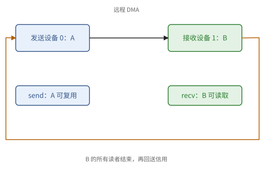
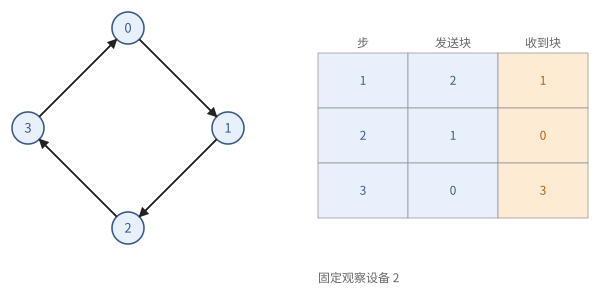
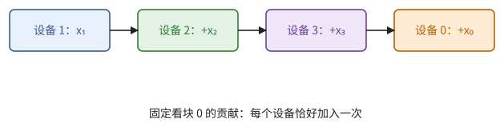
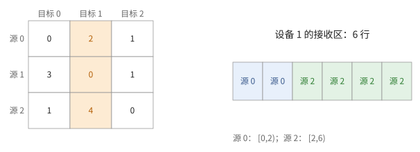
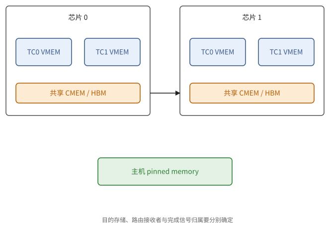

# 第 19 章　TPU 多芯片编程

第 14 章用 `shard_map` 与集合原语写多设备程序，集合通信由编译器实现。大多数时候这就够了。但有两类情形需要自己写通信：一是要把通信与计算交织在一起，让每一块数据一到就开始计算（命题 7.18）；二是需要编译器没有提供的通信模式。Pallas 允许在 kernel 中直接向另一颗芯片的存储发起 DMA。19.1、19.2 节讲远程 DMA 的语义与启动时的屏障；19.3、19.4 节用它写出环形 all-gather 与 reduce-scatter，并论证其正确；19.5–19.7 节讲通信与计算的重叠、all-to-all 与多维网格。

本章的 kernel 都放在 8 台模拟设备上的 `shard_map` 中，用 Pallas 的 TPU 解释器运行过。第一个版本的 all-gather 在解释器中出了错，这个错误本身就是本章最重要的例子（例 19.5）。

> **在体系中的位置**：下层是第 7 章的集合操作与环形算法、第 9 章的先行发生与信号量、第 12 章的并行策略、第 14 章的 `shard_map`、第 15 章的 ICI、第 16 章的手动 DMA。本章给出 Pallas 远程 DMA 的语义、屏障、环形 all-gather 与 reduce-scatter 的写法和正确性论证、通信与计算的重叠，以及 all-to-all。

## 19.1 远程 DMA

跨芯片的 kernel 只需要一个新的原语：向另一台设备的存储发起 DMA。本节给出它的写法与语义（定义 19.1），并说明它建立了哪些先行发生关系。

```python
copy = pltpu.make_async_remote_copy(
    src_ref=..., dst_ref=..., send_sem=..., recv_sem=...,
    device_id=(target,), device_id_type=pl.DeviceIdType.MESH)
copy.start()
copy.wait_send()     # 本设备：源数据已读完，源缓冲可以复用
copy.wait_recv()     # 本设备：别的设备发给本设备的、同样大小的数据已写入
```

> **定义 19.1（远程 DMA）** 远程 DMA 把本设备的 `src_ref` 拷贝到目标设备的 `dst_ref`。`device_id` 是目标设备在网格中的坐标（`MESH`），也可以是逻辑编号（`LOGICAL`）。两个信号量的作用不同：
>
> - `send_sem` 在**发送方**，源数据读完时增加；
> - `recv_sem` 在**接收方**（目标设备上同名的那个信号量），数据写入完成时增加。

所以一次远程 DMA 建立了两条先行发生关系（定义 9.1）：发送方等 `send_sem` 返回之后，可以复用源缓冲（命题 9.4）；接收方等 `recv_sem` 返回之后，可以读目标缓冲（命题 9.3）。

远程 DMA 只能在 `shard_map` 之内的 kernel 中使用，设备坐标由 `jax.lax.axis_index` 得到。通常每个设备同时是发送方和接收方：它向右邻居发送，同时接收左邻居发来的数据。`copy.wait_recv()` 等待的是"发给本设备的、与这个描述符同样大小的数据"，而不一定是本设备发出的那一份。

除 DMA 外，还可以只发信号：`pl.semaphore_signal(sem, n, device_id=...)` 使目标设备上的信号量增加 $n$，`pl.semaphore_wait(sem, n)` 等待本设备的信号量。

> **例 19.2（发送结束与接收结束各保护一边）** 设备 0 发缓冲 A 给设备 1 的 B。设备 0 等发送完成后可覆盖 A；设备 1 等接收完成后可读 B。设备 0 收到自己的发送完成，并不授权设备 1 提前读取；设备 1 读完 B，也不会自动通知设备 0 下一次可写 B。
>
> 复用远端 B 还需要设备 1 回送“旧读者已结束”的信用。发送完成、接收完成、接收消费完成是三个不同的事件。



**图 19.1**　同一次远程 DMA 的两个完成对象各在一台设备上；接收方消费完后另回送信用，授权下一轮覆盖。


## 19.2 启动屏障

一个设备向邻居的存储写入之前，必须确定邻居**已经进入了这个 kernel**：否则目标缓冲可能还属于邻居正在执行的上一个程序。所以跨设备的 kernel 在开始时要与邻居同步：

```python
def barrier_with_neighbours(left, right):
    sem = pltpu.get_barrier_semaphore()
    pl.semaphore_signal(sem, 1, device_id=(left,), device_id_type=pl.DeviceIdType.MESH)
    pl.semaphore_signal(sem, 1, device_id=(right,), device_id_type=pl.DeviceIdType.MESH)
    pl.semaphore_wait(sem, 2)
```

每个设备先通知左右邻居"我已进入"，再等待两个邻居的通知。这正是命题 9.14 中"先 signal 后 wait"的形式，不会死锁。使用屏障信号量的 kernel 要在编译参数中给出 `collective_id`：`pltpu.CompilerParams(collective_id=0)`。

> **例 19.3（局部进入不等于邻居已进入）** 设备 0 已进入通信 kernel，设备 1 还在运行前一 kernel。若设备 0 立即向设备 1 的 scratch 地址写数据，该地址可能尚未属于新 kernel。邻居屏障先交换“已进入”的信号，才能把两方的新缓冲生命周期对齐。
>
> 它只证明参与者进入同一轮协议；后续每个槽的满、空条件仍要另外建立。启动屏障不能代替稳态中的消费确认。


## 19.3 环形 all-gather

有了远程 DMA 和屏障，就可以写出第 7 章的环形算法。本节写出 all-gather，证明它正确（命题 19.4），再分析本章最初那个版本的错误（例 19.5）。

每个设备有一块 $x$（$b_M \times n$），要得到 $p$ 块拼成的完整数组（定义 7.8）。按 7.5 节的环形算法：第 $t$ 步（$t = 1, \dots, p - 1$），设备 $r$ 把它在上一步收到的块（第 1 步是自己的块）转发给右邻居。设备 $r$ 在第 $t$ 步转发的是第 $(r - t + 1) \bmod p$ 块，收到的是第 $(r - t) \bmod p$ 块。

```python
def allgather_kernel(x_ref, o_ref, send_sems, recv_sems):
    me = jax.lax.axis_index("x")
    p = jax.lax.axis_size("x")                       # Python 整数，下面的循环在追踪时展开
    right = jax.lax.rem(me + 1, p)
    left = jax.lax.rem(me + p - 1, p)
    bm = x_ref.shape[0]

    barrier_with_neighbours(left, right)
    pltpu.sync_copy(x_ref, o_ref.at[pl.ds(me * bm, bm)])    # 自己的块放进自己的位置

    for t in range(1, p):
        src = jax.lax.rem(me - t + 1 + p, p)          # 上一步收到的块
        slot = o_ref.at[pl.ds(src * bm, bm)]
        copy = pltpu.make_async_remote_copy(
            src_ref=slot, dst_ref=slot,                # 写到右邻居输出的同一位置
            send_sem=send_sems.at[t], recv_sem=recv_sems.at[t],
            device_id=(right,), device_id_type=pl.DeviceIdType.MESH)
        copy.start()
        copy.wait_send()
        copy.wait_recv()                               # 第 (me - t) 块已从左邻居到达
```

调用方式：输入与输出都留在 HBM（`memory_space=pl.ANY`），输出形状为 $(p\,b_M, n)$，scratch 为两组各 $p$ 个 DMA 信号量，编译参数含 `collective_id`；整个 `pallas_call` 放在 `jax.shard_map(..., in_specs=P("x", None), out_specs=P(None, None), check_vma=False)` 之中。

> **命题 19.4（正确性）** 上述 kernel 没有数据竞争，结束时每个设备的输出都是完整的数组。

*证明* 写：每个设备输出的每个位置恰好被写一次（自己的位置由 `sync_copy` 写，第 $(r - t) \bmod p$ 个位置在第 $t$ 步由左邻居写），所以不存在覆盖，不需要"缓冲已空"的信号（命题 9.4 自动满足）。读：第 $t$ 步转发的第 $(r - t + 1)$ 块，是在第 $t - 1$ 步由左邻居写入的；第 $t - 1$ 步的 `wait_recv` 等的是第 $t - 1$ 个接收信号量，只有那一次 DMA 会增加它，所以它返回时这一块确实已经写入（命题 9.3）。远程写入发生在屏障之后，邻居已经进入 kernel。∎

> **例 19.5（第一个版本的错误）** 本章最初写的版本只用了**一个**发送信号量和**一个**接收信号量，每一步都复用它们。在解释器的默认模式下（DMA 推迟到有人等待时才执行），结果中有些块是未初始化的值；在"立即执行 DMA"的模式下结果却是对的。

原因正是注 9.7。各设备的进度并不一致：设备 $r - 1$ 完成第 $t$ 步之后，只要它自己的左邻居够快，就可以进入第 $t + 1$ 步，向设备 $r$ 发出第二个 DMA，而此时设备 $r$ 还在等第 $t$ 步的数据。两个发往设备 $r$ 的 DMA 同时在途，都增加同一个接收信号量，大小也相同。设备 $r$ 的 `wait_recv` 可能被**后发的那个**满足；它以为第 $(r - t)$ 块已经到了，在下一步把这个尚未写入的位置转发了出去，错误的数据于是沿环传播。改为每一步一个信号量之后，第 $t$ 步的等待只能被第 $t$ 步的 DMA 满足，错误消失。

这个例子有三点教训：

1. 计数信号量只计数，不记名。凡是可能有两个异步操作同时增加同一个信号量的地方，都要检查等待者是否会被错误的那一个满足。
2. "通常情况下"各设备步调一致，这个错误在真实硬件上可能很少出现，测试难以发现；它是通过推理或解释器发现的。
3. 解释器的推迟执行模式是一个有用的对抗性测试：它让异步操作以最晚的时刻完成，更容易暴露同步的漏洞。

> **例 19.6（四设备上的源块不变量）** 顺时针环 $0\to1\to2\to3\to0$。设备 2 初始持块 2，第 1 步发 2 收 1，第 2 步发 1 收 0，第 3 步发 0 收 3。收到的块放在全局块号位置，最终依次为 0、1、2、3。
>
> 第 t 步的接收等待必须证明块 $(2-t)\bmod4$ 已写好；“收到过一块”不够。每步独立完成对象保存的正是这个身份信息。



**图 19.2**　四设备环上每步的块号。表格固定看设备 2，显示它发送和接收的块身份，而不是只有累计字节数。


## 19.4 环形 reduce-scatter

reduce-scatter 的结构与 all-gather 相同，只是每一步转发之前要加上自己的贡献，因而必须在 VMEM 中进行。

每个设备有完整的 $x_r$（$p$ 块），要得到总和的第 $r$ 块（定义 7.8）。第 $b$ 块的部分和从设备 $b + 1$ 出发，沿环经过 $p - 1$ 次转发到达设备 $b$，每经过一个设备就加上它的贡献。所以设备 $r$ 在第 $t$ 步转发的是第 $(r - t) \bmod p$ 块的部分和：第 1 步是自己的贡献，之后是"上一步收到的部分和 + 自己的贡献"。

```python
def rs_kernel(x_ref, o_ref, send_buf, recv_buf, send_sems, recv_sems):
    me = jax.lax.axis_index("x")
    p = jax.lax.axis_size("x")
    right = jax.lax.rem(me + 1, p)
    left = jax.lax.rem(me + p - 1, p)
    bm = o_ref.shape[0]
    barrier_with_neighbours(left, right)

    def own(b):                                       # 本设备对第 b 块的贡献
        return x_ref[pl.ds(b * bm, bm), :]

    for t in range(1, p):
        b = jax.lax.rem(me - t + p, p)
        partial = own(b) if t == 1 else recv_buf[t - 1] + own(b)
        send_buf[t] = partial
        copy = pltpu.make_async_remote_copy(
            src_ref=send_buf.at[t], dst_ref=recv_buf.at[t],
            send_sem=send_sems.at[t], recv_sem=recv_sems.at[t],
            device_id=(right,), device_id_type=pl.DeviceIdType.MESH)
        copy.start()
        copy.wait_send()
        copy.wait_recv()                              # 第 (me - t - 1) 块的部分和已到达
    o_ref[...] = recv_buf[p - 1] + own(me)
```

这里输入、输出与缓冲都在 VMEM 中（加法要在 VMEM 中进行）；scratch 是 `VMEM((p, bm, n))` 的发送与接收缓冲各一组，以及两组 DMA 信号量。

**验证**：第 $t$ 步收到的是第 $(r - 1) - t$ 块（左邻居第 $t$ 步转发的块），它在第 $t + 1$ 步作为 $b = r - t - 1$ 被使用，一致。最后一步收到第 $r - p = r$ 块的部分和，它含有其余 $p - 1$ 个设备的贡献，再加上自己的贡献即为完整的和。

这个版本为每一步分配一个接收位置，用 $(p - 1)$ 块的 VMEM 换取了简单的正确性论证（每个位置只写一次）。只用两个接收缓冲交替使用时，接收方必须先告诉发送方"这个缓冲已经用完"，发送方才能向它写入下一块：这是一个反向的信号（"信用"，7.9 节），用 `pl.semaphore_signal` 发给左邻居（习题 19.3）。

> **例 19.7（一块部分和怎样走到所有者）** 看最终属于设备 0 的块：设备 1 先发自己的贡献 $x_1^{(0)}$；设备 2 加 $x_2^{(0)}$ 后转发；设备 3 再加 $x_3^{(0)}$；设备 0 收到后加 $x_0^{(0)}$。这条路径经过每个贡献恰一次，最后停在块所有者。
>
> all-gather 转发完整块，reduce-scatter 转发尚在增长的部分和。两者都用环，但缓冲中数据的数学含义不同，不能只改 kernel 名字就得到另一算法。



**图 19.3**　块 0 的部分和从设备 1 出发，逐站加本地贡献，最后到设备 0。颜色标出新加入的贡献。


## 19.5 通信与计算的重叠

本章开头说的第一类情形，是让通信与计算交织。把 19.3 节的 all-gather 与矩阵乘法结合：每一步在发起转发之后、等待之前，先用已经在手中的块做计算：

```python
for t in range(1, p):
    copy = ...                        # 转发上一步收到的块
    copy.start()
    compute_on_block(src)             # 用手中的块计算，与 DMA 同时进行
    copy.wait_send()
    copy.wait_recv()
compute_on_block(last_received)
```

由命题 7.18，若每块的计算时间不少于每步的通信时间，通信几乎完全被掩盖。这就是例 14.4 的手写版本；与 `shard_map` 中用 `ppermute` 写的版本相比，它把通信、等待与计算的次序完全交给了程序员，也就把正确性的责任交给了程序员。

> **例 19.8（八块的重叠留下多少尾巴）** 每块通信 2、计算 3，8 块两级流水线用时 $2+3+7\cdot3=26$，串行则为 40。除首块通信和末块计算的边界外，稳态每 3 完成一块。
>
> 若通信和计算都大量读取同一 HBM，互不干扰的模型不再适用。应重新估有效带宽和每块计算时间，不能仅因 `.start()` 写在 `.wait()` 前就声称达到了 26。


## 19.6 all-to-all 与 MoE 的分发

all-to-all 中，每个设备要向其余每个设备发送一块（定义 7.8）。在 Pallas 中可以同时发起 $p - 1$ 个远程 DMA，**每个目标各用一对信号量**（注 9.7），然后等待全部完成。数据在环面上经过多跳由 ICI 的路由完成，但所需时间受二分带宽限制（命题 7.5）。MoE 的分发还要先知道每个目标要发多少行：通常先交换一次"计数"，再按计数发送数据，接收方据此确定写入位置。

> **例 19.9（计数矩阵决定接收区间）** 三设备的发送行数矩阵为
> $$
> N=\begin{pmatrix}0&2&1\\3&0&1\\1&4&0\end{pmatrix},
> $$
> 第 r 行第 q 列表示 r 发给 q 的行数。设备 1 接收源 0 的 2 行与源 2 的 4 行，可预定区间 $[0,2)$、$[2,6)$。若只知道总数 6，却没有源到区间的映射，两发送方可能覆盖同一位置。
>
> 各目标的数据长度也可能不同；等待必须与各描述符的大小对应。计数交换既用于容量，也用于确定地址与同步计数。



**图 19.4**　发送计数矩阵按列看接收方。设备 1 将来自不同源的行放在不重叠的接收区间。


## 19.7 多维网格

网格有多个轴时，`device_id` 是坐标的元组，例如 `(i, j)`；沿某一个轴的环只改变那个坐标。第 7 章的多维环面算法（命题 7.17）在 Pallas 中就是：先沿第一个轴做 reduce-scatter，再沿第二个轴，最后反向做 all-gather，每一阶段都用本章的单环 kernel，只是坐标与数据量不同。

> **现状（2026-10）**：XLA 为 TPU 生成的集合通信已经针对拓扑做了优化；较新的 TPU 还把一部分集合通信交给 SparseCore 或专门的集合通信单元（15.7、15.9 节）。手写的 Pallas 集合通信适合两种情形：需要与计算细粒度地交织；或需要编译器没有提供的模式。否则应当优先使用 `shard_map` 中的集合原语。

> **例 19.10（沿一个轴通信保持其他坐标）** mesh $\{x:2,y:4\}$。设备 $(1,2)$ 沿 y 的右邻居为 $(1,3)$，沿 x 的邻居为 $(0,2)$。若只把局部编号 2 加一而忽略它属于哪条轴，可能把数据送到错误子组。
>
> 逐轴归约时，后一个轴接收到的数组通常已被前一个轴切分，消息尺寸随阶段改变。坐标变化与数据形状变化都要在每个阶段重新写清。


## 19.8 跨核心、共享存储与主机

定义 19.1 分清发送完成与接收完成，例 15.7 分清每核心私有存储与芯片共享存储。本节把通信的目的地从设备编号扩展为“设备、核心、内存空间、区间”，再用命题 9.4 说明何时可以复用。拓扑与完成协议先确定，才有资格比较不同搬运路径的代价。

> **定义 19.11（带存储归属的端点）** 一个通信端点记为 $(d,c,m,[a,a+S))$：$d$ 是设备，$c$ 是核心或共享域，$m$ 是内存空间，区间给出该空间中的位置与字节数。协议还需指定完成信号的归属；目的数据空间与目的信号空间未必相同。

同芯片两 TensorCore 的 VMEM 交换，与跨芯片 VMEM 交换都要证明入口就绪、源读完和目的写完；共享 HBM 或 CMEM 不会取消这些条件。两个生产者若各自拥有不相交区间，可以并行；写同一区间则必须仲裁。共享存储只说明可达性，不提供数据版本或消费者完成通知。

> **例 19.12（换数据空间不能只改端点名称）** 一条原本写远端 TC VMEM 的 DMA，机器操作数写了目的存储，路由描述符还可能写了目标 TensorCore。若改成远端芯片共享 CMEM，却保留 TC 的路由覆盖字段，二者可能冲突；目的完成信号仍可能属于负责等待的 TC。
>
> 因此需要分别审查载荷终点、路由接收者、信号接收者和分配生命周期。“把 vmem 改成 cmem”不是完整规格。

> **现状（2026-10-08）**：教程在 v4 上展示 CMEM 的 staging 与直接读取、TC 间 remote DMA、跨芯片 CMEM 搬运及 pinned host memory。远端 CMEM 的路由修改与 CMEM scratch 分配限制均绑定其编译环境，见附录 B、E。共享 HBM 带宽和双向交换的资源争用不能按“两个 TC”直接乘二；主机路径另有固定开销、地址单位和公开接口限制。

第 14 章的卸载用主机容量换 HBM 容量；从 kernel 搬主机数据还要问：数据是否锁页（pinned），生命周期能否覆盖 DMA，主机何时可修改它，以及本次路径的启动开销。把数组标为 `pinned_host` 只解决放置问题，不自动建立长期通信协议。

> **命题 19.13（持久循环的槽位信用）** 设主机与设备通过有限槽位反复交换请求，每个槽有版本号 $v$。若生产者只在收到该槽版本 $v$ 的消费完成后发布 $v+1$，消费者只在收到版本 $v+1$ 的写入完成后读取，且发布/观察具有覆盖双方的可见性保证，则同一槽的相邻版本不会竞争。

*证明* 命题 9.3 给出写入完成到读取的边；命题 9.4 给出旧版本全部读者结束到新版本写入的边。版本身份阻止前一轮留下的完成标志授权后一轮，两条边逐轮归纳即可。∎

一个不退出的 kernel 可以摊薄反复启动开销，但需要这一整套信用协议，还需要主机与设备都能取得执行进展。教程中的持久主机流使用版本绑定的私有接口；本书把它保留为协议模型，不给读者一个貌似可直接运行的公开 API 例子。




**图 19.5**　共享域与核心私有域分开；下方的环演示块身份，实际协议还需完成与信用。

<div class="widget" data-widget="ring"></div>

## 接口小结

1. 远程 DMA：`make_async_remote_copy(src, dst, send_sem, recv_sem, device_id=..., device_id_type=pl.DeviceIdType.MESH)`；`send_sem` 在发送方表示源已读完，`recv_sem` 在接收方表示数据已写入；`wait_recv` 等的是发给本设备的同样大小的数据。（定义 19.1）
2. 向邻居写入之前要用屏障确认邻居已进入 kernel；屏障采用"先 signal 后 wait"，需要 `collective_id`。（19.2 节）
3. 环形 all-gather：每个输出位置只写一次，不需要"缓冲已空"的信号；每一步用不同的信号量，否则等待可能被后发的 DMA 满足。（命题 19.4、例 19.5）
4. 环形 reduce-scatter：转发"收到的部分和 + 自己的贡献"；为每一步分配接收位置最简单，交替复用缓冲需要反向的信用信号。（19.4 节）
5. 在发起与等待之间插入计算，实现通信与计算的重叠。（19.5 节）
6. all-to-all：每个目标一对信号量；受二分带宽限制。多维网格逐轴使用单环 kernel。（19.6、19.7 节）

8. 端点须包含设备、核心/共享域、存储空间与区间；数据目的地、路由和完成信号的归属分别检查。共享存储与 pinned host 放置都不能代替消费信用。（定义 19.11、例 19.12、命题 19.13）

## 习题

**习题 19.1** ★ 为什么 19.3 节的 all-gather 不需要接收方发回"缓冲已空"的信号，而 19.4 节的 reduce-scatter 若只用两个接收缓冲就需要？

<details><summary>提示 1</summary>

判断接收位置是否会被写第二次；只写一次时无需证明“覆盖之前”。

</details>
<details><summary>提示 2</summary>

命题 9.4：覆盖一个缓冲之前，它的读者必须已经读完。

</details>
<details><summary>答案</summary>

all-gather 中每个输出位置只被写一次，不存在"覆盖"，命题 9.4 无条件成立。两个缓冲交替的 reduce-scatter 中，第 $t + 2$ 步的数据要写进第 $t$ 步用过的缓冲，而接收方可能还没把第 $t$ 步的部分和加完、发出；发送方必须等接收方的"已用完"信号。

</details>

**习题 19.2** ★ 在例 19.5 的错误版本中，设备 $r - 1$ 最多可能比设备 $r$ 领先几步？这说明在 $p$ 个设备的环上，一个接收信号量上至多可能有几个同时在途的 DMA？

<details><summary>提示 1</summary>

设备进入下一步需左邻居提供数据；沿环追踪进度差可传到多少个节点。

</details>
<details><summary>提示 2</summary>

设备 $r - 1$ 进入第 $t + 1$ 步需要什么条件？它依赖设备 $r$ 吗？

</details>
<details><summary>答案</summary>

设备 $r - 1$ 进入下一步只需等自己的左邻居（设备 $r - 2$）发来的数据，以及自己的发送完成；在推迟执行的模式下，后者不依赖于设备 $r$ 是否已经开始等待。设备 $r - 2$ 又只依赖设备 $r - 3$，……，所以除了起始的屏障之外，链条上唯一的约束来自更左边的设备，设备 $r - 1$ 可以领先设备 $r$ 很多步，最多接近 $p - 1$ 步。于是一个共用的接收信号量上可能同时有多达 $p - 1$ 个在途的 DMA。

</details>

**习题 19.3** ★ 把 19.4 节的 reduce-scatter 改成只用两个接收缓冲（按 $t \bmod 2$ 交替）。需要增加什么同步？写出每一步中发送方与接收方各自要做的等待与信号。

<details><summary>提示 1</summary>

分别给满与空事件命名；接收完成只授权读，消费完成才授权下一轮写。

</details>
<details><summary>提示 2</summary>

接收方用完缓冲后，用 `pl.semaphore_signal` 给左邻居的一个"信用"信号量加 1；发送方向某个缓冲写入之前，等待这个信用。

</details>
<details><summary>答案</summary>

增加一个普通信号量 `credit`（每个设备一个）。第 $t$ 步：发送方（设备 $r$）在向右邻居的 `recv_buf[t % 2]` 发起 DMA 之前，若 $t \ge 3$，先 `pl.semaphore_wait(credit, 1)`（等右邻居确认第 $t - 2$ 步的数据已用完）。接收方（同一个设备 $r$，处理从左邻居收到的数据）在用 `recv_buf[t % 2]` 算完 `partial` 并发出之后（或者写入 `send_buf` 之后），用 `pl.semaphore_signal(credit, 1, device_id=(left,))` 通知左邻居这个缓冲可以复用。接收信号量仍要按缓冲（或按步）区分，否则会重现例 19.5 的问题。最后要保证 `credit` 的计数在 kernel 结束时归零（9.5 节的错误 5）。

</details>

**习题 19.4** ★ 在 16 颗芯片组成的环上（每条链路每方向 100 GB/s，每次 DMA 的固定开销约 2 µs），用 19.3 节的 kernel 对每颗芯片 4 MiB 的块做 all-gather。估计时间。若改为双向（两半数据各沿一个方向）呢？

<details><summary>提示 1</summary>

每步传的是单设备本地块，不是已经聚集出的整个输出数组。

</details>
<details><summary>提示 2</summary>

命题 7.13：$(p - 1)(\alpha + S/\beta)$，$S$ 是每步传递的块大小。

</details>
<details><summary>答案</summary>

每步 $2 + 4.19 \times 10^6 / 10^{11} \times 10^6 \approx 2 + 42 = 44$ µs，15 步约 0.66 ms。双向时每步每个方向只传一半（2 MiB），每步约 $2 + 21 = 23$ µs，共约 0.35 ms。

</details>

**习题 19.5** ★（审查题）有人删掉了 19.3 节 kernel 开头的屏障，在解释器中测试仍然通过。在真实硬件上可能出什么问题？

<details><summary>提示 1</summary>

启动屏障保护新 kernel 的远端地址生命周期，解释器的同时启动可能隐藏这个风险。

</details>
<details><summary>提示 2</summary>

19.2 节。解释器中各设备的 kernel 是一起开始的吗？

</details>
<details><summary>答案</summary>

若右邻居还在执行上一个程序（例如上一层的计算），它的输出缓冲所在的存储可能还属于那个程序，远程写入会破坏它正在使用的数据，或者被它后来的写覆盖。屏障保证双方都已进入本 kernel、缓冲已经分配给本 kernel。解释器中各设备几乎同时开始，这个问题不容易出现，所以测试通过不能说明正确。

</details>

**习题 19.6** ★（审查题）在 19.4 节的 kernel 中，有人为了省 VMEM，把 `send_buf[t] = partial` 改为直接在 `recv_buf[t - 1]` 上原地相加并从它发送：`recv_buf[t - 1] += own(b)`，然后以 `recv_buf.at[t - 1]` 为源发起 DMA（$t = 1$ 时另作处理）。这样做是否正确？

<details><summary>提示 1</summary>

列出源缓冲发送完成前和发送完成后可能的访问，确认没有再次覆盖。

</details>
<details><summary>提示 2</summary>

源缓冲在 `wait_send` 返回之前不能被修改；`recv_buf[t - 1]` 之后还会被谁写？

</details>
<details><summary>答案</summary>

在这个版本中，每一步都 `wait_send` 之后才进入下一步，而 `recv_buf[t - 1]` 只在第 $t - 1$ 步被左邻居写入一次，之后不会再被写，所以原地相加并以它为源是正确的，还省掉了 `send_buf`。但它依赖于"每个接收位置只写一次"；若再改成两个缓冲交替（习题 19.3），左邻居可能在本设备发送完成之前就向同一个缓冲写入下一块，就必须等 `wait_send` 之后再发信用信号。审查时要把每个缓冲的全部读者与写者列出来，逐一检查命题 9.3 与 9.4。

</details>

**习题 19.7** ☆ 设计一个双向的环形 all-gather：把每块分成两半，一半向右传、一半向左传。需要几组信号量？每个输出位置被写几次？

<details><summary>提示 1</summary>

两个方向的载荷不重叠，但完成身份和缓冲访问也必须各自独立。

</details>
<details><summary>提示 2</summary>

两个方向各是一个独立的环。

</details>
<details><summary>答案</summary>

两个方向各需一组每步一个的发送与接收信号量，共四组（或两组接收信号量按方向区分）。每个输出位置的前一半由向右的环写入一次，后一半由向左的环写入一次，仍然每个位置只写一次，不需要信用信号。步数仍是 $p - 1$，每步每个方向传半块，带宽项减半。

</details>

**习题 19.8** ★（综合审查题）源 0、2 分别向设备 1 发送 2 行和 4 行，每行 256 字节。二者使用不重叠目的区间却共用完成计数器。设备 1 wait 512 字节后立即读取源 0 的区域是否正确？怎样保留逐源到达就计算的能力？

<details><summary>提示 1</summary>

计数与身份分开；较长消息可能先贡献足够的字节。

</details>
<details><summary>提示 2</summary>

源 2 先完成会给计数器 1024，足以满足 512 的等待，但源 0 可能未到。

</details>
<details><summary>答案</summary>

不正确。应每源独立完成对象，源 0 等自己的 512、源 2 等自己的 1024，再分别处理。也可等待总量 1536 后处理两块，但这样失去逐源到达的重叠。各计数还须符合接口的完成单位。

</details>

**习题 19.9** ★（审查题）主机只检查共享槽中的 done=1，然后写入下一请求；设备将 done 留为 1，没有版本号。即使双方的写读可见性都正确，协议还缺什么？

<details><summary>提示 1</summary>

区分“看见旧完成”与“本次请求已被消费”；固定槽会反复复用。

</details>
<details><summary>提示 2</summary>

给每次请求一个递增 v，检查写入完成和消费完成分别属于哪一个版本。

</details>
<details><summary>答案</summary>

旧请求留下的 done=1 可能被误当成新请求完成，主机会提前覆盖设备仍在读取的槽。应给完成绑定槽号与版本 v：写入完成授权读取 v，消费完成授权发布 v+1，并以覆盖双方的同步建立可见性；还需确保计数器不会在仍有旧读者时回绕，以及双方具有执行进展。命题 19.13 的两个边界因此不能缩成一个永久为 1 的标志。

</details>
