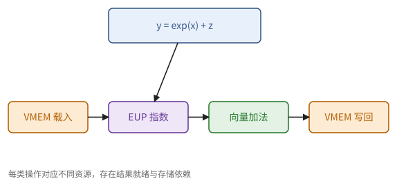
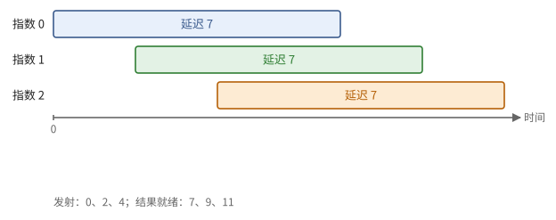
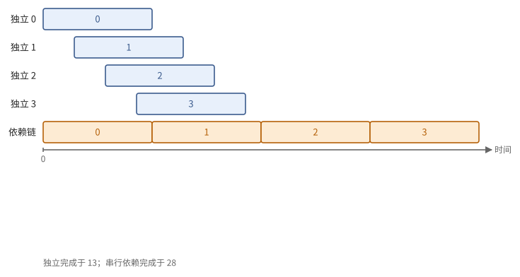
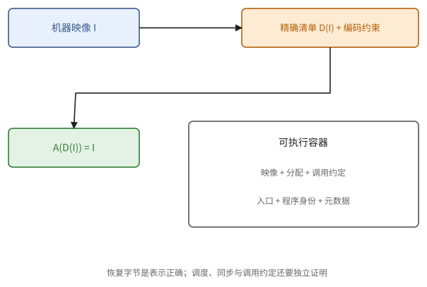
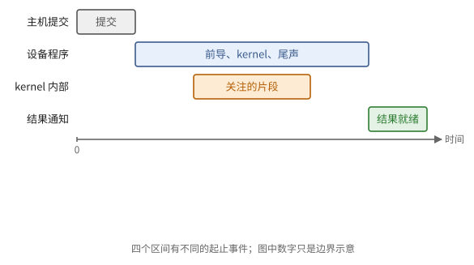

# 第 20 章　TPU 性能的静态分析

第 4 章说过，静态调度的机器有一个特别的好处：程序的执行时间可以从指令本身算出来。TensorCore 正是这样的机器：除了等待 DMA、等待其他设备这类外部事件，在固定资源与发射模型下，一段指令的周期数可由指令包序列、各单元延迟和发射间隔推算；真机还可能有并行任务、频率和外部资源争用的影响。

20.1 节讲指令包的读法；20.2、20.3 节建立发射模型并分析常见模式；20.4、20.5 节说明剖析证据与审查顺序；20.6 节进一步分清机器编码与可执行容器，20.7 节明确计时边界与时钟。

本章可以跳过：前面各章的屋顶线估算已经足以设计 kernel。本章用于最后一步：当估算与实际不符、或者要从一个已经接近上限的 kernel 中再挤出一些时间时，到指令的层面去找原因。本章的模型与参数来自对 TPU v4 的公开实测（ayaka14732 的 pallas-tpu-tutorial），其他代际的具体数字不同，但模型的结构相同。

> **在体系中的位置**：下层是第 4 章的流水线单元与 VLIW、第 15 章的 TensorCore、第 16 章的 Pallas。本章给出编译的各个阶段、指令包的读法、一个可计算的发射模型及其参数、用模型分析常见模式，以及剖析工具的局限。

## 20.1 从 kernel 到指令包

要从指令推算时间，先得拿到指令、读懂指令。本节说明一个 Pallas kernel 经过哪些阶段变成指令包，以及读指令包时先看什么。

一个 Pallas kernel 的编译经过以下几个阶段：

1. Pallas 把 kernel 体追踪成 jaxpr（13.2 节）；
2. Mosaic 把它降低为面向 TPU 的中间表示：块变成向量寄存器大小的片，`jnp.dot` 变成 MXU 的推入—乘—取回序列，DMA 与信号量变成相应的操作；
3. 后端编译器做寄存器分配、指令调度，把指令装进指令包，生成机器程序。

可以查看的产物有：Mosaic 的中间表示、编译器的调度结果，以及从可执行文件中反汇编出的指令包序列。最后一种最可靠，因为它就是实际执行的程序：每个指令包列出各个槽（15.2 节）上的指令。读一个循环体时，先数它有多少个指令包，再看各个槽的占用：

- 若某一类槽（例如 `vx`、`vr`，或 `vld`、`vst`）在每个指令包中都被占用，它是可能的发射瓶颈；还要比较依赖、单元服务间隔和外部等待；
- 若大部分指令包只有一两条指令，说明依赖链太长或循环展开得不够，单元在空等；
- 等待指令（等待同步标志）出现在哪里、等多久，说明访存是否与计算重叠。

> **例 20.1（从一行张量代码到多类硬件操作）** 对 f32 块写 `y=exp(x)+z`，降低后至少涉及 VMEM 载入、EUP 指数、向量加法与 VMEM 写回；若跨 HBM，还加 DMA 与等待。对矩阵乘法则要跟踪权重推入、装入、乘法、结果取回与 K 部分积的向量累加。
>
> “源码只有一行”不能作为周期估计。应先给每类操作指定执行单元和存储端点，再数数量与依赖；这样读反汇编时才知道哪些行是算法需要，哪些是额外的重排或溢出。

**图 20.1**　张量表达式逐层落到载入、指数、加法与写回。指令包只负责并排发射符合依赖的操作，硬件单元才负责实际运算。

## 20.2 发射模型

20.1 节的读法只能定性地看出瓶颈。要定量地推算周期，需要知道指令包是怎样被发射的。本节给出一个两级的发射模型（定义 20.2）及其参数，并说明在这个模型下执行时间是确定的（命题 20.3）。

> **定义 20.2（两级发射）** TensorCore 按以下规则执行指令包序列：
>
> 1. **标量发射**按顺序进行，没有阻塞时每周期一个指令包；标量指令在此时执行。
> 2. 含有向量（或 DMA）指令的指令包在标量发射之后进入**向量发射队列**（VIF）。
> 3. **向量发射**按顺序进行，每周期至多一个指令包，最早在标量发射之后 1 个周期（含 VMEM 读写的指令包为 2 个周期），并且要等记分板放行：源操作数已经就绪、要用的单元已过了发射间隔、要取回的结果已经进入结果队列。
> 4. VIF 的容量有限：一个指令包在向量发射之后若干周期才从 VIF 中释放；未释放的项达到上限时，标量发射停止。
> 5. 在本模型中，`sfence` 本身进入向量侧；其下一包的标量发射须等之前 VIF 项全部释放。它不自动排空尚未等待的外部 DMA 或各单元的结果队列。

规则 4 意味着标量单元最多只能"跑在"向量单元前面一段距离。这正是 4.6 节"解耦访存与执行"的一种实现：标量一侧可以提前计算地址、发起 DMA，向量一侧在后面按序执行。

> **现状（2026-10-08）**：以下参数来自教程对 TPU v4 的观察，适用于它给出的模型与指令形式；本书未做真机测量。MXU 准备、打包 XLU 等其他形式不能只套用 f32 的发射间隔。

**参数**（TPU v4 参考值，完整来源在附录 A、E）：

| 通路 | 提交 → 结果可取回（周期） | 相邻两次提交的间隔 | 相邻两次取回的间隔 |
| --- | ---: | ---: | ---: |
| 向量 ALU（多数运算） | 1–2 | 1 | — |
| EUP（指数、倒数等） | 7 | 2 | 1 |
| MXU（乘法 → 取回） | 约 83（部分 MXU 约 101） | 8 | 8 |
| XLU 转置（最后一次提交 → 取回） | 6 | 8 | 8 |
| XLU 跨通道归约 | 约 79 | 8 | — |
| XLU 通道置换 | 约 69 | 8 | — |
| CMEM 直接读取 `cld` → `crf` | 53 | 2 | 2 |
| 硬件随机比特 `vrng` | 结果直接写寄存器 | 8 | — |
| 向量 → 标量 | 约 43 | — | — |

VIF 的容量约为 20 项，一项在向量发射后约 10 个周期释放。模型按这些规则逐个指令包推算两种发射的时刻；在实测的几十个片段上，它与真机的周期计数器读数几乎完全一致。

> **命题 20.3** 在定义 20.2 的模型下，一段不含外部等待（DMA、跨设备同步）的直线代码的执行时间是确定的，可以由上表的参数逐包递推算出。

*证明* 每条规则都只依赖于之前各指令包的发射时刻与固定的参数；对指令包的序号归纳即得。∎

> **例 20.4（一个可以手算的简化调度表）** 暂时忽略 VIF，只保留每拍至多发一条、单元间隔与依赖。EUP 的延迟 7、间隔 2。独立的指数 $e_0,e_1,e_2$ 最早发射时刻为 0、2、4，结果就绪为 7、9、11；依赖 $e_i$ 的加法若另有可用 ALU，最早分别在 7、9、11 发射。
>
> 若强制先发完所有指数再发加法，还需满足程序次序；若加法又依赖前一个加法，出现更长的关键路径。这张表是模型内推算，不是声称真实后端一定采用这个排程。

**图 20.2**　三次独立指数的发射间隔为 2，延迟为 7。后续加法等待各自结果，而不是把每次指数的 7 周期串行相加。

## 20.3 用模型分析常见模式

下面用定义 20.2 的模型和上表的参数，分析几种在 kernel 中反复出现的指令模式。

**依赖链与吞吐。** EUP 的延迟是 7、间隔是 2：单个寄存器的指数要等 7 个周期，连续 16 个寄存器只要约 $15 \times 2 + 7 = 37$ 个周期（命题 4.4）。只有当程序同时提供足够多的独立寄存器时，才能达到吞吐。

**MXU 的交错。** MXU 的乘法每 8 个周期接收一个寄存器，结果约 83 个周期后才能取回，取回也是每 8 个周期一个。连续发出 16 条乘法、再连续取回 16 次，与"发出约 10 条之后开始交替发出乘法与取回"相比，前者要多等：第一次取回要排在最后一条乘法之后，之后每 8 个周期才取一个，积压的结果不能一口气取完。实测前者约 254 个周期，后者约 228 个周期。所以 MXU 的乘法与取回应当交错排列，在途的乘法保持在约 $83 / 8 \approx 10$ 条。

**跨通道归约的代价。** 一次跨通道归约约 79 个周期才能取回，但每 8 个周期可以提交一次。对单个寄存器求行和要等约 80 个周期；对很多个寄存器，吞吐是每 8 个周期一个（两个 XLU 时每 4 个周期）。沿子通道的归约（在向量 ALU 中移位相加）对单个寄存器约十几个周期。这就是习题 15.4 的结论在指令层面的来源。

**向量结果变成标量。** 把向量的计算结果变成循环次数或分支条件，要约 43 个周期，期间标量发射停止。所以数据依赖的控制流（例如"算出最大值再决定是否继续"）在 TensorCore 上很贵，应当尽量改写为掩码（4.3 节）。

**循环。** 一个计数循环的每次迭代是几个标量指令包加一个分支延迟槽；除此之外分支没有额外开销。所以循环的时间就是循环体的指令包数乘以迭代次数，再加上循环体中的等待。

> **例 20.5（资源下界和依赖下界取最大值）** 循环里有 16 条某类操作，单元发射间隔 2；不计其他约束，首发到最后结果至少 $15\cdot2+7=37$。若它们不是独立，而是每一条用前一条结果，则至少 $16\cdot7=112$ 才能完成整个链。
>
> 把“条数×发射间隔”当作时间，会漏掉依赖；把“条数×延迟”当作时间，会漏掉流水吞吐。最终估计还要受指令包数、端口、VIF 和寄存器容量约束。

**图 20.3**　同样四个延迟 7、间隔 2 的操作：独立时可交错，串行依赖时必须逐个等待。图只比较此单元，不含前端和搬运。

## 20.4 剖析工具的读法

静态分析之外，还有实测的剖析工具。本节说明它的结果该怎样读，以及它与静态分析各自适合回答什么问题。

TPU 也有性能剖析工具（XProf）。读一条时间线，先区分硬件跟踪事件与工具派生的分析结果：

- **有标记的区间有真实时间戳。** `vtrace` 在边界记录 GTC，主机按标记配对出事件区间；这些区间不是简单的编译器插值。但区间内部没有逐条指令的计时，也不能把工具的成本估计视为每条指令的测量。
- **插入标记会改变程序。** 跟踪指令本身要占用指令槽，可能打断原本紧密排列的指令包，测出的时间与不插入标记时不同。

所以剖析工具适合回答粗粒度的问题：哪一个 kernel、哪一个集合通信占了大部分时间，计算与通信是否重叠。细粒度的问题（这个循环体为什么比估计的慢）更适合用本章的静态分析回答：读指令包，按模型推算，与屋顶线的估计比较。

> **例 20.6（估计轨迹不等于每条指令的测量）** 某剖析图显示 kernel 为 100 微秒，其中 MXU 区间标为 60、DMA 等待标为 30。可据此怀疑搬运未充分重叠，再用静态清单确认等待的位置；不能由画在第 42 微秒的某条小操作推出该指令在那一刻被硬件逐条记录。
>
> 跟踪区间、成本估计与源码归属是三种证据。它们的边界随工具与版本变化；本章发射模型使用附录 A 的特定 v4 参考参数。

## 20.5 审查清单

最后把本章的方法汇总起来。读一个 TPU kernel 编译出的指令时，依次检查：

1. **内层循环的指令包数**：与按屋顶线估计的"每次迭代应当用的周期数"比较。
2. **瓶颈的槽**：哪一类槽在每个指令包中都满；它是否就是屋顶线预测的那个单元（MXU、向量 ALU、VMEM 读写、XLU、EUP）。
3. **MXU 的交错**：乘法与取回是否交错，在途的乘法是否足够多。
4. **等待的位置**：等待 DMA 的指令是否出现在循环的稳态中，若是，说明预取不够深（定理 9.10）或带宽不够。
5. **意外的指令**：寄存器溢出到 VMEM 的读写、意外的跨通道操作（布局不合适）、意外的类型转换。

> **例 20.7（先给多出来的操作找来历）** 本应每 K 步读两块、做乘法并合并部分积，清单却每步还出现一次转置和一组 VMEM 存取。先问转置是否由输入布局不符合 MXU 导致，再问额外存取是否由寄存器压力造成。
>
> 修复顺序由代价决定：消除多余数据移动通常比把两个独立标量指令塞到同包更有收益。每项建议都应指向一个具体资源账或依赖链，而不是笼统要求“提高利用率”。

## 20.6 机器清单、编码与可执行容器

例 20.1 已说明源码运算与机器操作并非一一对应；定义 20.2 的输入却必须是实际执行的包。本节因此从机器映像出发，说明怎样避免把编译器伪指令或默认编码选择当成硬件事实。记 $I$ 为原机器字节，$D$ 为反汇编，$A$ 为汇编。

> **定义 20.8（精确往返）** **精确往返**（exact round trip）要求 $A(D(I))=I$，即逐字节相同；只恢复可见助记符与操作数的清单，则可能选择另一个合法编码。相同助记符不是字节相同的证明，也不单独构成执行等价的证明。

> **例 20.9（空槽仍不能随意塞指令）** 一包的两个槽可能共享立即数字段、标量操作数选择或向量读端口。即使槽 1 为空，它想读取的资源也可能已被槽 0 以不兼容的方式占用。必须把各槽的编码约束同时求解；“每槽至多一条”只是必要条件。
>
> 精确清单中的 `.encoding` 记录无法由可见操作数唯一恢复的选择。删除它后重汇编可能得到规范编码，但尚不足以把它当成对原程序的一次单变量修改。

> **现状（2026-10-08）**：tpuasm 用 `.target` 选择目标，花括号界定 bundle，`s0:` 等前缀是物理槽。final bundles 仍可能有 `sphi` 等伪指令，且未必展示所有 selector；实际机器解码适合核对 `vdwg` 的权重来源等细节。目标还包括 v4 BCS（控制序列器）与 v6e TEC（SparseCore 向量子核），不都是 TensorCore。对齐、槽数、共享端口与支持的 libtpu 组合见附录 B。

> **命题 20.10（插入后必须重新定位）** 若在旧 PC $p$ 之前插入 $h$ 个包，对未新增的旧包，位置映射为 $f(q)=q$（$q<p$）或 $q+h$（$q\ge p$）。原从 $q$ 跳到 $r$ 的相对分支，必须改成 $f(r)-f(q)$；同时必须规定跳到插入边界时，是否先执行新增片段。

*证明* PC 按包的次序编号，插入后的前后区间直接给出 $f$；相对位移是目标 PC 减当前 PC。若边界的新旧两种入口含义未规定，原来的一个地址不能唯一确定控制流意图。∎

程序映像也不是完整可执行对象。序列化容器还保留内存分配、调用约定、入口、程序身份和编译元数据；修改字节后，这些关系必须仍一致。tpuasm 的等长替换与显式插入是两个入口，不能用两份变长清单猜重定位。汇编器检查编码，不替作者排程或补等待；成功汇编也不能证明数值、同步和运行时约束正确。

来源映射把 $(\mathrm{PC},\mathrm{slot})$ 对应到源码位置与函数区间，可用来追问一次额外存取来自哪一行。它需在匹配版本的编译阶段捕获；信息缺失时应保持“未知”，不能据此说该指令与源码无关。捕获应核对机器码未变；来源信息本身不能作为周期读数。

**图 20.4**　精确往返恢复机器字节；可执行容器还携带分配、身份与调用约定。

## 20.7 时间边界与两个时钟

定义 20.2 分开标量与向量发射；命题 9.3 又分开发起与完成。本节把这两种区别用于解释时间数字：读到计数器之前，到底哪些事件已经结束？无需让读者运行基准，也能从依赖关系判断某个计时结论是否成立。

> **定义 20.11（计时边界）** 一次时间声明应给出起止事件与计数器。主机提交返回、提交到结果就绪、连续调用的稳态间隔、整个设备程序、kernel 区间和内部指令段是不同对象；单位相同不代表边界相同。

> **例 20.12（提交两拍不等于算完两拍）** 一个长延迟向量操作随后接标量读计数器。只要 VIF 尚未满，标量一侧可以在向量结果出现前读数。这段差值量到的主要是提交，不是结果完成；若发起 DMA 后直接读数，也同样不能得到传输时间。
>
> 在来源的 v4 两级模型中，先等待相应完成对象，再单独执行 `sfence`，下一包才读计数器，可以把先前的向量侧等待纳入边界。`sfence` 排空 VIF，不自动等待所有 DMA 或结果队列；与读数同包也不能约束本次读数。

> **定义 20.13（局部周期与全局时间）** **局部周期计数器**（local cycle counter，LCC）计数一个局部执行器的周期，差值适合分析该执行器的程序段。**全局时间计数器**（global time counter，GTC）提供跨参与者对齐的时间轴；其分辨率、偏移和同步误差是另一组参数。

不同核心的 LCC 不能直接相减；周期转秒也需该次运行的频率。GTC 原始低位可能是本地排序信息，不能按一个固定比例把每个低位计数都当作等长周期。跨芯片比较事件时，还需把同步误差与网络传播区间放进上下界。

开始和结束两端都要建立所需的完成边界。只在终点同步，起点读数仍可能早于前导搬运完成，把本来不属于片段的等待纳入差值；排空哪些状态必须由本次关注的事件决定。

> **现状（2026-10-08）**：教程用 v4 的 LCC、GTC 与 `vtrace` 分别核对局部周期、跨核时钟和 XProf 事件；有 `vtrace` 的区间确实来自 GTC 时间戳。region trace 还会改变包数并限制跨区域调度。因此公平比较要固定 dtype、精度、形状、输出语义和执行边界，并区分含跟踪标记与正式运行的映像。相关指令与工具见附录 B、E。

**图 20.5**　提交、设备程序、内部片段和结果就绪的边界不同；下方用简化单元模型比较依赖与吞吐。

## 接口小结

1. Pallas kernel 经 Mosaic 降低、后端调度后成为指令包序列；读循环体时数指令包、看各槽的占用、看等待的位置。（20.1 节）
2. 两级发射模型：标量按序发射，向量指令经 VIF 按序发射，受操作数就绪、单元间隔、结果队列和 VIF 容量的约束；不含外部等待的代码，周期数由模型唯一确定。（定义 20.2、命题 20.3）
3. v4 的参数：EUP 延迟 7、间隔 2；MXU 延迟约 83、间隔 8；XLU 归约约 79、间隔 8；向量到标量约 43。（20.2 节的表）
4. 由模型得到的规律：要有足够多的独立操作；MXU 的乘法与取回要交错；跨通道归约与向量到标量的转换很贵；循环的时间是指令包数乘迭代次数。（20.3 节）
5. XProf 的跟踪区间有边界时间戳，但不提供区间内每条指令的测量；插入标记会改变程序，细粒度问题应结合实际机器映像与发射模型。（20.4 节）
6. 精确往返是逐字节恒等；组包还受共享编码资源约束。插入需更新 PC、分支和容器元数据；来源映射与计时证据分别使用。（定义 20.8、例 20.9、命题 20.10）
7. 时间声明需要起止事件与时钟；LCC 用于局部周期，GTC 用于对齐时间。标量读数可以早于向量侧完成，栅栏也不能代替相应完成等待。（定义 20.11、例 20.12、定义 20.13）

## 习题

**习题 20.1** ★ 用 20.2 节的参数估计：对 32 个互相独立的寄存器求指数（EUP），最后一个结果何时可以取回？若这 32 个指数是一条依赖链呢？

提示 1

独立指数按间隔提交，串行依赖按结果延迟推进；两者不能用同一乘法公式。

提示 2

命题 4.4，$L = 7$，$I = 2$。

答案

独立时约 $31 \times 2 + 7 = 69$ 个周期；依赖链时约 $32 \times 7 = 224$ 个周期（再加上每次取回与重新提交的少量周期）。

**习题 20.2** ★ 一个 MXU 要处理 64 个 LHS 寄存器。(a) 若连续发出 64 条乘法、再连续取回 64 次，大约需要多少周期？(b) 若交错排列，大约多少？

提示 1

画提交和取回两个资源道；先提交完会推迟结果队列的排空。

提示 2

(a) 最后一条乘法约在第 $63 \times 8$ 个周期发出，之后的 64 次取回每 8 个周期一次。(b) 稳态时每 8 个周期一条乘法、一次取回。

答案

(a) 约 $63 \times 8 + 1 + 63 \times 8 \approx 1009$ 个周期（第一次取回在最后一条乘法之后，且此时结果早已就绪）。(b) 约 $63 \times 8 + 83 \approx 587$ 个周期：乘法每 8 个周期一条，第一个结果 83 个周期后开始取回，之后取回与乘法同时进行，最后一个结果在最后一条乘法之后 83 个周期取回。交错排列快约 40%。

**习题 20.3** ★ 一个 kernel 的内层循环每次迭代读入一个 bf16 的 $16 \times 128$ 块（一次 VMEM 读）、做 4 次向量运算、写出一个块（一次 VMEM 写）。按 15.2 节的槽数，每次迭代至少要几个指令包？瓶颈在哪一类槽？

提示 1

按每类槽每拍服务数除操作数取上整，最后取最大值；依赖可能再增周期。

提示 2

每个指令包至多一次 VMEM 读、一次 VMEM 写、两次向量 ALU 运算。

答案

VMEM 读写各需 1 个包；向量运算需 2 个包（每包两次）。若循环展开、不同迭代的指令可以交织，每次迭代至少 2 个指令包，瓶颈是向量 ALU 的两个槽。若不展开，依赖链（读 → 运算 → 写）还会加上各自的延迟，实际更多。

**习题 20.4** ★ 一个 kernel 需要先求出一个向量的最大值，再根据这个最大值决定循环要执行几次。按 20.3 节，这个决定要多少周期？给出一种避免它的写法。

提示 1

数值归约与将结果变成控制标量是两段依赖；只改控制方式可避免第二段。

提示 2

向量 → 标量约 43 个周期，期间标量发射停止。

答案

除了求最大值本身（含一次跨通道归约，约 80 个周期），还要约 43 个周期把结果送到标量单元，期间整个 TensorCore 的标量发射停止。避免的办法：让循环执行固定的（最大可能的）次数，用掩码使多余的迭代不产生效果；或者让这个次数在 kernel 之外算好，作为标量预取的参数传入（16.7 节）。

**习题 20.5** ☆ XProf 显示某个 kernel 中一段"逐元素运算"占了 30% 的时间，但按屋顶线它只应占 5%。列出两种可能的解释，并说明怎样用静态分析区分它们。

提示 1

把剖析估计误差与真实额外工作分开，最终指令可验证后者。

提示 2

20.4 节的两点局限；以及布局导致的意外指令（20.5 节第 5 条）。

答案

解释一：时间线是插值的，这段时间实际上属于相邻的操作（例如一次 DMA 等待），剖析的归属不准确。解释二：这段运算确实慢，例如布局不合适导致了跨通道的重排、寄存器溢出或额外的类型转换。区分：读这一段的指令包，数它的包数并找出其中的跨通道操作、额外的 VMEM 读写；若指令包数与屋顶线的估计相符，就是解释一；若出现了意外的指令，就是解释二。

**习题 20.6** ★（综合审查题）简化模型每拍最多发两条向量 ALU、一次载入、一次写回。一个循环迭代有 6 条独立 ALU、2 次载入、1 次写回，纯发射资源下界是多少拍？若六条 ALU 构成延迟 2 的串行链，结果下界如何变化？

提示 1

对各类槽分别算工作量除服务率；依赖链是另一项下界。

提示 2

资源项为 max(ceil(6/2),2,1)；串行链需等每次结果。

答案

纯资源发射跨度至少三拍，但不包括最后操作的完成尾部。串行 ALU 链从第一条发射到最后结果就绪至少 $6\cdot2=12$ 拍；载入就绪和写回可能另延长总时间。三拍只是一项下界，不是完整执行时间。

**习题 20.7** ★ 原包 q=3 有相对分支跳到 r=8。在旧 PC 5 之前插入两个包，原分支的新位移是多少？若在旧 PC 3 之前插入两个包呢？

提示 1

分别映射当前 PC 和目标 PC，不是总给位移加插入长度。

提示 2

命题 20.10 给 f；分支的相对基点是当前包。

答案

在 PC 5 前插入，f(3)=3、f(8)=10，位移 7。若在 PC 3 前插入，旧分支移到 5、旧目标移到 10，位移仍为 5。还必须明确指向插入点的入口是否先执行新增包，并迁移相关元数据，不能只移动代码字节。

**习题 20.8** ★（审查题）一包发起 DMA，下一包只读 LCC，相差两个周期。AI 据此断言 DMA 只需两个周期。为什么证据不足？单独加一个 sfence 是否够？

提示 1

读计数器发生在标量侧；DMA 的发起和完成是两个事件。

提示 2

例 20.12 中，sfence 排空 VIF，但不自动等待尚未等待的 DMA。

答案

两个周期主要表示发起之后标量侧推进到读数，不能推出 DMA 已到达目的。需要先等这次 DMA 的完成对象，再按模型跨单独的 sfence 边界，在下一包读数。只有 sfence 而没有相关等待，仍可能量到发射而非交付；若只需最终算术结果，还须按目标接口等相应结果队列。计时操作会改变程序边界，数值不能直接当成未经插入标记的正式运行时间。

