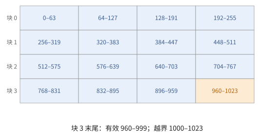
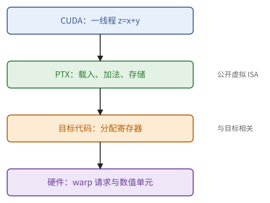
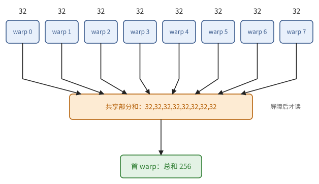
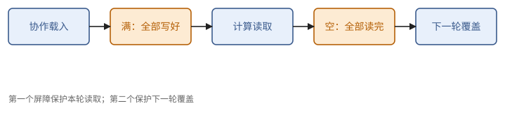

# 第 22 章　CUDA 编程：SIMT 模型

CUDA 是 GPU 的基本编程语言：在 C++ 中写一个函数（kernel），描述**一个线程**做什么，再以成千上万个线程启动它。第 21 章说明了硬件怎样执行这些线程。本章讲程序员看到的模型：22.1 节讲线程的编号与数据的对应；22.2、22.3 节讲存储空间与同步手段；22.4、22.5 节讲线程协作的基本模式：归约、扫描与分块矩阵乘法；22.6、22.7 节讲资源与占用率、内存模型；22.8 节讲主机一侧怎样组织 kernel 的执行。

本章的代码只用来确定数学对象（下标映射、同步关系），越短越好；语法细节可以交给 AI 或文档。现代 GPU 上高性能 kernel 的结构（异步搬运、Tensor Core）在第 23 章。

> **在体系中的位置**：下层是第 21 章的 SM 与 SIMT、第 10 章的归约与扫描、第 8 章的布局与存储体冲突、第 9 章的同步。本章给出 CUDA 的线程层级与下标映射、存储空间、同步原语、warp 级与块级的归约和扫描、共享内存分块矩阵乘法、占用率的权衡、内存模型与作用域、流与图。第 23 章在此之上讲现代 kernel 的结构；第 24 章讲更高层的 tile 语言。

## 22.1 kernel 与线程层级

本节从一个最小的 kernel 出发，说明线程怎样编号（定义 22.1），以及设计一个 kernel 首先要设计的东西：从线程坐标到数据下标的映射。

```cpp
__global__ void add(const float* x, const float* y, float* z, int n) {
    int i = blockIdx.x * blockDim.x + threadIdx.x;      // 本线程负责的元素
    if (i < n) z[i] = x[i] + y[i];                      // 越界的线程什么也不做
}
// 启动：add<<<(n + 255) / 256, 256>>>(x, y, z, n);   256 个线程一块，块数向上取整
```

> **定义 22.1（线程层级与下标映射）** 一次启动由一个**网格**（grid）组成，网格由**块**组成，块由**线程**组成，网格和块都可以是一到三维的。每个线程知道自己的块坐标 `blockIdx`、块内坐标 `threadIdx`，以及块的形状 `blockDim`、网格的形状 `gridDim`。一个 kernel 的数据访问由**下标映射**决定：从（块坐标，线程坐标）到它所处理的数据下标的函数。

上面的例子中，下标映射是 $(b, t) \mapsto 256 b + t$。设计一个 CUDA kernel，首先就是设计这个映射，使它满足三个要求：

1. **覆盖**：每个数据元素恰好被某个线程处理（多出的线程要用边界检查屏蔽）；
2. **合并**：同一个 warp 的 32 个线程（`threadIdx.x` 连续的 32 个）访问的地址应当连续（21.3 节）；
3. **负载**：工作在线程、warp、块之间大致均匀。

线程数少于数据量时，常用**网格步长循环**：`for (int i = blockIdx.x * blockDim.x + threadIdx.x; i < n; i += gridDim.x * blockDim.x)`，让每个线程处理若干个相隔"整个网格"的元素，相邻线程仍然访问相邻的地址。

> **例 22.2（一千个元素怎样被覆盖）** 取 $n=1000$、每块 256 线程，启动 4 块，编号覆盖 0–1023。前 1000 个线程各写一个元素，最后 24 个由边界条件屏蔽；块 3 的前三个 warp 全有效，最后一个 warp 只有 8 个有效线程。
>
> 这个掩码适合独立逐元素运算。若随后调用全 warp 掩码的归约，不应让那 24 个线程提前退出；应让它们贡献单位元并一起参与，或者使用满足参与规则的掩码算法。



**图 22.1**　四个 256 线程块覆盖 1024 个编号，最后 24 个超出数组。边界线程是否能退出取决于之后是否还需集体同步。


## 22.2 存储空间

线程能读写的存储分为几个空间，各自对应第 21 章的一种硬件：

| 存储空间 | 声明 | 范围 | 对应的硬件 |
| --- | --- | --- | --- |
| 寄存器 | 普通局部变量 | 一个线程 | 寄存器堆；放不下时溢出到"局部内存"（实为全局内存） |
| 共享内存 | `__shared__` | 一个块 | SM 上的共享内存 |
| 全局内存 | 指针参数、`cudaMalloc` 分配 | 所有线程 | HBM，经 L2、L1 缓存 |
| 常量内存 | `__constant__` | 所有线程，只读 | 带专门缓存的全局内存 |

主机与设备之间的数据传输（分配、拷贝、释放）属于 AI 可以代劳的样板代码，本书不展开。要记住的只有一点：主机与设备之间的带宽远低于 HBM，应当让数据尽量留在设备上。

> **定义 22.3（程序、虚拟指令与机器指令）** **指令集体系结构**（instruction set architecture，ISA）规定可见状态、指令操作与执行约束。CUDA C++ 是源语言；**PTX**（Parallel Thread Execution）是公开的虚拟 ISA；通常称为 **SASS** 的目标机器指令驱动具体 GPU。源语言的变量和虚拟寄存器在寄存器分配后才对应物理寄存器，溢出会引入额外存储操作。

> **例 22.4（把加法 kernel 的一条数据路径拆开）** 假设指针地址与边界谓词已计算好，单线程 $z_i=x_i+y_i$ 的 PTX 形态可以写成：
>
> ~~~text
> ld.global.f32 %x, [%px];
> ld.global.f32 %y, [%py];
> add.f32       %z, %x, %y;
> st.global.f32 [%pz], %z;
> ~~~
>
> 这里省略地址生成、寄存器声明与完整入口。载入指令发出每线程请求，硬件按一个 warp 的地址合并；加法使用数值单元，写回经过存储路径。同样的四条形态，线程地址不同，流量就可能不同；最终目标机器指令也不必与它逐条对应。



**图 22.2**　源语言、PTX 与目标机器指令是三个层次。每线程的虚拟操作在一个 warp 上形成并行请求，再映射到硬件资源。


## 22.3 同步

线程之间要协作，就需要同步。CUDA 提供四类手段：

- **块内屏障** `__syncthreads()`：块内所有线程都到达之后才继续；它也保证屏障之前对共享内存的写对屏障之后的读可见。**块内所有线程都必须执行到同一个** `__syncthreads()`；把它放在只有部分线程会进入的分支中，行为未定义，通常是死锁。
- **warp 级原语**：`__shfl_sync(mask, v, src)` 让每个线程取得同一 warp 中第 `src` 个线程的 `v`；`__shfl_xor_sync(mask, v, k)` 取得第 `lane ^ k` 个线程的 `v`；`__shfl_up_sync`、`__shfl_down_sync` 取得相距 $k$ 的线程的值。它们是在寄存器之间进行的、warp 内的数据置换（4.4 节），不经过共享内存。`mask` 列出参与的线程，通常是全部 32 个（`0xffffffff`）。`__ballot_sync` 把 32 个线程的条件收集成一个 32 位整数。
- **原子操作** `atomicAdd` 等：对全局或共享内存中一个位置的读—改—写不可分割。多个线程的原子加法以运行时决定的次序进行，浮点结果因此不确定（命题 10.18）。
- **栅栏** `__threadfence()`：保证本线程之前的写在其后的写之前对整个设备可见（22.7 节）。

> **例 22.5（边界条件不能包住块屏障）** 线程块读取尾部 tile，部分线程越界。正确结构是每个线程都写共享内存：有效线程载入数据，无效线程填单位元；随后全块执行同一个屏障。若把屏障也放进 `if (i<n)`，尾部块的参与者不一致。
>
> warp 洗牌的 mask 也不是“只取这些值”的筛选器：所有被 mask 指定的尚未退出线程必须正确参与，读取源 lane 还必须有效。最容易推理的归约模板是完整 warp 加单位元。


## 22.4 归约与扫描

有了同步手段，就可以写出线程协作的基本模式。本节写出第 10 章的归约与扫描：先在一个 warp 内（命题 22.6），再到一个块，再到整个网格。

**warp 内归约。** 用 XOR 的蝶形交换，5 步之后每个线程都得到 32 个值的和：

```cpp
__device__ float warp_sum(float v) {
    for (int k = 16; k > 0; k /= 2)
        v += __shfl_xor_sync(0xffffffff, v, k);
    return v;                                   // 32 个线程都持有总和
}
```

> **命题 22.6** `warp_sum` 返回时，每个线程的 `v` 等于 32 个线程初始值之和。

*证明* 归纳：取 $k = 16, 8, \dots, 2^j$ 的各步之后，线程 $l$ 的值等于所有与 $l$ 在低 $j$ 位相同（其余位任意）的线程的初始值之和。下一步与 $l \oplus 2^{j-1}$ 交换并相加，覆盖了第 $j - 1$ 位的两种取值。$j = 0$ 时覆盖全部 32 个线程。∎

这是命题 1.38 的树，深度 $\log 32 = 5$；它也是一个"全归约"：每个线程都得到结果（与 all-reduce 的结构相同，定义 7.8）。

**块内归约。** 先在每个 warp 内归约，每个 warp 的第 0 个线程把结果写入共享内存，屏障之后，由第一个 warp 归约这些部分和：

```cpp
__device__ float block_sum(float v) {
    __shared__ float partial[32];               // 每个 warp 一个位置（块至多 1024 线程）
    int lane = threadIdx.x % 32, warp = threadIdx.x / 32;
    v = warp_sum(v);
    if (lane == 0) partial[warp] = v;
    __syncthreads();                            // 所有部分和写完之后才读
    int nwarps = (blockDim.x + 31) / 32;
    v = (threadIdx.x < nwarps) ? partial[lane] : 0.0f;
    if (warp == 0) v = warp_sum(v);
    return v;                                   // 结果在第 0 个 warp 的线程中
}
```

（若在同一个 kernel 中连续调用两次，第二次写 `partial` 之前要再加一个 `__syncthreads()`，否则会覆盖第一次尚未读完的部分和：命题 9.4。）

**整个网格的归约**要跨越块。两种做法：每个块写出一个部分和，再由第二个 kernel（或最后完成的那个块）归约这些部分和，结果确定；或者每个块用 `atomicAdd` 把部分和加到一个全局变量上，只要一个 kernel，但结果不确定（命题 10.18）。

**扫描。** warp 内的前缀和用 `__shfl_up_sync` 的 5 步完成（Kogge–Stone，命题 1.40）：第 $k = 1, 2, 4, 8, 16$ 步，线程 $l \ge k$ 加上线程 $l - k$ 的值。块内与网格的扫描用命题 10.13 的分块扫描：warp 内扫描、各 warp 总和的扫描、加回偏移。

> **例 22.7（八个 warp 如何变成一个总和）** 256 线程每人贡献 1。每个完整 warp 经五步归约得到 32，lane 0 把 32 写到 `partial[warp]`；屏障后，首 warp 的前八个 lane 读这八个 32，其余 lane 填 0，再归约得 256。
>
> 本节示例要求一维块且线程数为 32 的正倍数。若最后一个 warp 不完整，`warp_sum` 的全掩码假设失效；不能仅把 `nwarps` 向上取整就宣称所有块尺寸都支持。



**图 22.3**　先在八个 warp 内各归约，再通过共享内存汇集八个部分和，最后由首 warp 合并。屏障位于共享写与共享读之间。


## 22.5 共享内存分块矩阵乘法

第 6 章的分块，最直接的 CUDA 写法是：每个块计算 $C$ 的一个 $T \times T$ 的块，每个线程算其中一个元素；沿 $K$ 每次把 $A$、$B$ 各一个 $T \times T$ 的块读入共享内存，块内的线程共同使用。本节写出它，用前几章的工具检查它，再说明为什么还要在寄存器一级再分一次块（命题 22.8）。

```cpp
template <int T>
__global__ void matmul_tiled(const float* A, const float* B, float* C, int M, int N, int K) {
    __shared__ float As[T][T];
    __shared__ float Bs[T][T];
    int tx = threadIdx.x, ty = threadIdx.y;
    int row = blockIdx.y * T + ty, col = blockIdx.x * T + tx;
    float acc = 0.0f;
    for (int k0 = 0; k0 < K; k0 += T) {
        As[ty][tx] = A[row * K + k0 + tx];      // 一个 warp 读一行中连续的 T 个：合并
        Bs[ty][tx] = B[(k0 + ty) * N + col];
        __syncthreads();                        // 命题 9.3：块装满之后才读
        for (int k = 0; k < T; ++k)
            acc += As[ty][k] * Bs[k][tx];
        __syncthreads();                        // 命题 9.4：全部读完之后才覆盖
    }
    C[row * N + col] = acc;
}
// 启动：dim3 block(T, T), grid(N / T, M / T)；这里假定 M、N、K 都是 T 的倍数
```

用前面各章的工具检查它：

- **合并**：$T = 32$ 时，一个 warp 是 `ty` 相同、`tx` 为 0–31 的 32 个线程，读 $A$ 与 $B$ 的地址都连续。
- **存储体**：`As[ty][k]` 对一个 warp 是同一个地址（广播，无冲突）；`Bs[k][tx]` 是连续的 32 个字，无冲突。
- **同步**：两个屏障分别对应命题 9.3 与命题 9.4。去掉第二个，快的线程会在慢的线程读完之前覆盖共享内存。
- **复用**：每个从全局内存读入的元素在共享内存中被 $T$ 个线程使用，全局内存的传输量按命题 6.12 降为 $1/T$。

但这个 kernel 仍然很慢：每次乘加都要从共享内存读两个数，共享内存的带宽成为瓶颈（6.6 节：多级分块要逐级检查）。

**寄存器分块。** 让每个线程计算一个 $t_M \times t_N$ 的小块（例如 $8 \times 8$）：每一步 $k$，从共享内存读 $A$ 的 $t_M$ 个元素与 $B$ 的 $t_N$ 个元素到寄存器，做 $t_M t_N$ 次乘加。

> **命题 22.8** 每个线程计算 $t_M \times t_N$ 的小块时，每次共享内存读取对应 $\frac{t_M t_N}{t_M + t_N}$ 次乘加；$t_M = t_N = t$ 时为 $t/2$。

*证明* 每一步 $k$ 从共享内存读 $t_M + t_N$ 个数，做 $t_M t_N$ 次乘加。这与命题 6.12 之后的块的强度是同一个计算，只是用在寄存器与共享内存这一级。∎

$t = 8$ 时每次读取对应 4 次乘加，共享内存的压力降为原来的八分之一。代价是每个线程要 $t_M t_N$ 个累加寄存器加上操作数寄存器，占用率下降（22.6 节）。这样逐级（全局内存 → 共享内存 → 寄存器）分块，就是 CUDA 矩阵乘法的经典结构；在有 Tensor Core 的 GPU 上，最内一级换成 MMA 指令（第 23、25 章）。

> **例 22.9（两个屏障分属两轮数据）** $T=32$ 时，一个块计算 $32\times32$ 输出，共 1024 线程。某 K 步的第一个屏障证明 A、B 的共享块全写好；第二个屏障证明本轮所有线程都读完，下一轮才可覆盖。
>
> 只保留第一个屏障时，一个快 warp 可能提前载入下一 K 块，另一个慢 warp 仍在用上一块。两个屏障保护同一存储的不同生命周期边界，不能因“每轮已经同步过”而删掉第二个。



**图 22.4**　共享 tile 的每轮生命周期：协作载入 → 满屏障 → 计算读取 → 空屏障 → 下一轮覆盖。


## 22.6 占用率与资源

命题 21.6 给出了占用率的上限。设计时的基本权衡是：

- 每个线程用更多的寄存器、每个块用更多的共享内存，可以做更大的分块，数据复用更多（命题 22.8）；
- 但驻留的 warp 更少，靠占用率隐藏延迟的能力更弱（命题 21.7）。

弥补的办法是让每个线程自己提供更多的在途操作：连续发出多个互相独立的读、在一个线程内展开多个独立的累加。由 Little 定律，在途的总量才是关键，它可以来自很多 warp，也可以来自每个 warp 的多个独立操作。所以高性能的 kernel 常常故意以较低的占用率运行。`__launch_bounds__` 可以告诉编译器每块的最大线程数，让它据此分配寄存器。

> **例 22.10（寄存器分块的收益与价格）** 每线程做 $8\times8$ 输出，至少有 64 个 f32 累加器；每个 k 还需 A、B 各 8 个值，未计地址就约 80 个寄存器。若每块 256 线程，算术需求为 20480 个 32 位寄存器，65536 的寄存器堆至多容纳三块。
>
> 真实分配按粒度取整，编译器也可能复用临时值。这个估算不预测最终寄存器数，却能提前发现“把局部块扩大两倍而资源不变”的规格不合理。


## 22.7 内存模型与作用域

不同线程对共享数据的读写，只有通过同步建立先行发生关系后，次序才有保证（9.6 节）。CUDA 的同步有**作用域**：线程、块、簇、设备、系统（包括主机与其他 GPU），作用域越大代价越高。

消息传递（命题 9.17）在 CUDA 中的写法，用带内存次序的原子操作：

```cpp
#include <cuda/atomic>

__device__ void publish(float* data, int* flag, float v) {
    data[0] = v;
    cuda::atomic_ref<int, cuda::thread_scope_device> f(*flag);
    f.store(1, cuda::memory_order_release);          // 释放：之前的写对获取者可见
}

__device__ float consume(const float* data, int* flag) {
    cuda::atomic_ref<int, cuda::thread_scope_device> f(*flag);
    while (f.load(cuda::memory_order_acquire) == 0) { }   // 获取
    return data[0];
}
```

> **注 22.11** 若生产者与消费者在不同的块中，消费者的忙等只有在生产者所在的块**同时驻留**在 GPU 上时才会结束。CUDA 不保证一个网格的所有块同时驻留：若消费者的块占满了 SM，生产者的块永远得不到调度，就会死锁。块之间的这类等待只能用于保证同时驻留的情形（例如协作启动，或块数不超过 SM 能同时容纳的数量的持久化 kernel，第 23 章）。

> **例 22.12（正确的内存次序仍需要可执行的调度）** 生产者用 release 发布标志，消费者 acquire 后读取，解决的是可见性；若消费者块占满 SM 而生产者块尚未获调度，协议仍可能无进展。数据一致性证明和调度进展证明要分别给出。
>
> 普通跨块归约可分两次 kernel：同流里第二次在第一次之后执行，减少显式忙等的复杂度。只有同时驻留条件成立时，才把跨块等待放进同一 kernel。


## 22.8 主机侧：流、事件与图

最后看主机一侧怎样组织 kernel 的执行。

- **流**（stream）：主机向 GPU 提交工作（kernel、拷贝）的有序队列。同一个流中的工作按次序执行；不同流中的工作可以并行，例如一个流在计算，另一个流在主机与设备之间拷贝数据。
- **事件**（event）：在一个流中做标记，另一个流可以等待它，从而建立流之间的依赖。
- **CUDA Graph**：把一串 kernel 与拷贝录制成一张图，之后一次提交整张图。每次启动 kernel 都有微秒量级的固定开销，模型很小、kernel 很多时（例如 decode 的每一步），启动开销本身可能成为瓶颈（6.2 节的开销受限），图把它降到最低。

> **例 22.13（两个流之间要写出真实依赖）** 流 A 算矩阵乘法后记录事件 E；流 B 先等待 E 再归约结果，得到计算完成到通信读取的先行发生边。若只把两者分到不同流，却没记录和等待 E，B 可能读取未完成的输出。
>
> CUDA Graph 可以降低反复提交的开销，但图中仍要有相同的数据依赖边。调度对象替你提交工作，不会自动修复数学上缺失的同步。


## 接口小结

1. kernel 描述一个线程的工作；线程按网格—块—线程组织；设计的核心是下标映射，要满足覆盖、合并、负载均匀；网格步长循环让少量线程处理大量数据。（定义 22.1）
2. 存储空间：寄存器（每线程，可能溢出）、共享内存（每块）、全局内存（所有线程，经缓存）、常量内存。（22.2 节）
3. 同步：`__syncthreads()` 必须被块内所有线程执行；warp 内用洗牌指令交换寄存器；原子操作的浮点结果不确定；栅栏保证可见次序。（22.3 节）
4. warp 内归约用 5 步 XOR 洗牌，每个线程都得到结果；块内归约是 warp 归约加共享内存；跨块的归约要么用第二步确定地归约，要么用原子操作；扫描用分块扫描。（命题 22.6、22.4 节）
5. 共享内存分块矩阵乘法：两个屏障对应读前与覆盖前；全局内存传输降为 $1/T$；再做寄存器分块，每次共享内存读取对应 $t/2$ 次乘加。（22.5 节、命题 22.8）
6. 占用率与分块大小相互制约；在途的总量可以来自 warp 数，也可以来自每个线程的独立操作。（22.6 节）
7. 用带释放/获取语义、指定作用域的原子操作做跨线程的消息传递；跨块的忙等要求双方同时驻留。（22.7 节、注 22.11）
8. 流、事件、CUDA Graph 组织主机一侧的工作；图降低启动开销。（22.8 节）

## 习题

**习题 22.1** ★ 一个 $M \times N$ 的行优先矩阵，用 $16 \times 16$ 的二维块逐元素处理。写出线程到元素的下标映射与边界检查。若改用 $32 \times 8$ 的块（`blockDim = (32, 8)`），哪种映射使得 warp 的访问合并？

<details><summary>提示 1</summary>

x 维是最快变化的线程坐标；一个 warp 应尽量沿数组连续列移动。

</details>
<details><summary>提示 2</summary>

`threadIdx.x` 连续的线程属于同一个 warp；它们应当访问同一行中相邻的列。

</details>
<details><summary>答案</summary>

`row = blockIdx.y * blockDim.y + threadIdx.y`，`col = blockIdx.x * blockDim.x + threadIdx.x`，`if (row < M && col < N)`。$16 \times 16$ 时一个 warp 是两行各 16 个线程，访问两段各 64 字节的连续地址；$32 \times 8$ 时一个 warp 恰是一行中连续的 32 列，访问 128 字节的连续地址，合并得更好。若错把 `threadIdx.x` 映射到行，一个 warp 的 32 个访问会相隔一整行，效率极低（习题 21.3）。

</details>

**习题 22.2** ★ 用 `__shfl_down_sync` 实现 warp 内归约，使得只有第 0 个线程得到总和。与命题 22.6 的 XOR 写法相比有什么区别？

<details><summary>提示 1</summary>

只要求 lane 0 正确时可构造向下归约树；其他 lane 的输出不用当作总和。

</details>
<details><summary>提示 2</summary>

`__shfl_down_sync(mask, v, k)` 让线程 $l$ 取得线程 $l + k$ 的值（$l + k \ge 32$ 时取自己的值）。

</details>
<details><summary>答案</summary>

`for (int k = 16; k > 0; k /= 2) v += __shfl_down_sync(0xffffffff, v, k);` 之后第 0 个线程持有总和，其余线程的值是部分和（编号较大的线程会把自己的值加了不止一次，但它们的结果不使用）。XOR 写法让所有线程都得到总和，适合之后每个线程都要用这个值的情形（例如 softmax 中用行最大值做减法）；down 写法只在需要一个结果时使用，二者的步数相同。

</details>

**习题 22.3** ★（审查题）下面的块内归约在某些块大小下会挂起。找出原因。

```cpp
if (threadIdx.x < 32) {
    v = warp_sum(v);
    if (threadIdx.x == 0) partial[blockIdx.x % 32] = v;
    __syncthreads();
}
```

<details><summary>提示 1</summary>

先找是否所有块内参与者都能到同一个屏障，再检查边界线程是否提前退出。

</details>
<details><summary>提示 2</summary>

22.3 节关于 `__syncthreads()` 的要求。

</details>
<details><summary>答案</summary>

`__syncthreads()` 放在只有前 32 个线程进入的分支中，块内其余线程永远不会到达这个屏障；块大于 32 个线程时行为未定义，通常是挂起。此外 `partial` 的下标用 `blockIdx.x` 也是错的：共享内存是每个块私有的，应当以块内的 warp 编号为下标。正确的写法见 22.4 节。

</details>

**习题 22.4** ★ 对 22.5 节的 kernel（$T = 32$，每线程一个输出），计算每次乘加对应的共享内存读取次数，以及每个块从全局内存读入的字节数与做的乘加次数之比。再按命题 22.8 计算每线程 $8 \times 8$ 的寄存器分块时的这两个量（块仍算 $128 \times 128$ 的输出）。

<details><summary>提示 1</summary>

分别数共享内存读与全局读；寄存器分块只直接减少前者。

</details>
<details><summary>提示 2</summary>

每线程每步 $k$：读 `As[ty][k]` 与 `Bs[k][tx]` 各一次，做一次乘加。

</details>
<details><summary>答案</summary>

每线程一个输出：每次乘加读两次共享内存。全局内存：每步 $k_0$ 读 $2 \times 32 \times 32 \times 4 = 8$ KiB，做 $32^3 = 32768$ 次乘加，每字节 4 次乘加（8 FLOP/字节）。$8 \times 8$ 寄存器分块、$128 \times 128$ 的块（256 个线程）：每次共享内存读取对应 4 次乘加；若 $b_K = 32$，每步读 $2 \times 128 \times 32 \times 4 = 32$ KiB，做 $128^2 \times 32 = 524288$ 次乘加，每字节 16 次乘加（32 FLOP/字节）。两级的复用都提高了。

</details>

**习题 22.5** ★ 一个 kernel 每线程 $8 \times 8$ 的寄存器分块，需要约 100 个寄存器。在 65536 个寄存器、最多 64 个 warp 的 SM 上，每块 256 个线程，能驻留几个块？若为了提高占用率强制每线程只用 64 个寄存器，会发生什么？

<details><summary>提示 1</summary>

减少可分配寄存器不等于减少数学状态，可能只是把状态放到更慢存储。

</details>
<details><summary>提示 2</summary>

命题 21.6；寄存器不够时，编译器把一部分变量溢出到局部内存。

</details>
<details><summary>答案</summary>

$65536 / (100 \times 256) \approx 2.56$，2 个块（按分配粒度可能是 2），16 个 warp，占用率 25%。强制 64 个寄存器后能驻留 4 个块，但 64 个累加值加上操作数放不进 64 个寄存器，编译器会把一部分溢出到局部内存，每次乘加都要多访问存储，通常更慢。更好的做法是保持寄存器分块、接受较低的占用率，用每个线程内的独立操作提供在途量（22.6 节）。

</details>

**习题 22.6** ★（审查题）一个求和 kernel 让每个线程对一个全局 f32 变量做 `atomicAdd`。指出它的两个问题，并给出改进。

<details><summary>提示 1</summary>

同时检查同址原子争用和浮点合并次序；先局部归约减少原子次数。

</details>
<details><summary>提示 2</summary>

性能：数百万次对同一个位置的原子操作。数值：命题 10.18。

</details>
<details><summary>答案</summary>

一，所有原子操作都落在同一个地址上，被硬件串行化，极慢。二，加法的次序由运行时决定，结果不确定，且是顺序求和，误差界随项数线性增长（命题 2.20）。改进：每个块先用 `block_sum` 求出部分和（树形求和，误差更小），每个块只做一次原子加法（快得多，但仍不确定）；若需要确定的结果，把部分和写到数组中，再用第二个 kernel 以固定的次序归约。

</details>

**习题 22.7** ☆ 若把 22.7 节的 `publish` 中的原子写改为普通写 `*flag = 1`，`consume` 中的循环改为普通读 `while (*flag == 0) {}`，可能出现哪些错误？

<details><summary>提示 1</summary>

普通变量没有跨线程同步语义；编译器可复用加载结果，硬件也可重排可见次序。

</details>
<details><summary>提示 2</summary>

9.6 节；编译器也可以对普通读做优化。

</details>
<details><summary>答案</summary>

一，编译器可能把普通读提到循环外，循环永远不结束。二，即使每次都真正读取，消费者也可能先看到 `flag = 1`、却读到旧的 `data`（没有释放/获取的次序保证）。用 `volatile` 只能解决第一个问题。正确的写法是带内存次序的原子操作，或者在写标志之前、读数据之前分别加上作用域足够的栅栏。

</details>

**习题 22.8** ★ 设计一个矩阵转置的 kernel：每个块把 $32 \times 32$ 的子块读入共享内存，再按转置后的次序写出。要求读和写都合并，且共享内存没有存储体冲突。

<details><summary>提示 1</summary>

读输出时连续和写输出时连续是两个要求，通常借共享内存改变数据归属。

</details>
<details><summary>提示 2</summary>

读：一个 warp 读一行的 32 个元素，写入共享内存的一行；写：一个 warp 读共享内存的一列，写到输出的一行。共享内存按列读时，用习题 8.7 的填充或交错。

</details>
<details><summary>答案</summary>

`__shared__ float tile[32][33];`（每行补一个元素）。读入：线程 $(ty, tx)$ 读输入的第 $r_0 + ty$ 行、第 $c_0 + tx$ 列，写入 `tile[ty][tx]`（warp 内连续，合并）。`__syncthreads()`。写出：线程 $(ty, tx)$ 把 `tile[tx][ty]` 写到输出的第 $c_0 + ty$ 行、第 $r_0 + tx$ 列（warp 内 `tx` 连续，写合并）；读 `tile[tx][ty]` 时 32 个线程的地址相隔 33 个字，存储体互不相同（命题 3.11，$\gcd(33, 32) = 1$）。不补元素时这一步的冲突度是 32。

</details>

**习题 22.9** ★（综合审查题）一维 CUDA 块有 64 线程，其中 50 个元素有效，全部线程将进入全块屏障和全 warp 掩码归约。无效线程提前 return 是否正确？给出易于证明的求和处理方式。

<details><summary>提示 1</summary>

无效数据不等于无效同步参与者；完整 warp 模板有参与前提。

</details>
<details><summary>提示 2</summary>

让全部 64 线程进入协议，无效元素贡献 0。

</details>
<details><summary>答案</summary>

不能用提前退出后的执行套本题要求的全参与模板。令无效线程读取值为 0，全部线程执行相同块屏障，两个完整 warp 使用全掩码归约；各 warp 部分和经共享内存再合并。这样求和数值为 50 个有效元素的和，参与和源 lane 都易于核对。

</details>
