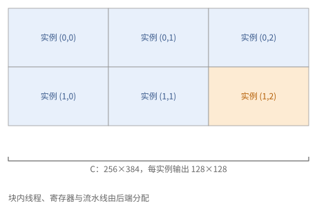
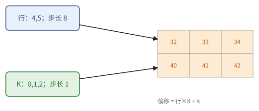
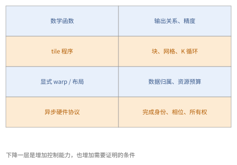

# 第 24 章　GPU 上的 tile 语言

第 22、23 章以线程为单位编程：程序员决定每个线程处理哪些数据、怎样同步、怎样排布寄存器与共享内存。这种写法能达到硬件的上限，但代码量大，而且与具体的架构紧密相关（Hopper 与 Blackwell 的 kernel 结构就不同）。**tile 语言**把编程的单位提高到"一个程序实例处理若干个多维块（tile）"：程序员描述块的划分与块上的运算，编译器决定线程怎样分工、数据怎样在寄存器与共享内存中摆放、何时异步搬运、用哪种 Tensor Core 指令。

24.1 节先给出 tile 模型；24.2–24.5 节介绍几种主要的 tile 语言（Triton、cuTile、Pallas GPU）以及更底层的 CuTe DSL；24.6 节讨论在 AI 写代码的前提下怎样选择抽象的层级。

> **在体系中的位置**：下层是第 22 章的 CUDA 线程模型与第 23 章的现代 kernel 结构（tile 语言的编译器要生成的就是那种结构）、第 6 章的分块理论、第 9 章的流水线、第 8 章的布局。本章给出 tile 模型、Triton 与 cuTile 的写法、Pallas GPU 的位置，以及选择抽象层级的原则。24.4 节另需第 13 章（JAX）。第 25、26 章的 kernel 都有 tile 语言与 CUDA 两种写法。

## 24.1 tile 模型

各种 tile 语言的写法不同，模型是同一个。本节给出这个模型（定义 24.1），说明程序员与编译器怎样分工，以及前面各章的性能规律在这个模型中体现为哪几个参数。

> **定义 24.1（tile 程序）** 一个 tile 程序由以下部分组成：
>
> - 一个**网格**：程序实例的编号集合，每个实例由它的编号（`program_id`、`bid`）区分；
> - **程序体**：每个实例是**单一的控制流**，它从全局数组中**载入**若干个块（形状在编译时确定），对块做运算（逐元素运算、归约、广播、块与块的矩阵乘法），再把结果块**写回**。

块的大小、网格、程序体中的循环由程序员决定；而一个实例内部怎样分给线程、warp 和 warpgroup，块在寄存器与共享内存中怎样布局，载入是否异步、用几级流水线，矩阵乘法用哪种 Tensor Core 指令，都由编译器决定。

与第 22 章相比，tile 模型去掉了"线程"这一层：同一个实例内的线程永远做同样的事（对块的不同部分），所以通常不需要用户显式写块内同步或共享内存安排；编译器生成的线程代码仍可能包含掩码、同步与异步等待。代价是程序员不能直接控制这些细节，只能通过少数参数（warp 数、流水线级数）影响编译器。

在 tile 模型中，性能仍由前面各章的规律决定，只是体现为几个参数：

- **块的形状**决定强度（命题 6.12 之后的块的强度：正方形块约为 $b/s$）与片上存储的用量；
- **流水线级数**决定能否掩盖载入的延迟（定理 9.10）；
- **每个实例的 warp 数**影响寄存器的分配与占用率（命题 21.6）；
- **实例的编号次序**影响 L2 的复用（命题 23.9）。

> **例 24.2（一个实例是一个块的程序）** $C[256,384]$ 取输出 tile $[128,128]$，网格为 $(2,3)$，共六个实例。实例 $(1,2)$ 负责行 128–255、列 256–383。它内部可能有多个 warp 合作，但用户的数学规格仍是这一个输出块及其 K 循环。
>
> 一个实例的 tile 不能被解释成“一个线程的数组”。寄存器总量与共享缓冲分布由编译器决定；选择块大小后仍要检查分配结果。



**图 24.1**　2×3 的程序实例覆盖一个输出数组；一个实例的块内数据由编译器分给多个线程，逻辑 tile 与线程数组分开。


## 24.2 Triton

下面依次看几种具体的语言。Triton 是最早被广泛使用的 GPU tile 语言，嵌入在 Python 中。它的特点是用**指针块**表示载入：`tl.arange` 生成一个下标向量，基地址加上下标与步长的组合就得到一个指针块，`tl.load` 按指针块载入、`tl.store` 按指针块写回，越界的位置用掩码屏蔽。

```python
@triton.jit
def matmul_kernel(a_ptr, b_ptr, c_ptr, M, N, K,
                  sam, sak, sbk, sbn, scm, scn,
                  BM: tl.constexpr, BN: tl.constexpr, BK: tl.constexpr):
    pid_m, pid_n = tl.program_id(0), tl.program_id(1)
    rm = pid_m * BM + tl.arange(0, BM)                   # 本实例负责的行
    rn = pid_n * BN + tl.arange(0, BN)                   # 本实例负责的列
    rk = tl.arange(0, BK)
    acc = tl.zeros((BM, BN), dtype=tl.float32)           # f32 累加器
    for k0 in range(0, K, BK):
        a = tl.load(a_ptr + rm[:, None] * sam + (k0 + rk)[None, :] * sak,
                    mask=(rm[:, None] < M) & ((k0 + rk)[None, :] < K), other=0.0)
        b = tl.load(b_ptr + (k0 + rk)[:, None] * sbk + rn[None, :] * sbn,
                    mask=((k0 + rk)[:, None] < K) & (rn[None, :] < N), other=0.0)
        acc = tl.dot(a, b, acc)                          # 块乘法，编译为 Tensor Core 指令
    tl.store(c_ptr + rm[:, None] * scm + rn[None, :] * scn,
             acc.to(c_ptr.dtype.element_ty),
             mask=(rm[:, None] < M) & (rn[None, :] < N))

# 启动：matmul_kernel[(triton.cdiv(M, BM), triton.cdiv(N, BN))](a, b, c, M, N, K, 各步长, BM=128, BN=128, BK=64)
```

几个要点：

- 指针块就是第 8 章的步长布局写成了数组：`rm[:, None] * sam + rk[None, :] * sak` 是块内每个元素的偏移。
- 编译器看到 `for k0` 循环中的载入与 `tl.dot`，会自动把载入做成多级的异步流水线；级数和 warp 数可以作为启动参数给出（`num_stages`、`num_warps`），通常用自动调优在若干组配置中挑选。
- Triton 官方教程中的矩阵乘法还把一维的实例编号重新映射为二维的块坐标，让同时运行的实例覆盖接近正方形的区域（"分组次序"），这就是命题 23.9 的光栅化。

Triton 适合写融合的逐元素运算、归约、softmax、归一化，以及中等复杂度的矩阵乘法与注意力。它在 Ampere 与 Hopper 上的矩阵乘法可以接近厂商库；对 Hopper 与 Blackwell 的新部件（TMA、warp 专门化、TMEM），它通过越来越多的编译器支持和提示来使用。

> **例 24.3（广播生成的不是实际复制）** 取 $B_M=2,B_K=3$，行编号 $(4,5)$，K 编号 $(0,1,2)$，行步长 8、列步长 1。`rm[:,None]*8+rk[None,:]` 得偏移矩阵 $\begin{pmatrix}32&33&34\\40&41&42\end{pmatrix}$。广播表达式确定六个逻辑地址，不要求先在 HBM 存一个六元素的地址数组。
>
> 尾部 K 只有两个有效元素时，第三列指针即使被算出，load 也要用 mask 禁止越界并填 0；store 的边界掩码则独立由输出形状决定。



**图 24.2**　行索引与 K 索引通过广播组成二维偏移；指针块表达布局和边界，不是先物化一份地址张量。


## 24.3 cuTile（CUDA Tile）

NVIDIA 在 CUDA 13 中推出了自己的 tile 编程模型，Python 接口称为 **cuTile**。与 Triton 的指针块不同，cuTile 以**块坐标**载入：把数组看成按块形状划分的块网格，按块坐标取出一块。

```python
import cuda.tile as ct

@ct.kernel
def matmul(A, B, C, tm: ct.Constant[int], tn: ct.Constant[int], tk: ct.Constant[int]):
    bm, bn = ct.bid(0), ct.bid(1)
    acc = ct.full((tm, tn), 0, dtype=ct.float32)
    for k in range(ct.num_tiles(A, axis=1, shape=(tm, tk))):
        a = ct.load(A, index=(bm, k), shape=(tm, tk), padding_mode=ct.PaddingMode.ZERO)
        b = ct.load(B, index=(k, bn), shape=(tk, tn), padding_mode=ct.PaddingMode.ZERO)
        acc = ct.mma(a, b, acc)
    ct.store(C, index=(bm, bn), tile=ct.astype(acc, C.dtype))

# 启动：ct.launch(stream, (ct.cdiv(M, tm), ct.cdiv(N, tn), 1), matmul, (A, B, C, tm, tn, tk))
```

- `ct.load(A, index=(bm, k), shape=(tm, tk))` 取出第 $(b_m, k)$ 块，与定义 8.4 的分块一一对应；越界的部分按 `padding_mode` 补零。
- 块的每一维必须是 2 的幂。
- 编译器负责把块载入映射到 TMA（若硬件支持）、把 `ct.mma` 映射到相应的 Tensor Core 指令。

> **现状（2026-10）**：cuTile Python 从 CUDA 13.1 起提供，13.2 起支持计算能力 8.x（Ampere、Ada）到 12.x 的 GPU，需要较新的驱动；C++ 接口从 CUDA 13.3 起提供。它仍然很新，是否会成为主流尚不确定；但它与 Triton、Pallas 的模型高度一致，学会其中一种，另外两种很快就能读懂。

> **例 24.4（同一地址换一种接口写出）** 行优先 $A[256,192]$，tile $[128,64]$。块坐标 $(1,2)$ 表示元素起点 $(128,128)$，取行 128–255、列 128–191；若数组最后一维只有 180，则最后 12 列必须按约定填零。
>
> 块坐标接口把地址生成交给编译器，仍需由用户选择适合语义的填充。矩阵乘法的 K 越界用 0，最大值归约却应使用 $-\infty$，不能把“自动 padding”一律理解成数值正确。


## 24.4 Pallas GPU

（本节用到第 13 章的 JAX。）Pallas 是 JAX 中的 kernel 语言，它的基本模型也是 tile 模型：`pl.pallas_call(kernel, grid=..., in_specs=..., out_specs=...)` 给出网格，每个输入输出的 `pl.BlockSpec(块形状, 下标映射)` 说明每个程序实例取哪一块，kernel 体对块做 `jnp` 运算。同一个用 BlockSpec 写的 kernel，可以通过 Triton 后端在 GPU 上运行。

Pallas 在 GPU 上还有一个更底层的后端 **Mosaic GPU**，面向 Hopper 与 Blackwell：程序员显式地使用 warpgroup、用 TMA 把块拷入共享内存、用 barrier 同步、调用 wgmma 或 tcgen05，并有自动生成多级流水线与 warp 专门化流水线的工具。它的结构就是第 23 章的结构，只是写在 JAX 中，并且可以与 JAX 的变换和分布式程序组合。

> **例 24.5（跨后端保留什么规格）** 同一个“两个输入块逐元素相加”的规格，可以保留输入输出形状、grid 覆盖与边界条件；GPU 后端内部怎样分配线程、何时载入、使用哪种块布局则需重新确定。
>
> 当需要显式 TMA 与异步 MMA 时，Mosaic GPU 的接口把这些资源暴露出来，程序员重新承担第 23 章的协议证明。接口同属一个框架，不意味着所有布局或流水线参数可以跨后端照抄。


## 24.5 CuTe DSL 与其他

CUTLASS 4 的 **CuTe DSL** 提供与 C++ CUTLASS 同等的控制力，用 Python 书写：程序员仍然以线程、warp、warpgroup 为单位编程，直接使用 TMA、mbarrier、wgmma、tcgen05，用 CuTe 的布局代数（定义 23.11）描述数据的划分。它适合追求最新硬件上峰值性能的 kernel。此外还有一些研究性的 tile 语言（如 TileLang、ThunderKittens），它们在 tile 模型与线程模型之间取不同的折中。

> **例 24.6（Python 拼写不决定抽象高低）** 一个 Python 函数只表达块乘法，由编译器安排线程，这是 tile 层；另一个 Python 函数显式分配 TMEM、建 mbarrier、发 tcgen05，则是在控制硬件协议。二者都用 Python，所需审查责任却不同。
>
> 读代码时看它是否暴露布局所有权、异步完成与执行角色，比按语言名称判断复杂度准确。


## 24.6 怎样选择抽象层级

第 22–24 章给出了从线程到 tile 的几个抽象层级。最后回答一个实际问题：一个任务该用哪一层来写？

| 任务 | 首选 |
| --- | --- |
| 普通的矩阵乘法、卷积、标准的注意力 | 厂商库与成熟的开源 kernel（cuBLAS、cuDNN、CUTLASS、FlashAttention） |
| 逐元素运算、归约、归一化、softmax 的融合 | 编译器的自动融合；不够时用 tile 语言（Triton、cuTile） |
| 带有新结构的融合 kernel（新的注意力变体、量化矩阵乘法、MoE 的分组运算） | tile 语言 |
| 在 Hopper、Blackwell 上逼近峰值，需要 warp 专门化、TMEM、CTA 对 | CuTe DSL / CUTLASS，或 Pallas 的 Mosaic GPU |
| 需要与 JAX 的变换、分片组合，或在 TPU 与 GPU 之间移植 | Pallas |

在 AI 写代码的前提下，选择的原则是：**用能够表达所需数据流的最高层抽象写规格，只有当屋顶线估算与实际性能之间有明显差距、且差距的原因落在这一层无法控制的细节上时，才下降一层**。层级越高，规格越短、越容易审查、越容易移植；层级越低，越能控制每一个细节，也越容易出现第 9 章和第 23 章那样的同步错误。

> **例 24.7（从瓶颈定位决定是否降低层级）** 假设一个融合 RMSNorm 的 tile kernel 已做到输入输出各一遍，寄存器不溢出，容量和在途量都满足，时间下界由 HBM 决定。改写成手工 TMA 协议没有新增数学复用机会，收益可能很小。
>
> 若一段注意力必须让两组 warp 交替软归约与矩阵乘法，而当前 tile 接口无法表达这种重叠，下降到显式 warpgroup 层就有明确目的。选择依据是缺失的数据流能力，不是“越底层越快”。



**图 24.3**　层级越低，暴露的责任越多：数学规格、块划分、布局、执行角色与完成协议。下降层级应针对一个明确瓶颈。


## 接口小结

1. tile 程序：网格中每个实例是单一控制流，载入块、做块运算、写回块；线程分工、布局、异步流水线与 Tensor Core 指令由编译器决定。性能仍由块形状、流水线级数、warp 数、实例次序决定。（定义 24.1）
2. Triton：用 `tl.arange` 构造指针块，掩码处理边界，`tl.dot` 做块乘法；`num_stages`、`num_warps` 与自动调优；分组次序提高 L2 复用。（24.2 节）
3. cuTile：按块坐标载入（`ct.load(A, index=..., shape=...)`），块的每维为 2 的幂，`ct.mma` 做块乘法，`ct.launch` 启动；CUDA 13.1 起提供。（24.3 节）
4. Pallas GPU：BlockSpec 模型可经 Triton 后端在 GPU 上运行；Mosaic GPU 后端提供第 23 章结构的显式控制。（24.4 节）
5. CuTe DSL 以 Python 提供 CUTLASS 级的控制。（24.5 节）
6. 选择原则：用能表达数据流的最高层抽象；只有在估算与实际的差距落在本层无法控制的细节上时才下降。（24.6 节）

## 习题

**习题 24.1** ★ 用 24.2 节的 Triton kernel 计算 $M = N = 1000$、$K = 4096$ 的矩阵乘法，$BM = BN = 128$，$BK = 64$。(a) 网格有多少个实例？(b) 因补零而浪费的计算占多少？(c) 若 GPU 有 132 个 SM，每个 SM 同时运行一个实例，利用率如何？

<details><summary>提示 1</summary>

先算向上取整后的两维，再比较有效输出面积与实际 tile 面积。

</details>
<details><summary>提示 2</summary>

(a) $\lceil 1000 / 128 \rceil = 8$。(c) 命题 6.22。

</details>
<details><summary>答案</summary>

(a) $8 \times 8 = 64$ 个。(b) 计算的是 $1024 \times 1024$，有效 $1000 \times 1000$，浪费 $1 - 10^6 / 1024^2 \approx 4.6\%$。(c) 64 个实例只用了 132 个 SM 中的 64 个，利用率不到一半。应当减小块（例如 $64 \times 128$，得 $16 \times 8 = 128$ 个实例），或者用 split-K / Stream-K（命题 23.8）。

</details>

**习题 24.2** ★ Triton 官方教程的"分组次序"把一维编号 `pid` 映射为块坐标：设每组 $G$ 行块，`num_pid_n` 为列块数，则 `group_id = pid // (G * num_pid_n)`，`pid_m = group_id * G + (pid % (G * num_pid_n)) % G`，`pid_n = (pid % (G * num_pid_n)) // G`（这里设行块数是 $G$ 的倍数）。取 $G = 2$、行块数 4、列块数 3，列出 `pid` 从 0 到 11 对应的 `(pid_m, pid_n)`，并说明前 6 个实例覆盖的区域。

<details><summary>提示 1</summary>

把 pid 按组号和组内号分开，确认每个块坐标出现恰一次。

</details>
<details><summary>提示 2</summary>

每组有 $G \times \text{num\_pid\_n} = 6$ 个实例。

</details>
<details><summary>答案</summary>

`pid` 0–5：$(0,0), (1,0), (0,1), (1,1), (0,2), (1,2)$；6–11：$(2,0), (3,0), (2,1), (3,1), (2,2), (3,2)$。前 6 个实例覆盖第 0–1 行块的全部 3 个列块，是一个 $2 \times 3$ 的区域，需要 2 个 $A$ 行条和 3 个 $B$ 列条；这个小例子里按行遍历的前 6 个实例恰好也是 $2 \times 3$。区别在列块很多时才显现：设同时运行 $P$ 个实例、列块数不少于 $P$，按行遍历时它们都在同一行，需要 1 个 $A$ 行条和 $P$ 个 $B$ 列条；分组次序下它们组成约 $G \times (P/G)$ 的区域，只需 $G + P/G$ 个条带，$G \approx \sqrt{P}$ 时最少（命题 23.9）。

</details>

**习题 24.3** ★（审查题）下面是一个 Triton kernel 的片段。指出问题。

```python
acc = tl.zeros((BM, BN), dtype=tl.float16)
for k0 in range(0, K, BK):
    a = tl.load(...)
    b = tl.load(...)
    acc += tl.dot(a, b).to(tl.float16)
```

<details><summary>提示 1</summary>

每个 K 步的部分和在哪里舍入？最后输出为 f32 并不能消除中途低精度舍入。

</details>
<details><summary>提示 2</summary>

例 2.18 与习题 2.9。

</details>
<details><summary>答案</summary>

累加器是 fp16，每一步的块乘积先舍入为 fp16 再累加，$K$ 大时误差随步数增长，甚至停滞。应当用 f32 的累加器，并把它作为 `tl.dot` 的第三个参数（`acc = tl.dot(a, b, acc)`），只在写回时转换为 fp16。

</details>

**习题 24.4** ★ cuTile 要求块的每一维是 2 的幂。用 24.3 节的 kernel 计算 $K = 300$ 的矩阵乘法，$tk = 64$。循环执行几次？最后一次载入的块中有多少是补出来的零？结果正确吗？

<details><summary>提示 1</summary>

先确定最后一块 K 的起点，填零只发生在超过 K 的位置。

</details>
<details><summary>提示 2</summary>

`ct.num_tiles(A, axis=1, shape=(tm, tk))` 是 $\lceil K / tk \rceil$。

</details>
<details><summary>答案</summary>

$\lceil 300 / 64 \rceil = 5$ 次。最后一块覆盖 $k \in [256, 320)$，其中 $[300, 320)$ 的 20 列（$A$）与 20 行（$B$）是补出来的零。零与任何数相乘为零，对累加没有贡献，结果正确；代价是最后一步约 31% 的计算是无用的。

</details>

**习题 24.5** ★ 为下列任务选择抽象层级，并说明理由：(a) 把 RMSNorm 与紧随其后的 fp8 量化融合成一个 kernel；(b) 在 B200 上实现一个达到峰值 80% 以上的 NVFP4 矩阵乘法；(c) 试验一种新的注意力掩码（按文档边界的块稀疏）；(d) 一个在 JAX 中训练、既要在 TPU 也要在 GPU 上运行的自定义算子。

<details><summary>提示 1</summary>

判断需要的控制是数学融合、tile 参数，还是显式异步硬件协议。

</details>
<details><summary>提示 2</summary>

对照 24.6 节的表与原则。

</details>
<details><summary>答案</summary>

(a) tile 语言（Triton 或 cuTile）：访存受限的融合，按行处理，不需要底层控制。(b) 先查厂商库与 CUTLASS 是否已有；需要自己写时用 CuTe DSL / CUTLASS：块缩放 MMA、TMEM、CTA 对都需要显式控制。(c) tile 语言：事先把（查询块，键值块）分成全部屏蔽、部分屏蔽、全部可见三类，全部屏蔽的跳过、部分屏蔽的逐元素掩码（26.2 节的因果掩码是它的特例），用额外的输入（一张非空块的表）告诉每个程序实例要访问哪些块。(d) Pallas：同一个 BlockSpec 级的 kernel 可以在两种硬件上运行，必要时再分别优化。

</details>

**习题 24.6** ☆ 一个 Triton 矩阵乘法每个 $K$ 步的计算约 0.4 µs，载入一块从发起到完成约 1.5 µs。`num_stages` 至少应设为多少？若每级的 $A$、$B$ 块共 32 KiB，共享内存够用吗（每 SM 228 KB）？

<details><summary>提示 1</summary>

输入延迟决定提前几步，槽数还需包含当前消费块；之后逐级计共享存储。

</details>
<details><summary>提示 2</summary>

定理 9.10。

</details>
<details><summary>答案</summary>

$\lceil 1.5 / 0.4 \rceil + 1 = 5$ 级，共 160 KiB，放得下（还要为编译器的其他用途留一些）。若改为 7 级则需 224 KiB，接近上限，可能导致每个 SM 只能驻留一个实例。

</details>

**习题 24.7** ★（综合审查题）tile $[128,64]$ 的块坐标为 $(2,3)$。元素起点是什么？若程序把 $(256,192)$ 作为块坐标提交，实际元素起点是多少？

<details><summary>提示 1</summary>

块坐标与元素偏移的单位不同；每个坐标分别乘对应块大小。

</details>
<details><summary>提示 2</summary>

正确起点为 $(2\cdot128,3\cdot64)$；错误坐标再被乘一次。

</details>
<details><summary>答案</summary>

正确为 $(256,192)$；把它当块坐标时会定位到 $(32768,12288)$。因此接口按块寻址时，index_map 返回块号；接口按指针块寻址时，再由步长算元素或字节偏移。

</details>
