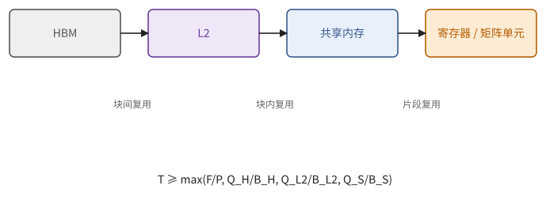
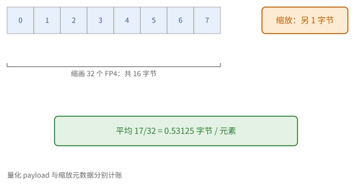
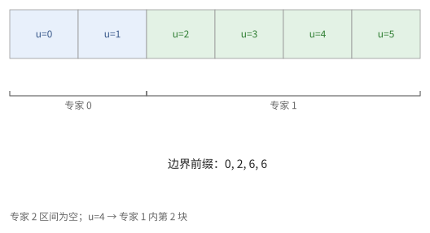
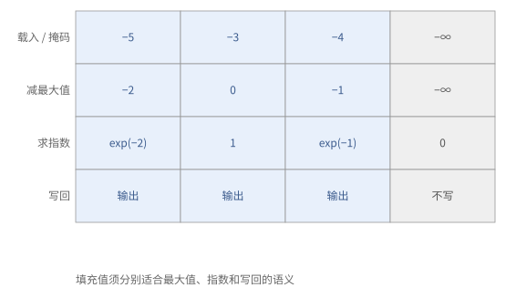

# 第 25 章　GPU kernel：矩阵乘法与访存受限算子

本章把前几章的部件组合成 GPU 上最常用的几类 kernel。25.1 节沿着"逐级优化"的阶梯走一遍矩阵乘法：每一级去掉一个瓶颈，每个瓶颈都可以用第 6 章的屋顶线在相应的存储级上算出来。25.2–25.4 节讲低精度与块缩放的矩阵乘法、MoE 的分组矩阵乘法与结尾融合；25.5 节讲 softmax 与归一化这类访存受限的 kernel；25.6 节汇总审查要点。

> **在体系中的位置**：下层是第 6 章的屋顶线与多级分块、第 10 章的在线算法、第 11 章的工作负载、第 21–24 章的 GPU 结构、CUDA 与 tile 语言。本章给出 GEMM 优化的各级及其瓶颈、块缩放的处理、分组 GEMM 的调度、结尾融合与访存受限 kernel 的写法，以及审查要点。

## 25.1 GEMM 的逐级优化

命题 22.8 解释寄存器分块的局部复用，命题 23.9 解释块间的 L2 复用。本节沿不同存储边逐级使用命题 6.18 的下界；例 25.1 说明为什么流量必须逐级计量。

矩阵乘法的优化是一级一级进行的：每一级去掉一个瓶颈，同时暴露出下一个。下表从最朴素的写法出发，每一级说明它去掉了哪个瓶颈、引入了什么。设 f32 的 CUDA 核心峰值为 $P_{\text{fp32}}$，Tensor Core 的峰值 $P_{\text{tc}}$ 是它的十倍以上。

| 级 | 做法 | 去掉的瓶颈 | 新的瓶颈 |
| --- | --- | --- | --- |
| 1 | 每个线程算一个输出，直接从全局内存读操作数 | — | 每次乘加读 8 字节，强度 $\approx 0.25$ FLOP/字节，严重访存受限 |
| 2 | 调整下标映射，使 warp 的访问合并（22.1 节） | 访存效率低 | 仍然没有复用 |
| 3 | 共享内存分块（22.5 节） | 全局内存的流量降为 $1/T$ | 每次乘加读两次共享内存 |
| 4 | 寄存器分块，每线程 $t \times t$（命题 22.8） | 共享内存带宽 | 寄存器压力、占用率 |
| 5 | 16 字节的向量化读写、无冲突的共享内存布局（第 8 章） | 指令数与存储体冲突 | 接近 CUDA 核心的峰值 |
| 6 | 改用 Tensor Core（warp 级 MMA）与 cp.async 多级流水线 | 计算峰值提高十倍以上 | 喂数据：带宽与延迟重新成为瓶颈 |
| 7 | Hopper：TMA + wgmma + warp 专门化（第 23 章） | 线程的寄存器与指令开销、数据供给 | 共享内存的容量、结尾 |
| 8 | Blackwell：tcgen05 + TMEM + CTA 对 + 持久化与结尾重叠 | 结尾、单个线程块的强度 | — |

每一级都可以用"逐级的屋顶线"（命题 6.18）定量地验证。以第 1、3、4 级为例：

- 第 1 级每次乘加（2 FLOP）读 $A$、$B$ 各一个 f32，若缓存没有帮助，强度为 $2/8 = 0.25$；
- 第 3 级 $T = 32$ 时，每读一个字节做 8 FLOP（习题 22.4）；
- 第 4 级 $128 \times 128$ 的块、$b_K = 32$ 时，每字节约 32 FLOP。

到第 6 级，峰值提高十倍以上，所需的强度也提高十倍以上。由命题 6.12 之后的公式，块的强度约为 $\frac{2 b_M b_N}{s(b_M + b_N)}$（$bf16$ 时为 $\frac{b_M b_N}{b_M + b_N}$）：$128 \times 256$ 的块约为 85 FLOP/字节。这个强度是相对于**这个线程块从 L2 读入的数据**而言的；不同线程块读的块大量重叠，若光栅化得好（命题 23.9），它们在 L2 中命中，HBM 的流量远小于各线程块读入量之和。所以 GPU 上 GEMM 的块大小，是在 L2 带宽、共享内存容量（习题 23.1）与寄存器或 TMEM 的容量之间权衡的结果。

> **现状（2026-10）**：用于 GEMM 的块，在 Hopper 上常见 $128 \times 128$ 到 $128 \times 256$（两个消费者 warpgroup），Blackwell 上常见 $256 \times 128$ 到 $256 \times 256$（CTA 对）。具体的选择由库在运行时按形状挑选。

> **例 25.1（不能把 L2 流量当成 HBM 流量）** bf16 的 $128\times256$ 输出 tile，每 K 步强度为 $128\cdot256/(128+256)\approx85.3$ FLOP/字节。若每份输入平均供给四个线程块并在 L2 中复用，理想 HBM 强度可约为四倍，达到 341；L2 到各块的强度仍只有 85.3。
>
> 前者可能够过 HBM 拐点，后者仍可能不过 L2 拐点。优化块次序的收益在第一本流量账上，共享存储或寄存器分块的收益在后两本账上，必须分开判断。



**图 25.1**　同一 GEMM 的 HBM、L2、共享内存和计算各有自己的下界。复用只减少它所在边外侧的流量，不能把四级账合成一个字节数。


## 25.2 低精度与块缩放的 GEMM

第 2 章已经给出块缩放的数值含义。本节先判断缩放是否依赖求和下标，再决定由矩阵指令还是结尾应用；例 25.2 同时计算元数据流量和缩放的次序。

**按张量缩放的 FP8。** 若整个张量共用一个缩放因子，$C = s_A s_B (Q_A Q_B)$，缩放不依赖于求和下标，可以在结尾乘一次。按输出通道（$B$ 的每一列一个因子）缩放也是如此。

**按块缩放。** 激活沿 $K$ 方向每 128 个元素一个因子、权重每个 $128 \times 128$ 块一个因子之类的细粒度缩放，因子依赖于 $k$ 所在的块，只能在块内提出（2.8 节末的公式）：必须在每个 $K$ 块的部分积累加之前乘上。在 Hopper 上，这要由消费者在寄存器中完成：每处理完一个 $K$ 块，把这一块的部分积乘以缩放因子，再加到 f32 的累加器上。

> **现状（2026-10）**：有公开的技术报告指出，Hopper 的 FP8 MMA 在内部以有限的精度（明显低于 f32）累加，长的 $K$ 方向累加会损失精度；他们的做法是每 128 个 $K$ 元素就把 MMA 的累加结果取出，在 CUDA 核心上以 f32 累加，这与按块缩放的处理正好合并在一起。Blackwell 在硬件中支持 MX 格式与 NVFP4 的块缩放 MMA，缩放因子放在 TMEM 中，不再需要软件处理。

**量化输出。** 若结尾要把输出量化为 FP8，需要先知道输出块的最大绝对值来确定缩放因子：在结尾对每个块做一次归约（命题 10.2），或者使用上一步的统计值（"延迟缩放"）。

> **例 25.2（缩放元数据也占带宽）** 32 个 FP4 元素原始值共 16 字节；若每组另用 1 字节缩放，载荷为 17 字节，平均 0.53125 字节/元素，而非恰好 0.5。若还有对齐和其他元数据，实际更多。
>
> 两 K 组的乘积分别为 3、5，组缩放乘积为 2、10，则合并为 56。把两组先累加后只乘一个缩放会错。这是存储预算和数值顺序两条独立检查。



**图 25.2**　FP4 数据块之外还有缩放元数据；硬件或软件在组内应用缩放，再合并各组部分积。


## 25.3 分组 GEMM 与 MoE

由命题 11.10，MoE 的工作由各专家的局部行数决定。本节把不同尺寸的输出块放进同一次调度；例 25.3 用前缀区间把全局编号变成专家和局部 tile。

MoE 层要对每个专家 $e$ 计算 $Y_e = X_e W_e$，各组的行数 $n_e$ 不同（11.5 节）。分组 GEMM 把它们放进**一次**启动：

1. 计算每组的输出块数 $c_e = \lceil n_e / b_M \rceil \cdot \lceil N / b_N \rceil$ 及其前缀和 $C_e = \sum_{e' < e} c_{e'}$；
2. 持久化的线程块依次领取全局的块编号 $u$，用二分查找找到 $C_e \le u < C_{e+1}$，得到专家 $e$ 与组内的块坐标；
3. 用专家 $e$ 的数据（基地址、行数）构造这次的载入。用 TMA 时，每个组需要自己的描述符（或者在设备上修改描述符）。

完整的 MoE 层是：路由 → 按专家**重排**词元（一次 gather）→ 分组 GEMM →（激活）→ 分组 GEMM → **还原**次序并按路由权重相加（scatter-add）。重排与还原是访存受限的操作，常与相邻的 kernel 融合（例如在第一个 GEMM 的载入阶段直接按下标表读取，第二个 GEMM 的结尾直接写到还原后的位置）。

> **现状（2026-10）**：Rubin 的 TMA 支持在 kernel 中直接更新描述符，以便于 MoE 这类每组形状不同的情形。

> **例 25.3（从全局块号找到专家）** 三专家的行数为 $(5,130,0)$，$b_M=128$，输出列有两个 tile。各专家块数为 $(2,4,0)$，边界前缀为 $(0,2,6,6)$。全局编号 $u=4$ 属专家 1，组内编号 $u-C_1=2$，解成行 tile 1、列 tile 0。
>
> 尾部行 tile 仅有两行有效。空专家对应相同的前缀边界，应跳过零长区间；二分查找与“编号到坐标”的公式都要保持这个规则。



**图 25.3**　六个全局工作块通过前缀区间映射到专家；专家 2 的区间为空，不领取任何 tile。


## 25.4 结尾融合

命题 6.9 说明融合减少中间结果往返。本节把融合放到完整累加结果的结尾，并核对残差输入与写回的真实流量；例 25.4 给出可手算的字节预算。

结尾（epilogue）是一个输出块的累加结果离开片上存储之前的最后一步，在这里可以做：

- 加偏置、激活函数、残差加法；
- 乘以缩放因子（25.2 节）、量化为低精度并算出新的缩放因子；
- 写入特殊的布局（例如下一层需要的转置或交错布局，8.8 节）。

在 Hopper 与 Blackwell 上，结尾通常是：累加结果从寄存器或 TMEM 读出 → 逐元素运算 → 写入共享内存 → 用 TMA 写回全局内存。结尾若不能与下一个块的主循环重叠，它的时间就直接加在每个块上：对 $K$ 较小的 GEMM，结尾可能占总时间的相当一部分。这就是持久化 kernel 与累加器双缓冲（23.5 节）的意义。

> **例 25.4（省掉一次往返有多少字节）** 输出 $C[4096,4096]$ bf16，占 32 MiB。单独执行激活至少再读 32 MiB、写 32 MiB；在 GEMM 结尾融合可省这次 64 MiB 的中间往返。若另外读残差，残差自身的 32 MiB 仍需读取，不能把所有结尾流量都算成零。
>
> 结尾还消耗数值单元、寄存器或 TMEM 读带宽及写回资源。省 HBM 流量之后，可能暴露结尾本身的吞吐下界。


## 25.5 访存受限的算子

命题 22.6 提供 warp 内归约，命题 10.4、10.9 提供跨块合并状态。本节按一行数据能否驻留决定单次或流式归约，并由例 25.5 检查边界单位元。

**行与执行单位的对应。** 一行很短（几百到几千个元素）时，一个 warp 处理一行：每个线程用 16 字节的向量化读取若干个元素，局部归约后用 warp 洗牌（命题 22.6）得到整行的结果。一行很长时，一个线程块处理一行，用块内归约（22.4 节）。一行放得进寄存器时一遍读入、两次归约（最大值与和），再写出；放不下时用在线 softmax（命题 10.4）或 Welford 合并（命题 10.9）。

**在途量。** 由命题 21.7，要跑满带宽，每个 SM 要有足够的字节在途：向量化读取、每个线程处理多个元素、足够的占用率。

一个 Triton 写的按行 softmax（一行放进一个块）：

```python
@triton.jit
def softmax_kernel(x_ptr, y_ptr, n_cols, stride, BLOCK: tl.constexpr):
    row = tl.program_id(0)
    cols = tl.arange(0, BLOCK)                          # BLOCK 是不小于 n_cols 的 2 的幂
    mask = cols < n_cols
    x = tl.load(x_ptr + row * stride + cols, mask=mask, other=-float("inf")).to(tl.float32)
    x = x - tl.max(x, axis=0)
    e = tl.exp(x)
    y = e / tl.sum(e, axis=0)
    tl.store(y_ptr + row * stride + cols, y.to(y_ptr.dtype.element_ty), mask=mask)
```

越界的位置载入为 $-\infty$，指数为 0，不影响最大值和总和（习题 25.5）。归约在 f32 中进行。

**与相邻的运算融合。** 访存受限的算子单独成为一个 kernel 时，要多读写一遍数据；能融合就融合：softmax 与注意力融合（第 26 章），RMSNorm 的缩放折进后续的 GEMM（设 $R = \operatorname{diag}(r_1, \dots, r_N)$ 为每行的归一化因子、$G = \operatorname{diag}(g)$，则 $\operatorname{RMSNorm}(X) = RXG$，由结合律 $\operatorname{RMSNorm}(X) W = R\,(X\,(GW))$：$GW$ 离线算好，每行的 $r_i$ 在结尾乘上），激活函数放进前一个 GEMM 的结尾。

> **例 25.5（负无穷与零各在正确的位置）** 真实一行是 $(-5,-3,-4)$，tile 长度为 4。最大值之前第四位置应填 $-\infty$，减最大值后指数为 0；若填 0，最大值变成 0，且分母多出一个 $e^0$，得到错误的归一化。
>
> 一行完全无有效元素时，四个位置都为 $-\infty$，直接相减会产生 NaN。规格应另约定空行输出；本节普通 softmax 示例只适用于至少一个有效元素的行。归约单位元和空集合结果要分别规定。



**图 25.4**　尾部位置在最大值阶段填负无穷，在指数后贡献零；写回只写有效三列。单位元随归约操作不同而不同。


## 25.6 审查要点

例 25.1 到例 25.5 分别建立流量、缩放、调度与边界条件。本节按这些不变量整理审查顺序；例 25.6 把它们写成一个输出块的具体规格。

1. **上限**：用屋顶线估出时间下界（HBM、L2、计算），确定它应当受什么限制。
2. **合并与向量化**：全局内存的访问是否合并，是否用了 16 字节的读写（或 TMA）。
3. **共享内存**：布局是否无冲突（交错与 MMA 期望的布局一致）；级数与块大小是否放得进共享内存。
4. **同步**：多级流水线的"满""空"同步是否正确，尤其是"等 MMA 完成之后才释放一级"（命题 23.5）。
5. **精度**：累加器是否为 f32；FP8 的长累加是否定期提升到 f32；块缩放是否在正确的位置应用。
6. **占用与在途量**：在途的字节数是否足够（命题 21.7）；寄存器是否溢出。
7. **调度**：输出块数与 SM 数的关系（波次量化，命题 6.22、命题 23.8）；光栅化是否有利于 L2 复用。
8. **结尾**：融合了哪些运算；结尾是否与主循环重叠。

> **例 25.6（一份能交给 AI 的输出块规格）** 先写明 $C=AB$ 的形状、输入 bf16、f32 累加、非整除边界，再写每块唯一负责的输出区间、K 块的缩放边界、输入槽的 full/empty 条件、预计共享内存和累加预算。最后分别给出 HBM、L2 和计算下界。
>
> 如果 AI 只汇报“使用 Tensor Core、四级流水线”，还不足以接受：这些名字没有证明元素覆盖、完成身份或容量合法。需要它把具体下标与资源账填写出来。


## 接口小结

1. GEMM 的八级优化，每一级去掉一个可以用逐级屋顶线算出的瓶颈；Tensor Core 使所需强度提高十倍以上，块大小在 L2 带宽、共享内存与寄存器/TMEM 容量之间权衡；光栅化让线程块在 L2 中共享数据。（25.1 节）
2. 按张量缩放在结尾乘；按块缩放在每个 $K$ 块累加前乘；Hopper 的 FP8 需要定期把累加提升到 f32；Blackwell 在硬件中支持块缩放。输出量化需要块内归约或延迟缩放。（25.2 节）
3. 分组 GEMM：块数的前缀和加二分查找，把全局块编号映射为（专家，块坐标）；MoE 的重排与还原与相邻 kernel 融合。（25.3 节）
4. 结尾融合偏置、激活、缩放、量化与布局变换；结尾应与下一块的主循环重叠。（25.4 节）
5. 访存受限的 kernel：一行一个 warp 或一个块，向量化读取，warp 或块内归约，一遍完成；越界位置用归约的单位元填充；尽量与相邻运算融合。（25.5 节）
6. 审查顺序：上限、合并、共享内存、同步、精度、在途量、调度、结尾。（25.6 节）

## 习题

**习题 25.1** ★ RTX 3060 Ti 的 f32 峰值约 16.2 TFLOP/s，显存带宽 448 GB/s。(a) 拐点是多少？(b) 估计 25.1 节第 1、3、4 级（强度分别为 0.25、8、32 FLOP/字节，设 L2 不提供额外的复用）各能达到峰值的多少？

<details><summary>提示 1</summary>

先算计算峰值与带宽之比，再把每级的强度乘带宽，截到计算峰值。

</details>
<details><summary>提示 2</summary>

$\min(P, I \cdot B)$。

</details>
<details><summary>答案</summary>

(a) $16.2 \times 10^{12} / 4.48 \times 10^{11} \approx 36$ FLOP/字节。(b) 第 1 级：$0.25 \times 448 = 112$ GFLOP/s，约 0.7%。第 3 级：$8 \times 448 \approx 3.6$ TFLOP/s，约 22%。第 4 级：$32 \times 448 \approx 14.3$ TFLOP/s，约 88%。实际上 L2 与 L1 会提供一些额外的复用，第 1、3 级会比这个估计好一些，但量级的差别不变。

</details>

**习题 25.2** ★ H100 的 bf16 Tensor Core 峰值约 990 TFLOP/s，HBM 3.35 TB/s，132 个 SM。(a) 一个 $128 \times 256$ 的块相对于它读入的数据，强度是多少？(b) 若所有 SM 读入的数据都来自 HBM（L2 没有复用），HBM 能支撑多少 TFLOP/s？(c) 要达到峰值，L2 平均要让每份数据被几个线程块共享？

<details><summary>提示 1</summary>

单块强度对应块读取，L2 共享减少的是 HBM 实际流量，不是单块的逻辑运算。

</details>
<details><summary>提示 2</summary>

(a) $\frac{b_M b_N}{b_M + b_N}$（bf16）。(c) 所需的复用倍数 = 峰值 / (b) 的结果。

</details>
<details><summary>答案</summary>

(a) $128 \times 256 / 384 \approx 85$ FLOP/字节。(b) $85 \times 3.35 \approx 285$ TFLOP/s，不到峰值的三分之一。(c) 约 $990 / 285 \approx 3.5$ 倍：平均每份从 HBM 读入的数据要被约 3.5 个线程块在 L2 中重复使用。这正是光栅化（命题 23.9）与簇的多播（21.7 节）要解决的问题，也说明 L2 的带宽必须是 HBM 的若干倍。

</details>

**习题 25.3** ★ 设某硬件的 FP8 MMA 在内部以约 14 位的有效精度累加（$u \approx 2^{-14}$）。$K = 8192$ 时，按命题 2.20 估计累加误差的界。若每 128 个元素就把部分和提升到 f32 中累加，误差界变为多少？代价是什么？

<details><summary>提示 1</summary>

若求严格界，应使用 gamma_K=Ku/(1−Ku)，并先检查 Ku 是否小于 1。

</details>
<details><summary>提示 2</summary>

命题 2.20 与习题 2.6 的分组求和。

</details>
<details><summary>答案</summary>

不提升时 $Ku=8192\times2^{-14}=0.5$，已不能把 $\gamma_K=Ku/(1-Ku)$ 近似为 $Ku$；按命题 2.20 的严格界，系数为 1（乘以 $\sum\lvert a_kb_k\rvert$），界非常宽松。每 128 项提升一次，组内系数 $\gamma_{128}=0.0078125/(1-0.0078125)\approx0.00787$；64 个组间用 f32 合并，再加约 $\gamma_{64}^{\mathrm{f32}}\approx3.8\times10^{-6}$ 的系数。典型的随机误差可能更小，但不能替代这个最坏情形界。代价是每组需要取出 MMA 的部分累加并在 CUDA 核心上相加，还要占用指令与寄存器。

</details>

**习题 25.4** ★ 一个 MoE 层有 4 个专家，各分到 300、50、0、700 个词元，$b_M = 128$，$N / b_N = 8$。(a) 每个专家的输出块数与前缀和是多少？(b) 全局块编号 $u = 30$ 属于哪个专家、组内的哪个块？(c) 补零浪费的行占多少？

<details><summary>提示 1</summary>

给每专家一个半开编号区间；空组产生零长区间，不领取块。

</details>
<details><summary>提示 2</summary>

$c_e = \lceil n_e / 128 \rceil \times 8$。

</details>
<details><summary>答案</summary>

(a) $c = (24, 8, 0, 48)$，前缀和 $C = (0, 24, 32, 32, 80)$。(b) $24 \le 30 < 32$，属于专家 1，组内第 6 个块（若按行块优先：行块 0，列块 6）。(c) 计算的行数 $384 + 128 + 0 + 768 = 1280$，有效 1050，浪费约 18%。

</details>

**习题 25.5** ★（审查题）把 25.5 节 Triton softmax 中的 `other=-float("inf")` 改成 `other=0.0`，对哪些输入会出错？错在哪里？

<details><summary>提示 1</summary>

尾部的零会参与分母，即使最大值没改变也可能错。

</details>
<details><summary>提示 2</summary>

越界位置的值会参与 `tl.max` 和 `tl.sum`。

</details>
<details><summary>答案</summary>

当 `BLOCK > n_cols` 时，越界位置被填成 0。若一行的所有真实元素都是负数，最大值会被错误地取为 0；即使最大值正确，每个越界位置也会给总和贡献 $e^{0 - m}$，使所有输出偏小。只有当 `n_cols` 恰好是 2 的幂（没有越界位置）时才正确。原则：越界位置要填归约的单位元（求最大值填 $-\infty$，求和填 0），而这里同一个值要先后参与两种归约，$-\infty$ 恰好对两者都正确（$e^{-\infty} = 0$）。

</details>

**习题 25.6** ★ 在 H100 上做一个逐行 RMSNorm，每行 8192 个 bf16，一个线程块（256 个线程）处理一行，每个线程用 16 字节的读取。(a) 每个线程读几次？(b) 用命题 21.7（每 SM 约需 18 KB 在途），每个 SM 需要同时驻留几个块？(c) 若块内先读完整行、再做归约、再写出，在途量是否足够？

<details><summary>提示 1</summary>

一次全块读取只产生 4 KiB 在途；每线程有几次请求同时活跃比总共要读几次更重要。

</details>
<details><summary>提示 2</summary>

一行 16 KiB；256 个线程每次共读 4 KiB。

</details>
<details><summary>答案</summary>

(a) $16384 / 16 / 256 = 4$ 次。(b) 若每个块在一行读完之前一直有 16 KiB 在途，约需 1–2 个块；考虑到读完之后的归约与写出阶段没有读在途，需要更多的块（例如 4 个以上）交错进行。(c) 每个线程连续发出 4 次独立的 16 字节读，再等待，在途量足够；若每个线程读一次、用一次、再读下一次，在途量只有四分之一，带宽利用率会明显下降。

</details>

**习题 25.7** ☆ 一个 GEMM 的结尾要把输出量化为 FP8，缩放因子由整个输出张量的最大绝对值决定。为什么不能在结尾中直接完成？给出两种办法。

<details><summary>提示 1</summary>

整张量的统计值依赖所有块，当前结尾还不能知道尚未产生的数据。

</details>
<details><summary>提示 2</summary>

结尾处理一个块时，其他块还没算完。

</details>
<details><summary>答案</summary>

整个张量的最大值依赖所有块，而每个块的结尾只知道自己的最大值。办法一：两遍，先写出 bf16 的结果并在结尾中用原子操作（或第二个 kernel）求全局最大值，再做一次量化（多一次读写）。办法二：延迟缩放，用上一步（或上几步）记录的最大值作为本步的缩放因子，同时在结尾中更新本步的最大值，供下一步使用；或者改用按块缩放，每个块的缩放因子只依赖于本块。

</details>

**习题 25.8** ★（综合审查题）一个 GEMM 结尾要量化输出，每个 128 列组使用该行该组的最大绝对值。若输出块按 64 列切分，能在各块独立确定正确的 128 列组缩放吗？给出两种修复。

<details><summary>提示 1</summary>

统计组跨越两个输出块，当前结尾看不到另一块的值。

</details>
<details><summary>提示 2</summary>

可改变 tile 使统计组局部完整，或增加一次跨块统计与重读量化。

</details>
<details><summary>答案</summary>

不能独立确定共同缩放。方案一让同一逻辑任务负责完整 128 列组，在结尾求组内最大值；方案二先写出未量化结果与局部最大值，合并两块统计后再量化，增加流量与启动。也可使用规格明确允许的延迟缩放，但那已是不同的数值协议。

</details>
