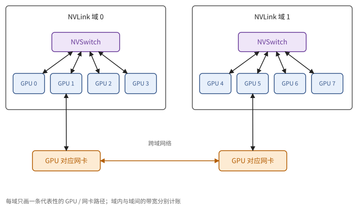
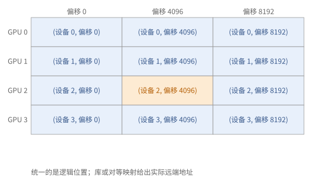
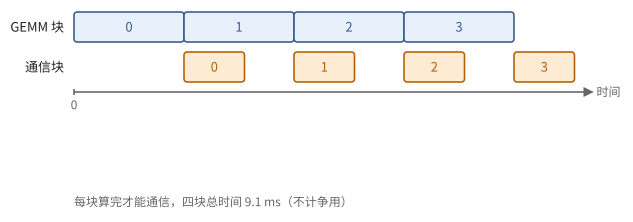
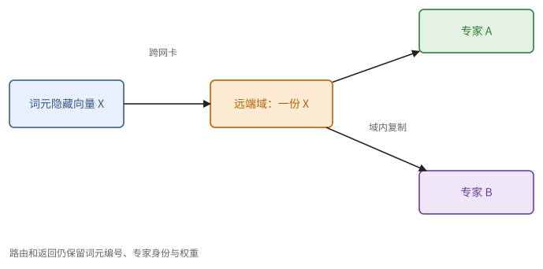

# 第 27 章　多 GPU 编程

第 7 章给出了集合通信的代数与代价，第 12 章给出了各种并行策略需要的通信。本章讲这些通信在 GPU 系统上怎样实现：27.1 节讲集合通信库怎样利用拓扑；27.2 节讲 kernel 怎样直接读写别的 GPU 的显存；27.3、27.4 节讲张量并行与专家并行的通信怎样与计算重叠；27.5 节讲多 GPU 程序特有的正确性问题。

> **在体系中的位置**：下层是第 7 章的集合操作、拓扑与环形算法，第 9 章的同步与内存一致性，第 12 章的并行策略，第 21 章的 NVLink 与 NVSwitch，第 22 章的作用域与原子操作。本章给出 NCCL 的算法与资源占用、对称内存与设备端通信、张量并行的通信重叠、MoE 的分层全交换，以及正确性要点。

## 27.1 NCCL 与拓扑

大多数程序通过一个库使用集合通信。本节说明它怎样按拓扑和数据量选择第 7 章的算法，以及它在 GPU 上的代价。NVIDIA 的集合通信库 **NCCL** 实现了第 7 章的集合操作（all-reduce、all-gather、reduce-scatter、broadcast、reduce，以及点对点的发送与接收，用来组成 all-to-all）。它在初始化时探测拓扑，为每种集合操作与数据量选择算法：

- **环形**（命题 7.13）：带宽最优，适合大数据量；
- **树形**：步数为 $O(\log p)$，适合小数据量（命题 7.14 之后的讨论）；
- **交换机内归约**：较新的 NVSwitch 可以在交换芯片内部完成求和。每个 GPU 只需把数据发给交换机一次、从交换机收回结果一次，all-reduce 的带宽项约为 $n / \beta$，而环形算法约为 $2n / \beta$（习题 27.1）。

**集合通信也要占用 SM。** NCCL 的集合操作以 GPU kernel 的形式运行：它用若干个 SM 来搬运数据、做归约，也消耗显存带宽。所以"通信与计算重叠"在 GPU 上并不是免费的：通信 kernel 与计算 kernel 争用 SM 和显存带宽（习题 27.6）。通常把通信放在单独的流中（22.8 节），并控制通信 kernel 使用的 SM 数。

**层次。** 一台服务器（或一个 NVLink 交换域）内的通信走 NVLink；跨服务器走网卡（每个 GPU 通常配一块），带宽低一个数量级。NCCL 把跨层次的集合操作分解为"域内—域间—域内"的组合，例如 all-reduce 先在域内 reduce-scatter，再在各域之间对每份 $1/p_{\text{域内}}$ 的数据做 all-reduce，最后域内 all-gather。这正是命题 7.17 的思路用在分层的拓扑上。

> **现状（2026-10）**：交换机内归约在 NVIDIA 的资料中称为 NVLink SHARP（NVLS）。NVL72 一类的系统把 72 颗 GPU 放进一个 NVLink 域，使张量并行与专家并行可以跨越更多的 GPU 而不经过网卡。

> **例 27.1（八 GPU 环的单向注入账）** 每 GPU 对 64 MiB 数据做环形 all-reduce，$p=8$，每 GPU 发送约 $2(p-1)S/p=112$ MiB。假定有效单向注入带宽 100 GB/s，只计带宽项为约 1.17 ms，再加 $2(p-1)\alpha$。
>
> 这个 beta 是算法使用的有效发送带宽，不是 NVLink 的双向总标称值。小消息应保留 alpha，大消息还要核对链路与 HBM 是否争用。

**图 27.1**　域内 GPU 经 NVLink/NVSwitch 相连，域间经网卡。逻辑 collective 可分解到不同层，每层带宽与固定开销各自计账。

## 27.2 对称内存与设备端通信

第 7 章的远程搬运与命题 9.17 的消息传递给出协议骨架。本节区分直接对等访问和网络库操作的完成语义；例 27.2 说明对称偏移怎样变成真实远端访问。

集合通信库以独立的 kernel 运行。另一种做法是让计算 kernel 自己通信，这要靠 GPU 之间的直接访问。在 NVLink 域内，一个 GPU 可以直接用读写指令访问另一个 GPU 的显存（对等访问）。**对称内存**进一步约定：每个 GPU 在同样的偏移处分配同样大小的缓冲，于是"GPU $r$ 上的这个缓冲"可以用（$r$，偏移）统一寻址。在这之上：

- kernel 中的线程可以直接**写入**对方的缓冲（推送），或从对方的缓冲**读取**（拉取），也可以对对方的标志做原子操作；
- 跨越 NVLink 域时，NVSHMEM 一类的库提供单边的"放"与"取"操作，经由网卡完成；
- 直接对等访问路径可用受支持的**系统作用域**释放/获取标志同步（命题 9.17 与 22.7 节）；单边网络路径则使用通信库规定的次序、完成与信号接口，不能只依赖普通 CUDA 原子标志。

这使得通信可以**写进计算 kernel 里面**：例如 GEMM 的结尾直接把输出块写到负责它的那个 GPU 的缓冲中，相当于把 reduce-scatter 融合进了 GEMM；或者 GEMM 的载入阶段直接从别的 GPU 拉取操作数块，相当于把 all-gather 融合进了 GEMM。这样省掉了单独的通信 kernel 与中间缓冲，代价是正确性完全由程序员负责（27.5 节）。

> **例 27.2（逻辑偏移相同不等于指针数值相同）** 四 GPU 各分配一个 1 MiB 对称缓冲，逻辑上用 (设备号，偏移) 定位。设备 0 要写设备 2 的偏移 4096，应通过受支持的远端地址解析或库接口取得目标，而不能假定本地指针加一个设备号就成为合法远端指针。
>
> 直接对等映射路径的同步需满足目标硬件的系统作用域原子支持；NVSHMEM 的放/取路径则按库的 fence、quiet 与信号 API 规定完成和可见性。一个普通 CUDA 原子标志不能自动替代网络传输的完成语义。

**图 27.2**　对称内存统一的是设备号和逻辑偏移；真正地址与跨域通信由受支持的映射或库接口提供。

## 27.3 张量并行中的通信重叠

张量并行中，MLP 的第二个矩阵乘法得到的是部分和，要做一次 all-reduce（或在序列并行中做 reduce-scatter，12.4 节）。直接的做法是先算完整个 GEMM、再通信，二者串行。本节说明怎样把它们重叠起来，并算出重叠后的时间（命题 27.3）。

**分块重叠。** 把 GEMM 的输出沿行切成 $c$ 块：算完第 $i$ 块，就发起它的 reduce-scatter，同时算第 $i + 1$ 块。由命题 7.18，若每块的计算时间不少于每块的通信时间，通信几乎完全被掩盖，只剩最后一块的通信。前一个 all-gather 同理：每收到一块激活就开始用它计算（命题 7.18 的情形）。

代价有两条：分块越细，每次通信越小，固定开销越显著（命题 4.19）；通信与计算同时进行时争用 SM 与显存带宽（27.1 节），所以重叠后的总时间往往大于两者的最大值。用对称内存把通信融合进 GEMM 的结尾，可以避免单独的通信 kernel 占用 SM。

> **命题 27.3** 设 GEMM 共需 $t_m$，通信共需 $t_c$，切成 $c$ 块，每块通信有固定开销 $\alpha$，重叠时计算与通信互不干扰。总时间约为
>
> $$
> \max\!\left(t_m + \frac{t_c}{c} + \alpha,\ \ t_c + c\alpha + \frac{t_m}{c}\right).
> $$

*证明* 两级流水线（命题 9.9），每块的计算为 $t_m / c$，每块的通信为 $t_c / c + \alpha$。∎

$c$ 太小，最后一块的通信（或第一块的计算）暴露在外；$c$ 太大，固定开销 $c\alpha$ 累积。

> **例 27.4（分四块与分三十二块比较）** $t_m=8$ ms，$t_c=4$ ms，单块固定开销 $\alpha=0.1$ ms。取 $c=4$，命题 27.3 给 $\max(8+1+0.1,4+0.4+2)=9.1$ ms；取 $c=32$，为 $\max(8+0.125+0.1,4+3.2+0.25)=8.225$ ms；取 $c=128$ 则为约 16.86 ms。
>
> 更细分块起初减少裸露的尾部通信，后来固定开销反而主导。若通信 kernel 争用 SM，$t_m$ 本身也会增加，最佳 c 还要按实际资源模型重算。

**图 27.3**　计算产出一块便允许通信消费这一块；首尾仍暴露，固定开销随块数累计。图表示有事件依赖的两级流水线。

## 27.4 MoE 的全交换

命题 11.10 给出专家负载，12.7 节给出分发和返回的通信。本节按目标域分组路由；例 27.5 展示减少跨域字节的方法及其边界。

专家并行中，每个 MoE 层要两次全交换（12.7 节）：**分发**（把每个词元送到持有其所选专家的 GPU）与**合并**（把专家的输出送回）。

1. **先交换计数**：每个 GPU 告诉其余 GPU 它将发给它们多少个词元，接收方据此分配接收缓冲的位置；
2. **再交换数据**：按计数发送词元的隐藏向量（以及路由权重）。

在 NVLink 域内，可以用对称内存直接写入对方的接收缓冲。跨越域时，直接的做法是每个词元经网卡发往每个目标 GPU；**分层**的做法是先经网卡发到目标服务器上与自己编号相同的 GPU，再由它在服务器内经 NVLink 转发给真正的目标。若一个词元选中的多个专家位于同一台服务器，分层做法只需跨网卡发送一次（习题 27.3）。

> **现状（2026-10）**：开源的专家并行通信库（例如 DeepEP）提供两类 kernel：高吞吐的版本用于训练与 prefill，采用上述分层的转发；低延迟的版本用于 decode，直接用 RDMA 写入、尽量减少同步与 SM 的占用，并能与计算重叠。

decode 中每步的词元很少，全交换的数据量小，时间主要是固定开销与同步（与 12.8 节张量并行的情形相同）。

> **例 27.5（多个专家共享一台远端主机）** 一个词元选择的两个专家都在同一远端服务器。直接逐专家跨网卡发送时，隐藏向量发两份；分层转发可先跨网卡发一份，再在远端 NVLink 域内复制给两个专家。
>
> 省掉的是跨域隐藏向量，不是专家计算，也不是全部返回数据。还要保留原词元编号、专家编号与路由权重，返回时按这些身份合并。

**图 27.4**　同一词元的两个目标专家位于同一远端域时，跨域只发一份隐藏向量，再用域内链路复制；返回合并仍保留各专家贡献。

## 27.5 正确性

例 27.4 的重叠需要每块就绪事件，例 27.5 的路由需要保持身份。本节把这些条件与命题 9.4 的覆盖规则合在一起；例 27.6 检查集合操作的全局次序。

- **集合操作的次序**：所有参与者必须以**同样的次序**调用同样的集合操作。若某个 GPU 因为数据依赖的分支跳过了一次 all-reduce，或者两个 GPU 以不同的次序调用两个集合操作，就会死锁或者把不相干的数据加在一起。
- **作用域**：GPU 之间的标志与数据要用系统作用域的释放与获取（22.7 节）；块作用域或设备作用域的同步不保证对其他 GPU 可见。
- **同时驻留**：一个 kernel 中的线程块忙等另一个 GPU 上的信号时，那个 GPU 上相应的 kernel 必须已经启动并在运行（注 22.11 的跨 GPU 版本）。
- **缓冲的复用**：推送式的通信中，发送方写入对方的缓冲之前，必须确认对方已经用完上一轮的数据（命题 9.4），这需要对方回送的信号（7.9 节的"信用"）。

> **例 27.6（同形状也不能交换两次 collective）** 设备 0 先 all-reduce A 再 all-reduce B，设备 1 先 B 再 A。A、B 即使形状与类型相同，库也可能把不相干贡献配在一起，或者因依赖不同停住。语义上每次 collective 的身份至少包含参与子组、序号、操作、形状和类型。
>
> 多流程序尤其需要把调用次序和事件依赖写清。某设备没有有效数据，应贡献规定的单位元，而不是跳过协议。复用接收槽还需上一轮消费确认；网络传完不等于消费者用完。

## 接口小结

1. NCCL 按拓扑与数据量选择环形、树形或交换机内归约；交换机内归约使 all-reduce 的带宽项减半。集合通信以 kernel 的形式运行，占用 SM 与显存带宽。跨层次的集合操作分解为域内与域间的组合。（27.1 节）
2. 对称内存让 kernel 直接读写其他 GPU 的缓冲；跨域时用单边的放与取；用系统作用域的释放/获取标志同步；通信可以融合进计算 kernel。（27.2 节）
3. 张量并行的通信分块与 GEMM 重叠，总时间见命题 27.3；块数在暴露的通信与累积的固定开销之间权衡；注意 SM 的争用。（27.3 节）
4. MoE 的全交换先交换计数再交换数据；跨域时分层转发减少网卡流量；decode 时受固定开销限制。（27.4 节）
5. 正确性：集合操作的次序一致、系统作用域的同步、同时驻留、缓冲复用前的信用。（27.5 节）

## 习题

**习题 27.1** ★ 8 颗 GPU 在一个 NVLink 交换域中，每颗 GPU 的单向带宽 450 GB/s。对每颗 GPU 上的 1 GB 做 all-reduce。(a) 用环形算法（只计带宽项）需要多少时间？(b) 用交换机内归约呢？

提示 1

环的每 GPU 发送量和双向同时收发分开；交换机归约还要求硬件与算法支持。

提示 2

环形：$2 \frac{p-1}{p} \frac{n}{\beta}$；交换机内归约：每个 GPU 发出 $n$、收回 $n$，可以同时进行。

答案

(a) $2 \times \frac{7}{8} \times 10^9 / 4.5 \times 10^{11} \approx 3.9$ ms。(b) 约 $10^9 / 4.5 \times 10^{11} \approx 2.2$ ms（发送与接收同时进行）。

**习题 27.2** ★ 张量并行中，一个 GEMM 需要 2 ms，它的 reduce-scatter 需要 1.5 ms，每次通信的固定开销 $\alpha = 20$ µs。按命题 27.3，切成 $c = 1, 4, 16, 64$ 块时总时间各是多少？哪个最好？

提示 1

每块通信含载荷项加固定项，块数越多尾部越小而固定项越大。

提示 2

两个表达式取最大值。

答案

$c = 1$：$\max(2 + 1.5 + 0.02, 1.5 + 0.02 + 2) = 3.52$ ms（不重叠）。$c = 4$：$\max(2 + 0.375 + 0.02, 1.5 + 0.08 + 0.5) = 2.40$ ms。$c = 16$：$\max(2 + 0.094 + 0.02, 1.5 + 0.32 + 0.125) = 2.11$ ms。$c = 64$：$\max(2 + 0.023 + 0.02, 1.5 + 1.28 + 0.031) = 2.81$ ms。$c = 16$ 附近最好，比不重叠快约 40%。（实际中还要计入 SM 的争用。）

**习题 27.3** ★ 16 台服务器、每台 8 颗 GPU，共 128 个专家，每颗 GPU 一个专家。每个词元选 8 个专家，设选择是均匀随机的。(a) 一个词元平均有几个选中的专家在本服务器之外？(b) 直接发送时每个词元平均跨网卡发送几次？(c) 分层发送（每个目标服务器只发一次）时呢？

提示 1

专家选择若不放回，应使用不放回的空服务器概率；独立抽样只是近似。

提示 2

(c) 8 个专家落在 15 台外部服务器上，求被选中的不同外部服务器个数的期望。

答案

(a) 每个专家在外部的概率为 $120/128$，期望 $8 \times 120/128 = 7.5$ 个。(b) 约 7.5 次。(c) 某台外部服务器至少被选中一次的概率约为 $1 - (1 - 8/128)^8 \approx 1 - 0.597 = 0.403$（近似为有放回），15 台的期望约 6.0 次。节省约 20%；若路由时限制每个词元只选少数几台服务器上的专家，节省会大得多。

**习题 27.4** ★（审查题）一个训练程序中，只有在梯度出现非有限值的 GPU 上才执行一次额外的 all-reduce 来"同步错误标志"，其余 GPU 跳过。会发生什么？怎样修改？

提示 1

collective 的调用身份必须对所有参与者一致，局部错误标志只是贡献值。

提示 2

27.5 节第一条。

答案

出现非有限值的 GPU 调用了一次额外的 all-reduce，其余 GPU 没有调用，它会一直等待（死锁），或者与其他 GPU 的下一次集合操作错配，把不相干的数据加在一起。修改：所有 GPU 每一步都无条件地对错误标志做一次 all-reduce（例如对一个 0/1 的标量求最大值），再统一决定是否跳过这一步。

**习题 27.5** ★（审查题）一个融合了通信的 kernel 中，GPU 0 的线程把数据写入 GPU 1 的对称缓冲，然后执行 `flag[1] = 1`（普通写入 GPU 1 的标志）。GPU 1 的线程循环读取自己的标志，见到 1 后读取缓冲。指出问题。

提示 1

先区分直接对等写入还是库传输，再按相应接口证明完成、可见性与信用。

提示 2

命题 9.17 与 22.7 节；作用域。

答案

标志用普通写入，没有释放语义；GPU 1 也是普通读取，没有获取语义。GPU 1 可能看到标志已为 1，却读到缓冲中的旧数据（GPU 0 的写还没有对 GPU 1 可见）；编译器还可能把循环中的读取提到循环外。修改：GPU 0 以系统作用域的释放语义写标志（或先执行系统作用域的栅栏），GPU 1 以系统作用域的获取语义读标志。还要确认 GPU 1 的缓冲在 GPU 0 写入之前已经空出来（27.5 节最后一条）。

**习题 27.6** ☆ 一个 GEMM 在 132 个 SM 上需要 2 ms。让它与一个使用 16 个 SM 的 NCCL 通信 kernel 同时运行。若 GEMM 计算受限、时间与可用的 SM 数成反比，它变成多少？若通信本身需要 1.5 ms，重叠后的总时间与不重叠相比如何？

提示 1

重叠会减少计算可用 SM；先把计算时间按新资源量放大。

提示 2

GEMM 只能用 116 个 SM。

答案

GEMM 约 $2 \times 132 / 116 \approx 2.28$ ms。重叠时总时间约为 $\max(2.28, 1.5) = 2.28$ ms（若通信的显存带宽占用不再拖慢 GEMM），不重叠时为 3.5 ms。重叠仍然划算，但收益比"通信完全免费"的估计少约 0.28 ms。

**习题 27.7** ★（综合审查题）设备 0、1 用对等推送重复发送到同一槽。生产者已经确认本次发送完成，但消费者仍在计算这份数据。能立即发送下一份吗？写出最小的双向握手，并说明换 NVSHMEM 路径还应核对什么。

提示 1

发送完成授权源复用，不授权覆盖目的消费者仍在读的数据。

提示 2

正向满信号保护读入，反向空信号保护下一次覆盖；每轮有身份。

答案

不能立即覆盖。生产者等本轮信用，写数据并以该路径规定的释放/完成机制发布满；消费者以获取/库等待确认本轮满，处理数据，所有读者结束后回送空信用；生产者观察空才开始下一轮。NVSHMEM 路径还需按库规定建立 put 的次序与交付完成，以及信号可见性，不能用普通对等原子推断网络完成。

